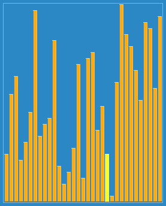

**希尔排序**，也称**递减增量排序算法**，是*插入排序*的一种更高效的改进版本。希尔排序是非稳定排序算法。

希尔排序是基于插入排序的以下两点性质而提出改进方法的：

- 插入排序在对几乎已经排好序的数据操作时，效率高，即可以达到*线性排序*的效率
- 但插入排序一般来说是低效的，因为插入排序每次只能将数据移动一位

- 分类：排序算法
- 数据结构：数组
- 最坏时间：根据步长序列的不同而不同。已知最好的：$O(n long^2n)$
- 最优时间复杂度：$O(n)$
- 平均时间复杂度：根据步长序列的不同而不同
- 最坏空间复杂度：$O(n)$