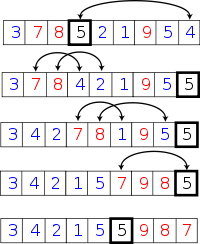
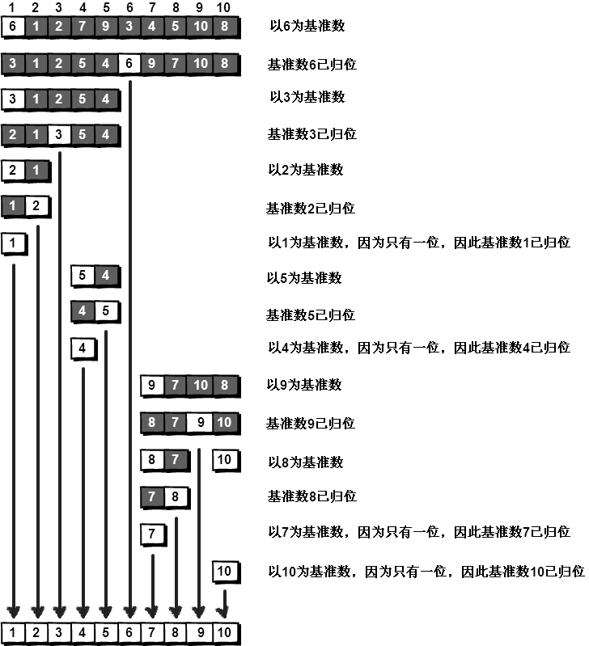

**快速排序**（英语：Quicksort），又称**划分交换排序**（partition-exchange sort），简称**快排**，一种[排序算法](https://zh.wikipedia.org/wiki/%E6%8E%92%E5%BA%8F%E7%AE%97%E6%B3%95)，最早由[东尼·霍尔](https://zh.wikipedia.org/wiki/%E6%9D%B1%E5%B0%BC%C2%B7%E9%9C%8D%E7%88%BE)提出。在平均状况下，排序个 n 项目要$O(nlong n)$(大O符号)次比较。在最坏状况下则需要$O(n^2)$次比较，但这种状况并不常见。事实上，快速排序$O(nlong n)$通常明显比其他算法更快，因为它的内部循环（inner loop）可以在大部分的架构上很有效率地达成。


- 分类：排序算法
- 数据结构：不定
- 最坏时间复杂度：$O(n^2)$
- 最优时间复杂度：$O(n long n)$
- 平均时间复杂度：$O(nlongn)$
- 最坏空间复杂度：根据实现的方式不同而不同



<center>快速排序采用“分而治之、各个击破”的观念，此为原地（ln-place）分割版本。</center>

快速排序使用*分治法*（Divide and conquer）策略来把一个*序列*（list）分为两个子序列（sub-lists）。

步骤为：

1. 从数列中挑出一个元素，称为“基准”（pivot），
2. 重新排序数列，所有比基准值小的元素摆放在基准前面，所有比基准值大的元素摆在基准后面（相同的数可以到任何一边）。在这个分割结束之后，该基准就处于数列的中间位置。这个称为**分割（partition）**操作。
3. *递归*地（recursively）把小于基准值元素的子数列和大于基准值元素的子数列排序。

递归到最底部时，数列的大小是零或一，也就是已经排序好了。这个算法一定会结束，因为在每次的迭代（iteration）中，它至少会把一个元素摆到它最后的位置去。

- C
  - 迭代法

```c
typedef struct _Range {
    int start, end;
} Range;

Range new_Range(int s, int e) {
    Range r;
    r.start = s;
    r.end = e;
    return r;
}

void swap(int *x, int *y) {
    int t = *x;
    *x = *y;
    *y = t;
}

void quick_sort(int arr[], const int len) {
    if (len <= 0)
        return; // 避免len等于负值时引发段错误（Segment Fault）
    // r[]模拟列表,p为数量,r[p++]为push,r[--p]为pop且取得元素
    Range r[len];
    int p = 0;
    r[p++] = new_Range(0, len - 1);
    while (p) {
        Range range = r[--p];
        if (range.start >= range.end)
            continue;
        int mid = arr[(range.start + range.end) / 2]; // 选取中间点为基准点
        int left = range.start, right = range.end;
        do {
            while (arr[left] < mid) ++left;   // 检测基准点左侧是否符合要求
            while (arr[right] > mid) --right; //检测基准点右侧是否符合要求
            if (left <= right) {
                swap(&arr[left], &arr[right]);
                left++;
                right--;               // 移动指针以继续
            }
        } while (left <= right);
        if (range.start < right) r[p++] = new_Range(range.start, right);
        if (range.end > left) r[p++] = new_Range(left, range.end);
    }
}
```

- 递归法

```c
void swap(int *x, int *y) {
    int t = *x;
    *x = *y;
    *y = t;
}

void quick_sort_recursive(int arr[], int start, int end) {
    if (start >= end)
        return;
    int mid = arr[end];
    int left = start, right = end - 1;
    while (left < right) {
        while (arr[left] < mid && left < right)
            left++;
        while (arr[right] >= mid && left < right)
            right--;
        swap(&arr[left], &arr[right]);
    }
    if (arr[left] >= arr[end])
        swap(&arr[left], &arr[end]);
    else
        left++;
    if (left)
        quick_sort_recursive(arr, start, left - 1);
    quick_sort_recursive(arr, left + 1, end);
}

void quick_sort(int arr[], int len) {
    quick_sort_recursive(arr, 0, len - 1);
}
```

- C++
  - 函数法

```c++
sort(a,a + n);// 排序a[0]-a[n-1]的所有数.
```

- 迭代法

```c++
// 参考：http://www.dutor.net/index.php/2011/04/recursive-iterative-quick-sort/
struct Range {
    int start, end;
    Range(int s = 0, int e = 0) {
        start = s, end = e;
    }
};
template <typename T> // 整数或浮点数皆可使用,若要使用物件(class)时必須设定"小于"(<)、"大于"(>)、"不小于"(>=)的运算子功能
void quick_sort(T arr[], const int len) {
    if (len <= 0)
        return; // 避免len等于负值時宣告堆叠阵列当机
    // r[]模拟堆叠,p为數量,r[p++]为push,r[--p]为pop且取得元素
    Range r[len];
    int p = 0;
    r[p++] = Range(0, len - 1);
    while (p) {
        Range range = r[--p];
        if (range.start >= range.end)
            continue;
        T mid = arr[range.end];
        int left = range.start, right = range.end - 1;
        while (left < right) {
            while (arr[left] < mid && left < right) left++;
            while (arr[right] >= mid && left < right) right--;
            std::swap(arr[left], arr[right]);
        }
        if (arr[left] >= arr[range.end])
            std::swap(arr[left], arr[range.end]);
        else
            left++;
        r[p++] = Range(range.start, left - 1);
        r[p++] = Range(left + 1, range.end);
    }
}
```

- 递归法

```c++
template <typename T>
void quick_sort_recursive(T arr[], int start, int end) {
    if (start >= end)
        return;
    T mid = arr[end];
    int left = start, right = end - 1;
    while (left < right) { //在整个范围内搜寻比枢纽元值小或大的元素，然后将左侧元素与右侧元素交换
        while (arr[left] < mid && left < right) //试图在左侧找到一个比枢纽元更大的元素
            left++;
        while (arr[right] >= mid && left < right) //试图在右侧找到一个比枢纽元更小的元素
            right--;
        std::swap(arr[left], arr[right]); //交换元素
    }
    if (arr[left] >= arr[end])
        std::swap(arr[left], arr[end]);
    else
        left++;
    quick_sort_recursive(arr, start, left - 1);
    quick_sort_recursive(arr, left + 1, end);
}
template <typename T> //整数或浮点数皆可使用,若要使用物件(class)时必须设定"小于"(<)、"大于"(>)、"不小于"(>=)的运算子功能
void quick_sort(T arr[], int len) {
    quick_sort_recursive(arr, 0, len - 1);
}
```

- 举个例子?
  - 上一节的冒泡排序可以说是我们学习的第一个真正的排序算法，并且解决了桶排序浪费
    空间的问题，但在算法的执行效率上却牺牲了很多，它的时间复杂度达到了 O(N 2 )。假如我
    们的计算机每秒钟可以运行 10 亿次，那么对 1 亿个数进行排序，桶排序只需要 0.1 秒，而冒
    泡排序则需要 1 千万秒，达到 115 天之久，是不是很吓人？那有没有既不浪费空间又可以快
    一点的排序算法呢？那就是“快速排序”啦！光听这个名字是不是就觉得很高端呢？
    假设我们现在对“6 1 2 7 9 3 4 5 10 8”这 10个数进行排序。首先在这个序列中随
    便找一个数作为基准数（不要被这个名词吓到了，这就是一个用来参照的数，待会儿你就知
    道它用来做啥了）。为了方便，就让第一个数 6 作为基准数吧。接下来，需要将这个序列中
    所有比基准数大的数放在 6 的右边，比基准数小的数放在 6 的左边，类似下面这种排列。
    3 1 2 5 4 6 9 7 10 8
    在初始状态下，数字 6在序列的第 1 位。我们的目标是将 6挪到序列中间的某个位置，
    假设这个位置是 k。现在就需要寻找这个 k，并且以第 k 位为分界点，左边的数都小于等于 6，
    右边的数都大于等于 6。想一想，你有办法可以做到这点吗？
    给你一个提示吧。请回忆一下冒泡排序是如何通过“交换”一步步让每个数归位的。此
    时你也可以通过“交换”的方法来达到目的。具体是如何一步步交换呢？怎样交换才既方便
    又节省时间呢？先别急着往下看，拿出笔来，在纸上画画看。我高中时第一次学习冒泡排序
    算法的时候，就觉得冒泡排序很浪费时间，每次都只能对相邻的两个数进行比较，这显然太
    不合理了。于是我就想了一个办法，后来才知道原来这就是“快速排序”。
  - 方法其实很简单：分别从初始序列“6 1 2 7 9 3 4 5 10 8”两端开始“探测”。先从右往左找一个小于 6 的数，再从左往右找一个大于 6 的数，然后交换它们。这里可以用两个变量 i 和 j，分别指向序列最左边和最右边。我们为这两个变量起个好听的名字“哨兵 i”和“哨兵 j”。刚开始的时候让哨兵 i 指向序列的最左边（即 i=1），指向数字 6。让哨兵 j 指向序列的最右边（即 j=10），指向数字 8。
  - 到此，第一次交换结束。接下来哨兵 j 继续向左挪动（再次友情提醒，每次必须是哨兵j 先出发）。他发现了 4（比基准数 6 要小，满足要求）之后停了下来。哨兵 i 也继续向右挪动，他发现了 9（比基准数 6 要大，满足要求）之后停了下来。此时再次进行交换，交换之后的序列如下。
    6 1 2 5 4 3 9 7 10 8
  - 第二次交换结束，“探测”继续。哨兵 j 继续向左挪动，他发现了 3（比基准数 6 要小，满足要求）之后又停了下来。哨兵 i 继续向右移动，糟啦！此时哨兵 i 和哨兵 j 相遇了，哨兵 i 和哨兵 j 都走到 3 面前。说明此时“探测”结束。我们将基准数 6 和 3 进行交换。交换之后的序列如下。
    3 1 2 5 4 6 9 7 10 8
  - 到此第一轮“探测”真正结束。此时以基准数 6 为分界点，6 左边的数都小于等于 6，6右边的数都大于等于 6。回顾一下刚才的过程，其实哨兵 j 的使命就是要找小于基准数的数，而哨兵 i 的使命就是要找大于基准数的数，直到 i 和 j 碰头为止。




- 快速排序之所以比较快，是因为相比冒泡排序，每次交换是跳跃式的。每次排序的时候
  设置一个基准点，将小于等于基准点的数全部放到基准点的左边，将大于等于基准点的数全
  部放到基准点的右边。这样在每次交换的时候就不会像冒泡排序一样只能在相邻的数之间进
  行交换，交换的距离就大得多了。因此总的比较和交换次数就少了，速度自然就提高了。当
  然在最坏的情况下，仍可能是相邻的两个数进行了交换。因此快速排序的最差时间复杂度和
  冒泡排序是一样的，都是 O(N 2 )，它的平均时间复杂度为 O (NlogN)。其实快速排序是基于一
  种叫做“二分”的思想。

```c
#include <stdio.h>
int a[101],n;//定义全局变量，这两个变量需要在子函数中使用
void quicksort(int left,int right)
{
int i,j,t,temp;
if(left>right)
return;
temp=a[left]; //temp中存的就是基准数
i=left;
j=right;
while(i!=j)
{
//顺序很重要，要先从右往左找
while(a[j]>=temp && i<j)
j--;
//再从左往右找
while(a[i]<=temp && i<j)
i++;
//交换两个数在数组中的位置
if(i<j)//当哨兵i和哨兵j没有相遇时
{
t=a[i];
a[i]=a[j];
a[j]=t;
}
}
//最终将基准数归位
    a[left]=a[i];
a[i]=temp;
quicksort(left,i-1);//继续处理左边的，这里是一个递归的过程
quicksort(i+1,right);//继续处理右边的，这里是一个递归的过程
}
int main()
{
int i,j,t;
//读入数据
scanf("%d",&n);
for(i=1;i<=n;i++)
scanf("%d",&a[i]);
quicksort(1,n); //快速排序调用
//输出排序后的结果
for(i=1;i<=n;i++)
printf("%d ",a[i]);
getchar();getchar();
return 0;
}
```

可以输入以下数据进行验证。
10
6 1 2 7 9 3 4 5 10 8

运行结果是：
1 2 3 4 5 6 7 8 9 10