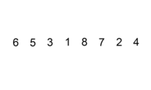

**插入排序**（英语：Insertion Sort）是一种简单直观的*排序算法*。它的工作原理是通过构建有序序列，对于未排序数据，在已排序序列中从后向前扫描，找到相应位置并插入。**插入排序**在实现上，通常采用in-place排序（即只需用到$O(1)$的额外空间的排序)，因而在从后向前扫描过程中，需要反复把已排序元素逐步向后挪位，为最新元素提供插入空间。


- 分类：排序算法
- 数据结构：数组
- 最坏时间复杂度：$O(n^{2})$
- 最优时间复杂度：$O(n)$
- 平均时间复杂度：$O(n^2)$
- 最坏空间复杂度：总共$O(n)$,需要辅助空间$O(1)$



<center>插入排序过程</center>

一般来说，**插入排序**都采用in-place在数组上实现。具体算法描述如下：

1. 从第一个元素开始，该元素可以认为已经被排序
2. 取出下一个元素，在已经排序的元素序列中从后向前扫描
3. 如果该元素（已排序）大于新元素，将该元素移到下一位置
4. 重复步骤3，直到找到已排序的元素小于或者等于新元素的位置
5. 将新元素插入到该位置后
6. 重复步骤2~5

如果*比较操作*的代价比*交换操作*大的话，可以采用*二分查找法*来减少*比较操作*的数目。该算法可以认为是**插入排序**的一个变种，称为*二分查找插入排序*。

- c

```c
void insertion_sort(int arr[], int len){
        int i,j,key;
        for (i=1;i<len;i++){
                key = arr[i];
                j=i-1;
                while((j>=0) && (arr[j]>key)) {
                        arr[j+1] = arr[j];
                        j--;
                }
                arr[j+1] = key;
        }
}
```

- c++

```c++
void insertion_sort(int arr[],int len){
        for(int i=1;i<len;i++){
                int key=arr[i];
                int j=i-1;
                while((j>=0) && (key<arr[j])){
                        arr[j+1]=arr[j];
                        j--;
                }
                arr[j+1]=key;
        }
}
```

- Java

```Java
public void insertionSort(int[] array) {
		for (int i = 1; i < array.length; i++) {
			int key = array[i];
			int j = i - 1;
			while (j >= 0 && array[j] > key) {
				array[j + 1] = array[j];
				j--;
			}
			array[j + 1] = key;
		}
	}
```

- Java的 另一个版本

```java
  //将arr[i] 插入到arr[0]...arr[i - 1]中
	public static void insertion_sort(int[] arr) {
		for (int i = 1; i < arr.length; i++ ) {
			int temp = arr[i];
			int j = i - 1;  
    //如果将赋值放到下一行的for循环内, 会导致在第10行出现j未声明的错误
			for (; j >= 0 && arr[j] > temp; j-- ) {
				arr[j + 1] = arr[j];
			}
			arr[j + 1] = temp;
		}
	}
```

