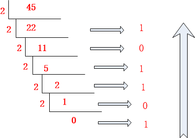

- 在数字后面加上不同的字母来表示不同的进位制。B（Binary)表示二进制，O（Octal）表示八进制，D（Decimal）或不加表示十进制，H（Hexadecimal）表示十六进制
- 二进制 $\to$ 十进制
  - 二级制数从低位到高位（从右向左）计算，第0位的权值是2的0次方，第1位是2的1次方，一次递推，最后结果相加就是十进制的值。
- 八进制 $\to$ 十进制
  - 八进制数从低位到高位（即从右往左）计算，第0位的权值是8的0次方，第1位的权值是8的1次方，第2位的权值是8的2次方，依次递增下去，把最后的结果相加的值就是十进制的值了。

- 十六进制 $\to$ 十进制
  - 十六进制数从低位到高位（即从右往左）计算，第0位的权值是16的0次方，第1位的权值是16的1次方，第2位的权值是16的2次方，依次递增下去，把最后的结果相加的值就是十进制的值了。

- 十进制 $\to​$ 二进制
  - 除2取余法，即每次将整数部分除以2，余数为该位权上的数，而商继续除以2，余数又为上一个位权上的数，这个步骤一直持续下去，直到商为0为止，最后读数时候，从最后一个余数读起，一直到最前面的一个余数。

- 十进制 $\to​$ 八进制
  - 方法1：除8取余法，即每次将整数部分除以8，余数为该位权上的数，而商继续除以8，余数又为上一个位权上的数，这个步骤一直持续下去，直到商为0为止，最后读数时候，从最后一个余数起，一直到最前面的一个余数。
  - 方法2：使用间接法，先将十进制转换成二进制，然后将二进制又转换成八进制；
- 十进制 $\to​$ 十六进制
  - 方法1：除16取余法，即每次将整数部分除以16，余数为该位权上的数，而商继续除以16，余数又为上一个位权上的数，这个步骤一直持续下去，直到商为0为止，最后读数时候，从最后一个余数起，一直到最前面的一个余数。
  - 方法2：使用间接法，先将十进制转换成二进制，然后将二进制又转换成十六进制；
- 二进制 $\to$ 八进制
  - 取三合一法，即从二进制的小数点为分界点，向左（向右）每三位取成一位，接着将这三位二进制按权相加，然后，按顺序进行排列，小数点的位置不变，得到的数字就是我们所求的八进制数。如果向左（向右）取三位后，取到最高（最低）位时候，如果无法凑足三位，可以在小数点最左边（最右边），即整数的最高位（最低位）添0，凑足三位。
- 八进制 $\to$ 二进制
  - 方法：取一分三法，即将一位八进制数分解成三位二进制数，用三位二进制按权相加去凑这位八进制数，小数点位置照旧。
- 二进制 $\to$ 十六进制
  - 取四合一法，即从二进制的小数点为分界点，向左（向右）每四位取成一位，接着将这四位二进制按权相加，然后，按顺序进行排列，小数点的位置不变，得到的数字就是我们所求的十六进制数。如果向左（向右）取四位后，取到最高（最低）位时候，如果无法凑足四位，可以在小数点最左边（最右边），即整数的最高位（最低位）添0，凑足四位。
- 十六进制 $\to$ 二进制
  - 方法：取一分四法，即将一位十六进制数分解成四位二进制数，用四位二进制按权相加去凑这位十六进制数，小数点位置照旧