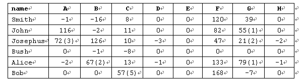

# 考试排名

**Time Limit: 1000/1000 MS (Java/Others)    Memory Limit: 32768/32768 K (Java/Others)Total Submission(s): 21664    Accepted Submission(s): 7412**

Problem Description

C++编程考试使用的实时提交系统，具有即时获得成绩排名的特点。它的功能是怎么实现的呢？
我们做好了题目的解答，提交之后，要么“AC”，要么错误，不管怎样错法，总是给你记上一笔，表明你曾经有过一次错误提交，因而当你一旦提交该题“AC”后，就要与你算一算帐了，总共该题错误提交了几回。虽然你在题数上，大步地跃上了一个台阶，但是在耗时上要摊上你共花去的时间。特别是，曾经有过的错误提交，每次都要摊上一定的单位时间分。这样一来，你在做出的题数上，可能领先别人很多，但是，在做出同样题数的人群中，你可能会在耗时上处于排名的劣势。
例如：某次考试一共8题（A，B，C，D，E，F，G，H），每个人做的题都在对应的题号下有个数量标记，负数表示该学生在该题上有过的错误提交次数，但到现在还没有AC，正数表示AC所耗的时间，如果正数a跟上一对括号，里面有个整数b，那就表示该学生提交该题AC了，耗去了时间a，同时，曾经错误提交了b次，因此对于下述输入数据：



若每次错误提交的罚分为20分，则其排名从高到低应该是这样的：
Josephus 5 376
John 4 284
Alice 4 352
Smith 3 167
Bob 2 325
Bush 0 0

 

Input

输入数据的第一行是考试题数n（1≤n≤12）以及单位罚分数m（10≤m≤20），每行数据描述一个学生的用户名（不多于10个字符的字串）以及对所有n道题的答题现状，其描述采用问题描述中的数量标记的格式，见上面的表格，提交次数总是小于100，AC所耗时间总是小于1000。


 

Output

将这些学生的考试现状，输出一个实时排名。实时排名显然先按AC题数的多少排，多的在前，再按时间分的多少排，少的在前，如果凑巧前两者都相等，则按名字的字典序排，小的在前。每个学生占一行，输出名字（10个字符宽），做出的题数（2个字符宽，右对齐）和时间分（4个字符宽，右对齐）。名字、题数和时间分相互之间有一个空格。

 

Sample Input

```
8 20
Smith	  -1	-16	8	0	0	120	39	0
John	  116	-2	11	0	0	82	55(1)	0
Josephus  72(3)	126	10	-3	0	47	21(2)	-2
Bush	  0	-1	-8	0	0	0	0	0
Alice	  -2	67(2)	13	-1	0	133	79(1)	-1
Bob	  0	0	57(5)	0	0	168	-7	0
```

 

Sample Output

```
Josephus    5  376
John        4  284
Alice       4  352
Smith       3  167
Bob         2  325
Bush        0    0
```

---

---

- 用一个结构存储学生的名字，解决题目数量和惩罚时间，然后写一个比较函数进行排序输出。 
一个难点是括号的处理，将所有数据以字符串的形式接收，然后处理括号，详见代码。

```c
#include<iostream>
#include<string.h>
#include<algorithm>
using namespace std;

struct stu{
	string name;
	int time;
	int solved;
}S[1001]; 
bool cmp(stu a,stu b)
{
	return a.solved != b.solved ? a.solved > b.solved : a.time < b.time;
}

int main(void)
{
	int n,m,wa,time,d;
	string str;
	cin>>n>>m;
	d=0;
	while(cin>>S[d].name)
	{
		S[d].time = 0;
		S[d].solved = 0;
		
		for(int j = 0;j < n;j++)
		{
			wa = 0;
			time = 0;
			cin>>str;
			
			if(str[0] == '0' || str[0] == '-') // 如果没有AC，不处理
				continue;
			for(int k = 0;k < str.length();k++)
			{
				if(str[k] == '(')// 当遇到括号
				{
					k++;
					while(str[k] != ')')// 记录括号中的WA次数
					{
						wa=wa*10 + str[k]-'0'; //这个是错误的罚时时间
						k++;
					}
					break;
				}
			else{ // 还没有遇到括号
				time=time*10 + str[k]-'0';// 记录本题的耗时
			}
		}
		S[d].solved++;
		S[d].time += (time + wa * m);
	}
	d++;
}
	sort(S,S+d,cmp);
	for(int i = 0;i < d;i++)
	{
		printf("%-10s %2d %4d\n",S[i].name.c_str(),S[i].solved,S[i].time);
	}
	return 0;
}
```

- 这个也有一个比较坑一点的地方：最后的输出一定要注意要左对齐

```
左对齐："-" e.g. "%-20s"
右对齐："+" e.g. "%+20s"
```

