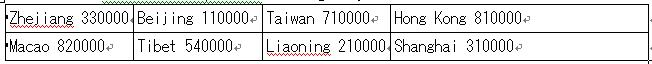

# 2629 Identity Card

- Problem Description：

```txt
Do you own an ID card?You must have a identity card number in your family's Household Register. From the ID card you can get specific personal information of everyone. The number has 18 bits,the first 17 bits contain special specially meanings:the first 6 bits represent the region you come from,then comes the next 8 bits which stand for your birthday.What do other 4 bits represent?You can Baidu or Google it.
Here is the codes which represent the region you are in.
However,in your card,maybe only 33 appears,0000 is replaced by other numbers.
Here is Samuel's ID number 331004198910120036 can you tell where he is from?The first 2 numbers tell that he is from Zhengjiang Province,number 19891012 is his birthday date (yy/mm/dd).
```

 


- Input:

```txt
Input will contain 2 parts:
A number n in the first line,n here means there is n test cases. For each of the test cases,there is a string of the ID card number.
```

- Sample Inpu:

```txt
1
330000198910120036
```

- Sample Output:

```txt
He/She is from Zhejiang,and his/her birthday is on 10,12,1989 based on the table.
```

- 实际很简单，但是我就是不会字符串的题。。。。。

```c++
#include<iostream>
#include<string.h>
#include<stdio.h>
using namespace std;

int main(void)
{
    int k;
    int address;
    char s[18],c[20];
    cin>>k;
    while(k--)
    {
        getchar();//这个地方要清空一下缓存
        for(int i = 0;i < 18;i++)
            cin>>s[i];
        address = (s[0]-'0')*10 + (s[1]-'0');
        if(address == 33)
            strcpy(c,"Zhejiang");
        if(address == 11)
            strcpy(c,"Beijing");
        if(address == 71)
            strcpy(c,"Taiwan");
        if(address == 81)
            strcpy(c,"Hong Kong");
        if(address == 82)
            strcpy(c,"Macao");
        if(address == 54)
            strcpy(c,"Tibet");
        if(address == 21)
            strcpy(c,"Liaoning");
        if(address == 31)
            strcpy(c,"Shanghai");
        printf("He/She is from %s,and his/her birthday is on %c%c,%c%c,%c%c%c%c based on the table.\n",c,s[10],s[11],s[12],s[13],s[6],s[7],s[8],s[9]);
    }
    return 0;
}
```

