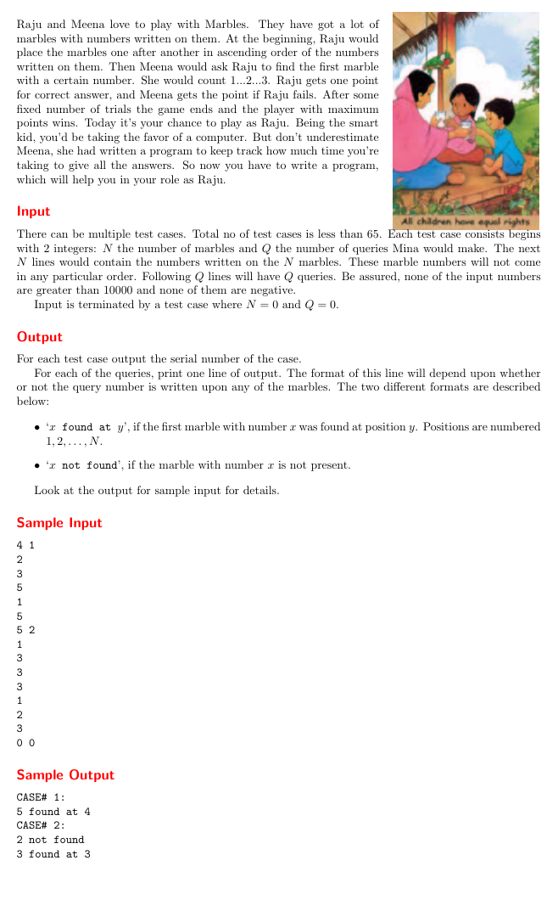

- 该死，在Linux下面找个可以截取长图的软件这么难么，害的我弄得这么模糊，烦死。。。。。

- 题的大意：
  - N个大理石，无序排列，每个大理石上面写一个非负数，找出问题“几”在第几块石头后面，你可以先排序后，在查找，可以用到c++的stl

```c++
#include<bits/stdc++.h>  //万能头文件，但是解析比较慢，编译慢
using namespace std;

const int maxn = 10000;
int main(void){
    int q,x,a[maxn],n,kase = 0;
    while(scanf("%d%d",&n,&q) ==2 && n){
        printf("CASE# %d:\n",++kase);
        for(int i = 0;i < n;i++)
            scanf("%d",&a[i]);
        sort(a,a+n);
        while(q--){
            scanf("%d",&x);

            auto p = lower_bound(a,a+n,x) - a;
            if(a[p] == x)
                printf("%d found at %d\n",x,p+1);
            else
                printf("%d not found\n",x);
        } 
    }
    return 0;
}
```

