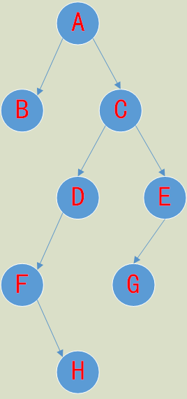

[TOC]

---

---
## 算法的的基本概念
- **算法的控制结构**给出了算法的基本框架，他不仅决定了算法中管操作的执行顺序，而且也直接反映了算法的设计是否符合结构化原则。一个算法一般都可以用**顺序、选择、循环**三种基本控制结构组合而成！

- **算法的特征**：
  1. 确定性：算法的每一步骤必须有确切的定义
  2. 有穷性：一个算法必须保证执行有限步之后结束。
  3. 可行性：算法原则上能够精确地运行，而且人们用笔和纸做有限次运算后即可完成。
  4. 输入：一个算法有0个或多个输入，以刻画运算对象的初始情况，所谓0个输入是指算法本身定除了初始条件。
  5. 输出：一个算法有一个或多个输出，以反映对输入数据加工后的结果。没有输出的算法是毫无意义的。

- **算法的组成要素**：一个算法**由数据对象的运算和操作以及控制结构**这两部分组成。

- **算法的基本运算和操作**：算术运算，逻辑运算，关系运算，数据传输。

- **算法基本设计方法**：列举法、归纳法、递推、递归、减半递推技术。

- 算法效率的度量——算法的复杂度：**时间复杂度**和**空间复杂度**。***二者并不相关***。
  - 算法时间复杂度：指执行算法所需要的计算工作量。通常，一个算法所用的时间包括编译时间和运行时间。
  - 算法空间复杂度：指执行这个算法所需要的内存空间。包括算法程序所占的空间，输入的初始数据所占的空间，算法执行过程中所需的额外空间。

---

##   数据结构的基本概念：

- 数据：数据是客观事物的符号表示，是能输入到计算机中并被计算程序识别和处理的符号的总称，如文档，声音，视频等。
- 数据元素：数据元素是数据的基本单位。
- 数据对象：数据对象是性质相同的数据元素的集合。
- 数据结构：是指由某一数据对象中所有数据成员之间的关系组成的集合。
- 逻辑结构和存储结构：
  1. 数据的结构可分为数据的逻辑结构和存储结构。
     - 数据的逻辑结构是对数据元素之间的**逻辑关系**的描述，**与数据的存储无关**，是**面向问题**的，是独立于计算机的。它包括数据对象和数据对象之间的关系。
     - 数据的存储结构也称为**数据的物理结构**，是数据在计算机中的存放的方式，是**面向计算机**的，它包括数据元素的存储方式和关系的存储方式。
  2. 存储结构和逻辑结构的关系：**一种数据的逻辑结构可以表示成多种存储结构即数据的逻辑结构和存储结构不一定一一对应。**
  3. 常见的存储结构有：**顺序，链接，索引**等。采用不同的存储结构其数据处理的效率是不同的。
- 一般数据结构分为两大类：线性结构和非线性结构。如果一个非空的数据结构满足下列两个条件：
  - 有且只有一个根节点;
  - 每个节点最多只有一个前键和后键。
    则称该数据结构为线性结构，又称线性表。所以具有两个根节点的数据结构一定是非线性结构。
- 线性结构的条件（一个非空数据结构)：（1）有且只有一个根结点；（2）每一个结点最多有一个前键，也最多有一个后键。
- 非线性结构：不满足线性结构条件的数据结构。
- **栈、队列、双向链表是线性结构，树、二叉树为非线性结构**。
- 顺序表的运算：查找、插入、删除。
- 线性链表：
  - 线性链表是线性表的链式存储结构，数据结构中的每一个结点对应于一个存储单元，这种存储单元称为存储结点，简称结点。
  - 节点由两部分组成：
    - 用于存储数据元素值，称为数据域；
    - 用于存放指针，称为指针域，用于指向前一个或后一个结点。
- 在链式存储结构中，存储数据结构的存储空间可以不连续，各数据结点的存储顺序与数据元素之间的逻辑关系可以不一致，而数据元素之间的逻辑关系是由指针域来确定的。

---

##  查找、排序算法

- 查找

  - 顺序查找是从表的一端开始，依次扫描表中的各个元素，并与所要查找的数进行比较。在下列两种情况下也只能采用顺序查找：
    - 如果线性表为无序表，则不管是顺序存储结构还是链式存储结构，只能用顺序查找。
    - 即使是有序线性表，如果采用链式存储结构，也只能用顺序查找。

    - 即使是有序线性表，如果采用链式存储结构，也只能用顺序查找。
  - 二分查找的条件：
    - （1）用顺序存储结构   
    - (2)  线性表是有序表。对于长度为n的有序线性表，在最坏情况下，二分法查找只需比较  $log_2n$  次，而顺序查找需要比较n次。
  - 对于长度为n的线性表，在最坏的情况下，快速排序所需要的次数为*$ n(n-1)/2$*;冒泡排序所需要的比较次数为$n(n-1)/2$;直接插入排序所需要的比较次数为$n(n-1)/2$;希尔排序所需要的比较次数为$O(n^{1.5})$;

- 排序

  - 交换排序

    - 冒泡排序法，在最坏的情况下，冒泡排序需要比较次数为$n(n－1)/2​$；
    - 快速排序法 ，在最坏的情况下，快速排序需要比较次数为$n(n－1)/2$。

  - 插入类排序法：

    - 简单插入排序法，最坏情况需要$n(n-1)/2$次比较；
    - 希尔排序法，最坏情况需要$O(n^{1.5})$次比较。（大写O是算法复杂度的表示方法）

  - 选择类排序法：

    - 简单选择排序法，最坏情况需要$n(n-1)/2$次比较；
    - 堆排序法，最坏情况需要$O(nlog_2n)$次比较。

    **相比以上几种(除希尔排序法外)，堆排序法的时间复杂度最小**。

---
## 栈和队列

- **栈**是一种特殊的线性表，只允许在表的一端进行插入和删除的线性表；插入，删除的一端为栈顶，另一端为栈底；当表中没有元素时为空栈。栈是一种**后进先出**（或先进后出Last In First Out）的线性表。栈具有记忆功能。
  - 顺序存储结构：用一组地址连续的存储单元即一维数组来存储；
  - 链式存储：用线性链表来存储。

- 循环队列不同于循环列表，**循环队列是顺序存储结构**。**循环链表是链式存储结构**。**双向链表是链式存储结构**，其中每个节点都有左指针和右指针，不同于二叉树节点的左子树和友子树指针。*非线性结构和线性结构是数据的逻辑操作*，*顺序和链式是数据的存储结构*，例如二叉树是非线性结构，也可以按照层序进行顺序存储。
- **队列**是一种特殊的线性表，只允许在表的一端插入，在另一端删除，允许插入的一端是队尾（rear），允许删除的一端为队头（front）；当表中没有元素是空队列；队列是一种**先进先出**的线性表。
  - 顺序存储：一维数组。
  - 链式存储：线性链表。

---

## 树和二叉树的遍历

- 树(tree)是$n(n\geq0)​$个结点的有限集。在任意一颗非空树种：
  - 有且仅有一个特定的称为根(Root)的节点；
  - 当$n>1$时，其余节点可分为m(m>0)个互不相交的有限集$T_1,T_2,T_3,...,T_m$，其中每一个集合本身又是一棵树，并且称为根的子树(SubTree)。
  -  树的**节点**包含一个数据元素及若干指向其子树的分支。
  - 节点拥有的子树数称为**节点的度(Degree)**。
  - 度为0的节点称为**叶子(Leaf)**或**终端节点**。
  - 度不为0的结点称为**非终端结点**或**分支结点**。
  - 除根结点之外，分支节点也成为内部结点。
  - **树的度**是树内各个节点的度的最大值。
  - 结点的子树的根称为该结点的孩子(Child)，相应的，该结点称为孩子的双亲(Parent)，同一个双亲的孩子之间称为兄弟(Sibling)。
  - 结点的**祖先**是从根到该结点所经分支上的所有结点(一条线上的)，以某结点为根的子树中的任一结点都称为该结点的**子孙**。
  - 结点的**层次(Level)**从根开始定义起，根为第一层跟的孩子为第二层。若某结点在第L层，则其子树的根就在第L+1层。其双亲在同一层的节点互为**堂兄弟**。
  - 树中节点的最大层次称为书的深度**(Depth)**，或高度。
- **二叉树的性质**：
  - 在二叉树的第k层上，最多有  **$2^{k-1}(k≥1）$** 个结点。
  - 深度为m的二叉树最多有   $2^{m-1}$   个结点。
  - 在任意一棵二叉树中，度为0的结点（叶子结点）总是比度为$2$的结点多一个。
  - 具有n个结点的二叉树，其深度不小于$(log_2n)+1$,其中$log_2n$表示为$log_2n$的整数部分。
- 满二叉树：除最后一层外，每一层上的所有结点都有两个子结点。在满二叉树中，每一层上的结点数都达到最大值，即在满二叉树的第k层上有$2^{k-1}$个结点，且深度为m的满二叉树有$2^m－1$个结点。
- 完全二叉树是指这样的二叉树：除最后一层外，每一层上的结点数均达到最大值；在最后一层上只缺少右边的若干结点。
- 完全二叉树性质：
  - 具有n个结点的完全二叉树的深度为$(log_2n )+1​$。
  - 完全二叉树中度为1的结点数为0或1。
- 满二叉树是完全二叉树，而完全二叉树一般不是满二叉树。
- 前序遍历：根结点 ---> 左子树 ---> 右子树
- 中序遍历：左子树---> 根结点 ---> 右子树
- 后序遍历：左子树 ---> 右子树 ---> 根结点
- 层次遍历：只需按层次遍历即可

1. 前序遍历：先访问根结点、然后遍历左子树，最后遍历右子树；并且，在遍历左、右子树时，仍然先访问根结点，然后遍历左子树，最后遍历右子树。

   前序遍历图可得：ABCDFHEG。

2. 中序遍历：先遍历左子树、然后访问根结点，最后遍历右子树；并且，在遍历左、右子树时，仍然先遍历左子树，然后访问根结点，最后遍历右子树。

   中序遍历图可得：BAFHDCGE。

3. 后序遍历：先遍历左子树、然后遍历右子树，最后访问根结点；并且，在遍历左、右子树时，仍然先遍历左子树，然后遍历右子树，最后访问根结点。

   后序遍历图可得：BHFDGECA。

   
