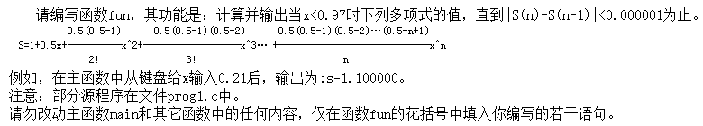

- 给定程序中，函数fun的功能是将形参给定的字符串、整数、浮点数写到文本文件中，再用字符方式从此文本文件中逐个读入并显示在终端屏幕上。

- 注意FILE的应用

```c
#include  <stdio.h>
void fun(char  *s, int  a, double  f)
{
/**********found**********/
  FILE* fp;  //FILE* fp记住啦。。。。
  char  ch;
  fp = fopen("file1.txt", "w");
  fprintf(fp, "%s %d %f\n", s, a, f);
  fclose(fp);
  fp = fopen("file1.txt", "r");
  printf("\nThe result :\n\n");
  ch = fgetc(fp);
/**********found**********/
  while (!feof(fp)) {
/**********found**********/
    putchar(ch); ch = fgetc(fp);  }
  putchar('\n');
  fclose(fp);
}
main()
{ char  a[10]="Hello!";    int  b=12345;
  double  c= 98.76;
  fun(a,b,c);
  getchar();
}

```

- 多项式求和



- 解题思路：
  - 本题是要求多项式的和，解类似的题的关键是找出其中的规律，观察表达式课得出$x(n)=x(n-1)*x*(0.5-n+1)/n$.
  - `abc()`是求整数的绝对值的。
  - `fabc()`是求浮点数的绝对值的。
  - 头文件都为`math.h`

```c
#include <stdio.h>
#include <math.h>.
#pragma warning (disable:4996)


double fun(double  x)
{
	int n = 1;          //循环计数
	double sn = 1;		//累计数
	double xn = 1,xn1 = 0; //x的n值，以及x的n-1值
	while(fabs(xn-xn1) >= 0.000001) //绝对值是否合格
	{
		xn=xn*x*(0.5-n+1)/n;  //表达式分解一会xn=(xn-1)*x*(0.5-n+1)/n
		n+=1;
		sn += xn;		//sn累加上xn
	}
	return (sn);
}
main()
{  double  x,s;
   void NONO( );
   printf("Input x:  ");  scanf("%lf",&x);
   s=fun(x);
   printf("s=%f\n",s);
   NONO();
}
void NONO()
{/* 请在此函数内打开文件，输入测试数据，调用 fun 函数，输出数据，关闭文件。 */
  FILE *rf, *wf ; int i ; double s, x ;
  rf = fopen("C:\\WEXAM\\000000000000\\in.dat","r") ;
  wf = fopen("C:\\WEXAM\\000000000000\\out.dat","w") ;
  for(i = 0 ; i < 10 ; i++) {
    fscanf(rf, "%lf", &x) ;
    s = fun(x) ;
    fprintf(wf, "%lf\n", s) ;
  }
  fclose(rf) ; fclose(wf) ;
}
```

