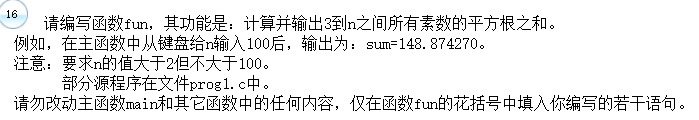

- 这题吧，实际不难，就是求个素数么
  - 看错题了，把结果求成平方和了，怎么都和样例对不住。。。
  - 第一种方法比较省内存（如果数比较大的话。。。），样例中还好没有大于100的数，不然我又错了。。。

```c
#include <math.h>
#include <stdio.h>
#pragma warning (disable:4996)
double fun(int  n)
{
	double sum = 0.0;
	int i,j,k;
	for(i = 3;i < n;i++)
	{
		k=0;
		for(j = 2;j <= sqrt(i)+1;j++) //不考虑加一的话，会少一个数。
		{
			if(i % j == 0)
			{
				k=0;
				break;
			}else
				k=1;
		}
		if(k)
			sum += sqrt(i);
	}
	return sum;
}
main()
{ int  n;    double  sum;
  void NONO( );
  printf("\n\nInput n:  ");  scanf("%d",&n);
  sum=fun(n);
  printf("\n\nsum=%f\n\n",sum);
  NONO();
}
void NONO()
{/* 请在此函数内打开文件，输入测试数据，调用 fun 函数，输出数据，关闭文件。 */
  FILE *rf, *wf ; int n, i ; double s ;
  rf = fopen("C:\\WEXAM\\000000000000\\in.dat","r") ;
  wf = fopen("C:\\WEXAM\\000000000000\\out.dat","w") ;
  for(i = 0 ; i < 10 ; i++) {
    fscanf(rf, "%d", &n) ;
    s = fun(n) ;
    fprintf(wf, "%lf\n", s) ;
  }
  fclose(rf) ; fclose(wf) ;
}


```

- 这个是参考答案，我发现我还是太嫩了，想得还是不够全面

```c
#include <math.h>
#include <stdio.h>
#pragma warning (disable:4996)
double fun(int  n)
{
	int i,j = 0;
	double s = 0;
	if(n <= 100){
		for(i=3;i<=n;i++)
		{
			for(j = 2;j < i;j++)
				if(i%j == 0)
					break;
			if(i==j)
				s+=sqrt(i);
		}
	}
	return s;
}
main()
{ int  n;    double  sum;
  void NONO( );
  printf("\n\nInput n:  ");  scanf("%d",&n);
  sum=fun(n);
  printf("\n\nsum=%f\n\n",sum);
  NONO();
}
void NONO()
{/* 请在此函数内打开文件，输入测试数据，调用 fun 函数，输出数据，关闭文件。 */
  FILE *rf, *wf ; int n, i ; double s ;
  rf = fopen("C:\\WEXAM\\000000000000\\in.dat","r") ;
  wf = fopen("C:\\WEXAM\\000000000000\\out.dat","w") ;
  for(i = 0 ; i < 10 ; i++) {
    fscanf(rf, "%d", &n) ;
    s = fun(n) ;
    fprintf(wf, "%lf\n", s) ;
  }
  fclose(rf) ; fclose(wf) ;
}
```

