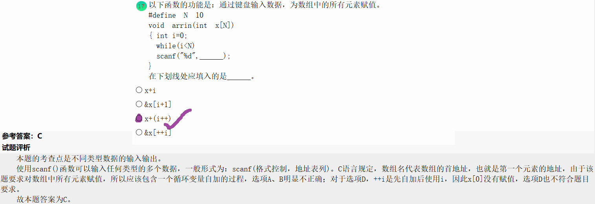
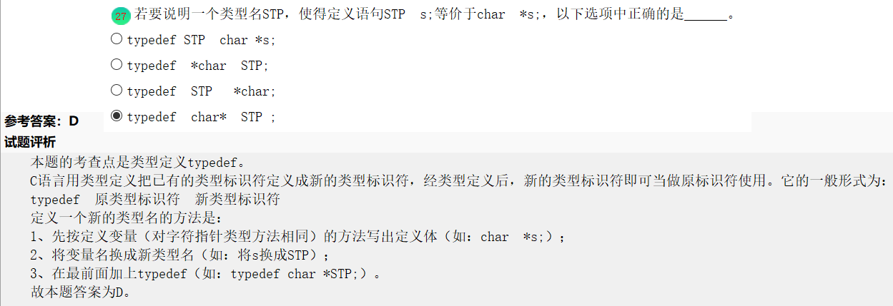
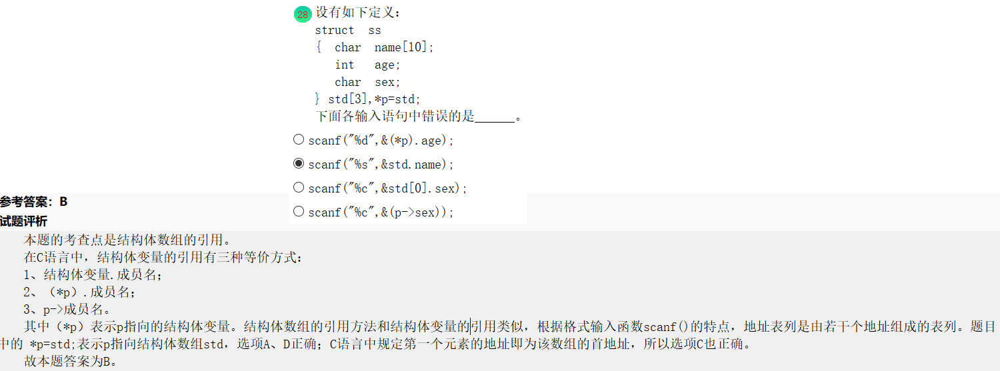
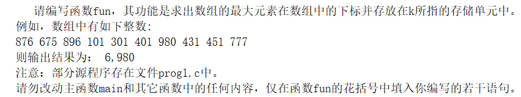

- 二分法查找只适用于顺序表的有序表。此处有序表是指线性表中的元素按值非递减排列（即从小到大，但允许相邻元素值相等）。
- 软件设计工具包括：程序流程图、N-S、PAD、HIPO，判定表，PDL（伪码）。

- DFD（数据流程图）属于结构化分析工具。



<center>还可以这样写？？？</center>

- 在函数内定义的变量是局部变量，而在函数之外定义的变量称为外部变量，外部变量是全局变量。它的有效范围：从定义变量的位置开始到该源文件结束。
- 函数的形参是局部变量，其它函数不能调用。
- 若在定义局部变量不赋初值，则对static变量来说编译时自动赋初值0（对数值型变量）或空字符（对字符变量）。
- 对auto变量来说，如果不赋初值它的值是一个不确定的值。



<center>对typedef的用法再熟悉一下</center>



<center>对结构体变量的熟悉</center>

- 踩坑。。。。。



```c++
#include <stdio.h>
void fun(int *s, int t, int *k)
{
	int i=s[0],j;
	*k=0;  //这里一定要给*k赋值为0，不然这边就给0分的哦，亲亲！
	for(j = 0;j < t;j++)
	{
		if(i < s[j])
		{
			i=s[j];
			*k=j;
		}
	}
	return *k;


}

main( )
{
    int a[10]={876,675,896,101,301,401,980,431,451,777}, k ;void NONO ();

    fun(a, 10, &k) ;
    printf("%d, %d\n", k, a[k]) ;
    NONO( ) ;
    getchar();
}

void NONO ()
{/* 本函数用于打开文件，输入测试数据，调用fun函数，输出数据，关闭文件。*/
  int a[10], i, k, j ;
  FILE *rf, *wf ;

  rf = fopen("C:\\WEXAM\\000000000000\\in.dat","r") ;
  wf = fopen("C:\\WEXAM\\000000000000\\out.dat","w") ;
  for(i = 0 ; i < 10 ; i++) {
    for(j = 0 ; j < 10 ; j++) fscanf(rf, "%d", &a[j]) ;
    fun(a, 10, &k) ;
    fprintf(wf, "%d,%d\n", k, a[k]) ;
  }
  fclose(rf) ;
  fclose(wf) ;
}
```

