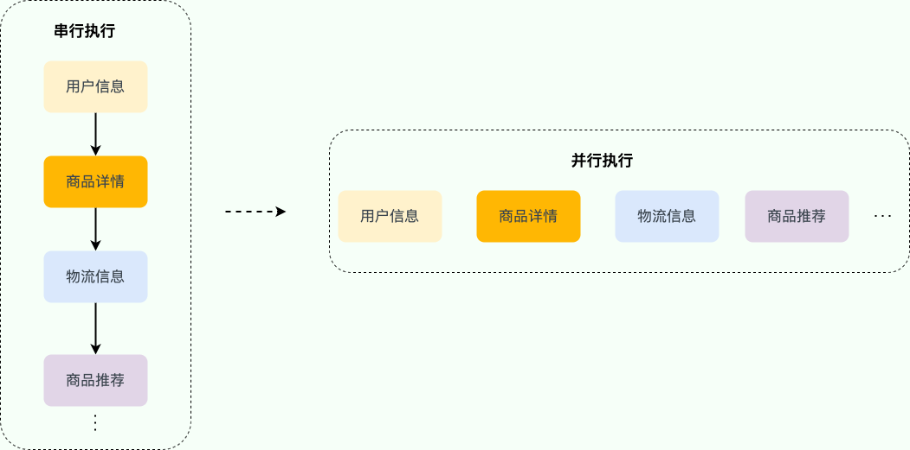
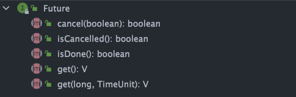

实际项目中，一个接口可能需要同时获取多种不同的数据，然后再汇总返回，这种场景还是挺常见的。举个例子：用户请求获取订单信息，可能需要同时获取用户信息、商品详情、物流信息、商品推荐等数据。

如果是串行（按顺序依次执行每个任务）执行的话，接口的响应速度会非常慢。考虑到这些任务之间有大部分都是 **无前后顺序关联** 的，可以 **并行执行** ，就比如说调用获取商品详情的时候，可以同时调用获取物流信息。通过并行执行多个任务的方式，接口的响应速度会得到大幅优化。



对于存在前后调用顺序关系的任务，可以进行任务编排。


1. 获取用户信息之后，才能调用商品详情和物流信息接口。
2. 成功获取商品详情和物流信息之后，才能调用商品推荐接口。

可能会用到多线程异步任务编排的场景（这里只是举例，数据不一定是一次返回，可能会对接口进行拆分）：

1. 首页：例如技术社区的首页可能需要同时获取文章推荐列表、广告栏、文章排行榜、热门话题等信息。
2. 详情页：例如技术社区的文章详情页可能需要同时获取作者信息、文章详情、文章评论等信息。
3. 统计模块：例如技术社区的后台统计模块可能需要同时获取粉丝数汇总、文章数据（阅读量、评论量、收藏量）汇总等信息。

对于 Java 程序来说，Java 8 才被引入的 `CompletableFuture` 可以帮助我们来做多个任务的编排，功能非常强大。

这篇文章是 `CompletableFuture` 的简单入门，带大家看看 `CompletableFuture` 常用的 API

## `Feture`介绍

`Future` 类是异步思想的典型运用，主要用在一些需要执行耗时任务的场景，避免程序一直原地等待耗时任务执行完成，执行效率太低。具体来说是这样的：当我们执行某一耗时的任务时，可以将这个耗时任务交给一个子线程去异步执行，同时我们可以干点其他事情，不用傻傻等待耗时任务执行完成。等我们的事情干完后，我们再通过 `Future` 类获取到耗时任务的执行结果。这样一来，程序的执行效率就明显提高了。

这其实就是多线程中经典的 **Future 模式**，你可以将其看作是一种设计模式，核心思想是异步调用，主要用在多线程领域，并非 Java 语言独有。

在 Java 中，`Future` 类只是一个泛型接口，位于 `java.util.concurrent` 包下，其中定义了 5 个方法，主要包括下面这 4 个功能：

- 取消任务；
- 判断任务是否被取消;
- 判断任务是否已经执行完成;
- 获取任务执行结果。

```java
// V 代表了Future执行的任务返回值的类型
public interface Future<V> {
    // 取消任务执行
    // 成功取消返回 true，否则返回 false
    boolean cancel(boolean mayInterruptIfRunning);
    // 判断任务是否被取消
    boolean isCancelled();
    // 判断任务是否已经执行完成
    boolean isDone();
    // 获取任务执行结果
    V get() throws InterruptedException, ExecutionException;
    // 指定时间内没有返回计算结果就抛出 TimeOutException 异常
    V get(long timeout, TimeUnit unit)

        throws InterruptedException, ExecutionException, TimeoutExceptio

}
```

简单理解就是：我有一个任务，提交给了 `Future` 来处理。任务执行期间我自己可以去做任何想做的事情。并且，在这期间我还可以取消任务以及获取任务的执行状态。一段时间之后，我就可以 `Future` 那里直接取出任务执行结果。

## `CompletableFuture`介绍

`Future` 在实际使用过程中存在一些局限性比如不支持异步任务的编排组合、获取计算结果的 `get()` 方法为阻塞调用。

Java 8 才被引入`CompletableFuture` 类可以解决`Future` 的这些缺陷。`CompletableFuture` 除了提供了更为好用和强大的 `Future` 特性之外，还提供了函数式编程、异步任务编排组合（可以将多个异步任务串联起来，组成一个完整的链式调用）等能力。

下面我们来简单看看 `CompletableFuture` 类的定义。

```java
public class CompletableFuture<T> implements Future<T>, CompletionStage<T> {
}
```

可以看到，`CompletableFuture` 同时实现了 `Future` 和 `CompletionStage` 接口。


`CompletionStage` 接口描述了一个异步计算的阶段。很多计算可以分成多个阶段或步骤，此时可以通过它将所有步骤组合起来，形成异步计算的流水线。

`CompletableFuture` 除了提供了更为好用和强大的 `Future` 特性之外，还提供了函数式编程的能力。



`Future` 接口有 5 个方法：

- `boolean cancel(boolean mayInterruptIfRunning)`：尝试取消执行任务。
- `boolean isCancelled()`：判断任务是否被取消。
- `boolean isDone()`：判断任务是否已经被执行完成。
- `get()`：等待任务执行完成并获取运算结果。
- `get(long timeout, TimeUnit unit)`：多了一个超时时间。

`CompletionStage` 接口描述了一个异步计算的阶段。很多计算可以分成多个阶段或步骤，此时可以通过它将所有步骤组合起来，形成异步计算的流水线。

`CompletionStage` 接口中的方法比较多，`CompletableFuture` 的函数式能力就是这个接口赋予的。从这个接口的方法参数你就可以发现其大量使用了 Java8 引入的函数式编程。

