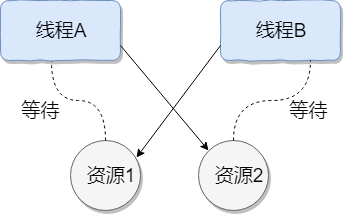
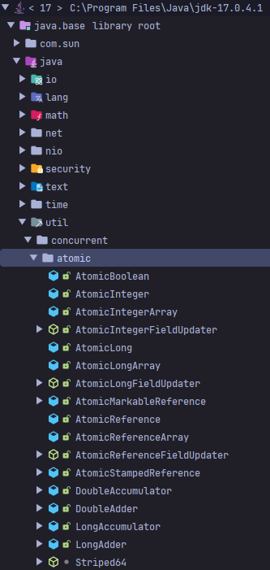
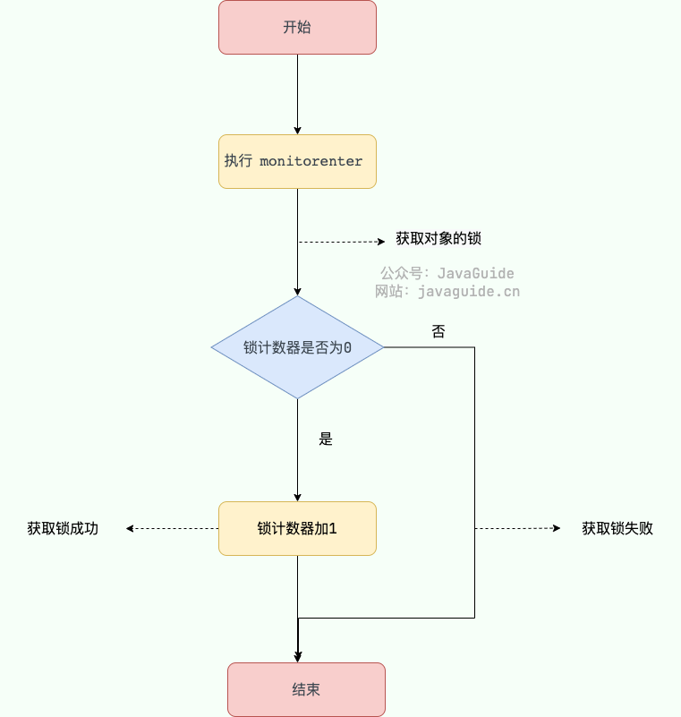
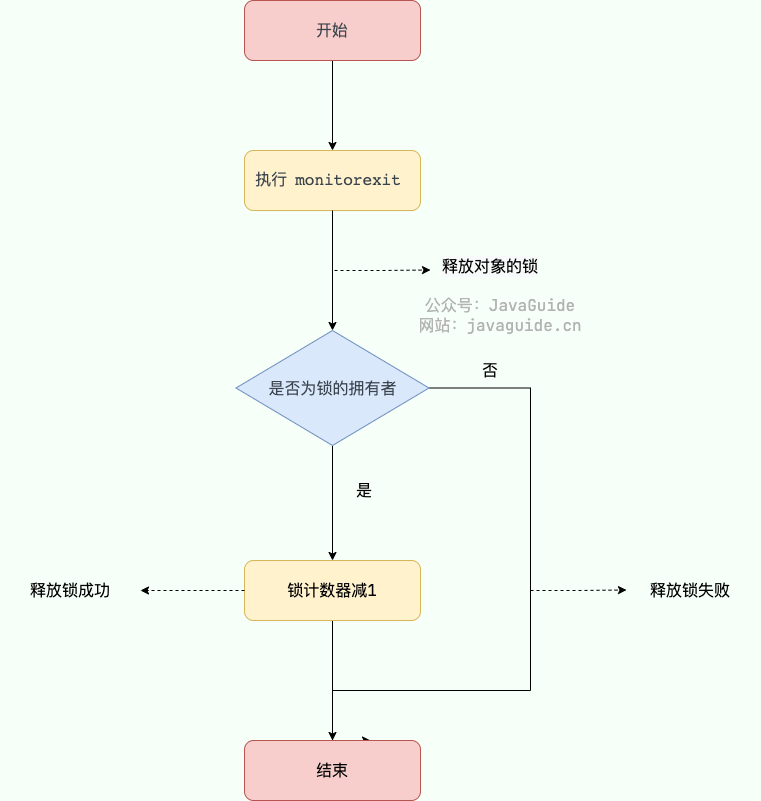
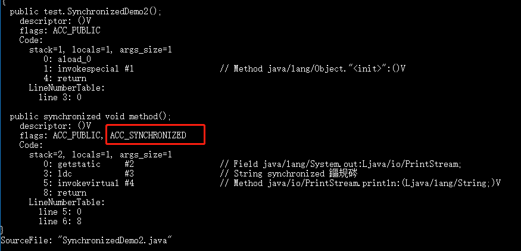
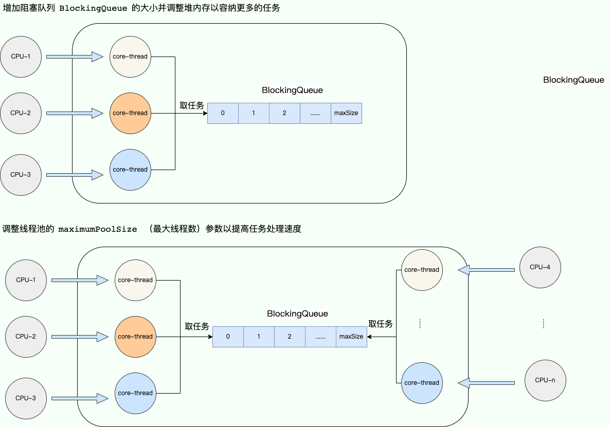
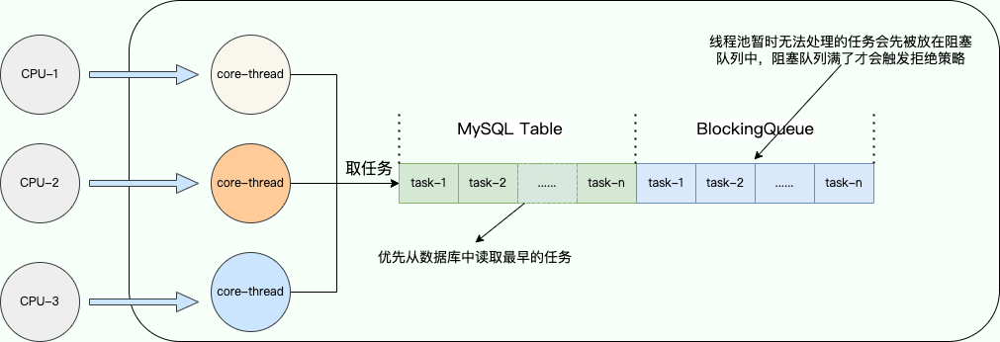
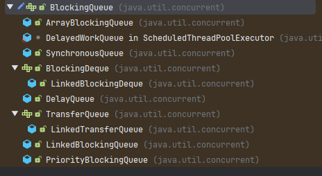

## 线程
### 虚拟机栈和本地方法栈为什么是私有的？

- **虚拟机栈：** 每个 Java 方法在执行之前会创建一个栈帧用于存储局部变量表、操作数栈、常量池引用等信息。从方法调用直至执行完成的过程，就对应着一个栈帧在 Java 虚拟机栈中入栈和出栈的过程。
- **本地方法栈：** 和虚拟机栈所发挥的作用非常相似，区别是：**虚拟机栈为虚拟机执行 Java 方法 （也就是字节码）服务，而本地方法栈则为虚拟机使用到的 Native 方法服务。** 在`HotSpot`虚拟机中和 Java 虚拟机栈合二为一。

所以，为了**保证线程中的局部变量不被别的线程访问到**，虚拟机栈和本地方法栈是线程私有的。

### 一句话简单了解堆和方法区

堆和方法区是所有线程共享的资源，其中堆是进程中最大的一块内存，主要用于存放新创建的对象 (几乎所有对象都在这里分配内存)，方法区主要用于存放已被加载的类信息、常量、静态变量、即时编译器编译后的代码等数据。

### 线程的生命周期和状态

Java 线程在运行的生命周期中的指定时刻只可能处于下面 6 种不同状态的其中一个状态：

- NEW: 初始状态，线程被创建出来但没有被调用 `start()` 。
- RUNNABLE: 运行状态，线程被调用了 `start()`等待运行的状态。
- BLOCKED：阻塞状态，需要等待锁释放。
- WAITING：等待状态，表示该线程需要等待其他线程做出一些特定动作（通知或中断）。
- TIME_WAITING：超时等待状态，可以在指定的时间后自行返回而不是像 WAITING 那样一直等待。
- TERMINATED：终止状态，表示该线程已经运行完毕。

线程在生命周期中并不是固定处于某一个状态而是随着代码的执行在不同状态之间切换。


由上图可以看出：线程创建之后它将处于 **NEW（新建）** 状态，调用 `start()` 方法后开始运行，线程这时候处于 **READY（可运行）** 状态。可运行状态的线程获得了 CPU 时间片（timeslice）后就处于 **RUNNING（运行）** 状态。

> 在操作系统层面，线程有 READY 和 RUNNING 状态；而在 JVM 层面，只能看到 RUNNABLE 状态（图源：[HowToDoInJava](https://howtodoinJava.com/ "HowToDoInJava")：[Java Thread Life Cycle and Thread States](https://howtodoinJava.com/Java/multi-threading/Java-thread-life-cycle-and-thread-states/ "Java Thread Life Cycle and Thread States")），所以 Java 系统一般将这两个状态统称为 **RUNNABLE（运行中）** 状态 。
**为什么 JVM 没有区分这两种状态呢？** （摘自：[Java 线程运行怎么有第六种状态？ - Dawell 的回答](https://www.zhihu.com/question/56494969/answer/154053599) ） 现在的时分（time-sharing）多任务（multi-task）操作系统架构通常都是用所谓的“时间分片（time quantum or time slice）”方式进行抢占式（preemptive）轮转调度（round-robin 式）。这个时间分片通常是很小的，一个线程一次最多只能在 CPU 上运行比如 10-20ms 的时间（此时处于 running 状态），也即大概只有 0.01 秒这一量级，时间片用后就要被切换下来放入调度队列的末尾等待再次调度。（也即回到 ready 状态）。线程切换的如此之快，区分这两种状态就没什么意义了。

- 当线程执行 `wait()`方法之后，线程进入 **WAITING（等待）** 状态。进入等待状态的线程需要依靠其他线程的通知才能够返回到运行状态。
- **TIMED_WAITING(超时等待)** 状态相当于在等待状态的基础上增加了超时限制，比如通过 `sleep（long millis）`方法或 `wait（long millis）`方法可以将线程置于 TIMED_WAITING 状态。当超时时间结束后，线程将会返回到 RUNNABLE 状态。
- 当线程进入 `synchronized` 方法/块或者调用 `wait` 后（被 `notify`）重新进入 `synchronized` 方法/块，但是锁被其它线程占有，这个时候线程就会进入 **BLOCKED（阻塞）** 状态。
- 线程在执行完了 `run()`方法之后将会进入到 **TERMINATED（终止）** 状态。

### `Thread#sleep()`方法和`Object#wait()`方法对比

**共同点**： 两者都可以暂停线程的执行

**区别**：
- **`sleep()` 方法没有释放锁，而 `wait()` 方法释放了锁** 。
- `wait()` 通常被用于线程间交互/通信，`sleep()`通常被用于暂停执行。
- `wait()` 方法被调用后，线程不会自动苏醒，需要别的线程调用同一个对象上的 `notify()`或者 `notifyAll()` 方法。`sleep()`方法执行完成后，线程会自动苏醒，或者也可以使用 `wait(long timeout)` 超时后线程会自动苏醒。
- `sleep()` 是 `Thread` 类的静态本地方法，`wait()` 则是 `Object` 类的本地方法。为什么这样设计呢？下一个问题就会聊到。

### 为什么`wati()`方法不定义在`Thread`中？

`wait()` 是让获得对象锁的线程实现等待，会自动释放当前线程占有的对象锁。每个对象（`Object`）都拥有对象锁，既然要释放当前线程占有的对象锁并让其进入 WAITING 状态，自然是要操作对应的对象（`Object`）而非当前的线程（`Thread`）。

类似的问题：**为什么 `sleep()` 方法定义在 `Thread` 中？**

因为 `sleep()` 是让当前线程暂停执行，不涉及到对象类，也不需要获得对象锁。

### 可以直接调用`Thread`中的`run`方法么？

new 一个 `Thread`，线程进入了新建状态。调用 `start()`方法，会启动一个线程并使线程进入了就绪状态，当分配到时间片后就可以开始运行了。 `start()` 会执行线程的相应准备工作，然后自动执行 `run()` 方法的内容，这是真正的多线程工作。 但是，直接执行 `run()` 方法，会把 `run()` 方法当成一个 main 线程下的普通方法去执行，并不会在某个线程中执行它，所以这并不是多线程工作。

**总结：调用 `start()` 方法方可启动线程并使线程进入就绪状态，直接执行 `run()` 方法的话不会以多线程的方式执行。**

## 多线程

### 并发语并行的区别

- **并发**：两个及两个以上的作业在同一 **时间段** 内执行。
- **并行**：两个及两个以上的作业在同一 **时刻** 执行。
最关键的点是：是否是 **同时** 执行。

### 同步和异步的区别

- **同步**：发出一个调用之后，在没有得到结果之前， 该调用就不可以返回，一直等待。
- **异步**：调用在发出之后，不用等待返回结果，该调用直接返回。

### 🌟为什么要使用多线程？

先从总体上来说：

- **从计算机底层来说：** 线程可以比作是轻量级的进程，是程序执行的最小单位,线程间的切换和调度的成本远远小于进程。另外，多核 CPU 时代意味着多个线程可以同时运行，这减少了线程上下文切换的开销。
- **从当代互联网发展趋势来说：** 现在的系统动不动就要求百万级甚至千万级的并发量，而多线程并发编程正是开发高并发系统的基础，利用好多线程机制可以大大提高系统整体的并发能力以及性能。

再深入到计算机底层来探讨：

- **单核时代**：在单核时代多线程主要是为了提高单进程利用 CPU 和 IO 系统的效率。 假设只运行了一个 Java 进程的情况，当我们请求 IO 的时候，如果 Java 进程中只有一个线程，此线程被 IO 阻塞则整个进程被阻塞。CPU 和 IO 设备只有一个在运行，那么可以简单地说系统整体效率只有 50%。当使用多线程的时候，一个线程被 IO 阻塞，其他线程还可以继续使用 CPU。从而提高了 Java 进程利用系统资源的整体效率。
- **多核时代**: 多核时代多线程主要是为了提高进程利用多核 CPU 的能力。举个例子：假如我们要计算一个复杂的任务，我们只用一个线程的话，不论系统有几个 CPU 核心，都只会有一个 CPU 核心被利用到。而创建多个线程，这些线程可以被映射到底层多个 CPU 核心上执行，在任务中的多个线程没有资源竞争的情况下，任务执行的效率会有显著性的提高，约等于（单核时执行时间/CPU 核心数）。

### 单核`CPU`支持`Java`多线程么？

单核 CPU 是支持 Java 多线程的。操作系统通过时间片轮转的方式，将 CPU 的时间分配给不同的线程。尽管单核 CPU 一次只能执行一个任务，但通过快速在多个线程之间切换，可以让用户感觉多个任务是同时进行的。

这里顺带提一下 Java 使用的线程调度方式。

操作系统主要通过两种线程调度方式来管理多线程的执行：

- **抢占式调度（Preemptive Scheduling）**：操作系统决定何时暂停当前正在运行的线程，并切换到另一个线程执行。这种切换通常是由系统时钟中断（时间片轮转）或其他高优先级事件（如 I/O 操作完成）触发的。这种方式存在上下文切换开销，但公平性和 CPU 资源利用率较好，不易阻塞。
- **协同式调度（Cooperative Scheduling）**：线程执行完毕后，主动通知系统切换到另一个线程。这种方式可以减少上下文切换带来的性能开销，但公平性较差，容易阻塞。

Java 使用的线程调度是抢占式的。也就是说，JVM 本身不负责线程的调度，而是将线程的调度委托给操作系统。操作系统通常会基于线程优先级和时间片来调度线程的执行，高优先级的线程通常获得 CPU 时间片的机会更多。

### 🌟单核`CPU`上运行多个线程效率一定会高么？

单核 CPU 同时运行多个线程的效率是否会高，取决于线程的类型和任务的性质。一般来说，有两种类型的线程：

1. **CPU 密集型**：CPU 密集型的线程主要进行计算和逻辑处理，需要占用大量的 CPU 资源。
2. **IO 密集型**：IO 密集型的线程主要进行输入输出操作，如读写文件、网络通信等，需要等待 IO 设备的响应，而不占用太多的 CPU 资源。

在单核 CPU 上，同一时刻只能有一个线程在运行，其他线程需要等待 CPU 的时间片分配。如果线程是 CPU 密集型的，那么多个线程同时运行会导致频繁的线程切换，增加了系统的开销，降低了效率。如果线程是 IO 密集型的，那么多个线程同时运行可以利用 CPU 在等待 IO 时的空闲时间，提高了效率。

因此，对于单核 CPU 来说，如果任务是 CPU 密集型的，那么开很多线程会影响效率；如果任务是 IO 密集型的，那么开很多线程会提高效率。当然，这里的“很多”也要适度，不能超过系统能够承受的上限。

## 🌟死锁

### 什么是死锁？

线程死锁描述的是这样一种情况：多个线程同时被阻塞，它们中的一个或者全部都在等待某个资源被释放。由于线程被无限期地阻塞，因此程序不可能正常终止。

如下图所示，线程 A 持有资源 2，线程 B 持有资源 1，他们同时都想申请对方的资源，所以这两个线程就会互相等待而进入死锁状态。



下面通过一个例子来说明线程死锁,代码模拟了上图的死锁的情况 (代码来源于《并发编程之美》)：

```java
public class DeadLockDemo {
    private static Object resource1 = new Object();//资源 1
    private static Object resource2 = new Object();//资源 2

    public static void main(String[] args) {
        new Thread(() -> {
            synchronized (resource1) {
                System.out.println(Thread.currentThread() + "get resource1");
                try {
                    Thread.sleep(1000);
                } catch (InterruptedException e) {
                    e.printStackTrace();
                }
                System.out.println(Thread.currentThread() + "waiting get resource2");
                synchronized (resource2) {
                    System.out.println(Thread.currentThread() + "get resource2");
                }
            }
        }, "线程 1").start();

        new Thread(() -> {
            synchronized (resource2) {
                System.out.println(Thread.currentThread() + "get resource2");
                try {
                    Thread.sleep(1000);
                } catch (InterruptedException e) {
                    e.printStackTrace();
                }
                System.out.println(Thread.currentThread() + "waiting get resource1");
                synchronized (resource1) {
                    System.out.println(Thread.currentThread() + "get resource1");
                }
            }
        }, "线程 2").start();
    }
}
```

Output

```
Thread[线程 1,5,main]get resource1
Thread[线程 2,5,main]get resource2
Thread[线程 1,5,main]waiting get resource2
Thread[线程 2,5,main]waiting get resource1
```

线程 A 通过 `synchronized (resource1)` 获得 `resource1` 的监视器锁，然后通过`Thread.sleep(1000);`让线程 A 休眠 1s 为的是让线程 B 得到执行然后获取到 resource2 的监视器锁。线程 A 和线程 B 休眠结束了都开始企图请求获取对方的资源，然后这两个线程就会陷入互相等待的状态，这也就产生了死锁。

上面的例子符合**产生死锁的四个必要条件**：

1. **互斥条件**：该资源任意一个时刻只由一个线程占用。
2. **请求与保持条件**：一个线程因请求资源而阻塞时，对已获得的资源保持不放。
3. **不剥夺条件**：线程已获得的资源在未使用完之前不能被其他线程强行剥夺，只有自己使用完毕后才释放资源。
4. **循环等待条件**：若干线程之间形成一种头尾相接的循环等待资源关系。

### `volatile`可以保证原子性么？

**`volatile` 关键字能保证变量的可见性，但不能保证对变量的操作是原子性的。**

```java
public class VolatileAtomicityDemo {
    public volatile static int inc = 0;

    public void increase() {
        inc++;
    }

    public static void main(String[] args) throws InterruptedException {
        ExecutorService threadPool = Executors.newFixedThreadPool(5);
        VolatileAtomicityDemo volatileAtomicityDemo = new VolatileAtomicityDemo();
        for (int i = 0; i < 5; i++) {
            threadPool.execute(() -> {
                for (int j = 0; j < 500; j++) {
                    volatileAtomicityDemo.increase();
                }
            });
        }
        // 等待1.5秒，保证上面程序执行完成
        Thread.sleep(1500);
        System.out.println(inc);
        threadPool.shutdown();
    }
}
```

正常情况下，运行上面的代码理应输出 `2500`。但你真正运行了上面的代码之后，你会发现每次输出结果都小于 `2500`。

为什么会出现这种情况呢？不是说好了，`volatile` 可以保证变量的可见性嘛！

也就是说，如果 `volatile` 能保证 `inc++` 操作的原子性的话。每个线程中对 `inc` 变量自增完之后，其他线程可以立即看到修改后的值。5 个线程分别进行了 500 次操作，那么最终 inc 的值应该是 5*500=2500。

很多人会误认为自增操作 `inc++` 是原子性的，实际上，`inc++` 其实是一个复合操作，包括三步：

1. 读取 inc 的值。
2. 对 inc 加 1。
3. 将 inc 的值写回内存。

`volatile` 是无法保证这三个操作是具有原子性的，有可能导致下面这种情况出现：

4. 线程 1 对 `inc` 进行读取操作之后，还未对其进行修改。线程 2 又读取了 `inc`的值并对其进行修改（+1），再将`inc` 的值写回内存。
5. 线程 2 操作完毕后，线程 1 对 `inc`的值进行修改（+1），再将`inc` 的值写回内存。

这也就导致两个线程分别对 `inc` 进行了一次自增操作后，`inc` 实际上只增加了 1。

其实，如果想要保证上面的代码运行正确也非常简单，利用 `synchronized`、`Lock`或者`AtomicInteger`都可以。

使用 `synchronized` 改进：

```java
public synchronized void increase() {
    inc++;
}
```

使用 `AtomicInteger` 改进：

```java
public AtomicInteger inc = new AtomicInteger();

public void increase() {
    inc.getAndIncrement();
}
```

使用 `ReentrantLock` 改进：

```java
Lock lock = new ReentrantLock();
public void increase() {
    lock.lock();
    try {
        inc++;
    } finally {
        lock.unlock();
    }
}
```

## 🌟乐观锁和悲观锁

### 什么是悲观锁？

悲观锁总是假设最坏的情况，认为共享资源每次被访问的时候就会出现问题(比如共享数据被修改)，所以每次在获取资源操作的时候都会上锁，这样其他线程想拿到这个资源就会阻塞直到锁被上一个持有者释放。也就是说，**共享资源每次只给一个线程使用，其它线程阻塞，用完后再把资源转让给其它线程**。

像 Java 中`synchronized`和`ReentrantLock`等独占锁就是悲观锁思想的实现。

```java
public void performSynchronisedTask() {
    synchronized (this) {
        // 需要同步的操作
    }
}

private Lock lock = new ReentrantLock();
lock.lock();
try {
   // 需要同步的操作
} finally {
    lock.unlock();
}
```

高并发的场景下，激烈的锁竞争会造成线程阻塞，大量阻塞线程会导致系统的上下文切换，增加系统的性能开销。并且，悲观锁还可能会存在死锁问题，影响代码的正常运行。

### 什么是乐观锁？

乐观锁总是假设最好的情况，认为共享资源每次被访问的时候不会出现问题，线程可以不停地执行，无需加锁也无需等待，只是在提交修改的时候去验证对应的资源（也就是数据）是否被其它线程修改了（具体方法可以使用版本号机制或 CAS 算法）。

在 Java 中`java.util.concurrent.atomic`包下面的原子变量类（比如`AtomicInteger`、`LongAdder`）就是使用了乐观锁的一种实现方式 **CAS** 实现的。



```java
// LongAdder 在高并发场景下会比 AtomicInteger 和 AtomicLong 的性能更好
// 代价就是会消耗更多的内存空间（空间换时间）
LongAdder sum = new LongAdder();
sum.increment();
```

高并发的场景下，乐观锁相比悲观锁来说，不存在锁竞争造成线程阻塞，也不会有死锁的问题，在性能上往往会更胜一筹。但是，如果冲突频繁发生（写占比非常多的情况），会频繁失败和重试，这样同样会非常影响性能，导致 CPU 飙升。

不过，大量失败重试的问题也是可以解决的，像我们前面提到的 `LongAdder`以空间换时间的方式就解决了这个问题。

理论上来说：

- 悲观锁通常多用于写比较多的情况（多写场景，竞争激烈），这样可以避免频繁失败和重试影响性能，悲观锁的开销是固定的。不过，如果乐观锁解决了频繁失败和重试这个问题的话（比如`LongAdder`），也是可以考虑使用乐观锁的，要视实际情况而定。
- 乐观锁通常多用于写比较少的情况（多读场景，竞争较少），这样可以避免频繁加锁影响性能。不过，乐观锁主要针对的对象是单个共享变量（参考`java.util.concurrent.atomic`包下面的原子变量类）。

### 如何实现乐观锁？

乐观锁一般会使用版本号机制或 CAS 算法实现，CAS 算法相对来说更多一些，这里需要格外注意。


#### 版本号机制

一般是在数据表中加上一个数据版本号 `version` 字段，表示数据被修改的次数。当数据被修改时，`version` 值会加一。当线程 A 要更新数据值时，在读取数据的同时也会读取 `version` 值，在提交更新时，若刚才读取到的 version 值为当前数据库中的 `version` 值相等时才更新，否则重试更新操作，直到更新成功。

**举一个简单的例子**：假设数据库中帐户信息表中有一个 version 字段，当前值为 1 ；而当前帐户余额字段（ `balance` ）为 $100 。

1. 操作员 A 此时将其读出（ `version`=1 ），并从其帐户余额中扣除 $50（ $100-$50 ）。
2. 在操作员 A 操作的过程中，操作员 B 也读入此用户信息（ `version`=1 ），并从其帐户余额中扣除 $20 （ $100-$20 ）。
3. 操作员 A 完成了修改工作，将数据版本号（ `version`=1 ），连同帐户扣除后余额（ `balance`=$50 ），提交至数据库更新，此时由于提交数据版本等于数据库记录当前版本，数据被更新，数据库记录 `version` 更新为 2 。
4. 操作员 B 完成了操作，也将版本号（ `version`=1 ）试图向数据库提交数据（ `balance`=$80 ），但此时比对数据库记录版本时发现，操作员 B 提交的数据版本号为 1 ，数据库记录当前版本也为 2 ，不满足 “ 提交版本必须等于当前版本才能执行更新 “ 的乐观锁策略，因此，操作员 B 的提交被驳回。

这样就避免了操作员 B 用基于 `version`=1 的旧数据修改的结果覆盖操作员 A 的操作结果的可能。

#### `CAS`算法

CAS 的全称是 **Compare And Swap（比较与交换）** ，用于实现乐观锁，被广泛应用于各大框架中。CAS 的思想很简单，就是用一个预期值和要更新的变量值进行比较，两值相等才会进行更新。

CAS 是一个原子操作，底层依赖于一条 CPU 的原子指令。

> **原子操作** 即最小不可拆分的操作，也就是说操作一旦开始，就不能被打断，直到操作完成。

CAS 涉及到三个操作数：

- **V**：要更新的变量值(Var)
- **E**：预期值(Expected)
- **N**：拟写入的新值(New)

当且仅当 V 的值等于 E 时，CAS 通过原子方式用新值 N 来更新 V 的值。如果不等，说明已经有其它线程更新了 V，则当前线程放弃更新。

**举一个简单的例子**：线程 A 要修改变量 i 的值为 6，i 原值为 1（V = 1，E=1，N=6，假设不存在 ABA 问题）。

1. i 与 1 进行比较，如果相等， 则说明没被其他线程修改，可以被设置为 6 。
2. i 与 1 进行比较，如果不相等，则说明被其他线程修改，当前线程放弃更新，CAS 操作失败。

当多个线程同时使用 CAS 操作一个变量时，只有一个会胜出，并成功更新，其余均会失败，但失败的线程并不会被挂起，仅是被告知失败，并且允许再次尝试，当然也允许失败的线程放弃操作。

Java 语言并没有直接实现 CAS，CAS 相关的实现是通过 C++ 内联汇编的形式实现的（JNI 调用）。因此， CAS 的具体实现和操作系统以及 CPU 都有关系。

`sun.misc`包下的`Unsafe`类提供了`compareAndSwapObject`、`compareAndSwapInt`、`compareAndSwapLong`方法来实现的对`Object`、`int`、`long`类型的 CAS 操作

```java
/**
  *  CAS
  * @param o         包含要修改field的对象
  * @param offset    对象中某field的偏移量
  * @param expected  期望值
  * @param update    更新值
  * @return          true | false
  */
public final native boolean compareAndSwapObject(Object o, long offset,  Object expected, Object update);

public final native boolean compareAndSwapInt(Object o, long offset, int expected,int update);

public final native boolean compareAndSwapLong(Object o, long offset, long expected, long update);
```

## `synchronized`关键字

### `synchronized`是什么？有什么用？

`synchronized` 是 Java 中的一个关键字，翻译成中文是同步的意思，主要解决的是多个线程之间访问资源的同步性，可以保证被它修饰的方法或者代码块在任意时刻只能有一个线程执行。

在 Java 早期版本中，`synchronized` 属于 **重量级锁**，效率低下。这是因为监视器锁（monitor）是依赖于底层的操作系统的 `Mutex Lock` 来实现的，Java 的线程是映射到操作系统的原生线程之上的。如果要挂起或者唤醒一个线程，都需要操作系统帮忙完成，而操作系统实现线程之间的切换时需要从用户态转换到内核态，这个状态之间的转换需要相对比较长的时间，时间成本相对较高。

不过，在 Java 6 之后， `synchronized` 引入了大量的优化如自旋锁、适应性自旋锁、锁消除、锁粗化、偏向锁、轻量级锁等技术来减少锁操作的开销，这些优化让 `synchronized` 锁的效率提升了很多。因此， `synchronized` 还是可以在实际项目中使用的，像 JDK 源码、很多开源框架都大量使用了 `synchronized` 。

关于偏向锁多补充一点：由于偏向锁增加了 JVM 的复杂性，同时也并没有为所有应用都带来性能提升。因此，在 JDK15 中，偏向锁被默认关闭（仍然可以使用 `-XX:+UseBiasedLocking` 启用偏向锁），在 JDK18 中，偏向锁已经被彻底废弃（无法通过命令行打开）。

### 如何使用`synchronized`？

`synchronized` 关键字的使用方式主要有下面 3 种：

1. 修饰实例方法
2. 修饰静态方法
3. 修饰代码块

**1、修饰实例方法** （锁当前对象实例）

给当前对象实例加锁，进入同步代码前要获得 **当前对象实例的锁** 。

```java
synchronized void method() {
    //业务代码
}
```

**2、修饰静态方法** （锁当前类）

给当前类加锁，会作用于类的所有对象实例 ，进入同步代码前要获得 **当前 class 的锁**。

这是因为静态成员不属于任何一个实例对象，归整个类所有，不依赖于类的特定实例，被类的所有实例共享。

```java
synchronized static void method() {
    //业务代码
}
```

静态 `synchronized` 方法和非静态 `synchronized` 方法之间的调用互斥么？不互斥！如果一个线程 A 调用一个实例对象的非静态 `synchronized` 方法，而线程 B 需要调用这个实例对象所属类的静态 `synchronized` 方法，是允许的，不会发生互斥现象，因为访问静态 `synchronized` 方法占用的锁是当前类的锁，而访问非静态 `synchronized` 方法占用的锁是当前实例对象锁。

**3、修饰代码块** （锁指定对象/类）

对括号里指定的对象/类加锁：

- `synchronized(object)` 表示进入同步代码库前要获得 **给定对象的锁**。
- `synchronized(类.class)` 表示进入同步代码前要获得 **给定 Class 的锁**

```java
synchronized(this) {
    //业务代码
}
```

**总结：**

- `synchronized` 关键字加到 `static` 静态方法和 `synchronized(class)` 代码块上都是是给 Class 类上锁；
- `synchronized` 关键字加到实例方法上是给对象实例上锁；
- 尽量不要使用 `synchronized(String a)` 因为 JVM 中，字符串常量池具有缓存功能。

### 构造方法可以用`synchronized`修饰么？

构造方法不能使用 synchronized 关键字修饰。不过，可以在构造方法内部使用 synchronized 代码块。

另外，**构造方法本身是线程安全的**，但如果在构造方法中涉及到共享资源的操作，就需要采取适当的同步措施来保证整个构造过程的线程安全。

### 🌟`synchronized`底层原理

synchronized 关键字底层原理属于 JVM 层面的东西。

#### `synchronized`同步语句块的情况

```java
package com.stone;  
  
public class SynchronizedDemo {  
    public void method() {  
        synchronized (this) {  
            System.out.println("synchronized code");  
        }  
    }  
}
```

通过 JDK 自带的 `javap` 命令查看 `SynchronizedDemo` 类的相关字节码信息：首先切换到类的对应目录执行 `javac SynchronizedDemo.java` 命令生成编译后的 .class 文件，然后执行`javap -c -s -v -l SynchronizedDemo.class`。


从上面我们可以看出：**`synchronized` 同步语句块的实现使用的是 `monitorenter` 和 `monitorexit` 指令，其中 `monitorenter` 指令指向同步代码块的开始位置，`monitorexit` 指令则指明同步代码块的结束位置。**

上面的字节码中包含一个 `monitorenter` 指令以及两个 `monitorexit` 指令，这是为了保证锁在同步代码块代码正常执行以及出现异常的这两种情况下都能被正确释放。

当执行 `monitorenter` 指令时，线程试图获取锁也就是获取 **对象监视器 `monitor`** 的持有权。

> 在 Java 虚拟机(HotSpot)中，Monitor 是基于 C++实现的，由[ObjectMonitor](https://github.com/openjdk-mirror/jdk7u-hotspot/blob/50bdefc3afe944ca74c3093e7448d6b889cd20d1/src/share/vm/runtime/objectMonitor.cpp)实现的。每个对象中都内置了一个 `ObjectMonitor`对象。
> 
> 另外，`wait/notify`等方法也依赖于`monitor`对象，这就是为什么只有在同步的块或者方法中才能调用`wait/notify`等方法，否则会抛出`java.lang.IllegalMonitorStateException`的异常的原因。

在执行`monitorenter`时，会尝试获取对象的锁，如果锁的计数器为 0 则表示锁可以被获取，获取后将锁计数器设为 1 也就是加 1。



对象锁的的拥有者线程才可以执行 `monitorexit` 指令来释放锁。在执行 `monitorexit` 指令后，将锁计数器设为 0，表明锁被释放，其他线程可以尝试获取锁。



如果获取对象锁失败，那当前线程就要阻塞等待，直到锁被另外一个线程释放为止。

#### `synchronized`修饰方法的情况

```java
public class SynchronizedDemo2 {
    public synchronized void method() {
        System.out.println("synchronized 方法");
    }
}
```



`synchronized` 修饰的方法并没有 `monitorenter` 指令和 `monitorexit` 指令，取而代之的是 `ACC_SYNCHRONIZED` 标识，该标识指明了该方法是一个同步方法。JVM 通过该 `ACC_SYNCHRONIZED` 访问标志来辨别一个方法是否声明为同步方法，从而执行相应的同步调用。

如果是实例方法，JVM 会尝试获取实例对象的锁。如果是静态方法，JVM 会尝试获取当前 class 的锁。

#### 总结

`synchronized` 同步语句块的实现使用的是 `monitorenter` 和 `monitorexit` 指令，其中 `monitorenter` 指令指向同步代码块的开始位置，`monitorexit` 指令则指明同步代码块的结束位置。

`synchronized` 修饰的方法并没有 `monitorenter` 指令和 `monitorexit` 指令，取而代之的是 `ACC_SYNCHRONIZED` 标识，该标识指明了该方法是一个同步方法。

**不过，两者的本质都是对对象监视器 monitor 的获取。**

### `synchronized`和`volatile`有什么区别？

`synchronized` 关键字和 `volatile` 关键字是两个互补的存在，而不是对立的存在！

- `volatile` 关键字是线程同步的轻量级实现，所以 `volatile`性能肯定比`synchronized`关键字要好 。但是 `volatile` 关键字只能用于变量而 `synchronized` 关键字可以修饰方法以及代码块 。
- `volatile` 关键字能保证数据的可见性，但不能保证数据的原子性。`synchronized` 关键字两者都能保证。
- `volatile`关键字主要用于解决变量在多个线程之间的可见性，而 `synchronized` 关键字解决的是多个线程之间访问资源的同步性。

|    特性    | `synchronized` |  `volatile`  |
| :------: | :------------: | :----------: |
| **作用范围** |     方法或代码块     |      变量      |
| **锁机制**  |    基于对象锁或类锁    |     无锁机制     |
| **可见性**  |     保证可见性      |    保证可见性     |
| **原子性**  |     保证原子性      |    不保证原子性    |
| **有序性**  |     保证有序性      |    保证有序性     |
|  **性能**  |   较低（因为锁的开销）   |      较高      |
| **适用场景** |  需要互斥访问的复杂操作   | 单一变量的可见性和有序性 |

## `ReentrantLock`

### `ReentrantLock`是什么？

`ReentrantLock` 实现了 `Lock` 接口，是一个可重入且独占式的锁，和 `synchronized` 关键字类似。不过，`ReentrantLock` 更灵活、更强大，增加了轮询、超时、中断、公平锁和非公平锁等高级功能。

```java
public class ReentrantLock implements Lock, java.io.Serializable {}
```

`ReentrantLock` 里面有一个内部类 `Sync`，`Sync` 继承 AQS（`AbstractQueuedSynchronizer`），添加锁和释放锁的大部分操作实际上都是在 `Sync` 中实现的。`Sync` 有公平锁 `FairSync` 和非公平锁 `NonfairSync` 两个子类。


`ReentrantLock` 默认使用非公平锁，也可以通过构造器来显式的指定使用公平锁。

```java
// 传入一个 boolean 值，true 时为公平锁，false 时为非公平锁
public ReentrantLock(boolean fair) {
    sync = fair ? new FairSync() : new NonfairSync();
}
```

### 公平锁和非公平锁有什么区别？

- **公平锁** : 锁被释放之后，先申请的线程先得到锁。性能较差一些，因为公平锁为了保证时间上的绝对顺序，上下文切换更频繁。
- **非公平锁**：锁被释放之后，后申请的线程可能会先获取到锁，是随机或者按照其他优先级排序的。性能更好，但可能会导致某些线程永远无法获取到锁。

### 🌟`synchronized`和`ReentrantLock`有什么区别？

#### 两者都是可重入锁

**可重入锁** 也叫递归锁，指的是线程可以再次获取自己的内部锁。比如一个线程获得了某个对象的锁，此时这个对象锁还没有释放，当其再次想要获取这个对象的锁的时候还是可以获取的，如果是不可重入锁的话，就会造成死锁。

JDK 提供的所有现成的 `Lock` 实现类，包括 `synchronized` 关键字锁都是可重入的。

在下面的代码中，`method1()` 和 `method2()`都被 `synchronized` 关键字修饰，`method1()`调用了`method2()`。

```java
public class SynchronizedDemo {
    public synchronized void method1() {
        System.out.println("方法1");
        method2();
    }

    public synchronized void method2() {
        System.out.println("方法2");
    }
}
```

由于 `synchronized`锁是可重入的，同一个线程在调用`method1()` 时可以直接获得当前对象的锁，执行 `method2()` 的时候可以再次获取这个对象的锁，不会产生死锁问题。假如`synchronized`是不可重入锁的话，由于该对象的锁已被当前线程所持有且无法释放，这就导致线程在执行 `method2()`时获取锁失败，会出现死锁问题。

#### `ReentrantLock`比`synchronized`增加了一些高级功能

相比`synchronized`，`ReentrantLock`增加了一些高级功能。主要来说主要有三点：

- **等待可中断** : `ReentrantLock`提供了一种能够中断等待锁的线程的机制，通过 `lock.lockInterruptibly()` 来实现这个机制。也就是说当前线程在等待获取锁的过程中，如果其他线程中断当前线程「 `interrupt()` 」，当前线程就会抛出 `InterruptedException` 异常，可以捕捉该异常进行相应处理。
- **可实现公平锁** : `ReentrantLock`可以指定是公平锁还是非公平锁。而`synchronized`只能是非公平锁。所谓的公平锁就是先等待的线程先获得锁。`ReentrantLock`默认情况是非公平的，可以通过 `ReentrantLock`类的`ReentrantLock(boolean fair)`构造方法来指定是否是公平的。
- **可实现选择性通知（锁可以绑定多个条件）**: `synchronized`关键字与`wait()`和`notify()`/`notifyAll()`方法相结合可以实现等待/通知机制。`ReentrantLock`类当然也可以实现，但是需要借助于`Condition`接口与`newCondition()`方法。
- **支持超时** ：`ReentrantLock` 提供了 `tryLock(timeout)` 的方法，可以指定等待获取锁的最长等待时间，如果超过了等待时间，就会获取锁失败，不会一直等待。

如果你想使用上述功能，那么选择 `ReentrantLock` 是一个不错的选择。

关于 `Condition`接口的补充：

> `Condition`是 JDK1.5 之后才有的，它具有很好的灵活性，比如可以实现多路通知功能也就是在一个`Lock`对象中可以创建多个`Condition`实例（即对象监视器），**线程对象可以注册在指定的`Condition`中，从而可以有选择性的进行线程通知，在调度线程上更加灵活。 在使用`notify()/notifyAll()`方法进行通知时，被通知的线程是由 JVM 选择的，用`ReentrantLock`类结合`Condition`实例可以实现“选择性通知”** ，这个功能非常重要，而且是 `Condition` 接口默认提供的。而`synchronized`关键字就相当于整个 `Lock` 对象中只有一个`Condition`实例，所有的线程都注册在它一个身上。如果执行`notifyAll()`方法的话就会通知所有处于等待状态的线程，这样会造成很大的效率问题。而`Condition`实例的`signalAll()`方法，只会唤醒注册在该`Condition`实例中的所有等待线程。

关于 **等待可中断** 的补充：

> `lockInterruptibly()` 会让获取锁的线程在阻塞等待的过程中可以响应中断，即当前线程在获取锁的时候，发现锁被其他线程持有，就会阻塞等待。
>在阻塞等待的过程中，如果其他线程中断当前线程 `interrupt()` ，就会抛出 `InterruptedException` 异常，可以捕获该异常，做一些处理操作。
为了更好理解这个方法，借用 Stack Overflow 上的一个案例，可以更好地理解 `lockInterruptibly()` 可以响应中断：
```java
public class MyRentrantlock {
    Thread t = new Thread() {
        @Override
        public void run() {
            ReentrantLock r = new ReentrantLock();
            // 1.1、第一次尝试获取锁，可以获取成功
            r.lock();

            // 1.2、此时锁的重入次数为 1
            System.out.println("lock() : lock count :" + r.getHoldCount());

            // 2、中断当前线程，通过 Thread.currentThread().isInterrupted() 可以看到当前线程的中断状态为 true
            interrupt();
            System.out.println("Current thread is intrupted");

            // 3.1、尝试获取锁，可以成功获取
            r.tryLock();
            // 3.2、此时锁的重入次数为 2
            System.out.println("tryLock() on intrupted thread lock count :" + r.getHoldCount());
            try {
                // 4、打印线程的中断状态为 true，那么调用 lockInterruptibly() 方法就会抛出 InterruptedException 异常
                System.out.println("Current Thread isInterrupted:" + Thread.currentThread().isInterrupted());
                r.lockInterruptibly();
                System.out.println("lockInterruptibly() --NOt executable statement" + r.getHoldCount());
            } catch (InterruptedException e) {
                r.lock();
                System.out.println("Error");
            } finally {
                r.unlock();
            }

            // 5、打印锁的重入次数，可以发现 lockInterruptibly() 方法并没有成功获取到锁
            System.out.println("lockInterruptibly() not able to Acqurie lock: lock count :" + r.getHoldCount());

            r.unlock();
            System.out.println("lock count :" + r.getHoldCount());
            r.unlock();
            System.out.println("lock count :" + r.getHoldCount());
        }
    };
    public static void main(String str[]) {
        MyRentrantlock m = new MyRentrantlock();
        m.t.start();
    }
}
```
输出：
```bash
lock() : lock count :1
Current thread is intrupted
tryLock() on intrupted thread lock count :2
Current Thread isInterrupted:true
Error
lockInterruptibly() not able to Acqurie lock: lock count :2
lock count :1
lock count :0
```

关于 **支持超时** 的补充：
>**为什么需要 `tryLock(timeout)` 这个功能呢？**
`tryLock(timeout)` 方法尝试在指定的超时时间内获取锁。如果成功获取锁，则返回 `true`；如果在锁可用之前超时，则返回 `false`。此功能在以下几种场景中非常有用：
- **防止死锁：** 在复杂的锁场景中，`tryLock(timeout)` 可以通过允许线程在合理的时间内放弃并重试来帮助防止死锁。
- **提高响应速度：** 防止线程无限期阻塞。
- **处理时间敏感的操作：** 对于具有严格时间限制的操作，`tryLock(timeout)` 允许线程在无法及时获取锁时继续执行替代操作。

#### 可中断锁和不可中断锁有什么区别？

- **可中断锁**：获取锁的过程中可以被中断，不需要一直等到获取锁之后 才能进行其他逻辑处理。`ReentrantLock` 就属于是可中断锁。
- **不可中断锁**：一旦线程申请了锁，就只能等到拿到锁以后才能进行其他的逻辑处理。 `synchronized` 就属于是不可中断锁。

#### 线程持有读锁还能获取写锁么？

- 在线程持有读锁的情况下，该线程不能取得写锁(因为获取写锁的时候，如果发现当前的读锁被占用，就马上获取失败，不管读锁是不是被当前线程持有)。
- 在线程持有写锁的情况下，该线程可以继续获取读锁（获取读锁时如果发现写锁被占用，只有写锁没有被当前线程占用的情况才会获取失败）。

读写锁的源码分析，推荐阅读 [聊聊 Java 的几把 JVM 级锁 - 阿里巴巴中间件](https://mp.weixin.qq.com/s/h3VIUyH9L0v14MrQJiiDbw) 这篇文章，写的很不错。

#### 读锁为什么不能升级为写锁？

写锁可以降级为读锁，但是读锁却不能升级为写锁。这是因为读锁升级为写锁会引起线程的争夺，毕竟写锁属于是独占锁，这样的话，会影响性能。

另外，还可能会有死锁问题发生。举个例子：假设两个线程的读锁都想升级写锁，则需要对方都释放自己锁，而双方都不释放，就会产生死锁。

## `ThreadLocal`

### `ThreadLocal`有什么用？

通常情况下，我们创建的变量可以被任何一个线程访问和修改。这在多线程环境中可能导致数据竞争和线程安全问题。那么，**如果想让每个线程都有自己的专属本地变量，该如何实现呢？**

JDK 中提供的 `ThreadLocal` 类正是为了解决这个问题。**`ThreadLocal` 类允许每个线程绑定自己的值**，可以将其形象地比喻为一个“存放数据的盒子”。每个线程都有自己独立的盒子，用于存储私有数据，确保不同线程之间的数据互不干扰。

当你创建一个 `ThreadLocal` 变量时，每个访问该变量的线程都会拥有一个独立的副本。这也是 `ThreadLocal` 名称的由来。线程可以通过 `get()` 方法获取自己线程的本地副本，或通过 `set()` 方法修改该副本的值，从而避免了线程安全问题。

举个简单的例子：假设有两个人去宝屋收集宝物。如果他们共用一个袋子，必然会产生争执；但如果每个人都有一个独立的袋子，就不会有这个问题。如果将这两个人比作线程，那么 `ThreadLocal` 就是用来避免这两个线程竞争同一个资源的方法。

```java
public class ThreadLocalExample {
    private static ThreadLocal<Integer> threadLocal = ThreadLocal.withInitial(() -> 0);

    public static void main(String[] args) {
        Runnable task = () -> {
            int value = threadLocal.get();
            value += 1;
            threadLocal.set(value);
            System.out.println(Thread.currentThread().getName() + " Value: " + threadLocal.get());
        };

        Thread thread1 = new Thread(task, "Thread-1");
        Thread thread2 = new Thread(task, "Thread-2");

        thread1.start(); // 输出: Thread-1 Value: 1
        thread2.start(); // 输出: Thread-2 Value: 1
    }
}
```

### `ThreadLocal`原理

从 `Thread`类源代码入手。

```java
public class Thread implements Runnable {
    //......
    //与此线程有关的ThreadLocal值。由ThreadLocal类维护
    ThreadLocal.ThreadLocalMap threadLocals = null;

    //与此线程有关的InheritableThreadLocal值。由InheritableThreadLocal类维护
    ThreadLocal.ThreadLocalMap inheritableThreadLocals = null;
    //......
}
```

从上面`Thread`类 源代码可以看出`Thread` 类中有一个 `threadLocals` 和 一个 `inheritableThreadLocals` 变量，它们都是 `ThreadLocalMap` 类型的变量,我们可以把 `ThreadLocalMap` 理解为`ThreadLocal` 类实现的定制化的 `HashMap`。默认情况下这两个变量都是 null，只有当前线程调用 `ThreadLocal` 类的 `set`或`get`方法时才创建它们，实际上调用这两个方法的时候，我们调用的是`ThreadLocalMap`类对应的 `get()`、`set()`方法。

`ThreadLocal`类的`set()`方法

```java
public void set(T value) {
    //获取当前请求的线程
    Thread t = Thread.currentThread();
    //取出 Thread 类内部的 threadLocals 变量(哈希表结构)
    ThreadLocalMap map = getMap(t);
    if (map != null)
        // 将需要存储的值放入到这个哈希表中
        map.set(this, value);
    else
        createMap(t, value);
}
ThreadLocalMap getMap(Thread t) {
    return t.threadLocals;
}
```

通过上面这些内容，我们足以通过猜测得出结论：**最终的变量是放在了当前线程的 `ThreadLocalMap` 中，并不是存在 `ThreadLocal` 上，`ThreadLocal` 可以理解为只是`ThreadLocalMap`的封装，传递了变量值。** `ThrealLocal` 类中可以通过`Thread.currentThread()`获取到当前线程对象后，直接通过`getMap(Thread t)`可以访问到该线程的`ThreadLocalMap`对象。

**每个`Thread`中都具备一个`ThreadLocalMap`，而`ThreadLocalMap`可以存储以`ThreadLocal`为 key ，Object 对象为 value 的键值对。**

```java
ThreadLocalMap(ThreadLocal<?> firstKey, Object firstValue) {
    //......
}
```

比如我们在同一个线程中声明了两个 `ThreadLocal` 对象的话， `Thread`内部都是使用仅有的那个`ThreadLocalMap` 存放数据的，`ThreadLocalMap`的 key 就是 `ThreadLocal`对象，value 就是 `ThreadLocal` 对象调用`set`方法设置的值。

`ThreadLocal` 数据结构如下图所示：


`ThreadLocalMap`是`ThreadLocal`的静态内部类。


### `ThreadLocal`内存泄露的问题是怎么导致的？

`ThreadLocal` 内存泄漏的根本原因在于其内部实现机制。

通过上面的内容我们已经知道：每个线程维护一个名为 `ThreadLocalMap` 的 map。 当你使用 `ThreadLocal` 存储值时，实际上是将值存储在当前线程的 `ThreadLocalMap` 中，其中 `ThreadLocal` 实例本身作为 key，而你要存储的值作为 value。

`ThreadLocalMap` 的 `key` 和 `value` 引用机制：

- **key 是弱引用**：`ThreadLocalMap` 中的 key 是 `ThreadLocal` 的弱引用 (`WeakReference<ThreadLocal<?>>`)。 这意味着，如果 `ThreadLocal` 实例不再被任何强引用指向，垃圾回收器会在下次 GC 时回收该实例，导致 `ThreadLocalMap` 中对应的 key 变为 `null`。
- **value 是强引用**：`ThreadLocalMap` 中的 value 是强引用。 即使 key 被回收（变为 `null`），value 仍然存在于 `ThreadLocalMap` 中，被强引用，不会被回收。

```java
static class Entry extends WeakReference<ThreadLocal<?>> {
    /** The value associated with this ThreadLocal. */
    Object value;

    Entry(ThreadLocal<?> k, Object v) {
        super(k);
        value = v;
    }
}
```

当 `ThreadLocal` 实例失去强引用后，其对应的 value 仍然存在于 `ThreadLocalMap` 中，因为 `Entry` 对象强引用了它。如果线程持续存活（例如线程池中的线程），`ThreadLocalMap` 也会一直存在，导致 key 为 `null` 的 entry 无法被垃圾回收，机会造成内存泄漏。

也就是说，内存泄漏的发生需要同时满足两个条件：

1. `ThreadLocal` 实例不再被强引用；
2. 线程持续存活，导致 `ThreadLocalMap` 长期存在。

虽然 `ThreadLocalMap` 在 `get()`, `set()` 和 `remove()` 操作时会尝试清理 key 为 null 的 entry，但这种清理机制是被动的，并不完全可靠。

**如何避免内存泄漏的发生？**

1. 在使用完 `ThreadLocal` 后，务必调用 `remove()` 方法。 这是最安全和最推荐的做法。 `remove()` 方法会从 `ThreadLocalMap` 中显式地移除对应的 entry，彻底解决内存泄漏的风险。 即使将 `ThreadLocal` 定义为 `static final`，也强烈建议在每次使用后调用 `remove()`。
2. 在线程池等线程复用的场景下，使用 `try-finally` 块可以确保即使发生异常，`remove()` 方法也一定会被执行。

## 线程池

### 什么是线程池？

顾名思义，线程池就是管理一系列线程的资源池。当有任务要处理时，直接从线程池中获取线程来处理，处理完之后线程并不会立即被销毁，而是等待下一个任务。

### 🌟为什么要使用线程池？

池化技术想必大家已经屡见不鲜了，线程池、数据库连接池、HTTP 连接池等等都是对这个思想的应用。池化技术的思想主要是为了减少每次获取资源的消耗，提高对资源的利用率。

**线程池**提供了一种限制和管理资源（包括执行一个任务）的方式。 每个**线程池**还维护一些基本统计信息，例如已完成任务的数量。

这里借用《Java 并发编程的艺术》提到的来说一下**使用线程池的好处**：

- **降低资源消耗**。通过重复利用已创建的线程降低线程创建和销毁造成的消耗。
- **提高响应速度**。当任务到达时，任务可以不需要等到线程创建就能立即执行。
- **提高线程的可管理性**。线程是稀缺资源，如果无限制的创建，不仅会消耗系统资源，还会降低系统的稳定性，使用线程池可以进行统一的分配，调优和监控

### 如何创建线程池？

**方式一：通过`ThreadPoolExecutor`构造函数来创建（推荐）。**


**方式二：通过 `Executor` 框架的工具类 `Executors` 来创建。**

`Executors`工具类提供的创建线程池的方法如下图所示：


可以看出，通过`Executors`工具类可以创建多种类型的线程池，包括：

- `FixedThreadPool`：固定线程数量的线程池。该线程池中的线程数量始终不变。当有一个新的任务提交时，线程池中若有空闲线程，则立即执行。若没有，则新的任务会被暂存在一个任务队列中，待有线程空闲时，便处理在任务队列中的任务。
- `SingleThreadExecutor`： 只有一个线程的线程池。若多余一个任务被提交到该线程池，任务会被保存在一个任务队列中，待线程空闲，按先入先出的顺序执行队列中的任务。
- `CachedThreadPool`： 可根据实际情况调整线程数量的线程池。线程池的线程数量不确定，但若有空闲线程可以复用，则会优先使用可复用的线程。若所有线程均在工作，又有新的任务提交，则会创建新的线程处理任务。所有线程在当前任务执行完毕后，将返回线程池进行复用。
- `ScheduledThreadPool`：给定的延迟后运行任务或者定期执行任务的线程池。

### 🌟为什么不推荐使用内置线程池？

在《阿里巴巴 Java 开发手册》“并发处理”这一章节，明确指出线程资源必须通过线程池提供，不允许在应用中自行显式创建线程。

**为什么呢？**

> 使用线程池的好处是减少在创建和销毁线程上所消耗的时间以及系统资源开销，解决资源不足的问题。如果不使用线程池，有可能会造成系统创建大量同类线程而导致消耗完内存或者“过度切换”的问题。

另外，《阿里巴巴 Java 开发手册》中强制线程池不允许使用 `Executors` 去创建，而是通过 `ThreadPoolExecutor` 构造函数的方式，这样的处理方式让写的同学更加明确线程池的运行规则，规避资源耗尽的风险

`Executors` 返回线程池对象的弊端如下：

- `FixedThreadPool` 和 `SingleThreadExecutor`:使用的是有界阻塞队列是 `LinkedBlockingQueue` ，其任务队列的最大长度为 `Integer.MAX_VALUE` ，可能堆积大量的请求，从而导致 OOM。
- `CachedThreadPool`:使用的是同步队列 `SynchronousQueue`, 允许创建的线程数量为 `Integer.MAX_VALUE` ，如果任务数量过多且执行速度较慢，可能会创建大量的线程，从而导致 OOM。
- `ScheduledThreadPool` 和 `SingleThreadScheduledExecutor` :使用的无界的延迟阻塞队列 `DelayedWorkQueue` ，任务队列最大长度为 `Integer.MAX_VALUE` ，可能堆积大量的请求，从而导致 OOM。

```java
// 有界队列 LinkedBlockingQueue
public static ExecutorService newFixedThreadPool(int nThreads) {

    return new ThreadPoolExecutor(nThreads, nThreads,0L, TimeUnit.MILLISECONDS,new LinkedBlockingQueue<Runnable>());

}

// 无界队列 LinkedBlockingQueue
public static ExecutorService newSingleThreadExecutor() {

    return new FinalizableDelegatedExecutorService (new ThreadPoolExecutor(1, 1,0L, TimeUnit.MILLISECONDS,new LinkedBlockingQueue<Runnable>()));

}

// 同步队列 SynchronousQueue，没有容量，最大线程数是 Integer.MAX_VALUE`
public static ExecutorService newCachedThreadPool() {

    return new ThreadPoolExecutor(0, Integer.MAX_VALUE,60L, TimeUnit.SECONDS,new SynchronousQueue<Runnable>());

}

// DelayedWorkQueue（延迟阻塞队列）
public static ScheduledExecutorService newScheduledThreadPool(int corePoolSize) {
    return new ScheduledThreadPoolExecutor(corePoolSize);
}
public ScheduledThreadPoolExecutor(int corePoolSize) {
    super(corePoolSize, Integer.MAX_VALUE, 0, NANOSECONDS,
          new DelayedWorkQueue());
}
```

### 🌟线程池的常见参数以及解释

```java
    /**
     * 用给定的初始参数创建一个新的ThreadPoolExecutor。
     */
    public ThreadPoolExecutor(int corePoolSize,//线程池的核心线程数量
                              int maximumPoolSize,//线程池的最大线程数
                              long keepAliveTime,//当线程数大于核心线程数时，多余的空闲线程存活的最长时间
                              TimeUnit unit,//时间单位
                              BlockingQueue<Runnable> workQueue,//任务队列，用来储存等待执行任务的队列
                              ThreadFactory threadFactory,//线程工厂，用来创建线程，一般默认即可
                              RejectedExecutionHandler handler//拒绝策略，当提交的任务过多而不能及时处理时，我们可以定制策略来处理任务
                               ) {
        if (corePoolSize < 0 ||
            maximumPoolSize <= 0 ||
            maximumPoolSize < corePoolSize ||
            keepAliveTime < 0)
            throw new IllegalArgumentException();
        if (workQueue == null || threadFactory == null || handler == null)
            throw new NullPointerException();
        this.corePoolSize = corePoolSize;
        this.maximumPoolSize = maximumPoolSize;
        this.workQueue = workQueue;
        this.keepAliveTime = unit.toNanos(keepAliveTime);
        this.threadFactory = threadFactory;
        this.handler = handler;
    }
```

`ThreadPoolExecutor` 3 个最重要的参数：

- `corePoolSize` : 任务队列未达到队列容量时，最大可以同时运行的线程数量。
- `maximumPoolSize` : 任务队列中存放的任务达到队列容量的时候，当前可以同时运行的线程数量变为最大线程数。
- `workQueue`: 新任务来的时候会先判断当前运行的线程数量是否达到核心线程数，如果达到的话，新任务就会被存放在队列中。

`ThreadPoolExecutor`其他常见参数 :

- `keepAliveTime`:当线程池中的线程数量大于 `corePoolSize` ，即有非核心线程（线程池中核心线程以外的线程）时，这些非核心线程空闲后不会立即销毁，而是会等待，直到等待的时间超过了 `keepAliveTime`才会被回收销毁。
- `unit` : `keepAliveTime` 参数的时间单位。
- `threadFactory` :executor 创建新线程的时候会用到。
- `handler` :拒绝策略。
下面这张图可以加深你对线程池中各个参数的相互关系的理解（图片来源：《Java 性能调优实战》）：


### 线程池的核心线程会被回收么？

`ThreadPoolExecutor` 默认不会回收核心线程，即使它们已经空闲了。这是为了减少创建线程的开销，因为核心线程通常是要长期保持活跃的。但是，如果线程池是被用于周期性使用的场景，且频率不高（周期之间有明显的空闲时间），可以考虑将 `allowCoreThreadTimeOut(boolean value)` 方法的参数设置为 `true`，这样就会回收空闲（时间间隔由 `keepAliveTime` 指定）的核心线程了。

```java
public void allowCoreThreadTimeOut(boolean value) {
    // 核心线程的 keepAliveTime 必须大于 0 才能启用超时机制
    if (value && keepAliveTime <= 0) {
        throw new IllegalArgumentException("Core threads must have nonzero keep alive times");
    }
    // 设置 allowCoreThreadTimeOut 的值
    if (value != allowCoreThreadTimeOut) {
        allowCoreThreadTimeOut = value;
        // 如果启用了超时机制，清理所有空闲的线程，包括核心线程
        if (value) {
            interruptIdleWorkers();
        }
    }
}
```

### 🌟线程池的拒绝策略有哪些？

如果当前同时运行的线程数量达到最大线程数量并且队列也已经被放满了任务时，`ThreadPoolExecutor` 定义一些策略:

- `ThreadPoolExecutor.AbortPolicy`：抛出 `RejectedExecutionException`来拒绝新任务的处理。
- `ThreadPoolExecutor.CallerRunsPolicy`：调用执行者自己的线程运行任务，也就是直接在调用`execute`方法的线程中运行(`run`)被拒绝的任务，如果执行程序已关闭，则会丢弃该任务。因此这种策略会降低对于新任务提交速度，影响程序的整体性能。如果你的应用程序可以承受此延迟并且你要求任何一个任务请求都要被执行的话，你可以选择这个策略。
- `ThreadPoolExecutor.DiscardPolicy`：不处理新任务，直接丢弃掉。
- `ThreadPoolExecutor.DiscardOldestPolicy`：此策略将丢弃最早的未处理的任务请求。

举个例子：Spring 通过 `ThreadPoolTaskExecutor` 或者我们直接通过 `ThreadPoolExecutor` 的构造函数创建线程池的时候，当我们不指定 `RejectedExecutionHandler` 拒绝策略来配置线程池的时候，默认使用的是 `AbortPolicy`。在这种拒绝策略下，如果队列满了，`ThreadPoolExecutor` 将抛出 `RejectedExecutionException` 异常来拒绝新来的任务 ，这代表你将丢失对这个任务的处理。如果不想丢弃任务的话，可以使用`CallerRunsPolicy`。`CallerRunsPolicy` 和其他的几个策略不同，它既不会抛弃任务，也不会抛出异常，而是将任务回退给调用者，使用调用者的线程来执行任务。

```java
public static class CallerRunsPolicy implements RejectedExecutionHandler {

        public CallerRunsPolicy() { }

        public void rejectedExecution(Runnable r, ThreadPoolExecutor e) {
            if (!e.isShutdown()) {
                // 直接主线程执行，而不是线程池中的线程执行
                r.run();
            }
        }
    }
```

### 如果不允许丢弃任务，应该选择哪个拒绝策略？

根据上面对线程池拒绝策略的介绍，相信大家很容易能够得出答案是：`CallerRunsPolicy` 。

这里我们再来结合`CallerRunsPolicy` 的源码来看看：

```java
public static class CallerRunsPolicy implements RejectedExecutionHandler {

        public CallerRunsPolicy() { }


        public void rejectedExecution(Runnable r, ThreadPoolExecutor e) {
            //只要当前程序没有关闭，就用执行execute方法的线程执行该任务
            if (!e.isShutdown()) {

                r.run();
            }
        }
    }
```

从源码可以看出，只要当前程序不关闭就会使用执行`execute`方法的线程执行该任务。

### `CallerRunsPolicy` 拒绝策略有什么风险？如何解决？

我们上面也提到了：如果想要保证任何一个任务请求都要被执行的话，那选择 `CallerRunsPolicy` 拒绝策略更合适一些。

不过，如果走到`CallerRunsPolicy`的任务是个非常耗时的任务，且处理提交任务的线程是主线程，可能会导致主线程阻塞，影响程序的正常运行。

这里简单举一个例子，该线程池限定了最大线程数为 2，阻塞队列大小为 1(这意味着第 4 个任务就会走到拒绝策略)，`ThreadUtil`为 Hutool 提供的工具类：

```java
public class ThreadPoolTest {

    private static final Logger log = LoggerFactory.getLogger(ThreadPoolTest.class);

    public static void main(String[] args) {
        // 创建一个线程池，核心线程数为1，最大线程数为2
        // 当线程数大于核心线程数时，多余的空闲线程存活的最长时间为60秒，
        // 任务队列为容量为1的ArrayBlockingQueue，饱和策略为CallerRunsPolicy。
        ThreadPoolExecutor threadPoolExecutor = new ThreadPoolExecutor(1,
                2,
                60,
                TimeUnit.SECONDS,
                new ArrayBlockingQueue<>(1),
                new ThreadPoolExecutor.CallerRunsPolicy());

        // 提交第一个任务，由核心线程执行
        threadPoolExecutor.execute(() -> {
            log.info("核心线程执行第一个任务");
            ThreadUtil.sleep(1, TimeUnit.MINUTES);
        });

        // 提交第二个任务，由于核心线程被占用，任务将进入队列等待
        threadPoolExecutor.execute(() -> {
            log.info("非核心线程处理入队的第二个任务");
            ThreadUtil.sleep(1, TimeUnit.MINUTES);
        });

        // 提交第三个任务，由于核心线程被占用且队列已满，创建非核心线程处理
        threadPoolExecutor.execute(() -> {
            log.info("非核心线程处理第三个任务");
            ThreadUtil.sleep(1, TimeUnit.MINUTES);
        });

        // 提交第四个任务，由于核心线程和非核心线程都被占用，队列也满了，根据CallerRunsPolicy策略，任务将由提交任务的线程（即主线程）来执行
        threadPoolExecutor.execute(() -> {
            log.info("主线程处理第四个任务");
            ThreadUtil.sleep(2, TimeUnit.MINUTES);
        });

        // 提交第五个任务，主线程被第四个任务卡住，该任务必须等到主线程执行完才能提交
        threadPoolExecutor.execute(() -> {
            log.info("核心线程执行第五个任务");
        });

        // 关闭线程池
        threadPoolExecutor.shutdown();
    }
}
```
输出：
```bash
18:19:48.203 INFO  [pool-1-thread-1] c.j.concurrent.ThreadPoolTest - 核心线程执行第一个任务
18:19:48.203 INFO  [pool-1-thread-2] c.j.concurrent.ThreadPoolTest - 非核心线程处理第三个任务
18:19:48.203 INFO  [main] c.j.concurrent.ThreadPoolTest - 主线程处理第四个任务
18:20:48.212 INFO  [pool-1-thread-2] c.j.concurrent.ThreadPoolTest - 非核心线程处理入队的第二个任务
18:21:48.219 INFO  [pool-1-thread-2] c.j.concurrent.ThreadPoolTest - 核心线程执行第五个任务
```

从输出结果可以看出，因为`CallerRunsPolicy`这个拒绝策略，导致耗时的任务用了主线程执行，导致线程池阻塞，进而导致后续任务无法及时执行，严重的情况下很可能导致 OOM。

我们从问题的本质入手，调用者采用`CallerRunsPolicy`是希望所有的任务都能够被执行，暂时无法处理的任务又被保存在阻塞队列`BlockingQueue`中。这样的话，在内存允许的情况下，我们可以增加阻塞队列`BlockingQueue`的大小并调整堆内存以容纳更多的任务，确保任务能够被准确执行。

为了充分利用 CPU，我们还可以调整线程池的`maximumPoolSize` （最大线程数）参数，这样可以提高任务处理速度，避免累计在 `BlockingQueue`的任务过多导致内存用完。



如果服务器资源以达到可利用的极限，这就意味我们要在设计策略上改变线程池的调度了，我们都知道，导致主线程卡死的本质就是因为我们不希望任何一个任务被丢弃。换个思路，有没有办法既能保证任务不被丢弃且在服务器有余力时及时处理呢？

这里提供的一种**任务持久化**的思路，这里所谓的任务持久化，包括但不限于:

1. 设计一张任务表将任务存储到 MySQL 数据库中。
2. Redis 缓存任务。
3. 将任务提交到消息队列中。

这里以方案一为例，简单介绍一下实现逻辑：

1. 实现`RejectedExecutionHandler`接口自定义拒绝策略，自定义拒绝策略负责将线程池暂时无法处理（此时阻塞队列已满）的任务入库（保存到 MySQL 中）。注意：线程池暂时无法处理的任务会先被放在阻塞队列中，阻塞队列满了才会触发拒绝策略。
2. 继承`BlockingQueue`实现一个混合式阻塞队列，该队列包含 JDK 自带的`ArrayBlockingQueue`。另外，该混合式阻塞队列需要修改取任务处理的逻辑，也就是重写`take()`方法，取任务时优先从数据库中读取最早的任务，数据库中无任务时再从 `ArrayBlockingQueue`中去取任务。



整个实现逻辑还是比较简单的，核心在于自定义拒绝策略和阻塞队列。如此一来，一旦我们的线程池中线程以达到满载时，我们就可以通过拒绝策略将最新任务持久化到 MySQL 数据库中，等到线程池有了有余力处理所有任务时，让其优先处理数据库中的任务以避免"饥饿"问题。

当然，对于这个问题，我们也可以参考其他主流框架的做法，以 Netty 为例，它的拒绝策略则是直接创建一个线程池以外的线程处理这些任务，为了保证任务的实时处理，这种做法可能需要良好的硬件设备且临时创建的线程无法做到准确的监控：

```java
private static final class NewThreadRunsPolicy implements RejectedExecutionHandler {
    NewThreadRunsPolicy() {
        super();
    }
    public void rejectedExecution(Runnable r, ThreadPoolExecutor executor) {
        try {
            //创建一个临时线程处理任务
            final Thread t = new Thread(r, "Temporary task executor");
            t.start();
        } catch (Throwable e) {
            throw new RejectedExecutionException(
                    "Failed to start a new thread", e);
        }
    }
}
```

ActiveMQ 则是尝试在指定的时效内尽可能的争取将任务入队，以保证最大交付：

```java
new RejectedExecutionHandler() {
                @Override
                public void rejectedExecution(final Runnable r, final ThreadPoolExecutor executor) {
                    try {
                        //限时阻塞等待，实现尽可能交付
                        executor.getQueue().offer(r, 60, TimeUnit.SECONDS);
                    } catch (InterruptedException e) {
                        throw new RejectedExecutionException("Interrupted waiting for BrokerService.worker");
                    }
                    throw new RejectedExecutionException("Timed Out while attempting to enqueue Task.");
                }
            });
```

### 线程池常用的阻塞队列有哪些？

新任务来的时候会先判断当前运行的线程数量是否达到核心线程数，如果达到的话，新任务就会被存放在队列中。

不同的线程池会选用不同的阻塞队列，我们可以结合内置线程池来分析。

- 容量为 `Integer.MAX_VALUE` 的 `LinkedBlockingQueue`（有界阻塞队列）：`FixedThreadPool` 和 `SingleThreadExecutor` 。`FixedThreadPool`最多只能创建核心线程数的线程（核心线程数和最大线程数相等），`SingleThreadExecutor`只能创建一个线程（核心线程数和最大线程数都是 1），二者的任务队列永远不会被放满。
- `SynchronousQueue`（同步队列）：`CachedThreadPool` 。`SynchronousQueue` 没有容量，不存储元素，目的是保证对于提交的任务，如果有空闲线程，则使用空闲线程来处理；否则新建一个线程来处理任务。也就是说，`CachedThreadPool` 的最大线程数是 `Integer.MAX_VALUE` ，可以理解为线程数是可以无限扩展的，可能会创建大量线程，从而导致 OOM。
- `DelayedWorkQueue`（延迟队列）：`ScheduledThreadPool` 和 `SingleThreadScheduledExecutor` 。`DelayedWorkQueue` 的内部元素并不是按照放入的时间排序，而是会按照延迟的时间长短对任务进行排序，内部采用的是“堆”的数据结构，可以保证每次出队的任务都是当前队列中执行时间最靠前的。`DelayedWorkQueue` 添加元素满了之后会自动扩容，增加原来容量的 50%，即永远不会阻塞，最大扩容可达 `Integer.MAX_VALUE`，所以最多只能创建核心线程数的线程。
- `ArrayBlockingQueue`（有界阻塞队列）：底层由数组实现，容量一旦创建，就不能修改。



- **任务数量可控**：使用`ArrayBlockingQueue`，限制队列大小。
- **任务数量不可控**：使用`LinkedBlockingQueue`，避免任务丢失。
- **需要优先级处理**：使用`PriorityBlockingQueue`。
- **需要延迟执行**：使用`DelayQueue`。
- **高效协作场景**：使用`LinkedTransferQueue`。
- **直接提交任务**：使用`SynchronousQueue`。

### 线程池任务处理流程


1. 如果当前运行的线程数小于核心线程数，那么就会新建一个线程来执行任务。
2. 如果当前运行的线程数等于或大于核心线程数，但是小于最大线程数，那么就把该任务放入到任务队列里等待执行。
3. 如果向任务队列投放任务失败（任务队列已经满了），但是当前运行的线程数是小于最大线程数的，就新建一个线程来执行任务。
4. 如果当前运行的线程数已经等同于最大线程数了，新建线程将会使当前运行的线程超出最大线程数，那么当前任务会被拒绝，拒绝策略会调用`RejectedExecutionHandler.rejectedExecution()`方法。

再提一个有意思的小问题：**线程池在提交任务前，可以提前创建线程吗？**

答案是可以的！`ThreadPoolExecutor` 提供了两个方法帮助我们在提交任务之前，完成核心线程的创建，从而实现线程池预热的效果：

- `prestartCoreThread()`:启动一个线程，等待任务，如果已达到核心线程数，这个方法返回 false，否则返回 true；
- `prestartAllCoreThreads()`:启动所有的核心线程，并返回启动成功的核心线程数。

### 🌟线程池中线程异常后，销毁还是复用？

直接说结论，需要分两种情况：

- **使用`execute()`提交任务**：当任务通过`execute()`提交到线程池并在执行过程中抛出异常时，如果这个异常没有在任务内被捕获，那么该异常会导致当前线程终止，并且异常会被打印到控制台或日志文件中。线程池会检测到这种线程终止，并创建一个新线程来替换它，从而保持配置的线程数不变。
- **使用`submit()`提交任务**：对于通过`submit()`提交的任务，如果在任务执行中发生异常，这个异常不会直接打印出来。相反，异常会被封装在由`submit()`返回的`Future`对象中。当调用`Future.get()`方法时，可以捕获到一个`ExecutionException`。在这种情况下，线程不会因为异常而终止，它会继续存在于线程池中，准备执行后续的任务。

简单来说：使用`execute()`时，未捕获异常导致线程终止，线程池创建新线程替代；使用`submit()`时，异常被封装在`Future`中，线程继续复用。

这种设计允许`submit()`提供更灵活的错误处理机制，因为它允许调用者决定如何处理异常，而`execute()`则适用于那些不需要关注执行结果的场景。

具体的源码分析可以参考这篇：[线程池中线程异常后：销毁还是复用？ - 京东技术](https://mp.weixin.qq.com/s/9ODjdUU-EwQFF5PrnzOGfw)。

### 如何设定线程池的大小？

很多人甚至可能都会觉得把线程池配置过大一点比较好！我觉得这明显是有问题的。就拿我们生活中非常常见的一例子来说：**并不是人多就能把事情做好，增加了沟通交流成本。你本来一件事情只需要 3 个人做，你硬是拉来了 6 个人，会提升做事效率嘛？我想并不会。** 线程数量过多的影响也是和我们分配多少人做事情一样，对于多线程这个场景来说主要是增加了**上下文切换**成本。不清楚什么是上下文切换的话，可以看我下面的介绍。

> 上下文切换：
多线程编程中一般线程的个数都大于 CPU 核心的个数，而一个 CPU 核心在任意时刻只能被一个线程使用，为了让这些线程都能得到有效执行，CPU 采取的策略是为每个线程分配时间片并轮转的形式。当一个线程的时间片用完的时候就会重新处于就绪状态让给其他线程使用，这个过程就属于一次上下文切换。概括来说就是：当前任务在执行完 CPU 时间片切换到另一个任务之前会先保存自己的状态，以便下次再切换回这个任务时，可以再加载这个任务的状态。**任务从保存到再加载的过程就是一次上下文切换**。
上下文切换通常是计算密集型的。也就是说，它需要相当可观的处理器时间，在每秒几十上百次的切换中，每次切换都需要纳秒量级的时间。所以，上下文切换对系统来说意味着消耗大量的 CPU 时间，事实上，可能是操作系统中时间消耗最大的操作。
Linux 相比与其他操作系统（包括其他类 Unix 系统）有很多的优点，其中有一项就是，其上下文切换和模式切换的时间消耗非常少。

类比于现实世界中的人类通过合作做某件事情，我们可以肯定的一点是线程池大小设置过大或者过小都会有问题，合适的才是最好。

- 如果我们设置的线程池数量太小的话，如果同一时间有大量任务/请求需要处理，可能会导致大量的请求/任务在任务队列中排队等待执行，甚至会出现任务队列满了之后任务/请求无法处理的情况，或者大量任务堆积在任务队列导致 OOM。这样很明显是有问题的，CPU 根本没有得到充分利用。
- 如果我们设置线程数量太大，大量线程可能会同时在争取 CPU 资源，这样会导致大量的上下文切换，从而增加线程的执行时间，影响了整体执行效率。

有一个简单并且适用面比较广的公式：

- **CPU 密集型任务(N+1)：** 这种任务消耗的主要是 CPU 资源，可以将线程数设置为 N（CPU 核心数）+1。比 CPU 核心数多出来的一个线程是为了防止线程偶发的缺页中断，或者其它原因导致的任务暂停而带来的影响。一旦任务暂停，CPU 就会处于空闲状态，而在这种情况下多出来的一个线程就可以充分利用 CPU 的空闲时间。
- **I/O 密集型任务(2N)：** 这种任务应用起来，系统会用大部分的时间来处理 I/O 交互，而线程在处理 I/O 的时间段内不会占用 CPU 来处理，这时就可以将 CPU 交出给其它线程使用。因此在 I/O 密集型任务的应用中，我们可以多配置一些线程，具体的计算方法是 2N。

**如何判断是 CPU 密集任务还是 IO 密集任务？**

CPU 密集型简单理解就是利用 CPU 计算能力的任务比如你在内存中对大量数据进行排序。但凡涉及到网络读取，文件读取这类都是 IO 密集型，这类任务的特点是 CPU 计算耗费时间相比于等待 IO 操作完成的时间来说很少，大部分时间都花在了等待 IO 操作完成上。

> 🌈 拓展一下（参见：[issue#1737](https://github.com/Snailclimb/JavaGuide/issues/1737)）：
线程数更严谨的计算的方法应该是：`最佳线程数 = N（CPU 核心数）∗（1+WT（线程等待时间）/ST（线程计算时间））`，其中 `WT（线程等待时间）=线程运行总时间 - ST（线程计算时间）`。
线程等待时间所占比例越高，需要越多线程。线程计算时间所占比例越高，需要越少线程。
我们可以通过 JDK 自带的工具 VisualVM 来查看 `WT/ST` 比例。
CPU 密集型任务的 `WT/ST` 接近或者等于 0，因此， 线程数可以设置为 N（CPU 核心数）∗（1+0）= N，和我们上面说的 N（CPU 核心数）+1 差不多。
IO 密集型任务下，几乎全是线程等待时间，从理论上来说，你就可以将线程数设置为 2N（按道理来说，WT/ST 的结果应该比较大，这里选择 2N 的原因应该是为了避免创建过多线程吧）。

## `Future`

### `Future`类有什么用？

`Future` 类是异步思想的典型运用，主要用在一些需要执行耗时任务的场景，避免程序一直原地等待耗时任务执行完成，执行效率太低。具体来说是这样的：当我们执行某一耗时的任务时，可以将这个耗时任务交给一个子线程去异步执行，同时我们可以干点其他事情，不用傻傻等待耗时任务执行完成。等我们的事情干完后，我们再通过 `Future` 类获取到耗时任务的执行结果。这样一来，程序的执行效率就明显提高了。

这其实就是多线程中经典的 **Future 模式**，你可以将其看作是一种设计模式，核心思想是异步调用，主要用在多线程领域，并非 Java 语言独有。

在 Java 中，`Future` 类只是一个泛型接口，位于 `java.util.concurrent` 包下，其中定义了 5 个方法，主要包括下面这 4 个功能：

- 取消任务；
- 判断任务是否被取消;
- 判断任务是否已经执行完成;
- 获取任务执行结果。

```java
// V 代表了Future执行的任务返回值的类型
public interface Future<V> {
    // 取消任务执行
    // 成功取消返回 true，否则返回 false
    boolean cancel(boolean mayInterruptIfRunning);
    // 判断任务是否被取消
    boolean isCancelled();
    // 判断任务是否已经执行完成
    boolean isDone();
    // 获取任务执行结果
    V get() throws InterruptedException, ExecutionException;
    // 指定时间内没有返回计算结果就抛出 TimeOutException 异常
    V get(long timeout, TimeUnit unit)

        throws InterruptedException, ExecutionException, TimeoutExceptio

}
```

简单理解就是：我有一个任务，提交给了 `Future` 来处理。任务执行期间我自己可以去做任何想做的事情。并且，在这期间我还可以取消任务以及获取任务的执行状态。一段时间之后，我就可以 `Future` 那里直接取出任务执行结果。

### `CompletableFuture` 类有什么用？

`Future` 在实际使用过程中存在一些局限性比如不支持异步任务的编排组合、获取计算结果的 `get()` 方法为阻塞调用。

Java 8 才被引入`CompletableFuture` 类可以解决`Future` 的这些缺陷。`CompletableFuture` 除了提供了更为好用和强大的 `Future` 特性之外，还提供了函数式编程、异步任务编排组合（可以将多个异步任务串联起来，组成一个完整的链式调用）等能力。

下面我们来简单看看 `CompletableFuture` 类的定义。

```java
public class CompletableFuture<T> implements Future<T>, CompletionStage<T> {
}
```

可以看到，`CompletableFuture` 同时实现了 `Future` 和 `CompletionStage` 接口。


`CompletionStage` 接口描述了一个异步计算的阶段。很多计算可以分成多个阶段或步骤，此时可以通过它将所有步骤组合起来，形成异步计算的流水线。

`CompletionStage` 接口中的方法比较多，`CompletableFuture` 的函数式能力就是这个接口赋予的。从这个接口的方法参数你就可以发现其大量使用了 Java8 引入的函数式编程。


### 🌟一个任务需要依赖另外两个任务执行完之后再执行，怎么设计？

这种任务编排场景非常适合通过`CompletableFuture`实现。这里假设要实现 T3 在 T2 和 T1 执行完后执行。

代码如下（这里为了简化代码，用到了 Hutool 的线程工具类 `ThreadUtil` 和日期时间工具类 `DateUtil`）：

```java
// T1
CompletableFuture<Void> futureT1 = CompletableFuture.runAsync(() -> {
    System.out.println("T1 is executing. Current time：" + DateUtil.now());
    // 模拟耗时操作
    ThreadUtil.sleep(1000);
});
// T2
CompletableFuture<Void> futureT2 = CompletableFuture.runAsync(() -> {
    System.out.println("T2 is executing. Current time：" + DateUtil.now());
    ThreadUtil.sleep(1000);
});

// 使用allOf()方法合并T1和T2的CompletableFuture，等待它们都完成
CompletableFuture<Void> bothCompleted = CompletableFuture.allOf(futureT1, futureT2);
// 当T1和T2都完成后，执行T3
bothCompleted.thenRunAsync(() -> System.out.println("T3 is executing after T1 and T2 have completed.Current time：" + DateUtil.now()));
// 等待所有任务完成，验证效果
ThreadUtil.sleep(3000);
```

### 🌟使用 CompletableFuture，有一个任务失败，如何处理异常？

使用 `CompletableFuture`的时候一定要以正确的方式进行异常处理，避免异常丢失或者出现不可控问题。

下面是一些建议：

- 使用 `whenComplete` 方法可以在任务完成时触发回调函数，并正确地处理异常，而不是让异常被吞噬或丢失。
- 使用 `exceptionally` 方法可以处理异常并重新抛出，以便异常能够传播到后续阶段，而不是让异常被忽略或终止。
- 使用 `handle` 方法可以处理正常的返回结果和异常，并返回一个新的结果，而不是让异常影响正常的业务逻辑。
- 使用 `CompletableFuture.allOf` 方法可以组合多个 `CompletableFuture`，并统一处理所有任务的异常，而不是让异常处理过于冗长或重复。

### 🌟### 在使用 `CompletableFuture` 的时候为什么要自定义线程池？

`CompletableFuture` 默认使用全局共享的 `ForkJoinPool.commonPool()` 作为执行器，所有未指定执行器的异步任务都会使用该线程池。这意味着应用程序、多个库或框架（如 Spring、第三方库）若都依赖 `CompletableFuture`，默认情况下它们都会共享同一个线程池。

虽然 `ForkJoinPool` 效率很高，但当同时提交大量任务时，可能会导致资源竞争和线程饥饿，进而影响系统性能。

为避免这些问题，建议为 `CompletableFuture` 提供自定义线程池，带来以下优势：

- 隔离性：为不同任务分配独立的线程池，避免全局线程池资源争夺。
- 资源控制：根据任务特性调整线程池大小和队列类型，优化性能表现。
- 异常处理：通过自定义 `ThreadFactory` 更好地处理线程中的异常情况。

```java
private ThreadPoolExecutor executor = new ThreadPoolExecutor(10, 10,
        0L, TimeUnit.MILLISECONDS,
        new LinkedBlockingQueue<Runnable>());

CompletableFuture.runAsync(() -> {
     //...
}, executor);
```


