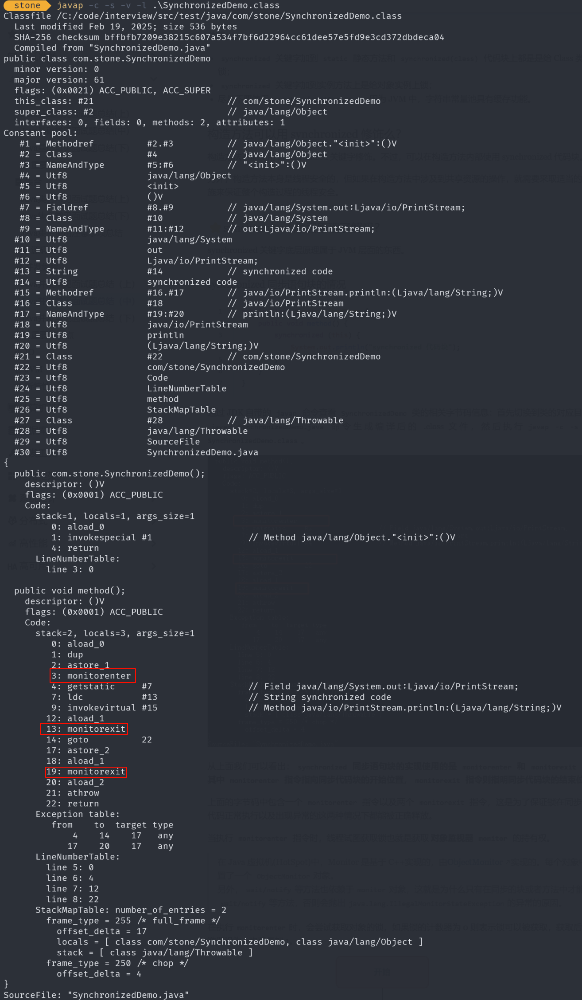

## 线程
### 虚拟机栈和本地方法栈为什么是私有的？

- **虚拟机栈：** 每个 Java 方法在执行之前会创建一个栈帧用于存储局部变量表、操作数栈、常量池引用等信息。从方法调用直至执行完成的过程，就对应着一个栈帧在 Java 虚拟机栈中入栈和出栈的过程。
- **本地方法栈：** 和虚拟机栈所发挥的作用非常相似，区别是：**虚拟机栈为虚拟机执行 Java 方法 （也就是字节码）服务，而本地方法栈则为虚拟机使用到的 Native 方法服务。** 在`HotSpot`虚拟机中和 Java 虚拟机栈合二为一。

所以，为了**保证线程中的局部变量不被别的线程访问到**，虚拟机栈和本地方法栈是线程私有的。

### 一句话简单了解堆和方法区

堆和方法区是所有线程共享的资源，其中堆是进程中最大的一块内存，主要用于存放新创建的对象 (几乎所有对象都在这里分配内存)，方法区主要用于存放已被加载的类信息、常量、静态变量、即时编译器编译后的代码等数据。

### 线程的生命周期和状态

Java 线程在运行的生命周期中的指定时刻只可能处于下面 6 种不同状态的其中一个状态：

- NEW: 初始状态，线程被创建出来但没有被调用 `start()` 。
- RUNNABLE: 运行状态，线程被调用了 `start()`等待运行的状态。
- BLOCKED：阻塞状态，需要等待锁释放。
- WAITING：等待状态，表示该线程需要等待其他线程做出一些特定动作（通知或中断）。
- TIME_WAITING：超时等待状态，可以在指定的时间后自行返回而不是像 WAITING 那样一直等待。
- TERMINATED：终止状态，表示该线程已经运行完毕。

线程在生命周期中并不是固定处于某一个状态而是随着代码的执行在不同状态之间切换。


由上图可以看出：线程创建之后它将处于 **NEW（新建）** 状态，调用 `start()` 方法后开始运行，线程这时候处于 **READY（可运行）** 状态。可运行状态的线程获得了 CPU 时间片（timeslice）后就处于 **RUNNING（运行）** 状态。

> 在操作系统层面，线程有 READY 和 RUNNING 状态；而在 JVM 层面，只能看到 RUNNABLE 状态（图源：[HowToDoInJava](https://howtodoinJava.com/ "HowToDoInJava")：[Java Thread Life Cycle and Thread States](https://howtodoinJava.com/Java/multi-threading/Java-thread-life-cycle-and-thread-states/ "Java Thread Life Cycle and Thread States")），所以 Java 系统一般将这两个状态统称为 **RUNNABLE（运行中）** 状态 。
**为什么 JVM 没有区分这两种状态呢？** （摘自：[Java 线程运行怎么有第六种状态？ - Dawell 的回答](https://www.zhihu.com/question/56494969/answer/154053599) ） 现在的时分（time-sharing）多任务（multi-task）操作系统架构通常都是用所谓的“时间分片（time quantum or time slice）”方式进行抢占式（preemptive）轮转调度（round-robin 式）。这个时间分片通常是很小的，一个线程一次最多只能在 CPU 上运行比如 10-20ms 的时间（此时处于 running 状态），也即大概只有 0.01 秒这一量级，时间片用后就要被切换下来放入调度队列的末尾等待再次调度。（也即回到 ready 状态）。线程切换的如此之快，区分这两种状态就没什么意义了。

- 当线程执行 `wait()`方法之后，线程进入 **WAITING（等待）** 状态。进入等待状态的线程需要依靠其他线程的通知才能够返回到运行状态。
- **TIMED_WAITING(超时等待)** 状态相当于在等待状态的基础上增加了超时限制，比如通过 `sleep（long millis）`方法或 `wait（long millis）`方法可以将线程置于 TIMED_WAITING 状态。当超时时间结束后，线程将会返回到 RUNNABLE 状态。
- 当线程进入 `synchronized` 方法/块或者调用 `wait` 后（被 `notify`）重新进入 `synchronized` 方法/块，但是锁被其它线程占有，这个时候线程就会进入 **BLOCKED（阻塞）** 状态。
- 线程在执行完了 `run()`方法之后将会进入到 **TERMINATED（终止）** 状态。

### `Thread#sleep()`方法和`Object#wait()`方法对比

**共同点**： 两者都可以暂停线程的执行

**区别**：
- **`sleep()` 方法没有释放锁，而 `wait()` 方法释放了锁** 。
- `wait()` 通常被用于线程间交互/通信，`sleep()`通常被用于暂停执行。
- `wait()` 方法被调用后，线程不会自动苏醒，需要别的线程调用同一个对象上的 `notify()`或者 `notifyAll()` 方法。`sleep()`方法执行完成后，线程会自动苏醒，或者也可以使用 `wait(long timeout)` 超时后线程会自动苏醒。
- `sleep()` 是 `Thread` 类的静态本地方法，`wait()` 则是 `Object` 类的本地方法。为什么这样设计呢？下一个问题就会聊到。

### 为什么`wati()`方法不定义在`Thread`中？

`wait()` 是让获得对象锁的线程实现等待，会自动释放当前线程占有的对象锁。每个对象（`Object`）都拥有对象锁，既然要释放当前线程占有的对象锁并让其进入 WAITING 状态，自然是要操作对应的对象（`Object`）而非当前的线程（`Thread`）。

类似的问题：**为什么 `sleep()` 方法定义在 `Thread` 中？**

因为 `sleep()` 是让当前线程暂停执行，不涉及到对象类，也不需要获得对象锁。

### 可以直接调用`Thread`中的`run`方法么？

new 一个 `Thread`，线程进入了新建状态。调用 `start()`方法，会启动一个线程并使线程进入了就绪状态，当分配到时间片后就可以开始运行了。 `start()` 会执行线程的相应准备工作，然后自动执行 `run()` 方法的内容，这是真正的多线程工作。 但是，直接执行 `run()` 方法，会把 `run()` 方法当成一个 main 线程下的普通方法去执行，并不会在某个线程中执行它，所以这并不是多线程工作。

**总结：调用 `start()` 方法方可启动线程并使线程进入就绪状态，直接执行 `run()` 方法的话不会以多线程的方式执行。**

## 多线程

### 并发语并行的区别

- **并发**：两个及两个以上的作业在同一 **时间段** 内执行。
- **并行**：两个及两个以上的作业在同一 **时刻** 执行。
最关键的点是：是否是 **同时** 执行。

### 同步和异步的区别

- **同步**：发出一个调用之后，在没有得到结果之前， 该调用就不可以返回，一直等待。
- **异步**：调用在发出之后，不用等待返回结果，该调用直接返回。

### 🌟为什么要使用多线程？

先从总体上来说：

- **从计算机底层来说：** 线程可以比作是轻量级的进程，是程序执行的最小单位,线程间的切换和调度的成本远远小于进程。另外，多核 CPU 时代意味着多个线程可以同时运行，这减少了线程上下文切换的开销。
- **从当代互联网发展趋势来说：** 现在的系统动不动就要求百万级甚至千万级的并发量，而多线程并发编程正是开发高并发系统的基础，利用好多线程机制可以大大提高系统整体的并发能力以及性能。

再深入到计算机底层来探讨：

- **单核时代**：在单核时代多线程主要是为了提高单进程利用 CPU 和 IO 系统的效率。 假设只运行了一个 Java 进程的情况，当我们请求 IO 的时候，如果 Java 进程中只有一个线程，此线程被 IO 阻塞则整个进程被阻塞。CPU 和 IO 设备只有一个在运行，那么可以简单地说系统整体效率只有 50%。当使用多线程的时候，一个线程被 IO 阻塞，其他线程还可以继续使用 CPU。从而提高了 Java 进程利用系统资源的整体效率。
- **多核时代**: 多核时代多线程主要是为了提高进程利用多核 CPU 的能力。举个例子：假如我们要计算一个复杂的任务，我们只用一个线程的话，不论系统有几个 CPU 核心，都只会有一个 CPU 核心被利用到。而创建多个线程，这些线程可以被映射到底层多个 CPU 核心上执行，在任务中的多个线程没有资源竞争的情况下，任务执行的效率会有显著性的提高，约等于（单核时执行时间/CPU 核心数）。

### 单核`CPU`支持`Java`多线程么？

单核 CPU 是支持 Java 多线程的。操作系统通过时间片轮转的方式，将 CPU 的时间分配给不同的线程。尽管单核 CPU 一次只能执行一个任务，但通过快速在多个线程之间切换，可以让用户感觉多个任务是同时进行的。

这里顺带提一下 Java 使用的线程调度方式。

操作系统主要通过两种线程调度方式来管理多线程的执行：

- **抢占式调度（Preemptive Scheduling）**：操作系统决定何时暂停当前正在运行的线程，并切换到另一个线程执行。这种切换通常是由系统时钟中断（时间片轮转）或其他高优先级事件（如 I/O 操作完成）触发的。这种方式存在上下文切换开销，但公平性和 CPU 资源利用率较好，不易阻塞。
- **协同式调度（Cooperative Scheduling）**：线程执行完毕后，主动通知系统切换到另一个线程。这种方式可以减少上下文切换带来的性能开销，但公平性较差，容易阻塞。

Java 使用的线程调度是抢占式的。也就是说，JVM 本身不负责线程的调度，而是将线程的调度委托给操作系统。操作系统通常会基于线程优先级和时间片来调度线程的执行，高优先级的线程通常获得 CPU 时间片的机会更多。

### 🌟单核`CPU`上运行多个线程效率一定会高么？

单核 CPU 同时运行多个线程的效率是否会高，取决于线程的类型和任务的性质。一般来说，有两种类型的线程：

1. **CPU 密集型**：CPU 密集型的线程主要进行计算和逻辑处理，需要占用大量的 CPU 资源。
2. **IO 密集型**：IO 密集型的线程主要进行输入输出操作，如读写文件、网络通信等，需要等待 IO 设备的响应，而不占用太多的 CPU 资源。

在单核 CPU 上，同一时刻只能有一个线程在运行，其他线程需要等待 CPU 的时间片分配。如果线程是 CPU 密集型的，那么多个线程同时运行会导致频繁的线程切换，增加了系统的开销，降低了效率。如果线程是 IO 密集型的，那么多个线程同时运行可以利用 CPU 在等待 IO 时的空闲时间，提高了效率。

因此，对于单核 CPU 来说，如果任务是 CPU 密集型的，那么开很多线程会影响效率；如果任务是 IO 密集型的，那么开很多线程会提高效率。当然，这里的“很多”也要适度，不能超过系统能够承受的上限。

## 🌟死锁

### 什么是死锁？

线程死锁描述的是这样一种情况：多个线程同时被阻塞，它们中的一个或者全部都在等待某个资源被释放。由于线程被无限期地阻塞，因此程序不可能正常终止。

如下图所示，线程 A 持有资源 2，线程 B 持有资源 1，他们同时都想申请对方的资源，所以这两个线程就会互相等待而进入死锁状态。


下面通过一个例子来说明线程死锁,代码模拟了上图的死锁的情况 (代码来源于《并发编程之美》)：

```java
public class DeadLockDemo {
    private static Object resource1 = new Object();//资源 1
    private static Object resource2 = new Object();//资源 2

    public static void main(String[] args) {
        new Thread(() -> {
            synchronized (resource1) {
                System.out.println(Thread.currentThread() + "get resource1");
                try {
                    Thread.sleep(1000);
                } catch (InterruptedException e) {
                    e.printStackTrace();
                }
                System.out.println(Thread.currentThread() + "waiting get resource2");
                synchronized (resource2) {
                    System.out.println(Thread.currentThread() + "get resource2");
                }
            }
        }, "线程 1").start();

        new Thread(() -> {
            synchronized (resource2) {
                System.out.println(Thread.currentThread() + "get resource2");
                try {
                    Thread.sleep(1000);
                } catch (InterruptedException e) {
                    e.printStackTrace();
                }
                System.out.println(Thread.currentThread() + "waiting get resource1");
                synchronized (resource1) {
                    System.out.println(Thread.currentThread() + "get resource1");
                }
            }
        }, "线程 2").start();
    }
}
```

Output

```
Thread[线程 1,5,main]get resource1
Thread[线程 2,5,main]get resource2
Thread[线程 1,5,main]waiting get resource2
Thread[线程 2,5,main]waiting get resource1
```

线程 A 通过 `synchronized (resource1)` 获得 `resource1` 的监视器锁，然后通过`Thread.sleep(1000);`让线程 A 休眠 1s 为的是让线程 B 得到执行然后获取到 resource2 的监视器锁。线程 A 和线程 B 休眠结束了都开始企图请求获取对方的资源，然后这两个线程就会陷入互相等待的状态，这也就产生了死锁。

上面的例子符合**产生死锁的四个必要条件**：

1. **互斥条件**：该资源任意一个时刻只由一个线程占用。
2. **请求与保持条件**：一个线程因请求资源而阻塞时，对已获得的资源保持不放。
3. **不剥夺条件**：线程已获得的资源在未使用完之前不能被其他线程强行剥夺，只有自己使用完毕后才释放资源。
4. **循环等待条件**：若干线程之间形成一种头尾相接的循环等待资源关系。

### `volatile`可以保证原子性么？

**`volatile` 关键字能保证变量的可见性，但不能保证对变量的操作是原子性的。**

```java
public class VolatileAtomicityDemo {
    public volatile static int inc = 0;

    public void increase() {
        inc++;
    }

    public static void main(String[] args) throws InterruptedException {
        ExecutorService threadPool = Executors.newFixedThreadPool(5);
        VolatileAtomicityDemo volatileAtomicityDemo = new VolatileAtomicityDemo();
        for (int i = 0; i < 5; i++) {
            threadPool.execute(() -> {
                for (int j = 0; j < 500; j++) {
                    volatileAtomicityDemo.increase();
                }
            });
        }
        // 等待1.5秒，保证上面程序执行完成
        Thread.sleep(1500);
        System.out.println(inc);
        threadPool.shutdown();
    }
}
```

正常情况下，运行上面的代码理应输出 `2500`。但你真正运行了上面的代码之后，你会发现每次输出结果都小于 `2500`。

为什么会出现这种情况呢？不是说好了，`volatile` 可以保证变量的可见性嘛！

也就是说，如果 `volatile` 能保证 `inc++` 操作的原子性的话。每个线程中对 `inc` 变量自增完之后，其他线程可以立即看到修改后的值。5 个线程分别进行了 500 次操作，那么最终 inc 的值应该是 5*500=2500。

很多人会误认为自增操作 `inc++` 是原子性的，实际上，`inc++` 其实是一个复合操作，包括三步：

1. 读取 inc 的值。
2. 对 inc 加 1。
3. 将 inc 的值写回内存。

`volatile` 是无法保证这三个操作是具有原子性的，有可能导致下面这种情况出现：

4. 线程 1 对 `inc` 进行读取操作之后，还未对其进行修改。线程 2 又读取了 `inc`的值并对其进行修改（+1），再将`inc` 的值写回内存。
5. 线程 2 操作完毕后，线程 1 对 `inc`的值进行修改（+1），再将`inc` 的值写回内存。

这也就导致两个线程分别对 `inc` 进行了一次自增操作后，`inc` 实际上只增加了 1。

其实，如果想要保证上面的代码运行正确也非常简单，利用 `synchronized`、`Lock`或者`AtomicInteger`都可以。

使用 `synchronized` 改进：

```java
public synchronized void increase() {
    inc++;
}
```

使用 `AtomicInteger` 改进：

```java
public AtomicInteger inc = new AtomicInteger();

public void increase() {
    inc.getAndIncrement();
}
```

使用 `ReentrantLock` 改进：

```java
Lock lock = new ReentrantLock();
public void increase() {
    lock.lock();
    try {
        inc++;
    } finally {
        lock.unlock();
    }
}
```

## 🌟乐观锁和悲观锁

### 什么是悲观锁？

悲观锁总是假设最坏的情况，认为共享资源每次被访问的时候就会出现问题(比如共享数据被修改)，所以每次在获取资源操作的时候都会上锁，这样其他线程想拿到这个资源就会阻塞直到锁被上一个持有者释放。也就是说，**共享资源每次只给一个线程使用，其它线程阻塞，用完后再把资源转让给其它线程**。

像 Java 中`synchronized`和`ReentrantLock`等独占锁就是悲观锁思想的实现。

```java
public void performSynchronisedTask() {
    synchronized (this) {
        // 需要同步的操作
    }
}

private Lock lock = new ReentrantLock();
lock.lock();
try {
   // 需要同步的操作
} finally {
    lock.unlock();
}
```

高并发的场景下，激烈的锁竞争会造成线程阻塞，大量阻塞线程会导致系统的上下文切换，增加系统的性能开销。并且，悲观锁还可能会存在死锁问题，影响代码的正常运行。

### 什么是乐观锁？

乐观锁总是假设最好的情况，认为共享资源每次被访问的时候不会出现问题，线程可以不停地执行，无需加锁也无需等待，只是在提交修改的时候去验证对应的资源（也就是数据）是否被其它线程修改了（具体方法可以使用版本号机制或 CAS 算法）。

在 Java 中`java.util.concurrent.atomic`包下面的原子变量类（比如`AtomicInteger`、`LongAdder`）就是使用了乐观锁的一种实现方式 **CAS** 实现的。


```java
// LongAdder 在高并发场景下会比 AtomicInteger 和 AtomicLong 的性能更好
// 代价就是会消耗更多的内存空间（空间换时间）
LongAdder sum = new LongAdder();
sum.increment();
```

高并发的场景下，乐观锁相比悲观锁来说，不存在锁竞争造成线程阻塞，也不会有死锁的问题，在性能上往往会更胜一筹。但是，如果冲突频繁发生（写占比非常多的情况），会频繁失败和重试，这样同样会非常影响性能，导致 CPU 飙升。

不过，大量失败重试的问题也是可以解决的，像我们前面提到的 `LongAdder`以空间换时间的方式就解决了这个问题。

理论上来说：

- 悲观锁通常多用于写比较多的情况（多写场景，竞争激烈），这样可以避免频繁失败和重试影响性能，悲观锁的开销是固定的。不过，如果乐观锁解决了频繁失败和重试这个问题的话（比如`LongAdder`），也是可以考虑使用乐观锁的，要视实际情况而定。
- 乐观锁通常多用于写比较少的情况（多读场景，竞争较少），这样可以避免频繁加锁影响性能。不过，乐观锁主要针对的对象是单个共享变量（参考`java.util.concurrent.atomic`包下面的原子变量类）。

### 如何实现乐观锁？

乐观锁一般会使用版本号机制或 CAS 算法实现，CAS 算法相对来说更多一些，这里需要格外注意。


#### 版本号机制

一般是在数据表中加上一个数据版本号 `version` 字段，表示数据被修改的次数。当数据被修改时，`version` 值会加一。当线程 A 要更新数据值时，在读取数据的同时也会读取 `version` 值，在提交更新时，若刚才读取到的 version 值为当前数据库中的 `version` 值相等时才更新，否则重试更新操作，直到更新成功。

**举一个简单的例子**：假设数据库中帐户信息表中有一个 version 字段，当前值为 1 ；而当前帐户余额字段（ `balance` ）为 $100 。

1. 操作员 A 此时将其读出（ `version`=1 ），并从其帐户余额中扣除 $50（ $100-$50 ）。
2. 在操作员 A 操作的过程中，操作员 B 也读入此用户信息（ `version`=1 ），并从其帐户余额中扣除 $20 （ $100-$20 ）。
3. 操作员 A 完成了修改工作，将数据版本号（ `version`=1 ），连同帐户扣除后余额（ `balance`=$50 ），提交至数据库更新，此时由于提交数据版本等于数据库记录当前版本，数据被更新，数据库记录 `version` 更新为 2 。
4. 操作员 B 完成了操作，也将版本号（ `version`=1 ）试图向数据库提交数据（ `balance`=$80 ），但此时比对数据库记录版本时发现，操作员 B 提交的数据版本号为 1 ，数据库记录当前版本也为 2 ，不满足 “ 提交版本必须等于当前版本才能执行更新 “ 的乐观锁策略，因此，操作员 B 的提交被驳回。

这样就避免了操作员 B 用基于 `version`=1 的旧数据修改的结果覆盖操作员 A 的操作结果的可能。

#### `CAS`算法

CAS 的全称是 **Compare And Swap（比较与交换）** ，用于实现乐观锁，被广泛应用于各大框架中。CAS 的思想很简单，就是用一个预期值和要更新的变量值进行比较，两值相等才会进行更新。

CAS 是一个原子操作，底层依赖于一条 CPU 的原子指令。

> **原子操作** 即最小不可拆分的操作，也就是说操作一旦开始，就不能被打断，直到操作完成。

CAS 涉及到三个操作数：

- **V**：要更新的变量值(Var)
- **E**：预期值(Expected)
- **N**：拟写入的新值(New)

当且仅当 V 的值等于 E 时，CAS 通过原子方式用新值 N 来更新 V 的值。如果不等，说明已经有其它线程更新了 V，则当前线程放弃更新。

**举一个简单的例子**：线程 A 要修改变量 i 的值为 6，i 原值为 1（V = 1，E=1，N=6，假设不存在 ABA 问题）。

1. i 与 1 进行比较，如果相等， 则说明没被其他线程修改，可以被设置为 6 。
2. i 与 1 进行比较，如果不相等，则说明被其他线程修改，当前线程放弃更新，CAS 操作失败。

当多个线程同时使用 CAS 操作一个变量时，只有一个会胜出，并成功更新，其余均会失败，但失败的线程并不会被挂起，仅是被告知失败，并且允许再次尝试，当然也允许失败的线程放弃操作。

Java 语言并没有直接实现 CAS，CAS 相关的实现是通过 C++ 内联汇编的形式实现的（JNI 调用）。因此， CAS 的具体实现和操作系统以及 CPU 都有关系。

`sun.misc`包下的`Unsafe`类提供了`compareAndSwapObject`、`compareAndSwapInt`、`compareAndSwapLong`方法来实现的对`Object`、`int`、`long`类型的 CAS 操作

```java
/**
  *  CAS
  * @param o         包含要修改field的对象
  * @param offset    对象中某field的偏移量
  * @param expected  期望值
  * @param update    更新值
  * @return          true | false
  */
public final native boolean compareAndSwapObject(Object o, long offset,  Object expected, Object update);

public final native boolean compareAndSwapInt(Object o, long offset, int expected,int update);

public final native boolean compareAndSwapLong(Object o, long offset, long expected, long update);
```

## `synchronized`关键字

### `synchronized`是什么？有什么用？

`synchronized` 是 Java 中的一个关键字，翻译成中文是同步的意思，主要解决的是多个线程之间访问资源的同步性，可以保证被它修饰的方法或者代码块在任意时刻只能有一个线程执行。

在 Java 早期版本中，`synchronized` 属于 **重量级锁**，效率低下。这是因为监视器锁（monitor）是依赖于底层的操作系统的 `Mutex Lock` 来实现的，Java 的线程是映射到操作系统的原生线程之上的。如果要挂起或者唤醒一个线程，都需要操作系统帮忙完成，而操作系统实现线程之间的切换时需要从用户态转换到内核态，这个状态之间的转换需要相对比较长的时间，时间成本相对较高。

不过，在 Java 6 之后， `synchronized` 引入了大量的优化如自旋锁、适应性自旋锁、锁消除、锁粗化、偏向锁、轻量级锁等技术来减少锁操作的开销，这些优化让 `synchronized` 锁的效率提升了很多。因此， `synchronized` 还是可以在实际项目中使用的，像 JDK 源码、很多开源框架都大量使用了 `synchronized` 。

关于偏向锁多补充一点：由于偏向锁增加了 JVM 的复杂性，同时也并没有为所有应用都带来性能提升。因此，在 JDK15 中，偏向锁被默认关闭（仍然可以使用 `-XX:+UseBiasedLocking` 启用偏向锁），在 JDK18 中，偏向锁已经被彻底废弃（无法通过命令行打开）。

### 如何使用`synchronized`？

`synchronized` 关键字的使用方式主要有下面 3 种：

1. 修饰实例方法
2. 修饰静态方法
3. 修饰代码块

**1、修饰实例方法** （锁当前对象实例）

给当前对象实例加锁，进入同步代码前要获得 **当前对象实例的锁** 。

```java
synchronized void method() {
    //业务代码
}
```

**2、修饰静态方法** （锁当前类）

给当前类加锁，会作用于类的所有对象实例 ，进入同步代码前要获得 **当前 class 的锁**。

这是因为静态成员不属于任何一个实例对象，归整个类所有，不依赖于类的特定实例，被类的所有实例共享。

```java
synchronized static void method() {
    //业务代码
}
```

静态 `synchronized` 方法和非静态 `synchronized` 方法之间的调用互斥么？不互斥！如果一个线程 A 调用一个实例对象的非静态 `synchronized` 方法，而线程 B 需要调用这个实例对象所属类的静态 `synchronized` 方法，是允许的，不会发生互斥现象，因为访问静态 `synchronized` 方法占用的锁是当前类的锁，而访问非静态 `synchronized` 方法占用的锁是当前实例对象锁。

**3、修饰代码块** （锁指定对象/类）

对括号里指定的对象/类加锁：

- `synchronized(object)` 表示进入同步代码库前要获得 **给定对象的锁**。
- `synchronized(类.class)` 表示进入同步代码前要获得 **给定 Class 的锁**

```java
synchronized(this) {
    //业务代码
}
```

**总结：**

- `synchronized` 关键字加到 `static` 静态方法和 `synchronized(class)` 代码块上都是是给 Class 类上锁；
- `synchronized` 关键字加到实例方法上是给对象实例上锁；
- 尽量不要使用 `synchronized(String a)` 因为 JVM 中，字符串常量池具有缓存功能。

### 构造方法可以用`synchronized`修饰么？

构造方法不能使用 synchronized 关键字修饰。不过，可以在构造方法内部使用 synchronized 代码块。

另外，**构造方法本身是线程安全的**，但如果在构造方法中涉及到共享资源的操作，就需要采取适当的同步措施来保证整个构造过程的线程安全。

### 🌟`synchronized`底层原理

synchronized 关键字底层原理属于 JVM 层面的东西。

#### `synchronized`同步语句块的情况

```java
package com.stone;  
  
public class SynchronizedDemo {  
    public void method() {  
        synchronized (this) {  
            System.out.println("synchronized code");  
        }  
    }  
}
```

通过 JDK 自带的 `javap` 命令查看 `SynchronizedDemo` 类的相关字节码信息：首先切换到类的对应目录执行 `javac SynchronizedDemo.java` 命令生成编译后的 .class 文件，然后执行`javap -c -s -v -l SynchronizedDemo.class`。



从上面我们可以看出：**`synchronized` 同步语句块的实现使用的是 `monitorenter` 和 `monitorexit` 指令，其中 `monitorenter` 指令指向同步代码块的开始位置，`monitorexit` 指令则指明同步代码块的结束位置。**

上面的字节码中包含一个 `monitorenter` 指令以及两个 `monitorexit` 指令，这是为了保证锁在同步代码块代码正常执行以及出现异常的这两种情况下都能被正确释放。

当执行 `monitorenter` 指令时，线程试图获取锁也就是获取 **对象监视器 `monitor`** 的持有权。

> 在 Java 虚拟机(HotSpot)中，Monitor 是基于 C++实现的，由[ObjectMonitor](https://github.com/openjdk-mirror/jdk7u-hotspot/blob/50bdefc3afe944ca74c3093e7448d6b889cd20d1/src/share/vm/runtime/objectMonitor.cpp)实现的。每个对象中都内置了一个 `ObjectMonitor`对象。
> 
> 另外，`wait/notify`等方法也依赖于`monitor`对象，这就是为什么只有在同步的块或者方法中才能调用`wait/notify`等方法，否则会抛出`java.lang.IllegalMonitorStateException`的异常的原因。

在执行`monitorenter`时，会尝试获取对象的锁，如果锁的计数器为 0 则表示锁可以被获取，获取后将锁计数器设为 1 也就是加 1。


对象锁的的拥有者线程才可以执行 `monitorexit` 指令来释放锁。在执行 `monitorexit` 指令后，将锁计数器设为 0，表明锁被释放，其他线程可以尝试获取锁。


如果获取对象锁失败，那当前线程就要阻塞等待，直到锁被另外一个线程释放为止。

#### `synchronized`修饰方法的情况

```java
public class SynchronizedDemo2 {
    public synchronized void method() {
        System.out.println("synchronized 方法");
    }
}
```


`synchronized` 修饰的方法并没有 `monitorenter` 指令和 `monitorexit` 指令，取而代之的是 `ACC_SYNCHRONIZED` 标识，该标识指明了该方法是一个同步方法。JVM 通过该 `ACC_SYNCHRONIZED` 访问标志来辨别一个方法是否声明为同步方法，从而执行相应的同步调用。

如果是实例方法，JVM 会尝试获取实例对象的锁。如果是静态方法，JVM 会尝试获取当前 class 的锁。

#### 总结

`synchronized` 同步语句块的实现使用的是 `monitorenter` 和 `monitorexit` 指令，其中 `monitorenter` 指令指向同步代码块的开始位置，`monitorexit` 指令则指明同步代码块的结束位置。

`synchronized` 修饰的方法并没有 `monitorenter` 指令和 `monitorexit` 指令，取而代之的是 `ACC_SYNCHRONIZED` 标识，该标识指明了该方法是一个同步方法。

**不过，两者的本质都是对对象监视器 monitor 的获取。**

### `synchronized`和`volatile`有什么区别？

`synchronized` 关键字和 `volatile` 关键字是两个互补的存在，而不是对立的存在！

- `volatile` 关键字是线程同步的轻量级实现，所以 `volatile`性能肯定比`synchronized`关键字要好 。但是 `volatile` 关键字只能用于变量而 `synchronized` 关键字可以修饰方法以及代码块 。
- `volatile` 关键字能保证数据的可见性，但不能保证数据的原子性。`synchronized` 关键字两者都能保证。
- `volatile`关键字主要用于解决变量在多个线程之间的可见性，而 `synchronized` 关键字解决的是多个线程之间访问资源的同步性。

|    特性    | `synchronized` |  `volatile`  |
| :------: | :------------: | :----------: |
| **作用范围** |     方法或代码块     |      变量      |
| **锁机制**  |    基于对象锁或类锁    |     无锁机制     |
| **可见性**  |     保证可见性      |    保证可见性     |
| **原子性**  |     保证原子性      |    不保证原子性    |
| **有序性**  |     保证有序性      |    保证有序性     |
|  **性能**  |   较低（因为锁的开销）   |      较高      |
| **适用场景** |  需要互斥访问的复杂操作   | 单一变量的可见性和有序性 |

## `ReentrantLock`

### `ReentrantLock`是什么？

`ReentrantLock` 实现了 `Lock` 接口，是一个可重入且独占式的锁，和 `synchronized` 关键字类似。不过，`ReentrantLock` 更灵活、更强大，增加了轮询、超时、中断、公平锁和非公平锁等高级功能。

```java
public class ReentrantLock implements Lock, java.io.Serializable {}
```

`ReentrantLock` 里面有一个内部类 `Sync`，`Sync` 继承 AQS（`AbstractQueuedSynchronizer`），添加锁和释放锁的大部分操作实际上都是在 `Sync` 中实现的。`Sync` 有公平锁 `FairSync` 和非公平锁 `NonfairSync` 两个子类。


`ReentrantLock` 默认使用非公平锁，也可以通过构造器来显式的指定使用公平锁。

```java
// 传入一个 boolean 值，true 时为公平锁，false 时为非公平锁
public ReentrantLock(boolean fair) {
    sync = fair ? new FairSync() : new NonfairSync();
}
```

### 公平锁和非公平锁有什么区别？

- **公平锁** : 锁被释放之后，先申请的线程先得到锁。性能较差一些，因为公平锁为了保证时间上的绝对顺序，上下文切换更频繁。
- **非公平锁**：锁被释放之后，后申请的线程可能会先获取到锁，是随机或者按照其他优先级排序的。性能更好，但可能会导致某些线程永远无法获取到锁。

### 🌟`synchronized`和`ReentrantLock`有什么区别？

#### 两者都是可重入锁

**可重入锁** 也叫递归锁，指的是线程可以再次获取自己的内部锁。比如一个线程获得了某个对象的锁，此时这个对象锁还没有释放，当其再次想要获取这个对象的锁的时候还是可以获取的，如果是不可重入锁的话，就会造成死锁。

JDK 提供的所有现成的 `Lock` 实现类，包括 `synchronized` 关键字锁都是可重入的。

在下面的代码中，`method1()` 和 `method2()`都被 `synchronized` 关键字修饰，`method1()`调用了`method2()`。

```java
public class SynchronizedDemo {
    public synchronized void method1() {
        System.out.println("方法1");
        method2();
    }

    public synchronized void method2() {
        System.out.println("方法2");
    }
}
```

由于 `synchronized`锁是可重入的，同一个线程在调用`method1()` 时可以直接获得当前对象的锁，执行 `method2()` 的时候可以再次获取这个对象的锁，不会产生死锁问题。假如`synchronized`是不可重入锁的话，由于该对象的锁已被当前线程所持有且无法释放，这就导致线程在执行 `method2()`时获取锁失败，会出现死锁问题。

#### `ReentrantLock`比`synchronized`增加了一些高级功能

相比`synchronized`，`ReentrantLock`增加了一些高级功能。主要来说主要有三点：

- **等待可中断** : `ReentrantLock`提供了一种能够中断等待锁的线程的机制，通过 `lock.lockInterruptibly()` 来实现这个机制。也就是说当前线程在等待获取锁的过程中，如果其他线程中断当前线程「 `interrupt()` 」，当前线程就会抛出 `InterruptedException` 异常，可以捕捉该异常进行相应处理。
- **可实现公平锁** : `ReentrantLock`可以指定是公平锁还是非公平锁。而`synchronized`只能是非公平锁。所谓的公平锁就是先等待的线程先获得锁。`ReentrantLock`默认情况是非公平的，可以通过 `ReentrantLock`类的`ReentrantLock(boolean fair)`构造方法来指定是否是公平的。
- **可实现选择性通知（锁可以绑定多个条件）**: `synchronized`关键字与`wait()`和`notify()`/`notifyAll()`方法相结合可以实现等待/通知机制。`ReentrantLock`类当然也可以实现，但是需要借助于`Condition`接口与`newCondition()`方法。
- **支持超时** ：`ReentrantLock` 提供了 `tryLock(timeout)` 的方法，可以指定等待获取锁的最长等待时间，如果超过了等待时间，就会获取锁失败，不会一直等待。

如果你想使用上述功能，那么选择 `ReentrantLock` 是一个不错的选择。

关于 `Condition`接口的补充：

> `Condition`是 JDK1.5 之后才有的，它具有很好的灵活性，比如可以实现多路通知功能也就是在一个`Lock`对象中可以创建多个`Condition`实例（即对象监视器），**线程对象可以注册在指定的`Condition`中，从而可以有选择性的进行线程通知，在调度线程上更加灵活。 在使用`notify()/notifyAll()`方法进行通知时，被通知的线程是由 JVM 选择的，用`ReentrantLock`类结合`Condition`实例可以实现“选择性通知”** ，这个功能非常重要，而且是 `Condition` 接口默认提供的。而`synchronized`关键字就相当于整个 `Lock` 对象中只有一个`Condition`实例，所有的线程都注册在它一个身上。如果执行`notifyAll()`方法的话就会通知所有处于等待状态的线程，这样会造成很大的效率问题。而`Condition`实例的`signalAll()`方法，只会唤醒注册在该`Condition`实例中的所有等待线程。

关于 **等待可中断** 的补充：

> `lockInterruptibly()` 会让获取锁的线程在阻塞等待的过程中可以响应中断，即当前线程在获取锁的时候，发现锁被其他线程持有，就会阻塞等待。
>在阻塞等待的过程中，如果其他线程中断当前线程 `interrupt()` ，就会抛出 `InterruptedException` 异常，可以捕获该异常，做一些处理操作。
为了更好理解这个方法，借用 Stack Overflow 上的一个案例，可以更好地理解 `lockInterruptibly()` 可以响应中断：
```java
public class MyRentrantlock {
    Thread t = new Thread() {
        @Override
        public void run() {
            ReentrantLock r = new ReentrantLock();
            // 1.1、第一次尝试获取锁，可以获取成功
            r.lock();

            // 1.2、此时锁的重入次数为 1
            System.out.println("lock() : lock count :" + r.getHoldCount());

            // 2、中断当前线程，通过 Thread.currentThread().isInterrupted() 可以看到当前线程的中断状态为 true
            interrupt();
            System.out.println("Current thread is intrupted");

            // 3.1、尝试获取锁，可以成功获取
            r.tryLock();
            // 3.2、此时锁的重入次数为 2
            System.out.println("tryLock() on intrupted thread lock count :" + r.getHoldCount());
            try {
                // 4、打印线程的中断状态为 true，那么调用 lockInterruptibly() 方法就会抛出 InterruptedException 异常
                System.out.println("Current Thread isInterrupted:" + Thread.currentThread().isInterrupted());
                r.lockInterruptibly();
                System.out.println("lockInterruptibly() --NOt executable statement" + r.getHoldCount());
            } catch (InterruptedException e) {
                r.lock();
                System.out.println("Error");
            } finally {
                r.unlock();
            }

            // 5、打印锁的重入次数，可以发现 lockInterruptibly() 方法并没有成功获取到锁
            System.out.println("lockInterruptibly() not able to Acqurie lock: lock count :" + r.getHoldCount());

            r.unlock();
            System.out.println("lock count :" + r.getHoldCount());
            r.unlock();
            System.out.println("lock count :" + r.getHoldCount());
        }
    };
    public static void main(String str[]) {
        MyRentrantlock m = new MyRentrantlock();
        m.t.start();
    }
}
```
输出：
```bash
lock() : lock count :1
Current thread is intrupted
tryLock() on intrupted thread lock count :2
Current Thread isInterrupted:true
Error
lockInterruptibly() not able to Acqurie lock: lock count :2
lock count :1
lock count :0
```

关于 **支持超时** 的补充：
>**为什么需要 `tryLock(timeout)` 这个功能呢？**
`tryLock(timeout)` 方法尝试在指定的超时时间内获取锁。如果成功获取锁，则返回 `true`；如果在锁可用之前超时，则返回 `false`。此功能在以下几种场景中非常有用：
- **防止死锁：** 在复杂的锁场景中，`tryLock(timeout)` 可以通过允许线程在合理的时间内放弃并重试来帮助防止死锁。
- **提高响应速度：** 防止线程无限期阻塞。
- **处理时间敏感的操作：** 对于具有严格时间限制的操作，`tryLock(timeout)` 允许线程在无法及时获取锁时继续执行替代操作。

#### 可中断锁和不可中断锁有什么区别？

- **可中断锁**：获取锁的过程中可以被中断，不需要一直等到获取锁之后 才能进行其他逻辑处理。`ReentrantLock` 就属于是可中断锁。
- **不可中断锁**：一旦线程申请了锁，就只能等到拿到锁以后才能进行其他的逻辑处理。 `synchronized` 就属于是不可中断锁。