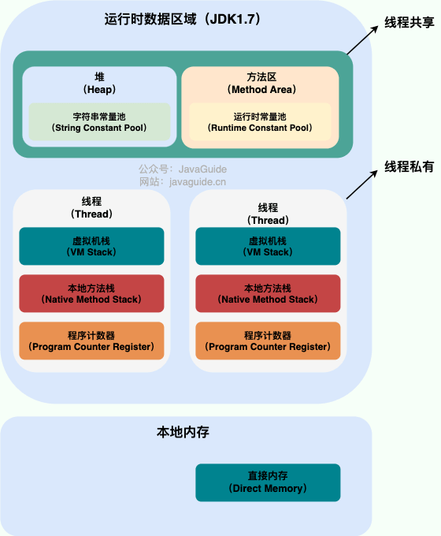

### 运行时数据区域

Java 虚拟机在执行 Java 程序的过程中会把它管理的内存划分成若干个不同的数据区域。

JDK 1.8 和之前的版本略有不同，我们这里以 JDK 1.7 和 JDK 1.8 这两个版本为例介绍。

**JDK 1.7**：

JDK1.8:

**线程私有的：**

- 程序计数器
- 虚拟机栈
- 本地方法栈

**线程共享的：**

- 堆
- 方法区
- 直接内存 (非运行时数据区的一部分)

Java 虚拟机规范对于运行时数据区域的规定是相当宽松的。以堆为例：堆可以是连续空间，也可以不连续。堆的大小可以固定，也可以在运行时按需扩展 。虚拟机实现者可以使用任何垃圾回收算法管理堆，甚至完全不进行垃圾收集也是可以的。

---

著作权归JavaGuide(javaguide.cn)所有 基于MIT协议 原文链接：https://javaguide.cn/java/jvm/memory-area.html