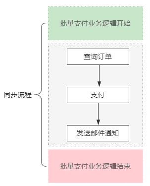
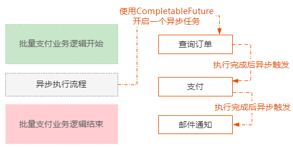
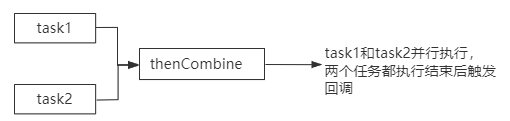
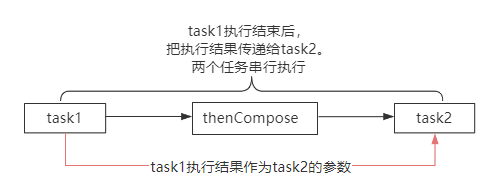
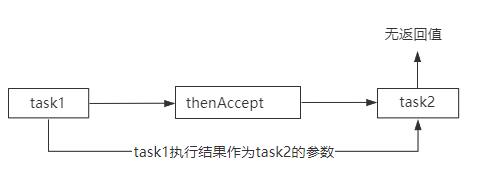
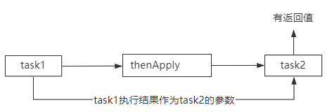
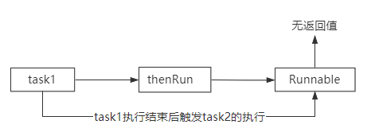

CompletableFuture是JDK1.8里面引入的一个基于事件驱动的异步回调类。

简单来说，就是当使用异步线程去执行一个任务的时候，我们希望在任务结束以后触发一个后续的动作。

而CompletableFuture就可以实现这个功能。

举个简单的例子，比如在一个批量支付的业务逻辑里面，

涉及到查询订单、支付、发送邮件通知这三个逻辑。

这三个逻辑是按照顺序同步去实现的，也就是先查询到订单以后，再针对这个订单发起支付，支付成功以后再发送邮件通知。

而这种设计方式导致这个方法的执行性能比较慢。

所以，这里可以直接使用CompletableFuture，（如图），也就是说把查询订单的逻辑放在一个异步线程池里面去处理。

然后基于CompletableFuture的事件回调机制的特性，可以配置查询订单结束后自动触发支付，支付结束后自动触发邮件通知。

从而极大的提升这个这个业务场景的处理性能！

CompletableFuture提供了5种不同的方式，把多个异步任务组成一个具有先后关系的处理链，然后基于事件驱动任务链的执行。

- 第一种，thenCombine，把两个任务组合在一起，当两个任务都执行结束以后触发事件回调。

- 第二种，thenCompose，把两个任务组合在一起，这两个任务串行执行，也就是第一个任务执行完以后自动触发执行第二个任务。

- 第三种，thenAccept，第一个任务执行结束后触发第二个任务，并且第一个任务的执行结果作为第二个任务的参数，这个方法是纯粹接受上一个任务的结果，不返回新的计算值。

- 第四种，thenApply，和thenAccept一样，但是它有返回值。

- 第五种，thenRun，就是第一个任务执行完成后触发执行一个实现了Runnable接口的任务。

CompletableFuture弥补了原本Future的不足，使得程序可以在非阻塞的状态下完成异步的回调机制。