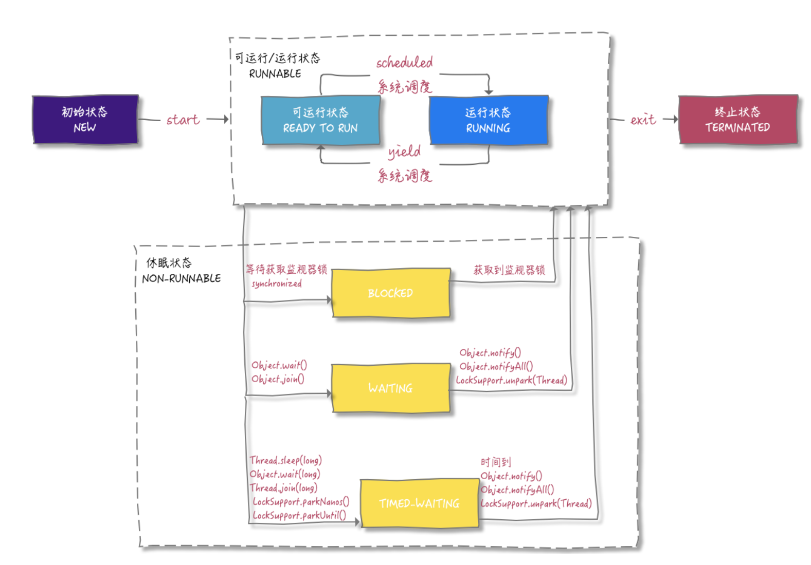

[toc]

### 线程相关

#### 线程状态

|   状态名称   |                           说    明                           |
| :----------: | :----------------------------------------------------------: |
|     NEW      |      初试状态，线程被构建，但是还没有调用`start()`方法       |
|   RUNNABLE   | 运行状态，Java线程将操作系统中的就绪和运行两种状态笼统地称作为“运行中” |
|   BLOCKED    |                  阻塞状态，表示线程阻塞于锁                  |
|   WAITING    | 等待状态，表示线程进入等待状态，进入该状态表示当前线程需要等待其他线程做出一些特定动作（通知或中断） |
| TIME_WAITING | 超时等待状态，该状态不同于WAITING，它是可以在指定时间自行返回 |
|  TERMINETED  |              终止状态，表示当前线程已经执行完毕              |

- 新建（NEW）：创建后尚未启动。
- 可运行（RUNABLE）：正在Java虚拟机中运行。但是在操作系统层面，它可能处于运行状态，也可能等待资源调度（例如处理器资源），资源调度完成就进入运行状态。所以该状态的可运行是指可以运行，具体有没有运行要看底层操作系统的资源调度。
- 阻塞（BLOCKED）：请求获取 monitor lock 从而进入 synchrozied 函数或者代码块，当时其它线程已经占用了该 monitor lock，所以处于堵塞状态。要结束该状态从而 RUNABLED 需要其它线程释放 monitor lock。
- 无期限等待（WAITING）：等待其它线程显式地唤醒。
  - 阻塞和等待的区别：阻塞是被动的，它是在等待获取 monitor lock。而等待是主动的，通过`Object.wait()`等方法进入。

|                  进入方法                  |               退出方法               |
| :----------------------------------------: | :----------------------------------: |
| 没有设置 Timeout 参数的 Object.wait() 方法 | Object.notify() / Object.notifyAll() |
| 没有设置 Timeout 参数的 Thread.join() 方法 |         被调用的线程执行完毕         |
|          LockSupport.park() 方法           |      LockSupport.unpark(Thread)      |

- 限期等待(TIMED_WAITING): 无需等待其它线程显式地唤醒，在一定时间之后会被系统自动唤醒。
  - 调用 Thread.sleep() 方法使线程进入限期等待状态时，常常用“使一个线程睡眠”进行描述。调用 Object.wait() 方法使线程进入限期等待或者无限期等待时，常常用“挂起一个线程”进行描述。睡眠和挂起是用来描述行为，而阻塞和等待用来描述状态。

|                 进入方法                 |                    退出方法                     |
| :--------------------------------------: | :---------------------------------------------: |
|           Thread.sleep() 方法            |                    时间结束                     |
| 设置了 Timeout 参数的 Object.wait() 方法 | 时间结束 / Object.notify() / Object.notifyAll() |
| 设置了 Timeout 参数的 Thread.join() 方法 |         时间结束 / 被调用的线程执行完毕         |
|       LockSupport.parkNanos() 方法       |           LockSupport.unpark(Thread)            |
|       LockSupport.parkUntil() 方法       |           LockSupport.unpark(Thread)            |

- 死亡(TERMINATED): 可以是线程结束任务之后自己结束，或者产生了异常而结束。

