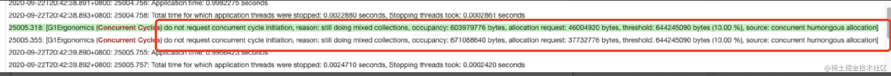
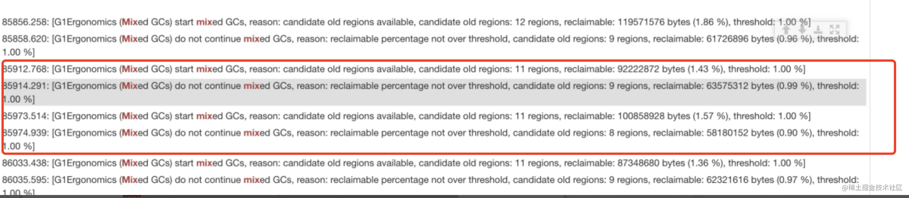
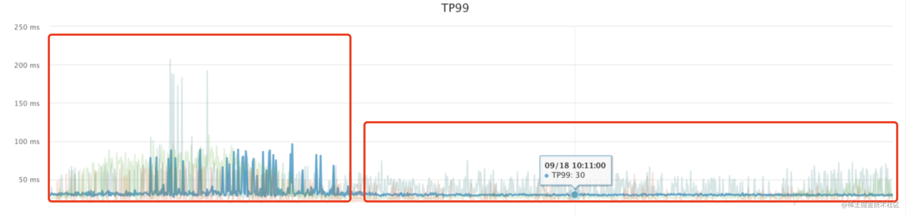
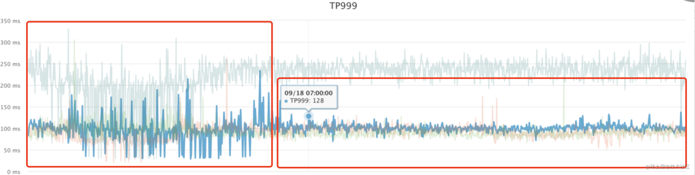
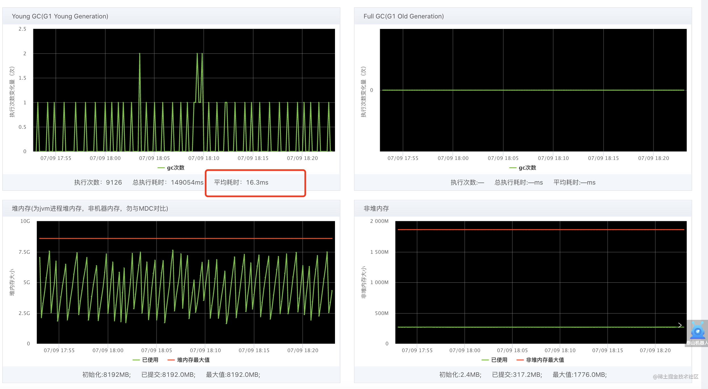
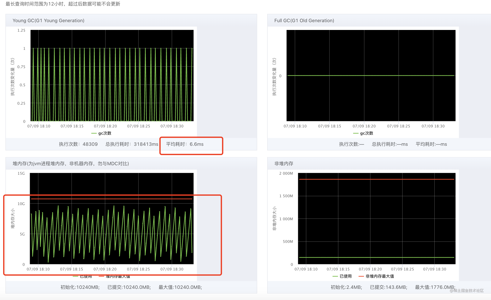

[toc]

### JVM参数配置参考

|          JVM参数          |        说明        | 1c2g | 2c4g  | 4c8g | 8c16g |
| :-----------------------: | :----------------: | :--: | :---: | :--: | :---: |
|           -Xms            |   初始堆内存大小   |  1g  | 2560m |  4g  |  10g  |
|           -Xmx            |   最大堆内存大小   |  1g  | 2560m |  4g  |  10g  |
|           -Xmn            |   新生代空间大小   | 500m | 1200m |  2g  |  5g   |
|     -XX:MetaspaceSize     |   初始元空间大小   | 128m | 256m  | 384m | 512m  |
|   -XX:MaxMetaspaceSize    |   最大元空间大小   | 128m | 256m  | 384m | 512m  |
|  -XX:MaxDirectMemorySize  | 最大堆堆外内存大小 | 256m | 256m  |  1g  |  1g   |
| -XX:ReservedCodeCacheSize |   CodeCache大小    | 64m  | 128m  | 256m | 256m  |

### 1. 如何设置高并发系统的jvm堆内存大小

**要解决的问题：**

- 系统要部署多少台机器
- 每台机器的内存空间
- 每台机器jvm堆内存大小
- jvm内存空间要多少，才能支撑这么多对象的创建才不至于进程直接崩溃

**内存压力计算：**

1. qps计算：

日常用户数量、高峰期时段多久、用户行为涉及到的接口、接口中创建的对象大小

举例：

- 假设用户系统高峰期 1w+qps 时， jvm内存要在一秒内能容纳下这一万多个用户信息实例
-  每天100万支付订单的交易系统，高峰期几个小时，平均到高峰期就是每秒100订单左右，要能容纳下这些订单对象处理耗时比较长的场景会比较复杂，进行minor gc的时候会有 qps * n * timeout 多个对象还存活着(n为接口一次处理过程产生的对象个数)

2. 计算每个对象的大小
3. 处理流程耗时
4. 然后计算出系统大概会进行一次minor gc（年轻代多久会塞满）

对于高并发的系统，如果请求耗时突然变成秒/十几秒（或者有个别接口耗时久），就很容易进入老年代： 系统并发较高 eden区很快就填满，然后进行 minor gc，慢接口引用的对象回收不掉，在多次minor gc后这些慢接口的对象就进入到老年代了

**实际场景：**

其实一般公司运维提供的机器配置是固定的几档，如4核8G、8核16G 然后会有对应的较为通用的jvm参数配置模板
而且线上服务情况错综复杂、不会说一个时刻就只有一个链路在执行，需要根据预期要抗的qps、目标rt进行压测，确定保证机器负载在健康水平下达到目标需要多少台机器，同时观察gc情况，然后再具体根据minor gc stw、老年代增长速率、fullgc频率和时长等进行调整

### 2. jvm启动相关配置参数解读

```bash
OPTS_MEMORY="-server

        -Xms6G     ##jvm内存最大值

        -Xmx6G     ##jvm内存最大可用内存

        -XX:MetaspaceSize=256M   ##

        -XX:MaxMetaspaceSize=256M

        -XX:+UseG1GC

        -verbose:gc

        -Xloggc:/export/Logs/xxxx.local/xxxx-jvm.log

        -XX:+PrintGCDetails  ##打印详细gc日志

        -XX:+PrintGCDateStamps ##打印gc时间戳

        -XX:+PrintHeapAtGC      ##gc前和gc后打印堆信息

        -XX:+PrintGCApplicationConcurrentTime ##应用程序在不停止的情况下工作的时间,即两个连续安全点之间的时间.

        -XX:+PrintGCApplicationStoppedTime  ##显示应用程序在安全点停止的时间.大多数情况下,安全点是由垃圾收集的世界各个阶段引起的

        -XX:+PrintTenuringDistribution ##输出显示在survivor空间里面有效的对象的岁数情况

        -XX:+UnlockExperimentalVMOptions ##解锁实验参数

        -XX:+UnlockDiagnosticVMOptions ##解锁诊断参数 G1SummarizeRSetStats

        -XX:+G1PrintRegionLivenessInfo ##打印在清除阶段每个Region存活对象信息。

        -XX:+G1SummarizeRSetStats ##可以确定并发优化线程是否能够及时处理更新日志缓冲区

        -XX:+PrintAdaptiveSizePolicy ##可以开启打印启发式算法决策细节

        -XX:+PrintReferenceGC ##个参数会打印各种引用的处理时间

        -XX:ParallelGCThreads=4   ##gc线程数------------一般配置成和机器核数相等

        -XX:G1HeapRegionSize=32M    ##每个regions大小-------------2，4，8，16，32 其他参数不生效；

        -XX:G1MaxNewSizePercent=90 ##年轻代占比最大空间-------------，Eden区和Survior区的大小之和接近G1MaxNewSizePercent，这个时候就要考虑调大 G1MaxNewSizePercent 。

        -XX:MaxGCPauseMillis=150 ##gc最大停顿时间------------当发现eden区分配过少，可以适当提升该配置（年轻代提升可以有效减少yanggc次数）

        -XX:InitiatingHeapOccupancyPercent=10         
        
        -XX:G1HeapWastePercent=1 ##堆废百分比达到参数值时，停止混合回收-------混合收集时间过长时，可以降低该参数

        -XX:G1MixedGCLiveThresholdPercent=85  默认值为85%存活对象超过region的百分之85，不会混合回收，也就是说 有可能造成15的空间浪费

        -XX:SoftRefLRUPolicyMSPerMB=1
```

### 3. 配置参数调整过程中可能遇到的问题

#### **old区占用比例持续增长的问题、原因和解决方式**

发生old区占用比例持续增长的原因有很多,可以通过日志分析看是下面那些原因造成的：

1. **软引用对象使用较多 rerefrence 导致的怎么办？**

解决：可以尝试降低以下参数：XX:SoftRefLRUPolicyMSPerMB=50  

2. **弱引用对象回收耗时占比高（ThreadLocal）怎么办？**

**解决**： -XX:+ParallelRefProcEnabled #启用弱引用对象的并行回收

3. **混合回收的频率低怎么办？**

**解决**：可以尝试调整以下参数：-XX:InitiatingHeapOccupancyPercent=10 # 当老年代占比达到堆大小10%时，下一次gc触发混合回收；

4. **空间碎片率较高怎么办？**

**解决**：降低以下参数-XX:G1MixedGCLiveThresholdPercent=85  默认值为85%存活对象超过region的百分之85，不会混合回收，也就是说 有可能造成15的空间浪费

5. **大对象区会被jvm监控计入old怎么办？**

**解决**：适当调大region区域:(需要分析)-XX:G1HeapRegionSize=32M  ##每个regions大小-------------2，4，8，16， 32 其他参数不生效;

出现一下的日志的时候，表示old区占用比例持续增长是由大对象引起的混合回收；



> **注意两点**：
>
> **1.Worker定时的频率尽量要小于yanggc的频率，否则定时的产生的垃圾会影响yangGc的效率；**
>
> **2.在 JDK8u40 之前的版本即便大对象区间是完全空闲的，也只会在井行回收循环的清除暂停阶段才会回收大对象。而JDK8u40 之后，新增了年轻代、Full GC 段针对大对象区间的回收功能，只要大对象区间不再包含任何引用，这些区间就会被回收井且放入空闲区间队列。即年轻代回收、并行回收循环、Full GC ，它们都会参与到大对象区间的回收工作。**

#### 压测并发较大的时候发生cpu飙升异常的原因和解决方式

**原因：**gc太频繁造成的

**解决：**提高一下参数，降低混合回收频率；

```shell
-XX:InitiatingHeapOccupancyPercent=10   # 当老年代占比达到堆大小10%时，下一次gc触发混合回收；
jvm日志搜索 mix  可以发现G1HeapWastePercent应该调整成2最为合适：
-XX:G1HeapWastePercent=2
```



#### 调优尽量减少stw（Stop The World）

- yangGC和fullgc都会存在stw
- yangGC时间可控，当时fullgc时间不可控，风险最大
- 所以调优的总目标就是消灭fullgc，并且在保证每次停顿时间可以接受的前提下，尽量禁烧yangGC的次数（他们是成反比的）；

#### G1模拟下主要有四种回收方式：

1. **Youg GC：**所有Eden区域满了后触发，并行手机，且完全STW。
2. **Mixed GC：**回收所有的年轻代的Region和部分老年代的Region，MIxed GC可能连续发生多次。
3. **Full GC：**非常慢，对OLTP系统来说简直就是灾难，会STW切回收所有类型的Region。
4. **YGC：**是频率最高的GC。

#### G1垃圾收集过程（yangGc和fullGC的过程类似）：

- **初始标记：**仅仅是标记GC Roots能直接关联的对象，速度很快。Stop The World。
- **并发标记：**从GC Roots出发，对堆中对象进行可达性分析，找出存活对象，该阶段耗时较长，但是可与用户线程并发执行。
- **最终标记：**主要修正在并发标记阶段因为用户线程继续运行而导致标记记录产生变动的那一部分对象的标记记录。stop the word。
- **筛选阶段：**将各个region分区的回收价值和成本进行排序，根据用户所期望的停顿时间制定回收计划。这阶段停顿用户线程。stop the word。

**G1调整优化效果：**

Tp99更加平稳：



Tp999提升明显：



### C端系统JVM调优的过程以及遇到的问题解决

#### TOC端调优策略选择

我们的C端服务多是SOA体系下的查询服务，所以这类服务如果按照最理想的方式，对外接口提供的数据都是经过底层数据异构后的数据呈现，特点就是简单、直接、小对象的呈现。针对这种服务的jvm调优，我们多考虑的是压缩gc的停顿时间，来提升接口的性能。

**接口的性能=任务线程等待时间（查询中间件）+网络损耗+gc停顿时间+序列化、反序列化时间；**

那么我们如何做呢？和B端业务比，我们需要改动哪些参数才能达到降低gc停顿时间的目的呢？

#### B端业务服务器规格以及垃圾回收器类型

- 8核 16G内存 32G磁盘 的机器
- G1垃圾回收器

**JVM启动相关配置参数解读**

```bash
if [ -z "$OPTS_MEMORY" ] ; then
        OPTS_MEMORY="
        -server
        -Xms10G ##jvm内存最大值
        -Xmx10G  ##jvm内存最大可用内存
        -XX:MetaspaceSize=512M
        -XX:MaxMetaspaceSize=512M
        -XX:+UseG1GC
        -verbose:gc
        -Xloggc:/export/Logs/xxxx/xxxx-jvm.log
        
         -XX:+PrintGCDetails  ##打印详细gc日志

        -XX:+PrintGCDateStamps ##打印gc时间戳

        -XX:+PrintHeapAtGC      ##gc前和gc后打印堆信息

        -XX:+PrintGCApplicationConcurrentTime ##应用程序在不停止的情况下工作的时间,即两个连续安全点之间的时间.

        -XX:+PrintGCApplicationStoppedTime  ##显示应用程序在安全点停止的时间.大多数情况下,安全点是由垃圾收集的世界各个阶段引起的

        -XX:+PrintTenuringDistribution ##输出显示在survivor空间里面有效的对象的岁数情况

        -XX:+UnlockExperimentalVMOptions ##解锁实验参数

        -XX:+UnlockDiagnosticVMOptions ##解锁诊断参数 G1SummarizeRSetStats

        -XX:+G1PrintRegionLivenessInfo ##打印在清除阶段每个Region存活对象信息。

        -XX:+G1SummarizeRSetStats ##可以确定并发优化线程是否能够及时处理更新日志缓冲区

        -XX:+PrintAdaptiveSizePolicy ##可以开启打印启发式算法决策细节

        -XX:+PrintReferenceGC ##个参数会打印各种引用的处理时间

        -XX:ParallelGCThreads=8   ##gc线程数------------一般配置成和机器核数相等
        
        -XX:G1HeapRegionSize=16M  ##每个regions大小-------------2，4，8，16，32 其他参数不生效；
        
        -XX:G1MaxNewSizePercent=90 ##年轻代占比最大空间-------------，Eden区和Survior区的大小之和接近G1MaxNewSizePercent，这个时候就要考虑调大 G1MaxNewSizePercent 
        
        -XX:MaxGCPauseMillis=50  ##gc最大停顿时间------------当发现eden区分配过少，可以适当提升该配置（年轻代提升可以有效减少yanggc次数）
        
        -XX:G1MixedGCLiveThresholdPercent=90  默认值为85%：存活对象超过region的百分之85，不会混合回收，也就是说 有可能造成15的空间浪费
        
        -XX:InitiatingHeapOccupancyPercent=3
        
        -XX:G1HeapWastePercent=1 ##堆废百分比达到参数值时，停止混合回收-------混合收集时间过长时，可以降低该参数
        
        -XX:SoftRefLRUPolicyMSPerMB=1
```

通过和toB的jvm参数对比得出配置参数的不同点，方便我们来剖析他们之间的区别：

1、ParallelGCThreads（gc线程数）

这个不必多说，gc线程数根据服务器的核数来配置

- toB设置（4核服务器）：-XX:ParallelGCThreads=4 
- toC设置（8核服务器）：-XX:ParallelGCThreads=8  2、G1HeapRegionSize（每个regions大小）

在堆内存耗尽之前，为了找到一系列连续的region也会导致FullGC。这种情况可以通过设置 **-XX:G1HeapRegionSize** 增大region的大小减少大对象占用的region数量，或者是增加整个堆的大小。极限情况下，虽然看上去还有很多的可用内存，但是G1找不到足够的连续的内存来分配对象。如果FullGC也无法回收足够的可用连续内存就会导致虚拟机退出。这种情况下，只能要么减少大对象的数量，要么就增加堆的大小。

- TOB：-XX:G1HeapRegionSize=32M B端业务更多的包含大对象，所以为了避免大对象占用region，尽量调大一些
- TOC：-XX:G1HeapRegionSize=16M C端业务更多的是小对象，region的占用不会很大（如果出现大对象，听劝，解耦你的上帝类吧）

3、MaxGCPauseMillis（gc最大停顿时间）

**注意** ：并不是说，参数的值设置得更小一点就能使得系统的垃圾收集速度变得更快，因为垃圾收 集停顿时间缩短是以牺牲吞吐量和新生代空间为代价换取的。

系统把新生代调得小一些，收集256MB新生代肯定比收集512MB快，但这也直接导致垃圾收集发生得更频繁，原来5秒收集一次、每次停顿50毫秒，现在变成2秒收集一次、 每次停顿10毫秒。停顿时间的确在下降，但吞吐量也降下来了。

- TOB：-XX:MaxGCPauseMillis=150
- TOC：-XX:MaxGCPauseMillis=50

4、G1MixedGCLiveThresholdPercent（mix gc时,老年代中存活对象的比例不能超过该值） 默认值为85%：存活对象超过region的百分之85，不会混合回收，也就是说 有可能造成15的空间浪费，B端业务大对象会比较多，region的占用不会特别规则，所以适当留出一些空间。C端业务精简后的小对象在region的占用会更细一些，所以提高到来提高空间使用率。

- TOB：-XX:G1MixedGCLiveThresholdPercent=85
- TOC：-XX:G1MixedGCLiveThresholdPercent=90

**G1调整优化效果：**

优化前：



优化后：



### 总结

上面两个模板，是面向两个不同的业务场景进行的配置，我们后续的业务也多是基于这两个模板进行微调，所以可以拿去尝试下效果，欢迎补充更多的优化经验

jvm调优的效果，远远比不上代码优化、业务拆分解耦带来的性能提升

牢记jvm调优的三个目的：降低延迟、提高吞吐量、抚平波动  他们三者之间是有取舍的，根据自己的业务来调整取舍。

---

作者：树洞君
链接：https://juejin.cn/post/7118323410689589278
