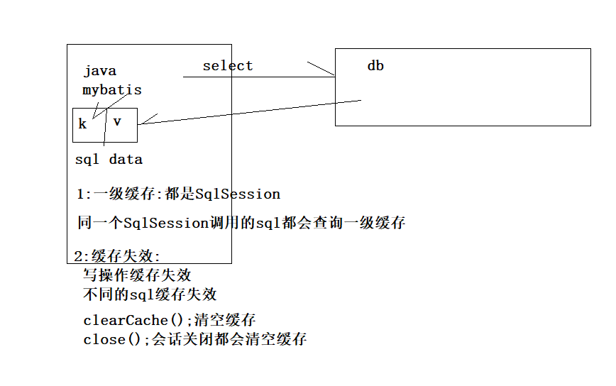

# Mybatis-03

# 14、基于注解的级联查询

## 14.1 注解自定义结果集

实体类属性与字段名称不一致

```java
/**
     * @Results:映射注解===ResultMap
     * @Result:
     *      id:是否主键
     *      column:字段名称
     *      property:bean中属性名称
     * @return
     */
@Results({
    @Result(id = true,column = "id",property = "id"),
    @Result(id = false,column = "last_name",property = "lastName"),
    @Result(id = false,column = "sex",property = "sex"),
})
@Select("select `id`,last_name,sex from t_user")
List<User> selectUserAll();
```

## 14.2 基于一对一级联查询

```java
//一个学生包含老师信息
//级联映射
@Results({
    @Result(id=true,column = "id",property = "id"),
    @Result(column = "name",property = "name"),
    //property:同样可以找到bean中的引用类型变量
    @Result(column = "tid",property = "teacher.id"),
    @Result(column = "tname",property = "teacher.name"),
})
@Select("select stu.id,stu.name,tea.id tid,tea.name tname\n" +
        "from t_student stu LEFT JOIN t_teacher tea\n" +
        "on stu.teacher_id = tea.id\n" +
        "where stu.id = #{id}")
Student selectStuAndTeaById(@Param("id") Integer id);
```

## 14.3 基于一对一延迟加载

1:先查询teacher

```java
@Select("select id,name from t_teacher where id = #{id}")
Teacher selectTeacherById(Integer id);
```

2:在Student中进行级联查询

```java
@Results({
    @Result(id = true, column = "id", property = "id"),
    @Result(column = "name", property = "name"),
    /**
             * 关联Teacher
             * column:传递的字段
             * property:返回值
             * one:表明一对一
             * @One:  ==>  association
             *  select:关联查询的方法全路径
             *  fetchType:加载时机
             *      FetchType.EAGER:立即加载
             *      FetchType.LAZY:懒加载
             *      FetchType.DEFAULT:默认,立即加载
             */
    @Result(column = "teacher_id",
            property = "teacher",
            one = @One(select = "com.atguigu.mapper.TeacherMapper.selectTeacherById",fetchType = FetchType.DEFAULT))
})
@Select("select id,name,teacher_id from t_student where id = #{id}")
Student selectStuAndTeaByIdTwo(@Param("id") Integer id);
```

## 14.4 基于一对多延迟加载

1:先查询乘客信息

```java
@Select("select id,name from t_passenger where bus_id = #{bid}")
List<Passenger> selectPassengersByBId(Integer bid);
```

2:查询公交车信息并关联乘客信息

```java
//查询一个公交车及车内乘客
@Results({
    @Result(id=true,column = "id",property = "id"),
    @Result(column = "name",property = "name"),
    /**
             * many = @Many:对多多 ==>collection
             *  select:关联方法全路径
             *  fetchType:加载时机
             *      FetchType.EAGER:立即加载
             *      FetchType.LAZY:懒加载
             *      FetchType.DEFAULT:默认,立即加载
             */
    @Result(column = "id",
            property = "passengers",
            many = @Many(select = "com.atguigu.mapper.PassengerMapper.selectPassengersByBId",
                         fetchType = FetchType.LAZY))
})
@Select("select id,name from t_bus where id = #{id}")
Bus selectBusById(Integer id);
```

## 14.6 多字段传递查询

1:通过id或name模糊查询乘客信息

```java
@Select("select id,name from t_passenger where bus_id = #{bid} or name = #{name}")
List<Passenger> selectPassengerByBidOrLikeName(@Param("bid") Integer bid, @Param("name") String name);
```

2:查询公交车信息

```java
@Results({
    @Result(id=true,column = "id",property = "id"),
    @Result(column = "name",property = "name"),
    /**
             * column=多值传递{参数名称=字段}
             */
    @Result(column = "{bid=id,name=name}",
            property = "passengers",
            many = @Many(select = "com.atguigu.mapper.PassengerMapper.selectPassengerByBidOrLikeName",fetchType = FetchType.LAZY))
})
@Select(" select `id`,name from t_bus where id = #{id}")
Bus selectBusByIdTwoArgs(Integer id);
```

# 15、动态SQL语句

动态的sql语句是指,mybatis根据参数值的不同.动态的改变sql语句的内容.

准备工作：

```java
public class User {
	private Integer id;
	private String lastName;
	private Integer sex;
}
```

## 15.1、if 语句

说明：	

if语句，可以动态的根据你的值来决定，是否需要动态的添加查询条件。

mapper接口

```java
public interface UserMapper {
    /**
     * 根据用户lastName和sex来查询用户信息 <br/>
     *  1 性别的有效值是0和1 , 1表示男,0表示女.,如果性别值无效,就不加入到查询条件中 <br/>
     *  2 lastName的值如果是null,也不加入到查询条件中 <br/>
     * @param user
     * @return
     */
    List<User> selectUserByNameOrSex(User user);
}
```

UserMapper.xml配置文件:

```xml
<?xml version="1.0" encoding="UTF-8" ?>
<!DOCTYPE mapper
        PUBLIC "-//mybatis.org//DTD Mapper 3.0//EN"
        "http://mybatis.org/dtd/mybatis-3-mapper.dtd">
<mapper namespace="com.atguigu.mapper.UserMapper">
    <!-- if 中的 and 必须小写 -->
     <!--
        1:只传递sex时多一个and
        2:不传递参数时多一个where
    -->
    <select id="selectUserByNameOrSex" resultType="User" parameterType="User">
        select `id`,last_name lastName,`sex` from t_user where
        <if test="lastName != null and lastName != ''">
            last_name like concat('%',#{lastName},'%') 
        </if>
        <if test="sex == 0 || sex == 1">
            and sex = #{sex}
        </if>
    </select>
</mapper>
```

测试的代码:

```java
@Test
public void selectUserById(){
    List<User> list = userMapper.selectUserByNameOrSex(new User("b", 0));
    list.forEach(user -> {
        System.err.println(user);
    });
}
```

## 15.2、where 语句

说明：	where语句，

1 可以帮我们在多个动态语句中，有效的去掉前面的多余的and  或 or 之类的多余关键字,

2 还可以判断是否有条件,如果有就添加where关键字

```xml
<?xml version="1.0" encoding="UTF-8" ?>
<!DOCTYPE mapper
        PUBLIC "-//mybatis.org//DTD Mapper 3.0//EN"
        "http://mybatis.org/dtd/mybatis-3-mapper.dtd">
<mapper namespace="com.atguigu.mapper.UserMapper">
    <!--
        where:
            1:只传递sex时可以
            2:只传递last_name也可以
            3:不传递参数时也可以
            4:只传递last_name:last_name like concat('%',#{lastName},'%') and 报错,因为where标签无法帮我们去掉后边的and
    -->
    <select id="selectUserByNameOrSex" resultType="User" parameterType="User">
        select `id`,last_name lastName,`sex`
        from t_user
        <!-- where动态语句
            1 可以帮我们在多个动态语句中，有效的去掉前面的多余的 and  或 or 之类的多余关键字,
            2 还可以判断是否有条件,如果有就添加where关键字
         -->
        <where>
            <if test="lastName != null and lastName != ''">
                last_name like concat('%',#{lastName},'%')
            </if>
            <if test="sex == 0 || sex == 1">
                and sex = #{sex}
            </if>
        </where>
    </select>
</mapper>
```

## 15.3、trim语句

说明：	

1. trim 可以动态在包含的语句前面和后面添加内容 或 删除指定内容。
2.  prefix 前面添加内容( 如果没有包含的内容,不添加 )
3. suffix 后面添加内容( 如果没有包含的内容,不添加 )
4. suffixOverrides 去掉的后面内容
5. prefixOverrides 去掉的前面内容

```xml
<?xml version="1.0" encoding="UTF-8" ?>
<!DOCTYPE mapper
        PUBLIC "-//mybatis.org//DTD Mapper 3.0//EN"
        "http://mybatis.org/dtd/mybatis-3-mapper.dtd">
<mapper namespace="com.atguigu.mapper.UserMapper">
    <select id="selectUserExampleByNameOrSex" resultType="User" parameterType="User">
        select `id`,last_name lastName,`sex` from t_user
        <!--
          trim 语句,可以在包含的内容前面和后面 添加添加或删除指定内容 (if语句先执行,执行完再执行trim)
            prefix 前面添加内容( 如果没有包含的内容,不添加 )
            suffix 后面添加内容( 如果没有包含的内容,不添加 )
            suffixOverrides 去掉的后面内容
            prefixOverrides 去掉的前面内容
        -->
        <trim suffixOverrides="and" prefixOverrides="and" prefix="where">
            <if test="lastName != null and lastName != ''">
                last_name like concat('%',#{lastName},'%') and
            </if>
            <if test="sex == 0 || sex == 1">
                 sex = #{sex} and
            </if>
        </trim>
    </select>
</mapper>
```

## 15.4、choose（ when , otherwise ）语句

说明：choose when otherwise 可以执行多路选择判断，但是只会有一个分支会被执行。

类似 switch case default语句

Mapper接口

```java
public interface UserMapper {
    /*
     * 1 如果lastName属性值有效,则只按照lastName属性做模糊查询 <br/>
     * 2 如果lastName无效,sex有效,则只按照sex进行查询<br/>
     * 3 如果lastName和sex都无效,则使用自定义查询条件
     * @param user
     * @return
     */
    List<User> selectUsersByUserChooseWhenOtherwise(User user);
}
```

Mapper.xml配置文件

```xml
<?xml version="1.0" encoding="UTF-8" ?>
<!DOCTYPE mapper
        PUBLIC "-//mybatis.org//DTD Mapper 3.0//EN"
        "http://mybatis.org/dtd/mybatis-3-mapper.dtd">
<mapper namespace="com.atguigu.mapper.UserMapper">
    <select id="selectUsersByUserChooseWhenOtherwise" resultType="User">
        select `id`,last_name lastName,`sex` from t_user
        <where>
            <choose>
                <!-- 如果lastName属性值不等于null就做模糊查询 -->
                <when test="lastName != null and lastName != '' ">
                    last_name like concat('%',#{lastName},'%')
                </when>
                <!-- 如果lastName值无效,sex有效,按sex查询 -->
                <when test="sex == 0 || sex == 1">
                    sex = #{sex}
                </when>
                <!-- 如果lastName无效,sex也无效,使用自定义查询条件 -->
                <otherwise>
                    1=1
                </otherwise>
            </choose>
        </where>
    </select>
</mapper>
```

测试代码:

```java
@Test
public void selectUsersByUserChooseWhenOtherwise(){
    List<User> list = userMapper.selectUsersByUserChooseWhenOtherwise(new User("b",1));
    list.forEach(user -> {
        System.err.println(user);
    });
}
```

## 15.4、set语句

set语句可以删除更新字段后的逗号

Mapper接口

```java
public interface UserMapper {
    /*
     * 如果lastName或sex值无效就不更新
     * @param user
     * @return
     */
    int updateUser(User user);

}
```

Mapper.xml配置文件:

```xml
<update id="updateUser" parameterType="User">
    update t_user set
    <!-- set可以去掉包含内容后面的逗号,如果有包含的内容还会添加set关键字 -->
    <set>
        <if test="lastName != null">
            last_name = #{lastName},
        </if>
        <if test="sex ==0 || sex == 1">
            sex = #{sex}
        </if>
    </set>
    where id = #{id}
</update>
```

## 15.5、foreach语句

foreach 语句用来做遍历操作.它可以遍历实现多个in条件的查询,也可以实现批量插入

select * from t_user where id in (1,2,3,4) 

Mapper接口

```java
/*
     * 执行where id in (xx,xx,xx) 查询
     *
     * @param ids
     * @return
     */
List<User> selectUsersByIds(List<Integer> ids);
```

Mapper.xml配置文件

```xml
<select id="selectUsersByIds" resultType="User">
    select `id`,last_name lastName,`sex` from t_user
    <where>
        <!-- foreach标签用于遍历操作
               collection遍历的数据源 collection || list
               item 是当前遍历的数据
               separator是每个遍历元素中的分隔符
               open 是在遍历内容前面添加
               close 是在遍历内容后面添加
			   如果没有使用@Param,collection只能用list,collection
           -->
        <!--
                foreach list in id
                   id in (id)
					id in (1,2,4,5)
             -->
        <foreach collection="list" item="id" open="id in (" close=")" separator=",">
            #{id}
        </foreach>
    </where>
</select>
```

测试代码:

```java
@Test
public void selectUsersByIds(){
    List<User> list = userMapper.selectUsersByIds( Arrays.asList(1, 2, 3));
    System.err.println(list);
}
```

insert into 表名(列1,列2) values(值1,值2) , (值1,值2) , (值1,值2) ......

Mapper接口

```java
/*
     * 批量插入
     *
     * @param users
     * @return
     */
int insertUsers(@Param("users") List<User> users);
```

Mapper.xml配置文件

```xml
<insert id="insertUsers">
    insert into t_user(`last_name`,`sex`) values
    <foreach collection="users" item="user" separator=",">
        (#{user.lastName},#{user.sex})
    </foreach>
</insert>
```

测试代码:

```java
@Test
public void insertUsers(){
    int result = userMapper.insertUsers(Arrays.asList(new User("abc", 1), new User("bcv", 0)));
    System.err.println(result);
    sqlSession.commit();
}
```

## 15.6、sql片段

sql片段是指把多个sql语句中相同的内容进行抽取为sql片段,在需要使用的地方进行引入即可.


# 16、Mybatis缓存

缓存：按动词解释是把经常需要访问的数据,预先保存到高速缓冲区中,方便用户高速访问.

按名词解释.缓存指的是,提前保存起来方便用户高速访问的数据叫缓存.

一级缓存：同一个SqlSession对象

二级缓存：同一个SqlSessionFactory对象

缓存的目的就一个,就是为了提高访问速度.



## 16.1、mybatis的一级缓存的示例

画图解释一级缓存:

 ```java
@Test
public void selectUser() {
    User user = userMapper.selectUserById(1);
    User user1 = userMapper.selectUserById(1);
    System.err.println(user);
    System.err.println(user1);
}
 ```


## 16.1.2、一级缓存的管理

缓存失效的四种情况：

1. 不在同一个SqlSession对象中

```java
//1.不在同一个mapper中
public void queryOne(){
    SqlSession session = sessionFactory.openSession();
    try {
        UserMapper userMapper = session.getMapper(UserMapper.class);
        User user = userMapper.selectUserById(1);
        System.err.println(user);
    } finally {
        session.close();
    }
}
@Test
public void firstLevelCacheFail1(){
    queryOne();
    queryOne();
}
```


2. 执行语句的参数不同。缓存中也不存在数据。

```java
@Test
public void firstLevelCacheFail2() {
    UserMapper mapper = sqlSession.getMapper(UserMapper.class);
    User user = mapper.selectUserById(1);
    User user1 = mapper.selectUserById(1);
    System.err.println(user1);
    User user3 = mapper.selectUserById(2);
    System.err.println(user3);
}
```

3. 执行增，删，改，语句，会清空掉缓存

```java
@Test
public void firstLevelCacheFail3() {
    UserMapper mapper = sqlSession.getMapper(UserMapper.class);
    User user = mapper.selectUserById(1);
    System.err.println("==============");
    mapper.updateUser(new User(23, "xxx", 0));
    System.err.println("==============");
    User user1 = mapper.selectUserById(1);
    System.err.println("==============");
    User user2 = mapper.selectUserById(2);
    System.err.println("==============");
    sqlSession.commit();
}
```

4. 手动清空缓存数据

```java
@Test
public void firstLevelCacheFail4() {
    UserMapper mapper = sqlSession.getMapper(UserMapper.class);
    User user = mapper.selectUserById(1);
    sqlSession.clearCache();
    System.err.println("-----------------");
    User user1 = mapper.selectUserById(1);
}
```

5.sqlSession关闭清空缓存

## 16.2、mybatis的二级缓存

二级缓存的图解示意

1. 当我们执行一个查询语句的时候。mybatis会先去二级缓存中查询数据。
2. 二级缓存中没有。就到一级缓存中查找。
3. 如果二级缓存和一级缓存都没有。就发sql语句到数据库中去查询。
4. 查询出来之后马上把数据保存到一级缓存中。
5. 当SqlSession关闭或commit的时候，会把一级缓存中的数据保存到二级缓存中。

 

一级缓存强制开始使用.

二级缓存的使用：

myBatis的二级缓存默认是不开启的。

1 我们需要在mybatis的核心配置文件中配置setting选项 

```xml
<setting name="cacheEnabled" value="true"/>
```

2 在Mapper.xml的配置文件中加入cache标签。启用二级缓存

或者
@CacheNamespace

 

3 需要被二级缓存的对象必须要实现java的序列化接口。

 

### 16.2.1、二级缓存的演示

```java
//1.不在同一个mapper中
public void queryOne1() {
    SqlSession session = sessionFactory.openSession();
    try {
        UserMapper mapper = session.getMapper(UserMapper.class);
        User user = mapper.selectUserById(1);
        System.out.println(user);
    } finally {
        session.close();
    }
}

@Test
public void firstLevelCacheFail5() {
    queryOne1();
    queryOne1();
}
```


### 16.2.2、useCache=false的演示和说明

useCache属性它是select标签中的属性,表示是否将查询的结果保存到二级缓存中.默认是true.保存到二级缓存中

```xml
<!--
	useCache="false" 表示不将查询的结果保存到二级缓存中
-->
<select id="selectUserById" resultType="com.atguigu.pojo.User" useCache="false">
  select `id`,`last_name` lastName,`sex` from t_user where id = #{id}
</select>
```

再次调用queryOne()


### 16.2.3、flushCache=false的演示和说明

是在insert , delete , update 标签中的属性,它表示执行写操作的时候,是否清空二级缓存.

默认值是true,表示执行insert delete update 语句就会清空缓存.

```xml
<!--
  flushCache="false"表示设置执行当前update操作是否清空缓存
-->
<update id="updateUser" flushCache="false" parameterType="com.atguigu.pojo.User">
    update t_user set last_name=#{lastName},sex=#{sex} where id = #{id}
</update>
```

测试

```java
@Test
public void selectUser() {
    UserMapper userMapper = sqlSession.getMapper(UserMapper.class);
    List<User> list = userMapper.selectAll();
    userMapper.updateUser(new User(3,"a",0));
    sqlSession.commit();  
    List<User> list1 = userMapper.selectAll();
    System.err.println(list); 
    System.err.println(list1);
}
```


## 自定义二级缓存(了解)

如果要自定义mybatis的二级缓存,需要实现Cache接口.

一级缓存默认实现类 : org.apache.ibatis.cache.impl.PerpetualCache

自定义二级缓存步骤如下:

1. 编写一个类去实现Cache接口

2. 到mapper.xml配置文件中,修改<cache type="" />

使用Redis做为mybatis的二级缓存.

```java
public class MySecondCache implements Cache {

    private final String id;

    private Map<Object, Object> cache = new HashMap<>();

    public MySecondCache(String id) {
        this.id = id;
    }

    @Override
    public String getId() {
        return id;
    }

    @Override
    public int getSize() {
        return cache.size();
    }

    @Override
    public void putObject(Object key, Object value) {
        System.err.println("save to cache");
        cache.put(key, value);
    }

    @Override
    public Object getObject(Object key) {
        System.err.println("get to cache");
        return cache.get(key);
    }

    @Override
    public Object removeObject(Object key) {
        return cache.remove(key);
    }

    @Override
    public void clear() {
        cache.clear();
    }

    @Override
    public ReadWriteLock getReadWriteLock() {
        return null;
    }

    @Override
    public boolean equals(Object o) {
        if (getId() == null) {
            throw new CacheException("Cache instances require an ID.");
        }
        if (this == o) {
            return true;
        }
        if (!(o instanceof Cache)) {
            return false;
        }

        Cache otherCache = (Cache) o;
        return getId().equals(otherCache.getId());
    }

    @Override
    public int hashCode() {
        if (getId() == null) {
            throw new CacheException("Cache instances require an ID.");
        }
        return getId().hashCode();
    }

}
```

<!-- 使用自定义二级缓存 -->

```xml
<cache type="com.atguigu.cache.MySecondCache"></cache>
```

# 17、Mybatis 逆向工程(了解)

MyBatis逆向工程，简称MBG。是一个专门为MyBatis框架使用者定制的代码生成器。可以快速的根据表生成对应的映射文件，接口，以及Bean类对象。

在Mybatis中，是一个可以自动对单表生成的增，删，改，查代码的插件。

叫 mybatis-generator-core-1.3.2。

它可以帮我们对比数据库表之后，生成大量的这个基础代码。

这些基础代码有：

1. 数据库表对应的javaBean对象
2. 这些javaBean对象对应的Mapper接口
3. 这些Mapper接口对应的配置文件

```xml
<!-- 去掉全部的注释 -->
<commentGenerator>
	<property name="suppressAllComments" value="true" />
</commentGenerator>
```

## 17.1、准备数据库表

```sql
create database mbg character set utf8;
use mbg;
create table t_user(
	`id` int primary key auto_increment,
	`username` varchar(30) not null unique,
	`password` varchar(40) not null,
	`email` varchar(50)
);

insert into t_user(`username`,`password`,`email`) values('admin','admin','admin@atguigu.com');

insert into t_user(`username`,`password`,`email`) values('wzg168','123456','admin@atguigu.com');

insert into t_user(`username`,`password`,`email`) values('admin168','123456','admin@atguigu.com');

insert into t_user(`username`,`password`,`email`) values('lisi','123456','admin@atguigu.com');

insert into t_user(`username`,`password`,`email`) values('wangwu','123456','admin@atguigu.com');


create table t_book(
	`id` int primary key auto_increment,
	`name` varchar(50),
	`author` varchar(50),
	`price`	decimal(11,2),
	`sales`	int,
	`stock` int
);

## 插入初始化测试数据
insert into t_book(`id` , `name` , `author` , `price` , `sales` , `stock` )  values(null , 'java从入门到放弃' , '国哥' , 80 , 9999 , 9);

insert into t_book(`id` , `name` , `author` , `price` , `sales` , `stock` )  values(null , '数据结构与算法' , '严敏君' , 78.5 , 6 , 13);

insert into t_book(`id` , `name` , `author` , `price` , `sales` , `stock` )  values(null , '怎样拐跑别人的媳妇' , '龙伍' , 68, 99999 , 52);

insert into t_book(`id` , `name` , `author` , `price` , `sales` , `stock` )  values(null , '木虚肉盖饭' , '小胖' , 16, 1000 , 50);

insert into t_book(`id` , `name` , `author` , `price` , `sales` , `stock` )  values(null , 'C++编程思想' , '刚哥' , 45.5 , 14 , 95);

insert into t_book(`id` , `name` , `author` , `price` , `sales` , `stock` )  values(null , '蛋炒饭' , '周星星' , 9.9, 12 , 53);

insert into t_book(`id` , `name` , `author` , `price` , `sales` , `stock` )  values(null , '赌神' , '龙伍' , 66.5, 125 , 535);

select * from t_user;
select * from t_book;
```

配置文件: 

```xml
<?xml version="1.0" encoding="UTF-8"?>
<!DOCTYPE generatorConfiguration
  PUBLIC "-//mybatis.org//DTD MyBatis Generator Configuration 1.0//EN"
  "http://mybatis.org/dtd/mybatis-generator-config_1_0.dtd">

<generatorConfiguration>
  <classPathEntry location="/Program Files/IBM/SQLLIB/java/db2java.zip" />

  <context id="DB2Tables" targetRuntime="MyBatis3">
    <jdbcConnection driverClass="COM.ibm.db2.jdbc.app.DB2Driver"
        connectionURL="jdbc:db2:TEST"
        userId="db2admin"
        password="db2admin">
    </jdbcConnection>

    <javaTypeResolver >
      <property name="forceBigDecimals" value="false" />
    </javaTypeResolver>

    <javaModelGenerator targetPackage="test.model" targetProject="\MBGTestProject\src">
      <property name="enableSubPackages" value="true" />
      <property name="trimStrings" value="true" />
    </javaModelGenerator>

    <sqlMapGenerator targetPackage="test.xml"  targetProject="\MBGTestProject\src">
      <property name="enableSubPackages" value="true" />
    </sqlMapGenerator>

    <javaClientGenerator type="XMLMAPPER" targetPackage="test.dao"  targetProject="\MBGTestProject\src">
      <property name="enableSubPackages" value="true" />
    </javaClientGenerator>

    <table schema="DB2ADMIN" tableName="ALLTYPES" domainObjectName="Customer" >
      <property name="useActualColumnNames" value="true"/>
      <generatedKey column="ID" sqlStatement="DB2" identity="true" />
      <columnOverride column="DATE_FIELD" property="startDate" />
      <ignoreColumn column="FRED" />
      <columnOverride column="LONG_VARCHAR_FIELD" jdbcType="VARCHAR" />
    </table>

  </context>
</generatorConfiguration>
```

修改:

```xml
<?xml version="1.0" encoding="UTF-8"?>
<!DOCTYPE generatorConfiguration
        PUBLIC "-//mybatis.org//DTD MyBatis Generator Configuration 1.0//EN"
        "http://mybatis.org/dtd/mybatis-generator-config_1_0.dtd">

<generatorConfiguration>

    <!--
        配置内容
        targetRuntime:生成的版本,
            标准版:curd          	  MyBatis3Simple
            豪华版:大量的query    	MyBatis3
    -->

    <!-- 配置内容 -->
    <context id="DB2Tables" targetRuntime="MyBatis3">

        <!-- 忽略注释 -->
        <commentGenerator>
            <property name="suppressAllComments" value="true"/>
        </commentGenerator>

        <!-- 连接信息 -->
        <jdbcConnection driverClass="com.mysql.jdbc.Driver"
                        connectionURL="jdbc:mysql://localhost:3306/mbg?characterEncoding=UTF-8"
                        userId="root"
                        password="root">
        </jdbcConnection>

        <!-- 是否使用大类型 -->
        <javaTypeResolver >
            <property name="forceBigDecimals" value="false" />
        </javaTypeResolver>

        <!--
            生成pojo位置
                targetPackage:包位置
                targetProject:路径
        -->
        <javaModelGenerator targetPackage="com.atguigu.pojo"
                            targetProject=".\src">
            <property name="enableSubPackages" value="true" />
            <property name="trimStrings" value="true" />
        </javaModelGenerator>

        <!--
            targetPackage:映射位置
            targetProject:路径
        -->
        <sqlMapGenerator targetPackage="com.atguigu.mapper"
                         targetProject=".\src">
            <property name="enableSubPackages" value="true" />
        </sqlMapGenerator>

        <!--
                    targetPackage:java中接口位置
                    targetProject:路径
                -->
        <javaClientGenerator type="XMLMAPPER"
                             targetPackage="com.atguigu.mapper"
                             targetProject=".\src">
            <property name="enableSubPackages" value="true" />
        </javaClientGenerator>

        <!--
            配置映射
                tableName:表明
                domainObjectName:实体类名称
        -->
        <table tableName="t_user" domainObjectName="User"/>
        <table tableName="t_book" domainObjectName="Book"/>

    </context>
</generatorConfiguration>
```

逆向工程运行的代码: 

```java
public class MbgRunner {
    public static void main(String[] args) throws IOException, XMLParserException, InvalidConfigurationException, SQLException, InterruptedException {
        List<String> warnings = new ArrayList<String>();
        boolean overwrite = true;
        File configFile = Resources.getResourceAsFile("mgb.xml");
        ConfigurationParser cp = new ConfigurationParser(warnings);
        Configuration config = cp.parseConfiguration(configFile);
        DefaultShellCallback callback = new DefaultShellCallback(overwrite);
        MyBatisGenerator myBatisGenerator = new MyBatisGenerator(config, callback, warnings);
        myBatisGenerator.generate(null);
    }
}
```

生成的豪华版本的查询条件方法使用说明:

 

豪华版的测试代码

```java
public class BookMapperTest {

    InputStream inputStream = null;
    SqlSessionFactory sessionFactory = null;
    SqlSession sqlSession = null;
    BookMapper bookMapper = null;

    @Before
    public void init() throws IOException {
        inputStream = Resources.getResourceAsStream("mybatis-config.xml");
        sessionFactory = new SqlSessionFactoryBuilder().build(inputStream);
        sqlSession = sessionFactory.openSession(true);
        bookMapper = sqlSession.getMapper(BookMapper.class);
    }

    @After
    public void destory() {
        sqlSession.close();
    }

    @Test
    public void countByExample() {
        //条件封装
        BookExample bookExample = new BookExample();
        //创建查询条件 and
        BookExample.Criteria criteria = bookExample.createCriteria();
        // or 条件
        BookExample.Criteria criteriaOr = bookExample.or();
        //条件 and
        //criteria.andAuthorEqualTo( "刚哥");
        //价格大于100
        criteria.andPriceGreaterThan(new BigDecimal(100));
        //条件 or
        criteriaOr.andIdIn(Arrays.asList(2,5,6));
        //count打头的方法,用于执行count()
        //参数就是查询的条件
        //如果为null则查询全部
        int count = bookMapper.countByExample(bookExample);
        System.err.println(count);
    }

    @Test
    public void deleteByExample() {
        BookExample bookExample = new BookExample();
        BookExample.Criteria criteria = bookExample.createCriteria();
        // 销量大于100 或 库存大于100
        criteria.andSalesGreaterThan(100);
        // or 关系的条件
        BookExample.Criteria or = bookExample.or();
        or.andStockGreaterThan(100);
        // 如果条件是null,表示全部
        int result = bookMapper.deleteByExample(bookExample);
        System.err.println(result);
    }

    @Test
    public void deleteByPrimaryKey() {
        // delete , update ,select , insert 表示操作
        // By 按什么什么条件
        // ByExample 表示按条件操作
        // ByPrimaryKey 按主键
        int result = bookMapper.deleteByPrimaryKey(10);
        System.err.println(result);
    }

    // public Book(String name, String author, BigDecimal price, Integer sales, Integer stock)
    @Test
    public void insert() {
        int result = bookMapper.insert(new Book("小明", "小红", new BigDecimal(100.0), 100, 100));
        System.err.println(result);
    }

    /**
     *  xxxSelective:表示会忽略为null的列,sql语句中不会有null的字段
     *  author为null的时候添加的时候直接略过
     *  insert into t_book ( name, price, sales, stock ) values ( ?, ?, ?, ? )
     */
    @Test
    public void insertSelective() {
        int result = bookMapper.insertSelective(new Book("小明", null, new BigDecimal(100.0), 100, 100));
        System.err.println(result);
    }

    @Test
    public void selectByExample() {
        BookExample bookExample = new BookExample();
        BookExample.Criteria criteria = bookExample.createCriteria();
        //criteria.andIdIn(Arrays.asList(2,5,6));
        criteria.andPriceBetween(new BigDecimal(10),new BigDecimal(100));
        //模糊
        //criteria.andAuthorLike("%敏%");
        //排序
        bookExample.setOrderByClause("price desc");
        List<Book> list = bookMapper.selectByExample(bookExample);
        list.forEach(book -> {
            System.err.println(book);
        });
    }

    @Test
    public void selectByPrimaryKey() {
        Book book = bookMapper.selectByPrimaryKey(5);
        System.err.println(book);
    }

    @Test
    public void updateByExampleSelective() {
        BookMapper mapper = sqlSession.getMapper(BookMapper.class);
        /*
         *第一个参数是, 更新的值 < br / >
         *第二个参数是, 更新的条件 < br / >
         */
        Book book = new Book(4, "红烧肉", null, new BigDecimal(10), 10, 10);
        BookExample bookExample = new BookExample();
        bookExample.createCriteria().andIdEqualTo(4);
        //update t_book set id = ?, name = ?, author = ?, price = ?, sales = ?, stock = ? WHERE ( id = ? )
        mapper.updateByExample(book, bookExample); //不忽略空列
        //update t_book SET id = ?, name = ?, price = ?, sales = ?, stock = ? WHERE ( id = ? )
        mapper.updateByExampleSelective(book, bookExample);//忽略空列的操作,发现未null的字段时底层自动过滤掉
    }

}
```

