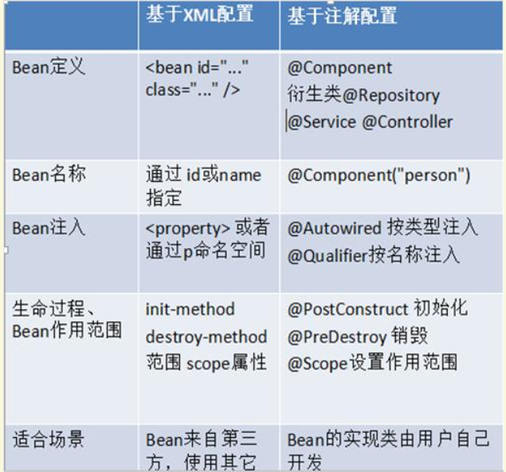

[TOC]

---

---

---

Spring是一个开源框架， Spring是于2003 年兴起的一个轻量级的Java 开发框架，由Rod Johnson在其著作 Expert One-On-One J2EE Development and Design 中阐述的部分理念和原型衍生而来。它是为了解决企业应用开发的复杂性而创建的。框架的主要优势之一就是其分层架构，分层架构允许使用者选择使用哪一个组件，同时为 J2EE 应用程序开发提供集成的框架。Spring 使用基本的 JavaBean来完成以前只可能由 EJB 完成的事情。然而， Spring 的用途不仅限于服务器端的开发。从简性、可测试性和松耦合的角度而言，任何 Java 应用都可以从 Spring 中受益。Spring 的核心是控制反转（IoC）和面向切面（AOP）。简单来说， Spring 是一个分层的 JavaSE/EEfull-stack(一站式) 轻量级开源框架。

EE 开发分成三层结构:
* WEB 层:Spring MVC.

* 业务层:Bean 管理:(IOC)

* 持久层:Spring 的 JDBC 模板.ORM 模板用于整合其他的持久层框架.

  Expert One-to-One J2EE Design and Development :J2EE 的设计和开发:(2002.EJB)
  Expert One-to-One J2EE Development without EJB :J2EE 不使用 EJB 的开发


- 方便解耦，简化开发
  - Spring 就是一个大工厂，可以将所有对象创建和依赖关系维护，交给 Spring 管理AOP 编程的支持
  - Spring 提供面向切面编程，可以方便的实现对程序进行权限拦截、运行监控等功能声明式事务的支持
  - 只需要通过配置就可以完成对事务的管理，而无需手动编程方便程序的测试
  - Spring 对 Junit4 支持，可以通过注解方便的测试 Spring 程序,方便集成各种优秀框架
  - Spring 不排斥各种优秀的开源框架，其内部提供了对各种优秀框架（如： Struts、 Hibernate、MyBatis、 Quartz 等）的直接支持,降低 JavaEE API 的使用难度
  - Spring 对 JavaEE 开发中非常难用的一些 API（JDBC、 JavaMail、远程调用等），都提供了封装，使这些 API 应用难度大大降低


# id 属性和 name 属性标签的配置

- id :Bean 起个名字. 在约束中采用 ID 的约束:唯一.必须以字母开始，可以使用字母、数字、连字符、下划线、句话、冒号 id:不能出现特殊字符.

```xml
<bean id=”bookAction”>
```

- name:Bean 起个名字. 没有采用 ID 的约束. name:出现特殊字符.如果<bean>没有 id 的话 , name 可以当做 id 使用

- scope 属性： Bean 的作用范围.
  - singleton :默认值，单例的.
  - prototype :多例的.
  -  request :WEB 项目中,Spring 创建一个 Bean 的对象,将对象存入到 request 域中.
  - session :WEB 项目中,Spring 创建一个 Bean 的对象,将对象存入到 session 域中.
  - globalSession :WEB 项目中,应用在 Porlet 环境.如果没有 Porlet 环境那么 globalSession 相当于 session.

# 配置注解扫描：

```xml
<!-- Spring 的注解开发:组件扫描(类上注解: 可以直接使用属性注入的注解) -->
<context:component-scan base-package="com.itheima.spring.demo1"/>
```

#  Spring 的Bean管理中的常用 的注解

## @Component:组件.(作用在类上)

- Spring 中提供@Component 的三个衍生注解:(功能目前来讲是一致的)

  - @Controller :WEB 层
  - @Service :业务层
  - @Repository :持久层

  > 这三个注解是为了让标注类本身的用途清晰， Spring 在后续版本会对其增强

## 属性注入的注解:(使用注解注入的方式,可以不用提供 set 方法.)

- @Value :用于注入普通类型
- @Autowired :自动装配:
  - 默认按类型进行装配
  - 按名称注入:
    - @Qualifier:强制使用名称注入
- Resource 相当于:
  - @Autowired 和@Qualifier 一起使用.

## Bean 的生命周期的配置:

- @PostConstruct :相当于 init-method
- @PreDestroy :相当于 destroy-method

## Spring 的 Bean 管理的方式的比较:



- XML 和注解:
  - XML :结构清晰.
  - 注解 :开发方便.(属性注入.).

- 实际开发中还有一种 XML 和注解整合开发:
  - Bean 有 XML 配置.但是使用的属性使用注解注入.

# AOP

- 在软件业，AOP为Aspect Oriented Programming的缩写，意为：面向切面编程，通过预编译方式和运行期动态代理实现程序功能的统一维护的一种技术。AOP是OOP的延续，是软件开发中的一个热点，也是Spring]框架中的一个重要内容，是函数式编程的一种衍生范型。利用AOP可以对业务逻辑的各个部分进行隔离，从而使得业务逻辑各部分之间的耦合度降低，提高程序的可重用性，同时提高了开发的效率。

## AOP开发中相关术语

- Joinpoint(连接点):所谓连接点是指那些被拦截到的点。在 spring 中,这些点指的是方法,因为 spring 只支持方法类型的连接点.
- Pointcut(切入点):所谓切入点是指我们要对哪些 Joinpoint 进行拦截的定义.
- Advice(通知/增强):所谓通知是指拦截到 Joinpoint 之后所要做的事情就是通知.通知分为前置通知,后置通知,异常通知,最终通知,环绕通知(切面要完成的功能).
- Introduction(引介):引介是一种特殊的通知在不修改类代码的前提下, Introduction 可以在运行期为类动态地添加一些方法或 Field.
- Target(目标对象):代理的目标对象.
- Weaving(织入):是指把增强应用到目标对象来创建新的代理对象的过程.
- spring 采用动态代理织入，而 AspectJ 采用编译期织入和类装在期织入.
- Proxy（代理） :一个类被 AOP 织入增强后，就产生一个结果代理类.
- Aspect(切面): 是切入点和通知（引介）的结合.

## 通知类型

- @Before	前置通知 ：在目标方法执行之前执行.
- @AfterReturing    后置通知 ：在目标方法执行之后执行.
- @Around    环绕通知 ：在目标方法执行前和执行后执行.
- @AfterThrowing    异常抛出通知：在目标方法执行出现 异常的时候 执行.
- @After    最终通知 ：无论目标方法是否出现异常 最终通知都会 执行.
- Pointcut:定义切入点的注解.

# 事务

- 什么是事务

  - 事务逻辑上的一组操作,组成这组操作的各个逻辑单元,要么一起成功,要么一起失败.

- 事务特性

  - 原子性 :强调事务的不可分割.
  - 一致性 :事务的执行的前后数据的完整性保持一致.
  - 隔离性 :一个事务执行的过程中,不应该受到其他事务的干扰.
  - 持久性 :事务一旦结束,数据就持久到数据库.

- 如果不考虑隔离性引发安全性问题:

  - 脏读 :一个事务读到了另一个事务的未提交的数据.
  - 不可重复读 :一个事务读到了另一个事务已经提交的 update 的数据导致多次查询结果不一致.
  - 虚幻读 :一个事务读到了另一个事务已经提交的 insert 的数据导致多次查询结果不一致.

- 解决读问题:设置事务隔离级别

  - 未提交读 :脏读，不可重复读，虚读都有可能发生.
  - 已提交读 :避免脏读。但是不可重复读和虚读有可能发生.
  - 可重复读 :避免脏读和不可重复读.但是虚读有可能发生.
  - 串行化的 :避免以上所有读问题.

  >Mysql 默认:可重复读
  >Oracle 默认:读已提交

- Spring 进行事务管理一组 API

  - PlatformTransactionManager:平台事务管理器.

  ```xml
  <!--真正管理事务的对象-->
  org.springframework.jdbc.datasource.DataSourceTransactionManager <!--使用 Spring
  JDBC 或 iBatis 进行持久化数据时使用-->
  org.springframework.orm.hibernate3.HibernateTransactionManager <!--使用
  Hibernate 版本进行持久化数据时使用-->
  ```

- TransactionDefinition:事务定义信息

  - 事务定义信息:
    - 隔离级别
    - 传播行为
    - 超时信息
    - 是否只读

- TransactionStatus:事务的状态

  - 记录事务的状态

- Spring 的这组接口是如何进行事务管理：

  - 平台事务管理根据事务定义的信息进行事务的管理,事务管理的过程中产生一些状态,将这些状态记录到 TransactionStatus 里面

- 事务的传播行为:

  - PROPAGION_XXX :事务的传播行为

  保证同一个事务中:

  - **PROPAGATION_REQUIRED 支持当前事务，如果不存在 就新建一个(默认)**
  - PROPAGATION_SUPPORTS 支持当前事务，如果不存在，就不使用事务
  - PROPAGATION_MANDATORY 支持当前事务，如果不存在，抛出异常

  保证没有在同一个事务中

  - **PROPAGATION_REQUIRES_NEW 如果有事务存在，挂起当前事务，创建一个新的事务**
  - PROPAGATION_NOT_SUPPORTED 以非事务方式运行，如果有事务存在，挂起当前事务
  - PROPAGATION_NEVER 以非事务方式运行，如果有事务存在，抛出异常
  - **PROPAGATION_NESTED 如果当前事务存在，则嵌套事务执行**

