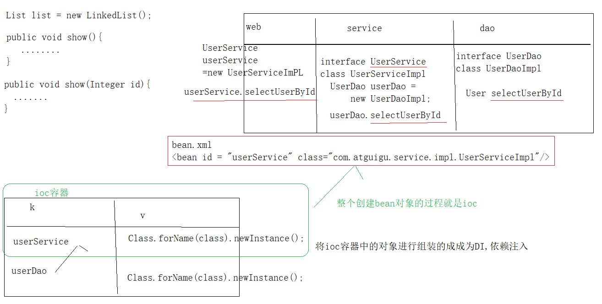

# Spring-01

# 1、Spring概述

①Spring是一个开源框架

②Spring为简化企业级开发而生，使用Spring开发可以将Bean对象，Dao组件对象，Service组件对象等交Spring容器来管理，这样使得很多复杂的代码在Spring中开发却变得非常的优雅和简洁，有效的降低代码的耦合度，极大的方便项目的后期维护、升级和扩展。

③Spring是一个IOC(DI)和AOP容器框架。

④Spring的优良特性

1. 侵入式：基于Spring开发的应用中的对象可以不依赖于Spring的API
2. 控制反转：IOC——Inversion of Control，指的是将对象的创建权交给Spring去创建。使用Spring之前，对象的创建都是由我们自己在代码中new创建。而使用Spring之后。对象的创建都是由给了Spring框架。
3. 依赖注入：DI——Dependency Injection，是指依赖的对象不需要手动调用setXX方法去设置，而是通过配置**赋值**。
4. 面向切面编程：Aspect Oriented Programming——AOP面向切面编程
5. 容器：Spring是一个容器，因为它包含并且管理应用对象的生命周期
6. 组件化：Spring实现了使用简单的组件配置组合成一个复杂的应用。在 Spring 中可以使用XML和Java注解组合这些对象。
7. 一站式：在IOC和AOP的基础上可以整合各种企业应用的开源框架和优秀的第三方类库（实际上Spring 自身也提供了表述层的SpringMVC和持久层的Spring JDBC）。

# 2、Spring的模块介绍

 

Spring框架分为四大模块：

Core核心模块。负责管理组件的Bean对象

- spring-beans-4.0.0.RELEASE.jar
- spring-context-4.0.0.RELEASE.jar
- spring-core-4.0.0.RELEASE.jar
- spring-expression-4.0.0.RELEASE.jar

面向切面编程

- spring-aop-4.0.0.RELEASE.jar
- spring-aspects-4.0.0.RELEASE.jar

数据库操作

- spring-jdbc-4.0.0.RELEASE.jar
- spring-orm-4.0.0.RELEASE.jar
- spring-oxm-4.0.0.RELEASE.jar
- spring-tx-4.0.0.RELEASE.jar
- spring-jms-4.0.0.RELEASE.jar

Web模块

- spring-web-4.0.0.RELEASE.jar
- spring-webmvc-4.0.0.RELEASE.jar
- spring-websocket-4.0.0.RELEASE.jar
- spring-webmvc-portlet-4.0.0.RELEASE.jar

# 4、IOC控制反转

## 4.1、什么是IOC

IOC	全称指的是 Inverse Of Control 控制反转。 

在使用Spring框架之前,我们的对象,都是通过代码我们自己去new创建对象实例.

在使用了Spring框架之后 , 对象的创建是由给spring容器来负责.

注意 : 如果自己去new对象 . 就不能使用Spring的功能.

## 4.2、什么是DI

DI 指的是Dependency	Injection 。是依赖注入的意思。

依赖是指需要依靠的对象.

注入是指给依靠的对象赋值.

DI依赖注入,就是给子对象赋值.

比如:

```java
public class BookService{
    public bookDao bookDao;
    public void setBookDao( BookDao bookDao ) {
        this.bookDao = bookDao;
        }
}
bookService.setBookDao(new BookDao());
```

而使用了Spring之后.我们对依赖对象的赋值只需要通过xml配置或者注解配置即可!!!!

画图解释IOC,DI:



## 4.3、第一个IOC示例程序 -- 通过id获取对象（重点）

实验1：通过IOC容器创建对象，并为属性赋值★

创建一个Java模块:

 

2 导入需要的jar包:

- junit_4.12.jar
- org.hamcrest.core_1.3.0.jar
- spring-beans-5.2.5.RELEASE.jar
- spring-context-5.2.5.RELEASE.jar
- spring-core-5.2.5.RELEASE.jar
- spring-expression-5.2.5.RELEASE.jar
- spring-jcl-5.2.5.RELEASE.jar

3 创建Person类:

```java
public class Person {
    private Integer id;
    private String name;
    private String phone;
    private Integer age;
}
```

4 在src源码目录下编写applicationContext.xml配置文件:

```xml
<?xml version="1.0" encoding="UTF-8"?>
<beans xmlns="http://www.springframework.org/schema/beans"
       xmlns:xsi="http://www.w3.org/2001/XMLSchema-instance"
       xsi:schemaLocation="http://www.springframework.org/schema/beans http://www.springframework.org/schema/beans/spring-beans.xsd">

    <!--
        bean标签表示配置一个Bean对象实例
        class属性表示对象的具体全类名
        id属性设置唯一标识
    -->
    <bean id="person" class="com.atguigu.pojo.Person">
        <!-- property标签是通过setXxx方法对属性赋值操作
            name 是属性名
            value是属性值
        -->
        <property name="id" value="1"/>
        <property name="name" value="小明"/>
        <property name="phone" value="18610541354"/>
        <property name="age" value="18"/>
    </bean>
</beans>
```

编写测试代码:

```java
@Test
public void test1(){
    //1:获取容器对象
    //ClassPathXmlApplicationContext:类路径下获取
    //ApplicationContext context = new ClassPathXmlApplicationContext("applicationContext.xml");
    ApplicationContext context = new FileSystemXmlApplicationContext("C:\\pro\\01-Spring-hello\\out\\production\\01-Spring-hello\\applicationContext.xml");
}
```

问题：

1. FileSystemXmlApplicationContext怎么用?

   答：跟使用JavaSE的相对路径一样,绝不推荐

   ApplicationContext applicationContext =
    new FileSystemXmlApplicationContext("src/applicationContext.xml");

2. Bean是在什么时候被创建的?

   答：在创建ApplicatiocnContext容器对象时一起创建Bean对象（默认）,项目启动扫描配置文件就会加载bean标签,创建bean组件(立即加载) lazy-init="true":对象是多例,每次getBean的时候创建一个新的bean(延迟加载)

3. 如果调用getBean多次，会创建几个?

   答：默认创建同一个,默认单例,scope="prototype",多例

**Spring中的bean是线程安全的吗?**

bean不是线程安全的,需要开发人员自己来管理bean  

TheadLocal

k:Thread.currentThread();   v:Object 

常见的错误：

指定的id不存在。找不到bean对象。

 

## 4.4、IOC示例程序 -- 通过类型获取对象（重点）

实验2：根据bean的类型从IOC容器中获取bean的实例★

 ```java
@Test
public void test1(){
    //1:获取容器对象
    ApplicationContext context = new ClassPathXmlApplicationContext("applicationContext.xml");
    //2:从容器中得到bean对象
    /**
   		* 通过具体的类型获取 <br/>
   		* 1 如果通过class类型找到唯一一个,就返回 <br/>
   		* 2 如果没有找到就报错<br/>
   		* 3 如果通过class类型找到多个,也报错<br/>
   */
    Person person = context.getBean("person", Person.class);
    System.err.println(perso);
}
 ```

applicationContext.xml配置文件:

 ```xml
<!--
        bean标签表示配置一个Bean对象实例
        class属性表示对象的具体全类名
        id属性设置唯一标识
    -->
<bean id="person" class="com.atguigu.pojo.Person">
    <!-- property标签是通过setXxx方法对属性赋值操作
            name 是属性名
            value是属性值
        -->
    <property name="id" value="1"/>
    <property name="name" value="小明"/>
    <property name="phone" value="18610541354"/>
    <property name="age" value="18"/>
</bean>
 ```

常见错误说明：

当在applicationContext.xml配置文件中。有多个同Person.class类型实现的时候。

 

## 4.5、IOC示例程序 -- 通过构造方法参数名注入值

实验3：通过构造器为bean的属性赋值

配置内容:

```xml
<bean id="person1" class="com.atguigu.pojo.Person">
    <!--
        constructor-arg是通过构造器参数进行赋值属性
            name 是参数名
            value是参数值
        -->
    <constructor-arg name="id" value="2"/>
    <constructor-arg name="name" value="小红"/>
    <constructor-arg name="phone" value="18610541354"/>
    <constructor-arg name="age" value="19"/>
</bean>
```

测试代码:

```java
@Test
public void test2(){
    ApplicationContext context =new ClassPathXmlApplicationContext("applicationContext.xml");
    Person person = context.getBean("person1", Person.class);
    System.err.println(person);
}
```

## 4.6、IOC示例程序 -- index属性指定构造器参数的顺序

实验4：通过index属性指定参数的位置

配置文件:

```xml
<bean id="person2" class="com.atguigu.pojo.Person">
    <!--
      public Person(Integer id, String name, Integer age,String phone)
      index 是参数索引
      value 是参数值
      type是参数类型,可省略
    -->
    <constructor-arg index="0" value="5" type="java.lang.Integer"/>
    <constructor-arg index="1" value="类型赋值" type="java.lang.String"/>
    <constructor-arg index="2" value="120" type="java.lang.Integer"/>
    <constructor-arg index="3" value="110" type="java.lang.String"/>
</bean>
```

测试代码:

```java
@Test
public void test3(){
    ApplicationContext context =new ClassPathXmlApplicationContext("applicationContext.xml");
    Person person = context.getBean("person2", Person.class);
    System.err.println(person);
}
```

## 4.7、IOC示例程序 -- 根据参数类型注入

实验5：根据参数类型注入

添加多个有参构造器:

```java
public Person(Integer id, String name, Integer age,String phone) {
    System.out.println("有参 Person 被创建了.....");
    this.id = id;
    this.name = name;
    this.phone = phone;
    this.age = age;
}
```

配置文件内容:

 ```xml
<bean id="person2" class="com.atguigu.pojo.Person">
    <!--
         public Person(Integer id, String name, Integer age,String phone)
         index 是参数索引
         value 是参数值
         type是参数类型
        -->
    <constructor-arg index="0" value="5" type="java.lang.Integer"/>
    <constructor-arg index="1" value="类型赋值" type="java.lang.String"/>
    <constructor-arg index="2" value="120" type="java.lang.Integer"/>
    <constructor-arg index="3" value="110" type="java.lang.String"/>
</bean>
 ```

测试代码:

```java
@Test
public void test3(){
    ApplicationContext context =new ClassPathXmlApplicationContext("applicationContext.xml");
    Person person = context.getBean("person2", Person.class);
    System.err.println(person);
}
```

## 4.8、IOC之 P名称空间

p名称空间,可以以非常简短的形式通过调用setXxx方法给属性赋值.

p名称空间:

 

实验6：通过p名称空间为bean赋值

配置信息如下:

```xml
<!--
        p名称空间的使用格式如下:
        p:属性名="值"
        -->
<bean class="com.atguigu.pojo.Person" id="person3"
      p:id="6" p:name="p名称空间赋值" p:age="18" p:phone="电话"/>
```

测试代码:

```java
@Test
public void test4(){
    ApplicationContext context =new ClassPathXmlApplicationContext("applicationContext.xml");
    Person person = context.getBean("person3", Person.class);
    System.err.println(person);
}
```

## 4.9、测试null值的使用

实验7：测试使用null值

配置信息:

```xml
<bean class="com.atguigu.pojo.Person" id="person4">
    <property name="id" value="7"/>
    <!-- 我希望赋于null空值 -->
    <property name="name">
        <!-- null标签表示null值 -->
        <null></null>
    </property>
</bean>
```

测试代码:

```java
@Test
public void test5(){
    ApplicationContext context =new ClassPathXmlApplicationContext("applicationContext.xml");
    Person person = context.getBean("person4", Person.class);
    System.err.println(person);
}
```

## 4.10、IOC之子对象的赋值测试（重点）

实验8：引用其他bean★

创建个新的工程。测试Spring的开发环境。此不重复。请参阅前面，环境搭建。

添加如下的类:

```java
public class Car {
    private String name;
    private String carNo;
}
```

```java
public class Person {
    private Integer id;
    private String name;
    private String phone;
    private Integer age;
    private Car car;
}
```

配置文件内容:

```xml
<bean id="car" class="com.atguigu.pojo.Car">
    <property name="name" value="托垃圾"/>
    <property name="carNo" value="京B66666"/>
</bean>

<bean id="person5" class="com.atguigu.pojo.Person">
    <property name="id" value="8"/>
    <property name="name" value="子对象赋值"/>
    <!-- ref表示引用 
	  value = "#{car}"  ==  ref ="car"
    -->
    <property name="car" ref="car"/>
</bean>
```

测试代码:

```java
@Test
public void test5(){
    ApplicationContext context =new ClassPathXmlApplicationContext("applicationContext.xml");
    Person person = context.getBean("person4", Person.class);
    System.err.println(person);
}
```

## 4.11、IOC之内部Bean的使用

内部Bean指的是在bean标签内定义的bean对象.它不能被 spring 容器直接获取. 

实验9：引用内部bean

配置信息:

```xml
<bean id="person6" class="com.atguigu.pojo.Person">
    <property name="id" value="9"/>
    <property name="name" value="内部bean"/>
    <property name="car">
        <bean class="com.atguigu.pojo.Car" id="car2">
            <property name="name" value="宝马"/>
            <property name="carNo" value="A111111"/>
        </bean>
    </property>
     <!-- 在spring中,如果要对属性使用级联属性赋值,需要先给car属性赋值 -->
    <property name ="car.name" value="bwm"/>
</bean>
```

注意：级联属性一定要先注入对象。再注入对象的属性

测试代码:

```java
@Test
public void test7(){
    ApplicationContext context =new ClassPathXmlApplicationContext("applicationContext.xml");
    Person person = context.getBean("person6", Person.class);
    //DI 出car2
    Car car = context.getBean("car2", Car.class);
    System.err.println(person);
    System.err.println(car);
}
```

常见错误：内部的Bean不能被外部使用

 

## 4.12、IOC之List属性的赋值

实验10：使用list子元素为List类型的属性赋值

类添加list集合属性:

```java
public class Person {
  private Integer id;
  private String name;
  private String phone;
  private Integer age;
  private Car car;
  private List<String> list;
}
```

配置文件内容:

```xml
<bean id="person7" class="com.atguigu.pojo.Person">
    <property name="list">
        <list>
            <value>item1</value>
            <value>item2</value>
            <value>item3</value>
            <value>item4</value>
        </list>
    </property>
</bean>
or
<bean id="person7" class="com.atguigu.pojo.Person">
    <property name="list">
        <array>
            <value>item1</value>
            <value>item2</value>
            <value>item3</value>
            <value>item4</value>
        </array>
    </property>
</bean>
```

测试的代码:

```java
@Test
public void test8(){
    ApplicationContext context =new ClassPathXmlApplicationContext("applicationContext.xml");
    Person person = context.getBean("person7", Person.class);
    System.err.println(person);
}
```

## 4.13、IOC之Map属性的赋值

实验11：使用map子元素为Map类型的属性赋值

给person添加map类型的属性:

```java
public class Person {
    private Integer id;
    private String name;
    private String phone;
    private Integer age;
    private Car car;
    private List<String> list;
    private Map<String,Object> map;
}
```

配置文件内容

```xml
<bean id="person8" class="com.atguigu.pojo.Person">
    <property name="id" value="11"></property>
    <property name="map">
        <!-- map标签表示赋值的类型的map集合 -->
         <!-- 表示每一个键值对 -->
        <map>
            <entry key="k1" value="v1"/>
            <entry key="k2" value="v2"/>
            <entry key="k3" value="v3"/>
            <entry key="k4" value="v4"/>
        </map>
    </property>
</bean>
or
<bean id="person8" class="com.atguigu.pojo.Person">
    <property name="id" value="11"></property>
    <property name="map">
        <props>
            <prop key="url">jdbc:mysql://localhost:3306/test</prop>
            <prop key="driverClassName">com.mysql.jdbc.Driver</prop>
            <prop key="username">root</prop>
            <prop key="password">root</prop>
        </props>
    </property>
</bean>
```

测试的代码:

```java
@Test
public void test9(){
    ApplicationContext context =new ClassPathXmlApplicationContext("applicationContext.xml");
    Person person = context.getBean("person8", Person.class);
    System.err.println(person.getMap());
}
```

## 4.14、IOC之Properties属性的赋值

实验12：使用prop子元素为Properties类型的属性赋值

给Person添加属性:

```java
public class Person {
    private Integer id;
    private String name;
    private String phone;
    private Integer age;
    private Car car;
    private List<String> list;
    private Map<String,Object> map;
    private Properties props;
}
```

配置文件内容:

```xml
<bean id="person9" class="com.atguigu.pojo.Person">
    <property name="id" value="11"></property>
    <property name="props">
        <map>
            <entry key="url" value="jdbc:mysql://localhost:3306/test"/>
            <entry key="driverClassName" value="com.mysql.jdbc.Driver"/>
            <entry key="username" value="root"/>
            <entry key="password" value="root"/>
        </map>
    </property>
</bean>
```

or

```xml
<bean id="person9" class="com.atguigu.pojo.Person">
    <property name="id" value="11"></property>
    <property name="props">
        <props>
            <prop key="url">jdbc:mysql://localhost:3306/test</prop>
            <prop key="driverClassName">com.mysql.jdbc.Driver</prop>
            <prop key="username">root</prop>
            <prop key="password">root</prop>
        </props>
    </property>
</bean>
```

 测试代码:

```java
@Test
public void test11(){
    ApplicationContext context =new ClassPathXmlApplicationContext("applicationContext.xml");
    Person person = context.getBean("person9", Person.class);
    System.err.println(person.getProps());
}
```

底层数据结构一致标签可以通用

## 4.15、IOC之util 名称空间

util名称空间，可以定义全局公共的集合信息,方便容器直接获取,或者是给属性赋值使用.

实验13：通过util名称空间创建集合类型的bean

添加util名称空间: 

```xml
头部约束
<?xml version="1.0" encoding="UTF-8"?>
<beans xmlns="http://www.springframework.org/schema/beans"
       xmlns:p="http://www.springframework.org/schema/p"
       xmlns:xsi="http://www.w3.org/2001/XMLSchema-instance"
       xmlns:util="http://www.springframework.org/schema/util"
       xsi:schemaLocation="http://www.springframework.org/schema/beans
        http://www.springframework.org/schema/beans/spring-beans.xsd
        http://www.springframework.org/schema/util
        http://www.springframework.org/schema/util/spring-util-4.0.xsd">
```

```xml
<!-- 可以从容器中直接获取到 也可以给list集合属性赋值使用 -->
<util:list id="list01">
    <value>01</value>
    <value>02</value>
    <value>03</value>
</util:list>


<!-- 使用 -->
<bean id="person10" class="com.atguigu.pojo.Person">
    <property name="list" ref="list01"/>
</bean>
```

测试代码:

```java
@Test
public void test12(){
    ApplicationContext context =new ClassPathXmlApplicationContext("applicationContext.xml");
    Person person = context.getBean("person10", Person.class);
    System.err.println(person.getList());
}
```

## 4.16、IOC之静态工厂方法创建Bean

```java
//当java中某些类不能我们创建对象的时候,我们需要创建一个工厂,在工厂中创建此对象
SqlSession sqlSession = sqlSessionFactory.openSession();
interfact SqlSession{}
class DefaultSqlSession implements SqlSession{}
public class SqlSessionFactory{
    public SqlSession openSession(){
        return new DefaultSqlSession();
    }
}
```

实验15：配置通过静态工厂方法创建的bean

工厂类:

```java
public class PersonFactory {
    public static Person getPerson(){
        return new Person(15,"静态工厂方法","123456789", 18);
    }
}
```

配置内容:

```xml
<!--    静态工厂方法使用class属性和factory-method属性组合使用
        class表示工厂的全类名
        factory-method属性静态方法名
		//Person person11 = PersonFactory.getPerson();
     -->
<bean id="person11" class="com.atguigu.pojo.PersonFactory" factory-method="getPerson">
</bean>
```

测试代码:

```java
@Test
public void test13(){
    ApplicationContext context =new ClassPathXmlApplicationContext("applicationContext.xml");
    Person person = context.getBean("person11", Person.class);
    System.err.println(person);
}
```

## 4.17、IOC之工厂实例方法创建Bean

实验16：配置通过实例工厂方法创建的bean

工厂实例代码:

```java
public class PersonFactory {
    public Person createPerson2(){
        return new Person(16,"工厂实例方法","123456789", 18);
    }
}
```

配置信息

```xml
<!-- 工厂实例方法创建Bean对象,需要由 bean + factory-bean + factory-method组合实现 -->
<bean id="personFactory" class="com.atguigu.pojo.PersonFactory"></bean>

<!--
      factory-bean   工厂实例对象
      factory-method  工厂方法名
	  PersonFactory person12 = new PersonFactory();
      Person person13 = person12.createPerson2();
    -->
<bean id="person13" factory-bean="personFactory" factory-method="createPerson2"/>
```

测试代码:

```java
@Test
public void test14(){
    ApplicationContext context =new ClassPathXmlApplicationContext("applicationContext.xml");
    Person person = context.getBean("person13", Person.class);
    System.err.println(person);
}
```

## 4.18、IOC之 接口方式创建对象

BeanFactory:SpringIoc最顶层的接口

FactoryBean:用于Spring整合第三方类库暴露出去的接口

实验17：配置FactoryBean接口创建Bean对象

1. 创建一个类去实现FactoryBean接口
2. 实现它的方法
3. 到Spring的配置文件中去配置

FactroryBean接口实现类:

```java
public class PersonFactoryBean implements FactoryBean<Person> {

    /**
     * 创建bean对象,将当前方法的返回值放入容器
     * @return
     * @throws Exception
     */
    @Override
    public Person getObject() throws Exception {
        return new Person(17,"FactoryBean接口方式","120",18);
    }

    /**
     * 获取bean的Class类型
     * @return
     */
    @Override
    public Class<?> getObjectType() {
        return Person.class;
    }

    /**
     * 是否为单例
     * @return
     */
    @Override
    public boolean isSingleton() {
        return false;
    }
}
```

配置文件:

```xml
 <bean id="person14" class="com.atguigu.factory.PersonFactoryBean"/>
```

测试的代码: 

```java
@Test
public void test15(){
    ApplicationContext context =new ClassPathXmlApplicationContext("applicationContext.xml");
    Person person = context.getBean("person14", Person.class);
    System.err.println(person);
}
```

面试:Spring整合第三方类库暴露的接口是什么?

FacotryBean

## 4.19、IOC之继承Bean配置

实验18：通过继承实现bean配置信息的重用

配置文件

```xml
<bean id="parent" class="com.atguigu.pojo.Person" abstract="true">
    <property name="id" value="100"/>
    <property name="name" value="父配置"/>
    <property name="age" value="100"/>
    <property name="phone" value="110"/>
</bean>

<bean id="person15" class="com.atguigu.pojo.Person" parent="parent">
    <property name="id" value="18"/>
    <property name="phone" value="1234567890"/>
</bean>
```

测试代码:

```java
@Test
public void test16(){
    ApplicationContext context =new ClassPathXmlApplicationContext("applicationContext.xml");
    Person person = context.getBean("person15", Person.class);
    System.err.println(person);
}
```

## 4.20、IOC之abstract抽象Bean

实验19：通过abstract属性创建一个模板bean

```xml
<!--
         abstract="true" 表示当前配置信息,只能用于继承,不能被实例化,默认为false
    -->
<bean id="person15" class="com.atguigu.pojo.Person" parent="parent" abstract="true">
    <property name="id" value="18"/>
    <property name="phone" value="1234567890"/>
</bean>
```

## 4.21、IOC之组件( Bean对象 )创建顺序

实验20：bean之间的依赖 depends-on 属性

在Spring容器中.Bean对象的创建顺序默认是他们在配置文件中,从上到下的顺序决定

```java
public class A {
    public A() {System.out.println("A 被创建了");}
}
public class B {
    public B() {System.out.println("B 被创建了");}
}
public class C {
    public C() {System.out.println("C 被创建了");}
}
```

配置信息:

```xml
<!--
  1 在Spring容器中.Bean对象的创建顺序默认是他们在配置文件中,从上到下的顺序决定.
  2 可以在bean的配置上,使用属性depends-on表示前置创建
-->
<bean class="com.atguigu.depends.A" id="a" depends-on="c,b"/>
<bean class="com.atguigu.depends.B" id="b" />
<bean class="com.atguigu.depends.C" id="c" />
```

测试代码:

```java
@Test
public void test18(){
    ApplicationContext context =new ClassPathXmlApplicationContext("applicationContextDepends.xml");
    C c = context.getBean("c", C.class);
    System.err.println(c);
}
```

## 4.22、IOC之Bean的单例和多例（重点）

实验21：测试bean的作用域，分别创建单实例和多实例的bean★

```xml
<!--
        scope:指定bean的范围
            singleton:单例
                默认
                会跟着Spring容器一起被创建:立即加载
                多次调用getBean()方法都会返回一个对象

            prototype:多例
                不会跟着Spring容器一起被创建:延迟加载
                每次调用getBean()会重新创建一个新的

   request:表示一次请求内多次调用getBean都返回同一个对象
            session:表示一个会话内多次调用getBean都返回同一个对象
            globalsession: 全局session
     -->
<bean id="person18" class="com.atguigu.pojo.Person" scope="prototype">
    <property name="id" value="20"/>
</bean>
```

测试的代码:

```java
@Test
public void test23(){
    ApplicationContext context =new ClassPathXmlApplicationContext("applicationContextDepends.xml");
    Person person = context.getBean("person18", Person.class);
    Person person1 = context.getBean("person18", Person.class);
    System.err.println(person==person1);
}
```

## 4.23、IOC之Bean的生命周期

实验22：创建带有生命周期方法的bean

给Person添加初始化方法和销毁方法:

```java
public class Person {
    private Integer id;
    private String name;
    private String phone;
    private Integer age;
    private Car car;

    /*初始化方法 */
    public void init(){
        System.out.println(" init() 这里可以做一些初始化操作 ");
    }
    /* 销毁方法 */
    public void destroy(){
        System.out.println(" destroy() 这里可以做一些销毁操作 ");
    }
}
```

配置内容:

```xml
<!--
        init-method:初始化方法
        destroy-method:容器销毁orbean销毁调用,ClassPathXmlApplicationContext 在close()方法调用
        scope="prototype":多例不会调用close(),原因是gc调用
     -->
<bean id="person20" class="com.atguigu.pojo.Person"
      init-method="init" destroy-method="destroy" scope="prototype">
    <property name="id" value="20"/>
</bean>
```

测试的代码:

```java
@Test
public void test25(){
    ClassPathXmlApplicationContext context =new ClassPathXmlApplicationContext("applicationContextDepends.xml");
    Person person = context.getBean("person20", Person.class);
    System.err.println(person);
    //容器销毁方法
    context.close();
}
```

 注意多例跟单例的区别

## 4.24、懒加载

通过构造方法输出查看是否是懒加载

```xml
<!--
        false:立即加载,容器启动时就立即进行实例化		
 -->
<bean id="user30" class="com.atguigu.pojo.User" lazy-init="true">
    <property name="id" value="26"/>
    <property name="name" value="小村"/>
</bean>
```

```java
@Test
public void last(){
    ClassPathXmlApplicationContext applicationContext = new ClassPathXmlApplicationContext("applicationContext2.xml");
}
```

# 5 注入

## 5.1、基于xml配置文件的自动注入

先创建Person类和Car类

```java
public class Person {
    private Integer id;
    private String name;
    private String phone;
    private Integer age;
    private Car car;
    private List<String> list;
    private Map<String,Object> map;
    private Properties props;
    
    public Person(Car car){
        this.car = car;
    }
}

public class Car {
    private String name;
    private String carNo;
}
```

配置文件内容:

```xml
<!--
        自动注入:按照某种指定的算法,自动给子对象赋值
        autowire:
            default  || no :不会自动赋值子对象
            constructor: 表示按照构造器参数超找并注入
				Person(Car car)
                1: 根据类型查找,找到就赋值 (唯一一个)
                2: 如果类型找到多个,那么就用参数名称去注入
                3: 如果类型有多个,名称没有匹配,则不会注入 null
            byName:    根据名称自动去容器中找这个bean,名称不一致则为null
            byType:    根据类型自动去容器中找这个bean,多个类型会报错 === getBean(Class class)
    -->
<bean id="person19" class="com.atguigu.pojo.Person" autowire="constructor">
    <property name="id" value="20"/>
</bean>
```

测试的代码:

```java
@Test
public void test24(){
    ApplicationContext context =new ClassPathXmlApplicationContext("applicationContextDepends.xml");
    Person person = context.getBean("person19", Person.class);
    System.err.println(person);
}
```

## 5.2、Bean的后置处理器之BeanPostProcessor

0. 在构造之后执行,在init前后执行

1. Bean的后置处理器可以给bean对象初始化方法前后调用,做一些操作,

2. 使用步骤如下:

   2.1 编写一个类去实现BeanPostProcessor接口

   2.2 实现接口的两个方法

   2.3 到Spring的配置文件中去配置后置处理器

实验23：测试bean的后置处理器

后置处理器代码 : 

```java
public class MyBeanPostProcessor implements BeanPostProcessor {

    /**
     * 在初始化方法(init-method)之前执行,做一些操作<br/>
     *
     * @param bean     当前初始化的对象实例
     * @param beanName 当前初始化对象的id值
     * @return 返回值是当前初始化对象(它会替代当前初始化对象)
     */
    @Override
    public Object postProcessBeforeInitialization(Object bean, String beanName) throws BeansException {
        System.out.println(" 初始化之前 obj => " + bean + " , id =>" + beanName);
        return bean;
    }

    /**
     * 在初始化方法之后执行,做一些操作<br/>
     *
     * @param bean     当前初始化的对象实例
     * @param beanName 当前初始化对象的id值
     */
    @Override
    public Object postProcessAfterInitialization(Object bean, String beanName) throws BeansException {
        System.out.println(" 初始化之后 obj => " + bean + " , id =>" + beanName);
        if ("person20".equals(beanName)) {
            Person person = (Person) bean;
            person.setCar(new Car("QQ卡丁车", "京西444444"));
        }
        return bean;
    }
}
```

 配置信息

```xml
<bean class="com.atguigu.processor.MyBeanPostProcessor"/>
```

测试代码:

```java
@Test
public void test26(){
    ApplicationContext context =new ClassPathXmlApplicationContext("applicationContextDepends.xml");
    Person person = context.getBean("person20", Person.class);
    System.err.println(person);
}
```

