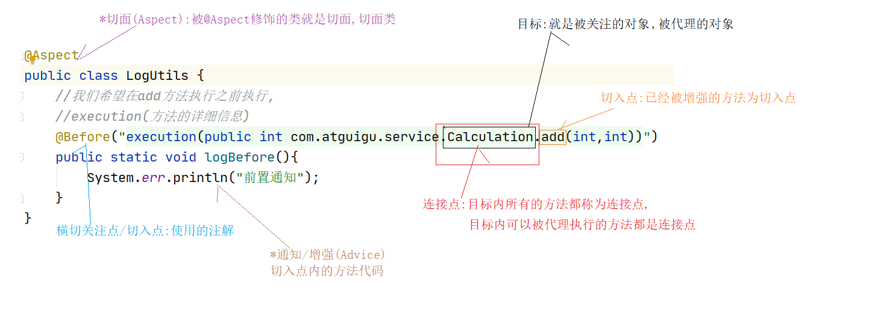

# Spring-03

# 9、AOP切面编程

## 9.4、使用Cglib代理

Cglib动态代理它不管目标对象**有没有实现接口**.它都可以实现代理技术.

Cglib动态代理是通过修改目标对象的字节码程序产生一个子类.生成一个代理对象实例(增强).

增强  extends 目标  

**Cglib产生的代理对象是目标对象(增强)的子类**

```java
jar:com.springsource.net.sf.cglib-2.2.0.jar
public class CglibProxyFactory {

    public static Object createCglibProxy(Object target){
        // 增强器 它负责产生一个Cglib代理对象实例
        Enhancer enhancer = new Enhancer();
        // 指定要修改哪个目标对象的字节码程序
        enhancer.setSuperclass(target.getClass());
        // 设置方法拦截器==跟InvocationHandler接口功能一样,是代理对象调用方法时就会执行的接口(专门对目标方法进行增强)
        enhancer.setCallback(new MethodInterceptor() {
            /**
             * 只要代理对象方法调用,就会执行intercept()方法
             * @param proxy         代理对象实例 <br/>
             * @param method        调用的方法的反射对象 <br/>
             * @param args          调用方法时传递的参数 <br/>
             * @param methodProxy   方法反射对象的代理对象<br/>
             * @return  返回值是代理对象调用方法的返回值
             * @throws Throwable
             */
            @Override
            public Object intercept(Object proxy, Method method, Object[] args, MethodProxy methodProxy) throws Throwable {
                LogUtils.logBefore(method.getName(), args);// 前置增强 (在目标方法前做的额外操作)
                Object result =  null;
                try {
                    /**
                     * method.invoke()通过反射调用方法<br/>
                     * 第一个参数是方法的实例对象 <br/>
                     * 第二个参数是方法调用时的参数 <br/>
                     * method.invoke() 返回值就是调用的方法的返回值<br/>
                     */
                        result = method.invoke( target , args );
                        System.out.println( " method.invoke() 方法的返回值 ===>>> " + result );
                        LogUtils.logAfterReturning(method.getName(), result); // 返回增强
                } catch (Exception e) {
                    LogUtils.logAfterThrowing(method.getName(), e);// 异常增强
                    throw  new RuntimeException(e);
                }
                return result;
            }
        });
        // 创建Cglib代理对象实例
        return enhancer.create();
    }

    public static void main(String[] args) {
        Calculator calculator = new Calculator();
        Calculator proxy = (Calculator) createCglibProxy(calculator);
        proxy.add(100, 100);
    }

}
```

优点：在没有接口的情况下，同样可以实现代理的效果。

缺点：同样需要自己编码实现代理全部过程。

但是为了更好的整合Spring框架使用。所以我们需要学习一下Spring 的AOP 功能。也就是学习Spring提供的代理功能。

面试:cglib(有无接口都可,但是目标不能是final修饰),jdk动态代理(必须有接口)

## 9.5、什么是AOP

AOP是面向切面编程。

全称：Aspect Oriented Programming

面向切面编程指的是：程序是运行期间，动态地将某段代码插入到原来方法代码的某些位置中。

利用aop可以对业务逻辑的各个部分进行隔离,从而使得业务逻辑各部分之间的耦合度降低,提高程序的可重用性,从而提高开发效率,减少冗余代码的编写,方便后期维护

## 9.6、使用Spring实现AOP简单切面编程

目标:使用spring方式实现动态代理

需要导哪些包:

- junit_4.12.jar
- org.hamcrest.core_1.3.0.jar
- spring-test-5.2.5.RELEASE.jar
- spring-aop-5.2.5.RELEASE.jar
- spring-aspects-5.2.5.RELEASE.jar
- com.springsource.org.aspectj.weaver-1.6.8.RELEASE.jar
- spring-beans-5.2.5.RELEASE.jar
- spring-context-5.2.5.RELEASE.jar
- spring-core-5.2.5.RELEASE.jar
- spring-expression-5.2.5.RELEASE.jar
- spring-jcl-5.2.5.RELEASE.jar

代码:

 

 

```java
public class LogUtils {

    public static void logBefore() {
        System.err.println("前置通知");
    }

    public static void logAfter() {
        System.out.println(" 后置通知");
    }

    public static void logAfterReturning() {
        System.err.println("最终通知");
    }

    public static void logAfterThrowing() {
        System.err.println("异常通知");
    }
}
```

Spring配置文件内容:

```xml
<?xml version="1.0" encoding="UTF-8"?>
<beans xmlns="http://www.springframework.org/schema/beans"
       xmlns:xsi="http://www.w3.org/2001/XMLSchema-instance"
       xmlns:context="http://www.springframework.org/schema/context"
       xmlns:aop="http://www.springframework.org/schema/aop"
       xsi:schemaLocation="http://www.springframework.org/schema/beans http://www.springframework.org/schema/beans/spring-beans.xsd http://www.springframework.org/schema/context https://www.springframework.org/schema/context/spring-context.xsd http://www.springframework.org/schema/aop https://www.springframework.org/schema/aop/spring-aop.xsd">

    <!--扫描注解包-->
    <context:component-scan base-package="com.atguigu"/>

    <!--切面生效,让@Aspect 生效-->
    <aop:aspectj-autoproxy/>
</beans>
```

测试代码:

```java
@ContextConfiguration(locations = {"classpath:applicationContext.xml"})
@RunWith(SpringJUnit4ClassRunner.class)
public class AopTest {

    @Autowired
    private Calculator calculator;

    @Test
    public void test() {
        int result = calculator.add(1, 2);
        System.out.println("结果是" + result);
    }
}
```

## 9.7、AOP编程的专业术语

### 目标(Target)

目标对象就是被关注的对象。

### *连接点(Joinpoint)

连接点指的是目标中可以被增强的方法,叫连接点。

### *切入点(pointcut)

切入点指的是目标中已经增强的方法，叫切入点。

### 横切关注点/切入点

增强的方法中,增强的位置

比如前置位置，后置位置，异常位置。和返回值位置。这些都叫横切关注点。

### *通知/增强(Advice)

通知就是增强的代码。比如前置增强的代码。后置增强的代码。异常增强代码。这些就叫通知

### *切面(Aspect)

包含有通知代码的类叫做切面

### 代理(Proxy)

增强之前是目标,增强之后是代理

### 图解AOP专业术语:



## 9.9、Spring切面中的代理对象

在Spring中，可以对有接口的对象和无接口的对象分别进行代理。在使用上有些细微的差别。

```xml
<?xml version="1.0" encoding="UTF-8"?>
<beans xmlns="http://www.springframework.org/schema/beans"
       xmlns:xsi="http://www.w3.org/2001/XMLSchema-instance"
       xmlns:context="http://www.springframework.org/schema/context"
       xmlns:aop="http://www.springframework.org/schema/aop"
       xsi:schemaLocation="http://www.springframework.org/schema/beans http://www.springframework.org/schema/beans/spring-beans.xsd http://www.springframework.org/schema/context https://www.springframework.org/schema/context/spring-context.xsd http://www.springframework.org/schema/aop https://www.springframework.org/schema/aop/spring-aop.xsd">

    <!--扫描注解包-->
    <context:component-scan base-package="com.atguigu"/>

    <!--
        aop:aspectj-autoproxy:面向切面必备标签
        让@Aspect 生效
        expose-proxy:让代理类暴露出来
        proxy-target-class:增强的类型
        true: 使用cglib代理
        false: 根据有无接口框架自动选择是cglib,还是jdk代理
    -->
    <aop:aspectj-autoproxy/>
</beans>
```

1:有接口的时候选择的是jdk动态代理


## 9.10、Spring的切入点表达式

1. @PointCut切入点表达式语法格式是：

**execution(public int com.atguigu.pojo.Calculator.add(int,int))**
**execution(访问权限 返回值类型 方法全限定名(参数类型列表))**

2. 限定符：

*表示任意的意思：

1) 匹配某全类名下，任意或多个方法。

**execution(public int com.atguigu.pojo.Calculator.*(int,int))**

以上的星表示方法名任意

2) 在Spring中只有public权限能拦截到，访问权限可以省略（访问权限不能写*）。

**execution( int com.atguigu.pojo.Calculator.add(int,int))**

3) 匹配任意类型的返回值，可以使用 * 表示

 **execution(public * com.atguigu.pojo.Calculator.add(int,int))**

以上的星表示返回值类型任意.

4) 匹配任意一层子包。

**execution(public int com.atguigu.*.Calculator.add(int,int))**

以上的星表示

包必须是com.atguigu.子包

而且只能是一层的子包

5) 任意类型参数

**execution(public int com.atguigu.pojo.Calculator.add(int,*))**

以上的星表示第二个参数类型任意.

..：可以匹配多层路径，或任意多个任意类型参数

1) 任意层级的包

**execution(public int com.atguigu..Calculator.add(int,int))**

以上的..表示 包名必须是 com.atguigu.所有子包都匹配

2) 任意个任意类型的参数

**execution(public int com.atguigu.pojo.Calculator.add(..))**

以上的..表示参数是任意个数,参数是任意的参数

模糊匹配：(绝不使用)

// 表示任意返回值，任意方法全限定符，任意参数

**execution(* *(..))**

// 表示任意返回值，任意包名+任意方法名，任意参数

**execution(* *.*(..))**

切入点表达式连接：&& 、|| 

&& 表示需要同时满足两个表达式

```
@Before(value = "execution(public int com.atguigu.pojo.Calculator.add(int,int)) && execution(public int com.atguigu.pojo.Calculator.div(int,int))")
```

|| 表示两个条件只需要满足一个，就会被匹配到

```
@Before(value = "execution(public int com.atguigu.pojo.Calculator.add(int,int)) || execution(public int com.atguigu.pojo.Calculator.div(int,int))")
```

```
推荐:	* com.atguigu..service.*.*(..)
```

## 9.11、Spring通知的执行顺序

Spring AOP编程中提供的常用通知有四种 , 分别是 : 前置通知 , 后置通知 , 返回通知 , 异常通知

Spring通知的执行顺序是:

正常情况:

前置=====>>>方法=====>>后置=====>>返回

异常情况:

前置=====>>>方法=====>>后置======>>异常

```java
@Component
@Aspect  //表示切面类
public class LogUtils {

    @Before(value = "execution(* com.atguigu.pojo.Calculator.*(..))")
    public static void logBefore() {
        System.out.println("前置通知  Before");
    }

    @After(value = "execution(* com.atguigu.pojo.Calculator.*(..))")
    public static void logAfter() {
        System.err.println("后置通知  After");
    }

    @AfterReturning(value = "execution(* com.atguigu.pojo.Calculator.*(..))")
    public static void logAfterReturning() {
        System.err.println("返回通知  AfterReturning");
    }

    @AfterThrowing(value = "execution(* com.atguigu.pojo.Calculator.*(..))")
    public static void logAfterThrowing() {
        System.err.println("异常通知  AfterThrowing");
    }
}

```

## 9.9、获取连接点信息

JoinPoint 是连接点的信息。

只需要在通知方法的参数中，加入一个JoinPoint参数。就可以获取到拦截方法的信息。

注意：是org.aspectj.lang.JoinPoint这个接口。

```java
@Component
@Aspect  //表示当前类是一个切面类
public class LogUtils {

    /**
     * 方法级别 返回值 全路径.类名.方法(参数1类型,参数2类型)
     */
    //前置
    @Before(value = "execution(* com.atguigu.pojo.Calculator.*(..))")
    public static void logBefore(JoinPoint joinPoint) {
        System.out.println("前置通知  Before 执行方法:"+joinPoint.getSignature().getName()+"\t 参数:"+Arrays.asList(joinPoint.getArgs()));
    }

    //后置
    @After(value = "execution(* com.atguigu.pojo.Calculator.*(..))")
    public static void logAfter(JoinPoint joinPoint) {
        System.err.println("后置通知  After  执行方法:"+joinPoint.getSignature().getName()+"\t 参数:"+Arrays.asList(joinPoint.getArgs()));
    }

    //返回通知
    @AfterReturning(value = "execution(* com.atguigu.pojo.Calculator.*(..))")
    public static void logAfterReturning(JoinPoint joinPoint) {
        System.err.println("返回通知  AfterReturning 执行方法:"+joinPoint.getSignature().getName()+"\t 参数:"+Arrays.asList(joinPoint.getArgs()));
    }

    //异常
    @AfterThrowing(value = "execution(* com.atguigu.pojo.Calculator.*(..))")
    public static void logAfterThrowing(JoinPoint joinPoint) {
        System.err.println("异常通知  AfterThrowing 执行方法:"+joinPoint.getSignature().getName()+"\t 参数:"+Arrays.asList(joinPoint.getArgs()));
    }

}
```

## 9.10、获取拦截方法的返回值和抛的异常信息

获取方法返回的值分为两个步骤：

1. 在返回值通知的方法中，追加一个参数 Object result

2. 然后在@AfterReturning注解中添加参数returning="参数名"

```java
/**
 * @AfterReturning 返回通知 <br/>
 *  1 在返回通知上追加一个参数Object result <br/>
 *  2 在返回通知注解@AfterReturning中使用属性returning = "result"告诉Spring框架,返回值交给哪个参数去接收 <br/>
 */
@AfterReturning(value = "execution(* com.atguigu.pojo.Calculator.*(int,int))", returning = "result")
public static void logAfterReturning(JoinPoint joinPoint, Object result) {
    System.out.println("前置通知 执行方法是 " + joinPoint.getSignature().getName()
                       + "\t 参数是"
                       + Arrays.asList(joinPoint.getArgs())
                       + "结果是 " + result);
}
```

获取方法抛出的异常分为两个步骤：

1、在异常通知的方法中，追加一个参数Exception exception

2、然后在@AfterThrowing 注解中添加参数 throwing="参数名"

```java
/**
 *@AfterThrowing 是异常通知 <br>
 *  1 在异常通知方法上追加一个参数Exception e 用来接收抛出的异常<br/>
 *  2 在异常通知注解@AfterThrowing上使用属性throwing = "e",告诉Spring抛出的异常用哪个参数来接收<br/>
 */
@AfterThrowing(value = "execution(* com.atguigu.pojo.Calculator.*(int,int))",throwing = "e")
public static void logAfterThrowing(Throwable e) {
    System.out.println(" 异常通知 ,异常类型 "+e);
}
```

## 9.11、Spring的环绕通知

1. 环绕通知使用@Around注解。

2. 环绕通知如果和其他通知同时执行。环绕通知会优先于其他通知之前执行。

3. 环绕通知一定要有返回值（环绕如果没有返回值。后面的其他通知就无法接收到目标方法执行的结果）。

4. 在环绕通知中。如果拦截异常。一定要往外抛。否则其他的异常通知是无法捕获到异常的。

```java
/**
 * 环绕通知 <br/>
 *  1 使用注解@Around表示环绕通知<br/>
 *  2 环绕通知需要添加一个ProceedingJoinPoint proceedingJoinPoint参数.它可以用来执行目标方法<br/>
 *  3 环绕通知一定要把目标方法的返回值返回.否则普通的返回通知收不到结果<br/>
 *  4 环绕通知捕获到异常,一定要往外抛.否则普通的异常通知不执行<br/>
 *  5 环绕通知会比普通通知优先执行<br/>
 */
@Around(value = "execution(public int com.atguigu.pojo.Calculator.*(..))")
public static Object around(ProceedingJoinPoint proceedingJoinPoint){
    Object proceed = null;
    try {
        try {
            System.err.println("环绕前置");
            //获取参数
            Object[] args = proceedingJoinPoint.getArgs();
            if(args.length>0){
                 //执行连接点的方法
            	proceed = proceedingJoinPoint.proceed(args);
            }
            proceed = proceedingJoinPoint.proceed();
        }finally {
            System.err.println("环绕后置");
        }
    } catch (Throwable throwable) {
        System.err.println("环绕异常");
        throw new RuntimeException(throwable);
    }
    System.err.println("环绕返回");
    return proceed;
}
```

## 9.12、切入点表达式的复用

 

## 9.13、多个切面的执行顺序

当我们有多个切面，多个通知的时候：

1. 通知的执行顺序默认是由切面类的字母先后顺序决定。
2. 在切面类上使用@Order注解决定通知执行的顺序（值越小，越先执行）

 

 

## 9.14、如何基于xml配置aop程序

```xml
<?xml version="1.0" encoding="UTF-8"?>
<beans xmlns="http://www.springframework.org/schema/beans"
       xmlns:xsi="http://www.w3.org/2001/XMLSchema-instance" xmlns:aop="http://www.springframework.org/schema/aop"
       xsi:schemaLocation="http://www.springframework.org/schema/beans
       http://www.springframework.org/schema/beans/spring-beans.xsd http://www.springframework.org/schema/aop https://www.springframework.org/schema/aop/spring-aop.xsd">

    <!-- 切面类 -->
    <bean id="logUtils" class="com.atguigu.utils.LogUtils"/>

    <!-- 目标 -->
    <bean id="calculator" class="com.atguigu.pojo.Calculator"/>

    <!-- 配置aop -->
    <aop:config>
        <!-- 切面类 -->
        <aop:aspect ref="logUtils">
            <!-- 配置切入点表达式 -->
            <aop:pointcut id="point" expression="execution(* com.atguigu.pojo.Calculator.*(..))"/>
            <!-- 前置通知 -->
            <aop:before method="logBefore" pointcut-ref="point"/>
            <!-- 后置通知 -->
           <aop:after method="logAfter" pointcut-ref="point"/>
            <!-- 异常 -->
            <aop:after-throwing method="logAfterThrowing" pointcut-ref="point" throwing="e"/>
            <!-- 返回  -->
           <aop:after-returning method="logAfterReturning" pointcut-ref="point" returning="result"/>
            <!-- 环绕 -->
            <aop:around method="logAround" pointcut-ref="point"/>
        </aop:aspect>
    </aop:config>
</beans>
```

## 9.15   纯注解AOP

```java
@Configuration
@ComponentScan(basePackages = {"com.atguigu"})
/**
 *  proxyTargetClass = true:cglib
 *  false:根据有无接口判断
 */
@EnableAspectJAutoProxy(proxyTargetClass = true)
public class AopConfig {
}
```

# 10、Spring之数据访问

## 10.1、Spring数据访问工程环境搭建

- druid-1.1.9.jar
- junit_4.12.jar
- mysql-connector-java-5.1.37-bin.jar
- org.hamcrest.core_1.3.0.jar
- spring-aop-5.2.5.RELEASE.jar
- spring-beans-5.2.5.RELEASE.jar
- spring-context-5.2.5.RELEASE.jar
- spring-core-5.2.5.RELEASE.jar
- spring-expression-5.2.5.RELEASE.jar
- spring-jcl-5.2.5.RELEASE.jar
- spring-jdbc-5.2.5.RELEASE.jar
- spring-orm-5.2.5.RELEASE.jar
- spring-test-5.2.5.RELEASE.jar
- spring-tx-5.2.5.RELEASE.jar

## 10.2、Spring之JdbcTemplate使用

在Spring中提供了对jdbc的封装类叫JdbcTemplate。

它可以很方便的帮我们执行sql语句，操作数据库。

先准备单表的数据库数据

```sql
CREATE DATABASE IF NOT EXISTS jdbctemplate DEFAULT CHARSET utf8;

use jdbctemplate;
CREATE TABLE `employee` (
`id` int(11) primary key AUTO_INCREMENT,
`name` varchar(100) DEFAULT NULL,
`salary` decimal(11,2) DEFAULT NULL
);

insert into `employee`(`id`,`name`,`salary`) 
values (1,'李三',5000.23),(2,'李四',4234.77),(3,'王五',9034.51),
(4,'赵六',8054.33),(5,'孔七',6039.11),(6,'曹八',7714.11);

select * from employee;
```

jdbc.properties

```properties
user=root
password=root
url=jdbc:mysql://localhost:3306/jdbctemplate?characterEncoding=UTF-8
driverClassName=com.mysql.jdbc.Driver
initialSize=5
maxActive=10
```

JdbcTemplate的使用需要在applicationContext.xml中进行配置

```xml
<?xml version="1.0" encoding="UTF-8"?>
<beans xmlns="http://www.springframework.org/schema/beans"
       xmlns:xsi="http://www.w3.org/2001/XMLSchema-instance"
       xmlns:context="http://www.springframework.org/schema/context"
       xsi:schemaLocation="http://www.springframework.org/schema/beans http://www.springframework.org/schema/beans/spring-beans.xsd http://www.springframework.org/schema/context https://www.springframework.org/schema/context/spring-context.xsd">

    <!-- 加载配置文件 -->
    <context:property-placeholder location="classpath:jdbc.properties"/>

    <!-- 扫描注解 -->
    <context:component-scan base-package="com.atguigu"/>

    <!-- 连接池 -->
    <bean class="com.alibaba.druid.pool.DruidDataSource" id="dataSource">
        <property name="username" value="${user}"/>
        <property name="password" value="${password}"/>
        <property name="url" value="${url}"/>
        <property name="driverClassName" value="${driverClassName}"/>
        <property name="initialSize" value="${initialSize}"/>
        <property name="maxActive" value="${maxActive}"/>
    </bean>

    <!-- 配置Spring提供的JdbcTemplate工具类执行sql语句 -->
    <bean class="org.springframework.jdbc.core.JdbcTemplate" id="jdbcTemplate">
        <property name="dataSource" ref="dataSource" />
    </bean>

</beans>
```

### 实验2：将id=5的记录的salary字段更新为1300.00

```java
@Test
public void test2() {
    String sql = "update employee set salary = ? where id = ?";
    int update = jdbcTemplate.update(sql, new BigDecimal(1300), 5);
    System.err.println(update);
}
```

### 实验3：批量插入

```java
@Test
public void test3() {
    //一个sql语句的,它的参数是一维数组
    String sql = "insert into employee(`name`,`salary`) values(?,?)";
    /**
         * batchUpdate批量的执行insert,update,delete语句 <br/>
         *  第一个参数是 sql 语句 <br/>
         *  第二个参数是 所有sql语句的占位符的值<br/>
         */
    List<Object[]> batchArgs = new ArrayList<>();//有几个一维数组,就插入几条记录
    batchArgs.add(new Object[]{"111111",new BigDecimal(10000)});
    batchArgs.add(new Object[]{"222222",new BigDecimal(20000)});
    batchArgs.add(new Object[]{"333333",new BigDecimal(30000)});
    batchArgs.add(new Object[]{"444444",new BigDecimal(40000)});
    int[] result = jdbcTemplate.batchUpdate(sql, batchArgs);
    System.err.println(result);
}
```

### 实验4：查询id=5的数据库记录，封装为一个Java对象返回

```java
public class Employee {
    private  Integer id;
    private String name;
    private BigDecimal salary;
}
```

```java
@Test
    public void test3() {
        String sql = "select `id`,`name`,`salary` from employee where id = ?";
        /**
         *  查询使用queryForObject()方法查询返回一条记录 <br/>
         *  第一个参数是sql语句<br/>
         *  第二个参数是 RowMapper接口,负责把查询结果集中每一行记录转换为JavaBean对象<br/>
         *  第三个参数是占位符的值<br/>
         *  注意:如果没查询到数据抛异常
         *  BeanPropertyRowMapper它负责将结果集中的列和属性做对应操作(将一行记录转换为JavaBean)
         */
        Employee employee = jdbcTemplate.queryForObject(sql,
                new BeanPropertyRowMapper<Employee>(Employee.class), 25);
        System.err.println(employee);
    }
```

### 实验5：查询salary>4000的数据库记录，封装为List集合返回

```java
@Test
public void test4() {
    String sql = "select `id`,`name`,`salary` from employee where salary > ?";
    List<Employee> employeeList = jdbcTemplate.query(sql,
                                                     new BeanPropertyRowMapper<Employee>(Employee.class), new BigDecimal(4000));
    employeeList.forEach(employee -> {
        System.err.println(employee);
    });
}
```

JdbcTemplate小结 :

 *   JdbcTemplate.update() 执行insert,delete,update的sql语句<br/>
 *   JdbcTemplate.queryForObject() 查询返回一行数据的方法<br/>
 *   JdbcTemplate.query() 查询多行数据<br/>
 *   JdbcTemplate中是使用BeanPropertyRowMapper将每笔记录转换为JavaBean<br/>

### 实验6：查询最大salary

```java
@Test
public void test5() {
    String sql = "select max(salary) from employee";
    BigDecimal max = jdbcTemplate.queryForObject(sql, BigDecimal.class);
    System.out.println(max);
}
```

### 实验7：使用带有具名参数的SQL语句插入一条员工记录，并以Map形式传入参数值

配置内容

```xml
<!-- 配置可执行具名参数sql的工具类 -->
<bean class="org.springframework.jdbc.core.namedparam.NamedParameterJdbcTemplate">
    <constructor-arg index="0" ref="dataSource" />
</bean>
```

测试代码:

  @Autowired
  NamedParameterJdbcTemplate namedParameterJdbcTemplate;

```java
@Autowired
NamedParameterJdbcTemplate namedParameterJdbcTemplate;

@Test
public void test6(){
    // 具名参数的SQL
    String sql ="insert into employee(`name`,`salary`) values( :name , :salary )";
    Map<String,Object> paramMap = new HashMap<>();
    // map的key要和参数名相同
    paramMap.put("name","具名参数");
    paramMap.put("salary",new BigDecimal("9.9"));
    int update = namedParameterJdbcTemplate.update(sql, paramMap);
    System.err.println(update);
}
```

### 实验8：重复实验7，以SqlParameterSource形式传入参数值

```java
@Test
public void test8() {
    /**
         *  具名参数sql中的占位符格式如下 ==>> :参数名
         */
    String sql = "insert into employee(`name`,`salary`) values( :name , :salary )";// 具名参数的SQL
    Employee employee = new Employee(null, "SqlParameterSource", new BigDecimal(10));
    /**
         * BeanPropertySqlParameterSource
         */
    int update = namedParameterJdbcTemplate.update(sql, new BeanPropertySqlParameterSource(employee));
    System.err.println(update);
}
```

### 实验9：创建Dao，自动装配JdbcTemplate对象

```java
@Repository
public class EmployeeDao {

    @Autowired
    JdbcTemplate jdbcTemplate;

    public Employee selectEmployeeById(Integer id){
        String sql = "select `id`,`name`,`salary` from employee where id = ?";
        return jdbcTemplate.queryForObject(sql,new BeanPropertyRowMapper<Employee>(Employee.class),id);
    }

}
```

测试代码:

```java
@Autowired
EmployeeDao employeeDao;

//   实验9：创建Dao，自动装配JdbcTemplate对象
@Test
public void test9() {
    System.err.println(employeeDao.selectEmployeeById(1));
}
```

### 实验10：通过继承JdbcDaoSupport创建JdbcTemplate的Dao

```java
@Repository
public class EmployeeDao  extends JdbcDaoSupport {

    @Autowired
    public void setJdbcTemplate(DataSource dataSource){
        setDataSource(dataSource);
    }

    public Employee selectEmployeeById(Integer id){
        String sql = "select `id`,`name`,`salary` from employee where id = ?";
        return getJdbcTemplate().queryForObject(sql,new BeanPropertyRowMapper<Employee>(Employee.class),id);
    }
}
```

## 注解形式配置bean

```java
@ContextConfiguration
@ComponentScan(basePackages = {"com.atguigu"})
@PropertySource(value = {"classpath:jdbc.properties"}) //加载外置配置文件
public class SpringConfig {

    //@Value:读取配置文件的key,得到value并给变量赋值
    @Value("${user}")
    private String username;
    @Value("${password}")
    private String password;
    @Value("${url}")
    private String url;
    @Value("${driverClassName}")
    private String driverClassName;
    @Value("${initialSize}")
    private Integer initialSize;
    @Value("${maxActive}")
    private Integer maxActive;

    //配置连接池
    @Bean
    public DataSource dataSource() {
        DruidDataSource dataSource = new DruidDataSource();
        dataSource.setUsername(username);
        dataSource.setPassword(password);
        dataSource.setUrl(url);
        dataSource.setDriverClassName(driverClassName);
        dataSource.setInitialSize(initialSize);
        dataSource.setMaxActive(maxActive);
        return dataSource;
    }

    @Bean
    public JdbcTemplate jdbcTemplate(DataSource dataSource) {
        JdbcTemplate jdbcTemplate = new JdbcTemplate();
        jdbcTemplate.setDataSource(dataSource);
        return jdbcTemplate;
    }

    @Bean
    public NamedParameterJdbcTemplate namedParameterJdbcTemplate(DataSource dataSource) {
        return new NamedParameterJdbcTemplate(dataSource);
    }

}

```

