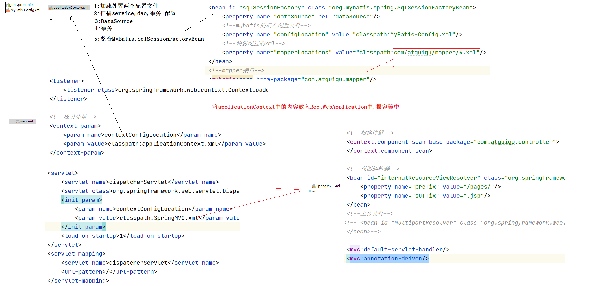
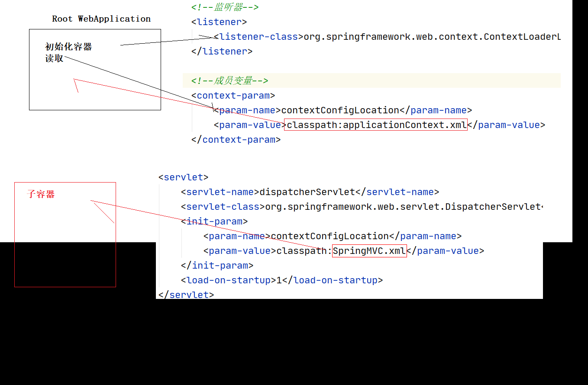

# 04-SpringMVC

# 14、异常处理

## 14.1、使用@ExceptionHandler注解处理异常

@ExceptionHandler注解标识的方法叫异常处理方法

它可以标识多个方法,异常类越精确,越优先调用.

```java
@Controller
public class LastController {

    /**
     * * @ExceptionHandler注解的方法会在Controller抛出异常时,自动调用<br/> 
     * *  1 处理异常 <br/> 
     * *  2 跳转到更友好的错误提示页面 (目标方法的跳转无效,使用异常方法的跳转) <br/> 
     */
    @ExceptionHandler
    public String exceptionHandler1(Exception exc) {
        System.out.println("exceptionHandler1 异常信息是: " + exc);
        return "error1";
    }

    /**
     *  * @ExceptionHandler注解的方法会在Controller抛出异常时,自动调用<br/> 
     * *  1 处理异常 <br/> 
     * *  2 跳转到更友好的错误提示页面 (目标方法的跳转无效,使用异常方法的跳转) <br/> 
     */
    @ExceptionHandler
    public String exceptionHandler2(RuntimeException exc) {
        System.out.println("exceptionHandler2 异常信息是: " + exc);
        return "error1";
    }

    /**
     *  * @ExceptionHandler注解的方法会在Controller抛出异常时,自动调用<br/> 
     * *  1 处理异常 <br/> 
     * *  2 跳转到更友好的错误提示页面 (目标方法的跳转无效,使用异常方法的跳转) <br/> 
     */
    @ExceptionHandler
    public String exceptionHandler3(ArithmeticException exc) {
        System.out.println("exceptionHandler3 异常信息是: " + exc);
        return "error1";
    }

    @RequestMapping(value = "/hello")
    public String hello() {
        System.out.println(" 这是hello方法() ");
        int i = 12 / 0;
        return "redirect:/index.jsp";
    }

}
```

## 14.2、使用@ControllerAdvice注解处理异常

@ControllerAdvice注解标识在放在bean上.

它可以让当前Controller中所有的异常处理方法改为全局异常处理方法

当有局部异常处理方法和全局异常处理方法同时存在时.他们的优先顺序是 :  局部优先 --->>> 精确优先 

```java
@ControllerAdvice     
//在controller之后执行,拦截异常,在全局异常处理器中,也有多个异常处理器
//也会根据异常类的关系进行匹配,越精确的越先执行
@Component
public class GlobalException {

    @ExceptionHandler
    public String ex2(RuntimeException e){
        System.err.println("ex2:"+e);
        //走视图解析器,/pages/error1.jsp
        return "error1";
    }

    @ExceptionHandler
    public String ex3(ArithmeticException e){
        System.err.println("ex3:"+e);
        //走视图解析器,/pages/error1.jsp
        return "error1";
    }

    @ExceptionHandler
    public String ex1(Exception e){
        System.err.println("GlobalException  ex1:"+e);
        return "error1";
    }
}

```

## 14.3、异常处理优先顺序

在局部异常处理和全局异常处理同时存在的时候，优先顺序是：

1、局部优先	---->>>>	2、精确优化

## 14.4、使用SimpleMappingExceptionResolver类映射异常跳转

```xml
<!--异常配置-->
<bean id="exceptionResolver" class="org.springframework.web.servlet.handler.SimpleMappingExceptionResolver">
    <property name="exceptionMappings">
        <props>
            <!-- 每一个prop标签表示一种类型的异常.和对应的一个错误跳转路径
                     key是具体的异常全类名
                     error1 , error2 , error3 是视图名( 跳转的路径 )
                -->
            <prop key="java.lang.Exception">error1</prop>
            <prop key="java.lang.RuntimeException">error2</prop>
            <prop key="java.lang.ArithmeticException">error3</prop>
        </props>
    </property>
</bean>
```

# 15、使用@ResponseBody将返回的数据转成json ( 重点 )

json的使用无法就两种情况,

1. 返回json数据
2.  接收json数据,转换为Java对象( )而我们在使用json的时候,一般大多是和Ajax请求一起使用.)

## 15.1、使用的步骤如下：

1、导入json相关的包到web工程中

- jackson-annotations-2.1.5.jar
- jackson-core-2.1.5.jar
- jackson-databind-2.1.5.jar

2、编写一个请求的方法接收请求，并返回数据对象

3、在方法上添加注解@ResponseBody自动将返回值json化

## 15.2、Controller中的代码：

```java
@RestController == @Controller + @ResponseBody
@Controller
public class JsonController {

    @RequestMapping("/queryPersonById")
    public @ResponseBody
        Person queryPersonById(){
        System.err.println("queryPersonById");
        return new Person(100,"思密达");
    }

    @ResponseBody
    @RequestMapping(value = "/queryPersons")
    public List<Person> queryPersons() {
        System.out.println(" queryPersons() 方法调用了 ");
        List<Person> personList = new ArrayList<>();
        personList.add(new Person(1, "a"));
        personList.add(new Person(2, "b"));
        personList.add(new Person(3, "c"));
        personList.add(new Person(4, "d"));
        return personList;
    }

    @ResponseBody
    @RequestMapping(value = "/queryForMap")
    public Map<String, Object> queryForMap() {
        System.out.println(" queryForMap() 方法调用了 ");
        Map<String, Object> map = new HashMap<>();
        map.put("key1", "呵呵");
        map.put("key1", "嘻嘻");
        map.put("key1", true);
        map.put("key1", 100);
        map.put("key1", new Person(99, "哔哔"));
        return map;
    }

}
```

前端:

```javascript
<%@ page contentType="text/html;charset=UTF-8" language="java" %>
<html>
  <head>
    <script type="text/javascript" src="${pageContext.request.contextPath}/script/jquery-1.7.2.js"></script>
    <title>$Title$</title>
    <script>
      $(function () {
        $(".personJson").click(function () {
          var personJson = {"id":1,"name":"mm"};
            //ajax
            $.ajax({
              //路径
              url:"${pageContext.request.contextPath}/savepersonJson",
              type:"POST",
              //响应回来的数据格式
              dataType:"JSON",
              //将json对象转换成Json串
              data:JSON.stringify(personJson),
              //响应json 赋值给 obj
              success:function (obj) {
                console.log(obj)  //System.out.println
              },
              //设置请求类型
              contentType:"application/json"
            })
        });
        $(".personJsons").click(function () {
          var personJsons = [{"id":1,"name":"mm"},{"id":2,"name":"niuniu"},{"id":3,"name":"huihui"}];
          $.ajax({
            url:"${pageContext.request.contextPath}/savepersonJsons",  //路径
            dataType: "JSON", //响应json
            type:"POST",    //请求方式
            data:JSON.stringify(personJsons),  //数据 转换成 json 串
            contentType: "application/json",  //请求 类型
            success:function (obj) {  //回调
              console.log(obj);
            }
          })
        })

      })
    </script>
  </head>
  <body>
  <a class="personJson" href="#">发送一个personJson数据</a>
  <a class="personJsons" href="#">发送一个personJsons数据</a>

  </body>
</html>

```


# 16、三大框架ssm（Spring+SpringMVC+Mybatis）的整合

1:Spring如何整合第三方类库

2:复习Spring+SpringMVC整合===Root WebApplicationContext

1. 先使用mybatis逆向工程生成mybatis代码

2. 整合Spring+Mybatis
3. 使用Spring给service方法添加事务
4. 拷贝SpringMVC的jar包
5. 添加SpringMVC的配置springmvc.xml
6.  整合Spring到web中

## 16.1、测试数据库

```sql
CREATE DATABASE IF NOT EXISTS ssm DEFAULT CHARSET utf8;

use ssm; 

##创建图书表
create table t_book(
    	`id` int(11) primary key auto_increment, 	## 主键
    	`name` varchar(50) not null,				## 书名 
    	`author` varchar(50) not null,				## 作者
    	`price` decimal(11,2) not null,				## 价格
    	`sales` int(11) not null,					## 销量
    	`stock` int(11)								## 库存
);

## 插入初始化测试数据

insert into t_book(`id` , `name` , `author` , `price` , `sales` , `stock`) 
values(null , 'java从入门到放弃' , '国哥' , 80 , 9999 , 9 );

insert into t_book(`id` , `name` , `author` , `price` , `sales` , `stock`) 
values(null , '数据结构与算法' , '严敏君' , 78.5 , 6 , 13 );

insert into t_book(`id` , `name` , `author` , `price` , `sales` , `stock`) 
values(null , '怎样拐跑别人的媳妇' , '龙伍' , 68, 99999 , 52 );

insert into t_book(`id` , `name` , `author` , `price` , `sales` , `stock`) 
values(null , '木虚肉盖饭' , '小胖' , 16, 1000 , 50 );

insert into t_book(`id` , `name` , `author` , `price` , `sales` , `stock`) 
values(null , 'C++编程思想' , '刚哥' , 45.5 , 14 , 95 );

insert into t_book(`id` , `name` , `author` , `price` , `sales` , `stock`) 
values(null , '蛋炒饭' , '周星星' , 9.9, 12 , 53 );

insert into t_book(`id` , `name` , `author` , `price` , `sales` , `stock`) 
values(null , '赌神' , '龙伍' , 66.5, 125 , 535 );

insert into t_book(`id` , `name` , `author` , `price` , `sales` , `stock`) 
values(null , 'Java编程思想' , '阳哥' , 99.5 , 47 , 36 );

insert into t_book(`id` , `name` , `author` , `price` , `sales` , `stock`) 
values(null , 'JavaScript从入门到精通' , '婷姐' , 9.9 , 85 , 95 );

insert into t_book(`id` , `name` , `author` , `price` , `sales` , `stock`) 
values(null , 'cocos2d-x游戏编程入门' , '国哥' , 49, 52 , 62 );

insert into t_book(`id` , `name` , `author` , `price` , `sales` , `stock`) 
values(null , 'C语言程序设计' , '谭浩强' , 28 , 52 , 74 );

insert into t_book(`id` , `name` , `author` , `price` , `sales` , `stock`) 
values(null , 'Lua语言程序设计' , '雷丰阳' , 51.5 , 48 , 82 );

insert into t_book(`id` , `name` , `author` , `price` , `sales` , `stock`) 
values(null , '西游记' , '罗贯中' , 12, 19 , 9999 );

insert into t_book(`id` , `name` , `author` , `price` , `sales` , `stock`) 
values(null , '水浒传' , '华仔' , 33.05 , 22 , 88 );

insert into t_book(`id` , `name` , `author` , `price` , `sales` , `stock`) 
values(null , '操作系统原理' , '刘优' , 133.05 , 122 , 188 );

insert into t_book(`id` , `name` , `author` , `price` , `sales` , `stock`) 
values(null , '数据结构 java版' , '封大神' , 173.15 , 21 , 81 );

insert into t_book(`id` , `name` , `author` , `price` , `sales` , `stock`) 
values(null , 'UNIX高级环境编程' , '乐天' , 99.15 , 210 , 810 );

insert into t_book(`id` , `name` , `author` , `price` , `sales` , `stock`) 
values(null , 'javaScript高级编程' , '国哥' , 69.15 , 210 , 810 );

insert into t_book(`id` , `name` , `author` , `price` , `sales` , `stock`) 
values(null , '大话设计模式' , '国哥' , 89.15 , 20 , 10 );

insert into t_book(`id` , `name` , `author` , `price` , `sales` , `stock`) 
values(null , '人月神话' , '刚哥' , 88.15 , 20 , 80 ); 

## 查看表内容
select id,name,author,price,sales,stock from t_book;
```

## 16.2、创建一个动态Web工程, 并mybatis逆向工程生成代码

根据以上的数据库表，使用 Mybatis 逆向工程生成JavaBean 、 Mapper接口 、 Mapper.xml 配置文件

直接生成到此web模块下， 并创建jdbc.properties属性配置文件 ， mybatis-config.xml核心配置文件


## 16.3、然后导入整合Spring+SpringMVC+Mybatis的所有jar包

```
aop 切入点表达式jar包： 
com.springsource.org.aspectj.weaver-1.6.8.RELEASE.jar

数据库连接池：
druid-1.1.9.jar

json的包：
jackson-annotations-2.10.3.jar
jackson-core-2.10.3.jar
jackson-databind-2.10.3.jar

原生Junit测试： 
junit_4.12.jar
org.hamcrest.core_1.3.0.jar

Mybatis的包：
mybatis-3.5.1.jar

Mybatis到Spring的整合包：
mybatis-spring-2.0.4.jar

数据库驱动包：
mysql-connector-java-5.1.37-bin.jar

Spring切面包：
spring-aop-5.2.5.RELEASE.jar
spring-aspects-5.2.5.RELEASE.jar

Spring核心包：
spring-beans-5.2.5.RELEASE.jar
spring-context-5.2.5.RELEASE.jar
spring-core-5.2.5.RELEASE.jar
spring-expression-5.2.5.RELEASE.jar
spring-jcl-5.2.5.RELEASE.jar

Spring数据库访问包：
spring-jdbc-5.2.5.RELEASE.jar
spring-orm-5.2.5.RELEASE.jar
spring-tx-5.2.5.RELEASE.jar

Spring测试包：
spring-test-5.2.5.RELEASE.jar

SpringMVC需要的包：
spring-web-5.2.5.RELEASE.jar
spring-webmvc-5.2.5.RELEASE.jar
```

## 16.4、开始整合Spring + Mybatis

### 16.4.1、jdbc.properties属性配置文件 

```properties
jdbc.user=root
jdbc.password=root
jdbc.url=jdbc:mysql://localhost:3306/ssm?characterEncoding=UTF-8
jdbc.driver=com.mysql.jdbc.Driver
jdbc.initialSize=5
jdbc.maxActive=10
```

### 16.4.2、Mybatis核心配置文件

mybatis-config.xml配置文件：

```xml
<?xml version="1.0" encoding="UTF-8" ?>
<!DOCTYPE configuration
        PUBLIC "-//mybatis.org//DTD Config 3.0//EN"
        "http://mybatis.org/dtd/mybatis-3-config.dtd">
<configuration>
    <settings>
        <!-- 打开延迟加载的开关 -->
        <setting name="lazyLoadingEnabled" value="true" />
        <!-- 将积极加载改为消极加载 按需加载 -->
        <setting name="aggressiveLazyLoading" value="false" />
    </settings>
</configuration>
```

### 16.4.3、applicationContext.xml配置文件：

```xml
<?xml version="1.0" encoding="UTF-8"?>
<beans xmlns="http://www.springframework.org/schema/beans"
       xmlns:xsi="http://www.w3.org/2001/XMLSchema-instance"
       xmlns:context="http://www.springframework.org/schema/context"
       xmlns:mybatis="http://mybatis.org/schema/mybatis-spring"
       xsi:schemaLocation="http://www.springframework.org/schema/beans http://www.springframework.org/schema/beans/spring-beans.xsd http://www.springframework.org/schema/context http://www.springframework.org/schema/context/spring-context.xsd http://mybatis.org/schema/mybatis-spring http://mybatis.org/schema/mybatis-spring.xsd">

    <!-- 注解扫描 -->
    <context:component-scan base-package="com.atguigu"></context:component-scan>

    <!-- 外置配置文件 -->
    <context:property-placeholder location="classpath:jdbc.properties"></context:property-placeholder>

    <!--数据源-->
    <bean id="dataSource" class="com.alibaba.druid.pool.DruidDataSource">
        <property name="username" value="${jdbc.user}"/>
        <property name="password" value="${jdbc.password}"/>
        <property name="url" value="${jdbc.url}"/>
        <property name="driverClassName" value="${jdbc.driver}"/>
        <property name="initialSize" value="${jdbc.initialSize}"/>
        <property name="maxActive" value="${jdbc.maxActive}"/>
    </bean>

    <!--开始整合Spring+Mybatis-->
    <bean id="sessionFactory" class="org.mybatis.spring.SqlSessionFactoryBean">
        <!--使用Spring中的数据库连接池-->
        <property name="dataSource" ref="dataSource"/>
        <!--配置Mybatis的核心配置文件-->
        <property name="configLocation" value="classpath:mybatis-config.xml"/>
        <!--配置加载Mapper.xml配置文件-->
        <property name="mapperLocations" value="classpath:com/atguigu/mapper/*.xml"/>
    </bean>

    <!-- 是把Mybatis中的Mapper接口都扫描到Spring容器中,创建代理对象放入ioc容器中 -->
    <mybatis:scan base-package="com.atguigu.mapper"/>

    
</beans>
```

```

```

### 16.4.4、测试Mybatis和Spring整合成功	

只要能成功注入BookMapper说明Mybatis中的Mapper接口已经注入到Spring容器中了。说明整合成功！！！

```java
package com.atguigu.test;

import com.atguigu.mapper.BookMapper;
import org.junit.Test;
import org.junit.runner.RunWith;
import org.springframework.beans.factory.annotation.Autowired;
import org.springframework.test.context.ContextConfiguration;
import org.springframework.test.context.junit4.SpringJUnit4ClassRunner;

import javax.sql.DataSource;
import java.sql.SQLException;

@ContextConfiguration(locations = "classpath:applicationContext.xml")
@RunWith(SpringJUnit4ClassRunner.class)
public class SpringTest {

  @Autowired
  DataSource dataSource;

  @Autowired
  BookMapper bookMapper;

  @Test
  public void test1() throws SQLException {
    System.out.println(dataSource.getConnection());
    System.out.println( bookMapper );
  }
}
```

## 16.5、Spring添加事务管理

### 16.5.1、编写BookService

```java
public interface BookService {

    void saveBook(Book book);

    void updateBook(Book book);

    void deleteBookById(Integer id);

    Book queryBookById(Integer id);

    List<Book> queryBooks();

}
```

### 16.5.2、BookServiceImpl实现类：

```java
@Service
public class BookServiceImpl implements BookService {

    @Autowired
    BookMapper bookMapper;

    @Override
    public void saveBook(Book book) {
        bookMapper.insertSelective(book);
        // 只是为了测试使用 测试完了之后。记得删除掉下面两行
        int i = 12 / 0;
        bookMapper.insertSelective(book);
    }

    @Override
    public void updateBook(Book book) {
        bookMapper.updateByPrimaryKeySelective(book);
    }

    @Override
    public void deleteBookById(Integer id) {
        bookMapper.deleteByPrimaryKey(id);
    }

    @Override
    public Book queryBookById(Integer id) {
        return bookMapper.selectByPrimaryKey(id);
    }

    @Override
    public List<Book> queryBooks() {
        return bookMapper.selectByExample(null);
    }
}
```

### 16.5.3、在applicationContext.xml配置文件中添加事务管理：

```xml
<?xml version="1.0" encoding="UTF-8"?>
<beans xmlns="http://www.springframework.org/schema/beans"
       xmlns:xsi="http://www.w3.org/2001/XMLSchema-instance"
       xmlns:context="http://www.springframework.org/schema/context"
       xmlns:mybatis="http://mybatis.org/schema/mybatis-spring" xmlns:tx="http://www.springframework.org/schema/tx"
       xmlns:aop="http://www.springframework.org/schema/aop"
       xsi:schemaLocation="http://www.springframework.org/schema/beans http://www.springframework.org/schema/beans/spring-beans.xsd http://www.springframework.org/schema/context http://www.springframework.org/schema/context/spring-context.xsd http://mybatis.org/schema/mybatis-spring http://mybatis.org/schema/mybatis-spring.xsd http://www.springframework.org/schema/tx http://www.springframework.org/schema/tx/spring-tx.xsd http://www.springframework.org/schema/aop http://www.springframework.org/schema/aop/spring-aop.xsd">

    <!-- 注解扫描 -->
    <context:component-scan base-package="com.atguigu"></context:component-scan>

    <!-- 外置配置文件 -->
    <context:property-placeholder location="classpath:jdbc.properties"></context:property-placeholder>

    <!--数据源-->
    <bean id="dataSource" class="com.alibaba.druid.pool.DruidDataSource">
        <property name="username" value="${jdbc.user}"/>
        <property name="password" value="${jdbc.password}"/>
        <property name="url" value="${jdbc.url}"/>
        <property name="driverClassName" value="${jdbc.driver}"/>
        <property name="initialSize" value="${jdbc.initialSize}"/>
        <property name="maxActive" value="${jdbc.maxActive}"/>
    </bean>

    <!--开始整合Spring+Mybatis-->
    <bean id="sessionFactory" class="org.mybatis.spring.SqlSessionFactoryBean">
        <!--使用Spring中的数据库连接池-->
        <property name="dataSource" ref="dataSource"/>
        <!--配置Mybatis的核心配置文件-->
        <property name="configLocation" value="classpath:mybatis-config.xml"/>
        <!--配置加载Mapper.xml配置文件-->
        <property name="mapperLocations" value="classpath:com/atguigu/mapper/*.xml"/>
    </bean>

    <!-- 是把Mybatis中的Mapper接口都扫描到Spring容器中 -->
    <mybatis:scan base-package="com.atguigu.mapper"/>

    <!--配置事务管理器:TransactionManager接口===>>platformTransactionManager-->
    <bean id="transactionManager" class="org.springframework.jdbc.datasource.DataSourceTransactionManager">
        <property name="dataSource" ref="dataSource"/>
    </bean>
    <!--事务属性:指定某些方法对事务控制-->
    <tx:advice id="tx_advice" transaction-manager="transactionManager">
        <tx:attributes>
            <tx:method name="save*" propagation="REQUIRED"/>
            <tx:method name="delete*" propagation="REQUIRED"/>
            <tx:method name="update*" propagation="REQUIRED"/>
            <tx:method name="insert*" propagation="REQUIRED"/>
            <tx:method name="*" read-only="true"/>
        </tx:attributes>
    </tx:advice>

    <!--切面-->
    <aop:config>
        <aop:pointcut id="txPoint" expression="execution(* com.atguigu.service.impl.*.*(..))"/>
        <aop:advisor advice-ref="tx_advice" pointcut-ref="txPoint"></aop:advisor>
    </aop:config>
</beans>
```

### 16.5.4、BookService的测试：

```java
@ContextConfiguration(locations = "classpath:applicationContext.xml")
@RunWith(SpringJUnit4ClassRunner.class)
public class BookServiceTest {

    @Autowired
    BookService bookService;

    @Test
    public void saveBook() {
        bookService.saveBook(new Book(null, "扫噶",
                                      "xx", new BigDecimal(1000), 10000, 10000));
    }

    @Test
    public void updateBook() {
        bookService.updateBook(new Book(21, "嘻嘻",
                                        "xx", new BigDecimal(1000), 10000, 10000));
    }

    @Test
    public void deleteBookById() {
        bookService.deleteBookById(21);
    }

    @Test
    public void queryBookById() {
        Book book = bookService.queryBookById(1);
        System.out.println(book);
    }

    @Test
    public void queryBooks() {
        for (Book queryBook : bookService.queryBooks()) {
            System.out.println(queryBook);
        }
    }
}
```

## 16.6、开始整合Spring+SpringMVC框架

### 16.6.1、创建springmvc的配置文件SpringMVC.xml配置文件，内容如下：

```xml
<?xml version="1.0" encoding="UTF-8"?>
<beans xmlns="http://www.springframework.org/schema/beans"
       xmlns:xsi="http://www.w3.org/2001/XMLSchema-instance"
       xmlns:content="http://www.springframework.org/schema/context"
       xmlns:mvc="http://www.springframework.org/schema/mvc"
       xsi:schemaLocation="http://www.springframework.org/schema/beans http://www.springframework.org/schema/beans/spring-beans.xsd http://www.springframework.org/schema/context http://www.springframework.org/schema/context/spring-context.xsd http://www.springframework.org/schema/mvc http://www.springframework.org/schema/mvc/spring-mvc.xsd">

    <!--包扫描-->
    <content:component-scan base-package="com" use-default-filters="false">
        <content:include-filter type="annotation" expression="org.springframework.stereotype.Controller"/>
        <content:include-filter type="annotation" expression="org.springframework.web.bind.annotation.ControllerAdvice"/>
         <context:include-filter type="annotation" expression="org.springframework.web.bind.annotation.RestController"/>
    </content:component-scan>

    <!--加载配置文件-->
    <mvc:default-servlet-handler/>
    <!--注解驱动-->
    <mvc:annotation-driven/>
</beans>
```

### 16.6.2、修改applicationContext.xml中包扫描的配置：

```xml
 <!-- 注解扫描 -->
<context:component-scan base-package="com.atguigu">
    <context:exclude-filter type="annotation" expression="org.springframework.web.bind.annotation.ControllerAdvice"/>
    <context:exclude-filter type="annotation" expression="org.springframework.stereotype.Controller"/>
     <context:exclude-filter type="annotation" expression="org.springframework.web.bind.annotation.RestController"/>
</context:component-scan>
```

### 16.6.3、在web.xml中添加如下配置：

web.xml中的配置：

```xml
<?xml version="1.0" encoding="UTF-8"?>
<web-app xmlns="http://xmlns.jcp.org/xml/ns/javaee"
         xmlns:xsi="http://www.w3.org/2001/XMLSchema-instance"
         xsi:schemaLocation="http://xmlns.jcp.org/xml/ns/javaee http://xmlns.jcp.org/xml/ns/javaee/web-app_4_0.xsd"
         version="4.0">
    <filter>
        <filter-name>characterEncodingFilter</filter-name>
        <filter-class>org.springframework.web.filter.CharacterEncodingFilter</filter-class>
        <init-param>
            <param-name>encoding</param-name>
            <param-value>UTF-8</param-value>
        </init-param>
        <init-param>
            <param-name>forceRequestEncoding</param-name>
            <param-value>true</param-value>
        </init-param>
        <init-param>
            <param-name>forceResponseEncoding</param-name>
            <param-value>true</param-value>
        </init-param>
    </filter>
    <filter-mapping>
        <filter-name>characterEncodingFilter</filter-name>
        <url-pattern>/*</url-pattern>
    </filter-mapping>
    <filter>
        <filter-name>methodFilter</filter-name>
        <filter-class>org.springframework.web.filter.HiddenHttpMethodFilter</filter-class>
    </filter>
    <filter-mapping>
        <filter-name>methodFilter</filter-name>
        <url-pattern>/*</url-pattern>
    </filter-mapping>

    <!--加载spring配置文件-->
    <context-param>
        <param-name>contextConfigLocation</param-name>
        <param-value>classpath:applicationContext.xml</param-value>
    </context-param>
    <!--监听器-->
    <listener>
        <listener-class>org.springframework.web.context.ContextLoaderListener</listener-class>
    </listener>
    <!--前端控制器-->
    <servlet>
        <servlet-name>dispatcherServlet</servlet-name>
        <servlet-class>org.springframework.web.servlet.DispatcherServlet</servlet-class>
        <init-param>
            <param-name>contextConfigLocation</param-name>
            <param-value>classpath:SpringMVC.xml</param-value>
        </init-param>
        <load-on-startup>1</load-on-startup>
    </servlet>
    <servlet-mapping>
        <servlet-name>dispatcherServlet</servlet-name>
        <url-pattern>/</url-pattern>
    </servlet-mapping>
</web-app>
```

### 16.6.4、编写BookController测试三大框架整合是否成功

```java
@RequestMapping(value = "/book")
@Controller
public class BookController {

    @Autowired
    BookService bookService;

    @RequestMapping("/save")
    public String save(){
        bookService.saveBook(new Book(null,"\**国哥\**,\**拉出去糟蹋了\**",
                                      "SZ\**王灿侨\**", new BigDecimal(1000), 10000,10000));
        return "redirect:/index.jsp";
    }

}
```



