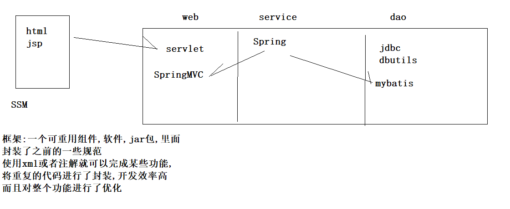
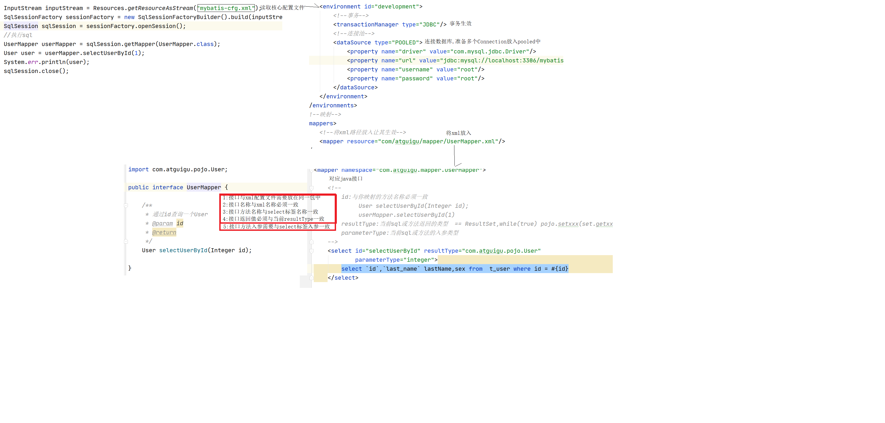

# 课程简介



# 1、mybatis概述

## 1.1、mybatis简介

MyBatis 是支持定制化 SQL、存储过程以及高级映射的优秀的持久层框架。

MyBatis 避免了几乎所有的 **JDBC 代码和手动设置参数以及获取结果集。**

MyBatis可以使用简单的XML或注解用于配置和原始映射，

将接口和Java的POJO（Plain Old Java Objects，普通的Java对象）映射成数据库中的记录.

## 1.2、mybatis历史

原是apache的一个开源项目iBatis, 2010年6月这个项目由apache software foundation 迁移到了google code，随着开发团队转投Google Code旗下，ibatis3.x正式更名为Mybatis ，代码于2013年11月迁移到Github。

iBATIS一词来源于“internet”和“abatis”的组合，是一个基于Java的持久层框架。

iBATIS提供的持久层框架包括SQL Maps和Data Access Objects（DAO）

## 1.3、为什么要使用mybatis。

MyBatis是一个半自动化的持久化层ORM框架。

回顾jdbc

```java
Connection con = null;
PreparedStatement psmt = null;
ResultSet set = null;
try {
    // 1.加载驱动
    Class.forName("com.mysql.jdbc.Driver");
    // 2.创建数据库的连接对象
    con = DriverManager.getConnection("jdbc:mysql://127.0.0.1:3306/test", "root", "root");
    // 3.定义sql语句 findUserById
    String sql = "select * from user where id = ?";
    // 4.创建statement对象
    psmt = con.prepareStatement(sql);
    // 5.设置参数
    psmt.setInt(1, 1);
    // 6.执行
    set = psmt.executeQuery();
    // 7.处理结果集
    while (set.next()) {
        User user = new User();
        user.setId(set,getInt("id"));
        System.out.println("用户Id：" + set.getInt("id") + ",用户名称：" + set.getString("username"));
    }
} catch (Exception e) {
    e.printStackTrace();
} finally {
    try {
        //8.释放资源
        if (set != null)set.close();
        if (psmt != null)psmt.close();
        if (con != null)con.close();
    } catch (Exception e) {
        e.printStackTrace();
    }
```

Hibernate和JPA  

长难复杂SQL，对于Hibernate而言处理也不容易

内部自动生产的SQL，不容易做特殊优化。

sql和java编码分开，功能边界清晰，一个专注业务、一个专注数据。

可以使用简单的XML或注解用于配置和原始映射，**将接口和Java的POJO映射成数据库中的记录**。成为业务代码+底层数据库的媒介

ORM 

对象 		 关系  								

Object      关系型数据库中记录    

映射 过程规范叫做jpa

User   将数据库字段映射成属性

private String name;   

t_user

varchar name;

# 2、mybatis的Hello 示例程序

## 2.1、创建一个数据库和一个单表

```sql
CREATE database mybatis DEFAULT CHARACTER SET utf8 COLLATE utf8_general_ci;
use mybatis;
## 创建单表
create table t_user(
`id` int primary key auto_increment,
`last_name`	varchar(50),
`sex` int
);
insert into t_user(`last_name`,`sex`) values('',1);
select * from t_user;
```

# Mybatis程序示例：

## 1 创建一个java模块:


## 2 导入需要的jar包:

- junit_4.12.jar
- log4j-1.2.17.jar
- mybatis-3.5.1.jar
- mysql-connector-java-5.1.7-bin.jar
- org.hamcrest.core_1.3.0.jar

 

## 3 在源码目录下创建mybatis的核心配置文件 mybatis-config.xml

```xml
<?xml version="1.0" encoding="UTF-8" ?>
<!DOCTYPE configuration
        PUBLIC "-//mybatis.org//DTD Config 3.0//EN"
        "http://mybatis.org/dtd/mybatis-3-config.dtd">
<configuration>
    <!--environments 表示配置数据库环境-->
    <environments default="development">
        <environment id="development">
            <transactionManager type="JDBC"></transactionManager>
            <!-- 数据库驱动 -->
            <dataSource type="POOLED">
                <property name="driver" value="com.mysql.jdbc.Driver"/>
                <property name="url" value="jdbc:mysql://localhost:3306/mybatis?characterEncoding=UTF-8"/>
                <property name="username" value="root"/>
                <property name="password" value="root"/>
            </dataSource>
        </environment>
    </environments>
    <!--mybatis 是把sql配置到xml配置文件中,下面的配置是告诉Mybatis到哪里加载sql的配置文件 -->
    <mappers>
        <mapper resource="com/atguigu/mapper/UserMapper.xml"/>
    </mappers>
    
</configuration>
```

## 4 数据库表对应的JavaBean

```java
public class User {
  private Integer id;
  private String lastName;
  private Integer sex;
}
```

## 5 编写Mapper接口:

```java
public interface UserMapper {
  /**
   * 根据id查询用户信息
   * @param id 用户的id
   * @return
   */
  User selectUserById(Integer id);
}
```

## 6.编写sql的配置文件:

```xml
<?xml version="1.0" encoding="UTF-8" ?>
<!DOCTYPE mapper
        PUBLIC "-//mybatis.org//DTD Mapper 3.0//EN"
        "http://mybatis.org/dtd/mybatis-3-mapper.dtd">
<!-- namespace是名称空间,它的取值必须是对应的接口的全类名 -->
<mapper namespace="com.atguigu.mapper.UserMapper">
    <!--
        select 标签用来配置select查询语句
        id 属性配置一个唯一的标识
        resultType 是查询后每一行记录封装的对象类型
        #{id} 它是占位符 ?
    -->
    <select id="selectByUserId" resultType="com.atguigu.pojo.User">
     select `id`,`last_name` lastName,`sex` from t_user where id = #{id}
</select>

</mapper>
```

## 7 测试代码:

```java
@Test
public void test1(){
    try {
        //1:连接数据库,加载配置文件
        InputStream inputStream = Resources.getResourceAsStream("mybatis-config.xml");
        //2:构建连接
        SqlSessionFactory sessionFactory = new SqlSessionFactoryBuilder().build(inputStream);
        //3:得到sqlSession,负责执行sql
        SqlSession sqlSession = sessionFactory.openSession();
        //4:加载SQL
        UserMapper userMapper = sqlSession.getMapper(UserMapper.class);
        //5:执行方法
        User user = userMapper.selectByUserId(1);
        System.err.println(user);
        //6:释放
        sqlSession.close();
    } catch (IOException e) {
        e.printStackTrace();
    }
}
```

## 总结:

```
1:jar
    mysql驱动
    mybatis jar
2:核心配置文件-----mybatis-config.xml,整个mybatis框架的一些核心参数配置
	环境
		事务
		数据源
	映射
3:接口 UserMapper.java
4:xml  UserMapper.xml  
	必须在同包下,名称必须一致
	namespace:接口的全路径
	<id="与方法名称一致" resultType="与方法的返回值一致|sql语句的接口映射类型">
		select `id`,`last_name` lastName,sex from t_user
5:入门测试
  读取核心配置文件返回一个InputStream
  sqlSessionFactory = new SqlSessionFactoryBuilder()build(inputstream);
  sqlSession = sqlSessionFactory.openSession();
  //底层进行了JDK的动态代理,代理对象底层调用jdbc方法
  userMapper = sqlSession.getMapper(UserMapper.class);
  userMapper.selectUserAll();
  sqlSession.close();
```



# 3、Mapper接口实现CRUD

## 3.1 Mapper接口代码:

```java
/**
 * UserMapper它的实现类是由Mybatis底层源码进行了实现( jdk动态代理 )
 */
public interface UserMapper {

  /**
   * 根据id查询用户信息
   *
   * @param id 用户的id
   * @return
   */
  public User selectUserById(Integer id);

  /**
   * 查询全部
   *
   * @return
   */
  public List<User> selectAll();

  /**
   * 更新用户
   *
   * @param user
   * @return
   */
  public int updateUser(User user);

  /**
   * 删除用户
   *
   * @param id
   * @return
   */
  public int deleteUserById(Integer id);

  /**
   * 插入用户
   *
   * @param user
   * @return
   */
  public int insertUser(User user);

}
```

## 3.2 Mapper.xml配置文件 

```xml
<?xml version="1.0" encoding="UTF-8" ?>
        <!DOCTYPE mapper
                PUBLIC "-//mybatis.org//DTD Mapper 3.0//EN"
                "http://mybatis.org/dtd/mybatis-3-mapper.dtd">
        <!--
        namespace是名称空间,它的取值必须是对应的接口的全类名
        -->
<mapper namespace="com.atguigu.mapper.UserMapper">
    <!--
      select 标签用来配置select查询语句
        id 属性配置一个唯一的标识
        resultType 是查询后每一行记录封装的对象类型
         #{id} 它是占位符 ?
    -->
    <select id="SelectByUserId" resultType="com.atguigu.pojo.User">
        select id,last_name as lastName,sex from t_user WHERE id = 1
    </select>


    <!--
      查询全部
      @return
      public List<User> selectAll();
      resultType 是表示查询回来之后每一行记录转换为什么类型的对象
    -->
    <select id="selectAll" resultType="com.atguigu.pojo.User">
        select `id`,`last_name` lastName,`sex` from t_user
    </select>

    <!--  
      更新用户
       @param user
      @return
      public int updateUser(User user);
      parameterType 和 resultType 都是在JavaBean类型的时候才写.
  -->
    <update id="updateUser" parameterType="com.atguigu.pojo.User">
        update
        t_user
        set
        `last_name` = #{lastName} ,
        `sex` = #{sex}
        where
        id = #{id}
    </update>

    <!--
    删除用户
    @param id
    @return
    public int deleteUserById(Integer id);-->
    <delete id="deleteUserById">
        delete from t_user where id = #{id}
    </delete>

    <!--  
     插入用户
     @param user
     @return
    public int insertUser(User user);-->
    <insert id="insertUser" parameterType="com.atguigu.pojo.User">
        insert into
        t_user(`last_name`,`sex`)
        values
        (#{lastName},#{sex})
    </insert>

</mapper>
```

## 3.3 测试的代码:

```java
public class UserMapperTest2 {

    SqlSessionFactory sqlSessionFactory = null;
    SqlSession sqlSession = null;

    @Before
    public void init() throws IOException {
        System.err.println("初始化===============");
        sqlSessionFactory = new SqlSessionFactoryBuilder().build(Resources.getResourceAsStream("mybatis-config.xml"));
        sqlSession = sqlSessionFactory.openSession();
    }

    @Test
    public void test1() {
        UserMapper userMapper = sqlSession.getMapper(UserMapper.class);
        List<User> userList = userMapper.selectAll();
        userList.forEach(user -> {
            System.err.println(user);
        });
    }

    @Test
    public void updateUser() {
        UserMapper userMapper = sqlSession.getMapper(UserMapper.class);
        userMapper.updateUser(new User(1, "bbj", 1));
        sqlSession.commit();
    }

    @Test
    public void deleteUserById() {
        UserMapper mapper = sqlSession.getMapper(UserMapper.class);
        mapper.deleteUserById(2);
        sqlSession.commit();
    }

    @Test
    public void insertUser() {
        UserMapper mapper = sqlSession.getMapper(UserMapper.class);
        mapper.insertUser(new User(6, "bbj168", 1));
        sqlSession.commit();
    }

    @After
    public void destory() {
        System.err.println("over==============");
        sqlSession.close();
    }

}
```

## 3.4、返回自增的主键

```xml
<!--
     插入用户
     @param user
     useGeneratedKeys="true" 数据库自增主键
     keyProperty="id"        主键值映射到id中
     @return
    public int insertUser(User user);-->
<insert id="insertUser" useGeneratedKeys="true"
        keyProperty="id" parameterType="com.atguigu.pojo.User">
    insert into
    t_user(`last_name`,`sex`)
    values
    (#{lastName},#{sex})
</insert>
```

## 3.5、  `<selectKey>`标签的使用

```xml
selectKey是一个标签,常用于在insert标签里配置一个查询操作. 也是经常用来查询插入后生成的主键值. 
<insert id="insertUser" parameterType="com.atguigu.pojo.User">
    <!--
           select  select查询
           Key   主键
           last_insert_id() 是一个函数.它会返回最后一次生成的主键值
           order 设置selectKey的语句是先执行,还是后执行.
             BEFORE  selectKey先执行
             AFTER   selectKey后执行
          keyProperty="id" 表示将返回的主键值注入到id属性中
           resultType 设置返回的主键的类型 Integer
         -->
    <selectKey order="AFTER" keyProperty="id" resultType="integer">
        select last_insert_id()
    </selectKey>
    insert into
    t_user(`last_name`,`sex`)
    values
    (#{lastName},#{sex})
</insert>
```

## 注解@MapKey的使用。

@MapKey可以将查询回来的JavaBean以注解给定的属性做为key,封装为一个Map对象返回. 

Mapper接口

```java
/**
* 查询用户,结果返回一个map,key:序号  v:user
* @return
*/
@MapKey("id")
Map<Integer,User> selectAllForMap();
```

XML映射:

```xml
<select id="selectAllForMap" resultType="com.atguigu.pojo.User">
    select `id`,`last_name` lastName,`sex` from t_user
</select>
```

Oracle数据库的用法

```xml
<selectKey order="BEFORE" resultType="int" keyProperty="id"> 
    select 序列名.nextval as id from dual 
</selectKey> 
```

测试:

```java
@Test
public void selectForAllMap() {
    UserMapper mapper = sqlSession.getMapper(UserMapper.class);
    Map<Integer, User> map = mapper.selectAllForMap();
    map.forEach((k,v)->{
        System.err.println(k+":"+v);
    });
}
```

# 4、mybatis的核心配置之properties

```xml
<?xml version="1.0" encoding="UTF-8" ?>
<!DOCTYPE configuration
        PUBLIC "-//mybatis.org//DTD Config 3.0//EN"
        "http://mybatis.org/dtd/mybatis-3-config.dtd">
<configuration>
    <!--properties 表示复数(多组键值对);
    resource属性表示读取(引用) 
    指定properties属性配置文件的键值对-->
    <properties resource="jdbc.properties"></properties>
    <!--environments 表示配置数据库环境-->
    <environments default="development">
        <environment id="development">
            <transactionManager type="JDBC"></transactionManager>
            <!-- 数据库驱动 -->
            <dataSource type="POOLED">
                <property name="driver" value="${driverClassName}"/>
                <property name="url" value="${url}"/>
                <property name="username" value="${username}"/>
                <property name="password" value="${password}"/>
            </dataSource>
        </environment>
    </environments>
    <!--mybatis 是把sql配置到xml配置文件中,下面的配置是告诉Mybatis到哪里加载sql的配置文件 -->
    <mappers>
        <mapper resource="com/atguigu/mapper/UserMapper.xml"/>
    </mappers>

</configuration>
```

# 5、mybatis的核心配置之settings

这是 MyBatis 中极为重要的调整设置，它们会改变 MyBatis 的运行时行为。下表描述了设置中各项的意图、默认值等。

## 5.1、所有mybatis的settings设置选项

| 设置参数                         | 描述                                                         | 有效值                                                       | 默认值                                                       |
| -------------------------------- | ------------------------------------------------------------ | ------------------------------------------------------------ | ------------------------------------------------------------ |
| cacheEnabled                     | 该配置影响的所有映射器中配置的缓存的全局开关。               | true \| false                                                | true                                                         |
| lazyLoadingEnabled               | 延迟加载的全局开关。当开启时，所有关联对象都会延迟加载。 特定关联关系中可通过设置fetchType属性来覆盖该项的开关状态。 | true \| false                                                | false                                                        |
| aggressiveLazyLoading            | 当启用时，对任意延迟属性的调用会使带有延迟加载属性的对象完整加载；反之，每种属性将会按需加载。 | true \| false                                                | true                                                         |
| multipleResultSetsEnabled        | 是否允许单一语句返回多结果集（需要兼容驱动）。               | true \| false                                                | true                                                         |
| useColumnLabel                   | 使用列标签代替列名。不同的驱动在这方面会有不同的表现， 具体可参考相关驱动文档或通过测试这两种不同的模式来观察所用驱动的结果。 | true \| false                                                | true                                                         |
| useGeneratedKeys                 | 允许 JDBC 支持自动生成主键，需要驱动兼容。 如果设置为 true 则这个设置强制使用自动生成主键，尽管一些驱动不能兼容但仍可正常工作（比如 Derby）。 | true \| false                                                | False                                                        |
| autoMappingBehavior              | 指定 MyBatis 应如何自动映射列到字段或属性。 NONE 表示取消自动映射；PARTIAL 只会自动映射没有定义嵌套结果集映射的结果集。 FULL 会自动映射任意复杂的结果集（无论是否嵌套）。 | NONE, PARTIAL, FULL                                          | PARTIAL                                                      |
| autoMappingUnknownColumnBehavior | Specify the behavior when detects an unknown column (or unknown property type) of automatic mapping target.· NONE: Do nothing· WARNING: Output warning log (The log level of'org.apache.ibatis.session.AutoMappingUnknownColumnBehavior'must be set to WARN)· FAILING: Fail mapping (Throw SqlSessionException) | NONE, WARNING, FAILING                                       | NONE                                                         |
| defaultExecutorType              | 配置默认的执行器。SIMPLE 就是普通的执行器；REUSE 执行器会重用预处理语句（prepared statements）； BATCH 执行器将重用语句并执行批量更新。 | SIMPLE REUSE BATCH                                           | SIMPLE                                                       |
| defaultStatementTimeout          | 设置超时时间，它决定驱动等待数据库响应的秒数。               | Any positive integer                                         | Not Set (null)                                               |
| defaultFetchSize                 | Sets the driver a hint as to control fetching size for return results. This parameter value can be override by a query setting. | Any positive integer                                         | Not Set (null)                                               |
| safeRowBoundsEnabled             | 允许在嵌套语句中使用分页（RowBounds）。 If allow, set the false. | true \| false                                                | False                                                        |
| safeResultHandlerEnabled         | 允许在嵌套语句中使用分页（ResultHandler）。 If allow, set the false. | true \| false                                                | True                                                         |
| mapUnderscoreToCamelCase         | 是否开启自动驼峰命名规则（camel case）映射，即从经典数据库列名 A_COLUMN 到经典 Java 属性名 aColumn 的类似映射。 | true \| false                                                | False                                                        |
| localCacheScope                  | MyBatis 利用本地缓存机制（Local Cache）防止循环引用（circular references）和加速重复嵌套查询。 默认值为 SESSION，这种情况下会缓存一个会话中执行的所有查询。 若设置值为 STATEMENT，本地会话仅用在语句执行上，对相同 SqlSession 的不同调用将不会共享数据。 | SESSION \| STATEMENT                                         | SESSION                                                      |
| jdbcTypeForNull                  | 当没有为参数提供特定的 JDBC 类型时，为空值指定 JDBC 类型。 某些驱动需要指定列的 JDBC 类型，多数情况直接用一般类型即可，比如 NULL、VARCHAR 或 OTHER。 | JdbcType enumeration. Most common are: NULL, VARCHAR and OTHER | OTHER                                                        |
| lazyLoadTriggerMethods           | 指定哪个对象的方法触发一次延迟加载。                         | A method name list separated by commas                       | equals,clone,hashCode,toString                               |
| defaultScriptingLanguage         | 指定动态 SQL 生成的默认语言。                                | A type alias or fully qualified class name.                  | org.apache.ibatis.scripting.xmltags.XMLDynamicLanguageDriver |
| callSettersOnNulls               | 指定当结果集中值为 null 的时候是否调用映射对象的 setter（map 对象时为 put）方法，这对于有 Map.keySet() 依赖或 null 值初始化的时候是有用的。注意基本类型（int、boolean等）是不能设置成 null 的。 | true \| false                                                | false                                                        |
| logPrefix                        | 指定 MyBatis 增加到日志名称的前缀。                          | Any String                                                   | Not set                                                      |
| logImpl                          | 指定 MyBatis 所用日志的具体实现，未指定时将自动查找。        | SLF4J \| LOG4J \| LOG4J2 \| JDK_LOGGING \| COMMONS_LOGGING \| STDOUT_LOGGING \| NO_LOGGING | Not set                                                      |
| proxyFactory                     | 指定 Mybatis 创建具有延迟加载能力的对象所用到的代理工具。    | CGLIB \| JAVASSIST                                           | JAVASSIST (MyBatis 3.3 or above)                             |
| vfsImpl                          | Specifies VFS implementations                                | Fully qualified class names of custom VFS implementation separated by commas. | Not set                                                      |
| useActualParamName               | Allow referencing statement parameters by their actual names declared in the method signature. To use this feature, your project must be compiled in Java 8 with -parameters option. (Since: 3.4.1) | true \| false                                                | true                                                         |

演示 mapUnderscoreToCamelCase,**注意无参构造**

db: last_name

java:lastName

tableName: user_account

# 6、mybatis的核心配置之typeAliases

```xml
<typeAliases>
    <!--
            typeAlias标签给一个具体类型起别名
            type是具体的类型
            alias是别名
         -->
    <!--<typeAlias type="com.atguigu.pojo.User" alias="u"/>-->
    <!--给包中所有的类起别名,默认当前类名,并且忽略大小写-->
    <package name="com.atguigu.pojo"/>
</typeAliases>
```

 

## 6.1.系统提示的预定义别名

已经为许多常见的 Java 类型内建了相应的类型别名。它们都是大小写不敏感的，需要注意的是由基本类型名称重复导致的特殊处理。

| 别名       | 映射的类型 |
| ---------- | ---------- |
| _byte      | byte       |
| _long      | long       |
| _short     | short      |
| _int       | int        |
| _integer   | int        |
| _double    | double     |
| _float     | float      |
| _boolean   | boolean    |
| string     | String     |
| byte       | Byte       |
| long       | Long       |
| short      | Short      |
| int        | Integer    |
| integer    | Integer    |
| double     | Double     |
| float      | Float      |
| boolean    | Boolean    |
| date       | Date       |
| decimal    | BigDecimal |
| bigdecimal | BigDecimal |
| object     | Object     |
| map        | Map        |
| hashmap    | HashMap    |
| list       | List       |
| arraylist  | ArrayList  |
| collection | Collection |
| iterator   | Iterator   |

## 6.2、mybatis的核心配置之typeHandlers

类型处理器主要就是用来设置sql语句中的占位符的参数值.以及获取查询结果集中的值.

```xml
sql select `id`,`last_name`,sex from t_user where id = #{id}
PreparedStatement;

parameterType="integer"  === PreparedStatement.setIndex(1,1);

resultType="user"=== while(ResultSet.next()){
	user.setId(ResultSet.getInt("id"));
}

java:id Integer  			  	  db:id int
java:last_name String  	转换器		db:last_name varcher

<select id="selectUserById" resultType="user" parameterType="integer">
    select  int `id`,`last_name`,sex from t_user where id = #{id}
</select>
```

| 类型处理器                 | Java 类型                  | JDBC 类型                                                    |
| -------------------------- | -------------------------- | ------------------------------------------------------------ |
| BooleanTypeHandler         | java.lang.Boolean, boolean | 数据库兼容的 BOOLEAN                                         |
| ByteTypeHandler            | java.lang.Byte, byte       | 数据库兼容的 NUMERIC 或 BYTE                                 |
| ShortTypeHandler           | java.lang.Short, short     | 数据库兼容的 NUMERIC 或 SHORT INTEGER                        |
| IntegerTypeHandler         | java.lang.Integer, int     | 数据库兼容的 NUMERIC 或 INTEGER                              |
| LongTypeHandler            | java.lang.Long, long       | 数据库兼容的 NUMERIC 或 LONG INTEGER                         |
| FloatTypeHandler           | java.lang.Float, float     | 数据库兼容的 NUMERIC 或 FLOAT                                |
| DoubleTypeHandler          | java.lang.Double, double   | 数据库兼容的 NUMERIC 或 DOUBLE                               |
| BigDecimalTypeHandler      | java.math.BigDecimal       | 数据库兼容的 NUMERIC 或 DECIMAL                              |
| StringTypeHandler          | java.lang.String           | CHAR, VARCHAR                                                |
| ClobReaderTypeHandler      | java.io.Reader             | -                                                            |
| ClobTypeHandler            | java.lang.String           | CLOB, LONGVARCHAR                                            |
| NStringTypeHandler         | java.lang.String           | NVARCHAR, NCHAR                                              |
| NClobTypeHandler           | java.lang.String           | NCLOB                                                        |
| BlobInputStreamTypeHandler | java.io.InputStream        | -                                                            |
| ByteArrayTypeHandler       | byte[]                     | 数据库兼容的字节流类型                                       |
| BlobTypeHandler            | byte[]                     | BLOB, LONGVARBINARY                                          |
| DateTypeHandler            | java.util.Date             | TIMESTAMP                                                    |
| DateOnlyTypeHandler        | java.util.Date             | DATE                                                         |
| TimeOnlyTypeHandler        | java.util.Date             | TIME                                                         |
| SqlTimestampTypeHandler    | java.sql.Timestamp         | TIMESTAMP                                                    |
| SqlDateTypeHandler         | java.sql.Date              | DATE                                                         |
| SqlTimeTypeHandler         | java.sql.Time              | TIME                                                         |
| ObjectTypeHandler          | Any                        | OTHER 或未指定类型                                           |
| EnumTypeHandler            | Enumeration Type           | VARCHAR-任何兼容的字符串类型，存储枚举的名称（而不是索引）   |
| EnumOrdinalTypeHandler     | Enumeration Type           | 任何兼容的 NUMERIC 或 DOUBLE 类型，存储枚举的索引（而不是名称）。 |

# 7、mybatis的核心配置之environments

environments标签配置的是数据库环境

 

## 7.1、environments 标签说明

 

## 7.2、transactionManager 标签说明

表示使用哪种类型的事务

· JDBC – 这个配置直接使用了 JDBC 的提交和回滚设施，它依赖从数据源获得的连接来管理事务作用域。

· MANAGED – 这个配置几乎没做什么。它从不提交或回滚一个连接，而是让容器来管理事务的整个生命周期（比如 JEE 应用服务器的上下文）。 默认情况下它会关闭连接。然而一些容器并不希望连接被关闭，因此需要将 closeConnection 属性设置为 false 来阻止默认的关闭行为

## 7.3、dataSource 标签说明

type 属性的值有三种： UNPOOLED 、 POOLED 、 JNDI。自定义（实现DataSourceFactory接口）

UNPOOLED– 不使用数据库连接池,每次使用才打开一个,用完关闭

POOLED	使用数据库连接池

# 8、mybatis的核心配置之databaseIdProvider 

MyBatis 可以根据不同的数据库厂商执行不同的语句，这种多厂商的支持是基于映射语句中的 databaseId 属性。 MyBatis 会加载不带 databaseId 属性和带有匹配当前数据库 databaseId 属性的所有语句。

```xml
<databaseIdProvider type="DB_VENDOR">
    <property name="SQL Server" value="sqlserver" />
    <property name="MySQL" value="mysql" />
    <property name="DB2" value="db2" />
    <property name="Oracle" value="oracle" />
</databaseIdProvider>
```

## 8.1、databaseId测试

```xml
<databaseIdProvider type="DB_VENDOR">
    <property name="SQL Server" value="sqlserver"/>
    <property name="DB2" value="db2"/>
    <property name="Oracle" value="oracle" />
    <property name="MySQL" value="mysql" />
</databaseIdProvider>

<!--
        1.mybatis会加载所有sql标签,如果没有databaseId那么报错
        2.如果有databaseId,那么mybatis会加载所有带有databaseId以及不带有databaseId的
        3.优先匹配databaseId为当前数据库的
    -->
<select id="selectAll" resultType="user">
    select `id`,`last_name`,`sex` from t_user
</select>
<!--
  databaseId="mysql" 表示如果我的数据库是mysql,就会使用下面配置的这个语句
-->
<select id="selectAll" resultType="user" databaseId="mysql">
    select `id`,`last_name`,`sex` from t_user where 1 = 1
</select>
<!--
  databaseId="oracle" 表示如果我的数据库是mysql,就会使用下面配置的这个语句
-->
<select id="selectAll" resultType="user" databaseId="oracle">
    select `id`,`last_name`,`sex` from t_user where 2 = 2
</select>
```

# 9、mybatis的核心配置之Mappers

按照类路径加载

 

 按照接口,或给定包名加载


