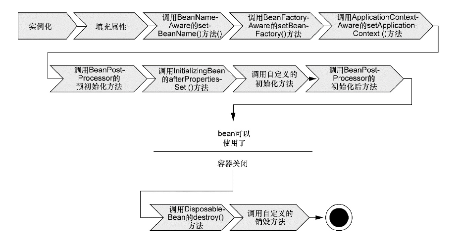
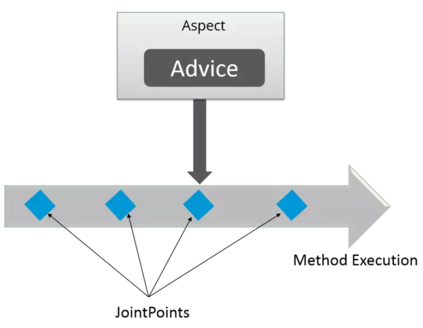

[toc]

#### Spring框架中都用到了哪些设计模式？

- 工厂模式：`BeanFactory`就是简单工厂模式的体现，用来创建对象的实例
- 单例模式：`Bean`默认为单例模式
- 代理模式：Spring的AOP功能用到了JDK的动态代理和CGLIB字节码生成技术
- 模板方法：用来解决代码重复的问题。比如. RestTemplate, JmsTemplate, JpaTemplate。
- 观察者模式：定义对象键一种一对多的依赖关系，当一个对象的状态发生改变时，所有依赖于它的对象都会得到通知被制动更新，如Spring中listener的实现–ApplicationListener。

#### 详细讲解一下核心容器（spring context应用上下文) 模块

这是基本的Spring模块，提供spring 框架的基础功能，BeanFactory 是 任何以spring为基础的应用的核心。Spring 框架建立在此模块之上，它使Spring成为一个容器。

Bean 工厂是工厂模式的一个实现，提供了控制反转功能，用来把应用的配置和依赖从真正的应用代码中分离。最常用的就是`org.springframework.beans.factory.xml.XmlBeanFactory`，它根据XML文件中的定义加载beans。该容器从XML 文件读取配置元数据并用它去创建一个完全配置的系统或应用。

#### Spring框架中有哪些不同类型的事件

Spring 提供了以下5种标准的事件：
1. 上下文更新事件（ContextRefreshedEvent）：在调用ConfigurableApplicationContext 接口中的refresh()方法时被触发。
2. 上下文开始事件（ContextStartedEvent）：当容器调用ConfigurableApplicationContext的Start()方法开始/重新开始容器时触发该事件。
3. 上下文停止事件（ContextStoppedEvent）：当容器调用ConfigurableApplicationContext的Stop()方法停止容器时触发该事件。
4. 上下文关闭事件（ContextClosedEvent）：当ApplicationContext被关闭时触发该事件。容器被关闭时，其管理的所有单例Bean都被销毁。
5. 请求处理事件（RequestHandledEvent）：在Web应用中，当一个http请求（request）结束触发该事件。如果一个bean实现了ApplicationListener接口，当一个ApplicationEvent 被发布以后，bean会自动被通知。

#### Spring应用程序有哪些不同组件

Spring应用一般又以下组件：

- 接口：定义功能
- Bean类：它包含属性，setter和getter方法，函数等
- Bean 配置文件：包含类的信息以及如何配置它们。
- Spring 面向切面编程（AOP）：提供面向切面编程的功能。
- 用户程序：它使用接口

### Spring控制反转（IOC）

#### 什么是Spring IOC容器？

控制反转即IoC (Inversion of Control)，它把传统上由程序代码直接操控的对象的调用权交给容器，通过容器来实现对象组件的装配和管理。所谓的“控制反转”概念就是对组件对象控制权的转移，从程序代码本身转移到了外部容器。

Spring IOC 负责创建对象，管理对象（通过依赖注入（DI），装配对象，配置对象，并且管理这些对象的整个生命周期。

#### 控制反转（IOC）有什么作用？

- 管理对象的创建和依赖关系的维护。对象的创建并不是一件简单的事，在对象关系比较复杂时，如果依赖关系需要程序猿来维护的话，那是相当头疼的
- 解耦，由容器去维护具体的对象
- 托管了类的产生过程，比如我们需要在类的产生过程中做一些处理，最直接的例子就是代理，如果有容器程序可以把这部分处理交给容器，应用程序则无需去关心类是如何完成代理的

#### Spring IOC的实现机制

Spring中的IOC的实现原理就是工厂模式加反射机制。

```java
interface Fruit {
	public abstract void eat();
}
class Apple implements Fruit {
    public void eat(){
    	System.out.println("Apple");
    }
}
class Orange implements Fruit {
    public void eat(){
    	System.out.println("Orange");
    }
}
class Factory {
    public static Fruit getInstance(String ClassName) {
        Fruit f=null;
        try {
            f=(Fruit)Class.forName(ClassName).newInstance();
        } catch (Exception e) {
            e.printStackTrace();
        }
        return f;
    }
}
class Client {
    public static void main(String[] a) {
        Fruit f=Factory.getInstance("io.github.dunwu.spring.Apple");
        if(f!=null){
        f.eat();
        }
    }
}
```

#### Spring的IOC支持哪些功能

Spring的IOC设计支持一下功能：

- 依赖注入
- 依赖检查
- 自动装配
- 支持集合
- 指定初始化方法和销毁方法
- 支持回调某些方法（但是需要实现Spring接口，略有侵入）

其中，最重要的就是依赖注入，从 XML 的配置上说，即 ref 标签。对应 SpringRuntimeBeanReference 对象。

对于 IoC 来说，最重要的就是容器。容器管理着 Bean 的生命周期，控制着 Bean 的依赖注入。

#### BeanFactory 和 ApplicationContext有什么区别？

BeanFactory和ApplicationContext是Spring的两大核心接口，都可以当做Spring的容器。其中ApplicationContext是BeanFactory的子接口。

依赖关系

BeanFactory：是Spring里面最底层的接口，包含了各种Bean的定义，读取bean配置文档，管理bean的加载、实例化，控制bean的生命周期，维护bean之间的依赖关系。

ApplicationContext接口作为BeanFactory的派生，除了提供BeanFactory所具有的功能外，还提供了更完整的框架功能：

- 继承MessageSource，因此支持国际化。
- 统一的资源文件访问方式。
- 提供在监听器中注册bean的事件。
- 同时加载多个配置文件。
- 载入多个（有继承关系）上下文 ，使得每一个上下文都专注于一个特定的层次，比如应用的web层。

加载方式

BeanFactroy采用的是延迟加载形式来注入Bean的，即只有在使用到某个Bean时(调用getBean())，才对该Bean进行加载实例化。这样，我们就不能发现一些存在的Spring的配置问题。如果Bean的某一个属性没有注入，BeanFacotry加载后，直至第一次使用调用getBean方法才会抛出异常。

ApplicationContext，它是在容器启动时，一次性创建了所有的Bean。这样，在容器启动时，我们就可以发现Spring中存在的配置错误，这样有利于检查所依赖属性是否注入。 ApplicationContext启动后预载入所有的单实例Bean，通过预载入单实例bean ,确保当你需要的时候，你就不用等待，因为它们已经创建好了。

相对于基本的BeanFactory，ApplicationContext 唯一的不足是占用内存空间。当应用程序配置Bean较多时，程序启动较慢。

创建方式

BeanFactory通常以编程的方式被创建，ApplicationContext还能以声明的方式创建，如使用ContextLoader。

注册方式

BeanFactory和ApplicationContext都支持BeanPostProcessor、BeanFactoryPostProcessor的使用，但两者之间的区别是：BeanFactory需要手动注册，而ApplicationContext则是自动注册。

#### ApplicationContext通常的实现是什么？

`FileSystemXmlApplicationContext`：此容器从一个XML文件中加载beans的定义，XML Bean 配置文件的全路径名必须提供给它的构造函数。
`ClassPathXmlApplicationContext`：此容器也从一个XML文件中加载beans的定义，这里，你需要正确设置classpath因为这个容器将在classpath里找bean配置。
`WebXmlApplicationContext`：此容器加载一个XML文件，此文件定义了一个WEB应用的所有bean。

#### 什么是Spring的依赖注入？

控制反转IOC是一个很大的概念，可以用不同的方式来实现。其主要实现方式有两种：依赖注入和依赖查找

依赖注入：相对于IOC而言，依赖注入（DI）更加准确地描述了IOC的设计理念。所谓依赖如（Dependency Injection），即组件之间的依赖关系由容器在应用系统运行期间来决定，也就是容器动态地将某种依赖关系的目标对象实例注入到应用系统中的各个关联组件中。组件不做定位查询，只提供普通的Java方法让容器去决定依赖管理。

#### 依赖注入的基本原则

依赖注入的基本原则：应用组件不应该负责查找资源或者其它依赖的协作对象。配置对象的工作应该由IOC容器负责，“查找资源”的逻辑应该从应用组件的代码抽取出来，交给IOC容器负责。容器全权负责组件的装配，它会把符合依赖关系的对象通过属性（JavaBean中的setter）或者构造器传递给需要的对象。

#### 依赖注入有什么优势

依赖注入之所以更流行是因为它是一种更可取的方式：让容器全权负责依赖查询，受管组件只需要暴露JavaBean的setter方法或者带参数的构造器或者接口，使容器可以在初始化时组装对象的依赖关系。其与依赖查找方式相比，主要优势为：

- 查找定位操作与应用代码完全无关。
- 不依赖于容器的API，可以很容易地在任何容器以外使用应用对象。
- 不需要特殊的接口，绝大多数对象可以做到完全不必依赖容器。

#### 有哪些不同类型的依赖注入实现方式？

依赖注入是时下最流行的IoC实现方式，依赖注入分为接口注入（Interface Injection），Setter方法注入（Setter Injection）和构造器注入（Constructor Injection）三种方式。其中接口注入由于在灵活性和易用性比较差，现在从Spring4开始已被废弃。

构造器依赖注入：构造器依赖注入通过容器触发一个类的构造器来实现的，该类有一系列参数，每个参数代表一个对其他类的依赖。

Setter方法注入：Setter方法注入是容器通过调用无参构造器或无参static工厂 方法实例化bean之后，调用该bean的setter方法，即实现了基于setter的依赖注入。

#### 构造器依赖注入和Setter方法注入的区别

| 构造器注入                 | Setter注入                 |
| -------------------------- | -------------------------- |
| 没有部分注入               | 有部分注入                 |
| 不会覆盖setter属性         | 会覆盖setter属性           |
| 任意修改都会创建一个新实例 | 任意修改不会创建一个新实例 |
| 适用于设置很多属性         | 适用于设置少量属性         |

两种依赖注入都可以使用，构造器注入和Setter方法注入。最好的解决方案是用构造器参数实现强制依赖，Setter方法实现可选依赖。

### Spring Beans

#### 什么是Spring Beans？

Spring beans是那些形成Spring应用主干的Java对象。它们被Spring IOC容器初始化，装配和管理。这些beans通过容器中配置的元数据创建。比如，以xml文件中的形式定义。

#### 一个Spring Bean定义包含什么？

一个Spring Bean 的定义包含容器必知的所有配置元数据，包括如何创建一个bean，它的生命周期详情及它的依赖

#### 如何给Spring容器提供配置元数据？Spring有几种配置方式？

这里有三种重要的方法给Spring 容器提供配置元数据。

- XML配置文件。
- 基于注解的配置。
- 基于java的配置。

#### Spring配置文件包含了哪些信息？

Spring配置文件是个XML 文件，这个文件包含了类信息，描述了如何配置它们，以及如何相互调用。

#### Spring基于xml注入Bean的几种方式

1. Set方法注入；
2. 构造器注入：①通过index设置参数的位置；②通过type设置参数类型；
3. 静态工厂注入；
4. 实例工厂

#### 怎样定义类的作用域？

当定义一个 在Spring里，我们还能给这个bean声明一个作用域。它可以通过bean 定义中的scope属性来定义。如，当Spring要在需要的时候每次生产一个新的bean实例，bean的scope属性被指定为prototype。另一方面，一个bean每次使用的时候必须返回同一个实例，这个bean的scope 属性 必须设为 singleton。

#### 解释Spring支持的几种Bean的作用域

Spring框架支持以下五种bean的作用域：

- singleton : bean在每个Spring ioc 容器中只有一个实例。
- prototype：一个bean的定义可以有多个实例。
- request：每次http请求都会创建一个bean，该作用域仅在基于web的Spring ApplicationContext情形下有效。
- session：在一个HTTP Session中，一个bean定义对应一个实例。该作用域仅在基于web的SpringApplicationContext情形下有效。
- global-session：在一个全局的HTTP Session中，一个bean定义对应一个实例。该作用域仅在基于web的Spring ApplicationContext情形下有效。

注意： 缺省的Spring bean 的作用域是Singleton。使用 prototype 作用域需要慎重的思考，因为频繁创
建和销毁 bean 会带来很大的性能开销。

#### Spring框架中的单例Bean是线程安全的么？

不是，Spring框架中的单例Bean不是线程安全的。

Spring中的Bean默认是单例模式，Spring框架并没有对单例Bean进行多线程的封装处理。

实际上大部分时候，Spring Bean是无状态（比如dao类），所有某种程度上来说Bean也是安全的，但如果Bean有状态的话（比如view model对象），那就要开发者自己去保证线程安全了，最简单的就是改变Bean的作用域，把“singleton”变更为“prototype”，这样请求Bean就相当于new Bean()了，所以就可以保证线程安全了。

- 有状态就是数据存储功能
- 无状态就是不会保存数据

#### Spring如何处理线程并发问题？

在一般情况下，只有无状态的Bean才可以在多线程环境下共享，在Spring中，绝大部分Bean都可以声明为singleton作用域，因为Spring对一些Bean中非线程安全状态采用ThreadLocal进行处理，解决线程安全问题。

ThreadLocal和线程同步机制都是为了解决多线程中相同变量的访问冲突问题。同步机制采用了“时间换空间”的方式，仅提供一份变量，不同的线程在访问前需要获取锁，没获得锁的线程则需要排队。而ThreadLocal采用了“空间换时间”的方式。

ThreadLocal会为每一个线程提供一个独立的变量副本，从而隔离了多个线程对数据的访问冲突。因为每一个线程都拥有自己的变量副本，从而也就没有必要对该变量进行同步了。ThreadLocal提供了线程安全的共享对象，在编写多线程代码时，可以把不安全的变量封装进ThreadLocal。

#### Spring中Bean的生命周期

在传统的Java应用中，bean的生命周期很简单。使用Java关键字new进行bean实例化，然后该bean就可以使用了。一旦该bean不再被使用，则由Java自动进行垃圾回收。相比之下，Spring容器中的bean的生命周期就显得相对复杂多了。正确理解Spring bean的生命周期非常重要，因为你或许要利用Spring提供的扩展点来自定义bean的创建过程。下图展示了bean装载到Spring应用上下文中的一个典型的生命周期过程。



bean在Spring容器中从创建到销毁经历了若干阶段，每一阶段都可以针对Spring如何管理bean进行个性化定制。

正如你所见，在bean准备就绪之前，bean工厂执行了若干启动步骤

我们对上图进行详细描述：

Spring对bean进行实例化；

Spring将值和bean的引用注入到bean对应的属性中；

如果bean实现了BeanNameAware接口，Spring将bean的ID传递给setBean-Name()方法；

如果bean实现了BeanFactoryAware接口，Spring将调用setBeanFactory()方法，将BeanFactory容器实例传入；

如果bean实现了ApplicationContextAware接口，Spring将调用setApplicationContext()方法，将bean所在的应用上下文的引用传入进来；

如果bean实现了BeanPostProcessor接口，Spring将调用它们的post-ProcessBeforeInitialization()方法；

如果bean实现了InitializingBean接口，Spring将调用它们的after-PropertiesSet()方法。类似地，如果bean使用initmethod声明了初始化方法，该方法也会被调用；

如果bean实现了BeanPostProcessor接口，Spring将调用它们的post-ProcessAfterInitialization()方法；

此时，bean已经准备就绪，可以被应用程序使用了，它们将一直驻留在应用上下文中，直到该应用上下文被销毁；

如果bean实现了DisposableBean接口，Spring将调用它的destroy()接口方法。同样，如果bean使用destroy-method声明了销毁方法，该方法也会被调用。

现在你已经了解了如何创建和加载一个Spring容器。但是一个空的容器并没有太大的价值，在你把东西放进去之前，它里面什么都没有。为了从Spring的DI(依赖注入)中受益，我们必须将应用对象装配进Spring容器中

#### 哪些是重要的Bean生命周期方法？能重载它们么？

有两个重要的bean 生命周期方法，第一个是setup ， 它是在容器加载bean的时候被调用。第二个方法是 teardown 它是在容器卸载类的时候被调用。

bean 标签有两个重要的属性（init-method和destroy-method）。用它们你可以自己定制初始化和注销方法。它们也有相应的注解（@PostConstruct和@PreDestroy）。

#### 什么是Spring的内部bean？什么是Spring inner beans？

在Spring框架中，当一个bean仅被用作另一个bean的属性时，它能被声明为一个内部bean。内部bean可以用setter注入“属性”和构造方法注入“构造参数”的方式来实现，内部bean通常是匿名的，它们的Scope一般是prototype。

#### 在 Spring中如何注入一个java集合？

Spring提供以下几种集合的配置元素：

类型用于注入一列值，允许有相同的值。

类型用于注入一组值，不允许有相同的值。

类型用于注入一组键值对，键和值都可以为任意类型。

类型用于注入一组键值对，键和值都只能为String类型。

#### 什么是Bean装配？

装配，或bean装配是指在Spring 容器中把bean组装到一起，前提是容器需要知道bean的依赖关系，如何通过依赖注入来把它们装配到一起。

#### 什么是bean的自动装配？

在Spring框架中，在配置文件中设定bean的依赖关系是一个很好的机制，Spring 容器能够自动装配相互合作的bean，这意味着容器不需要和配置，能通过Bean工厂自动处理bean之间的协作。这意味着Spring可以通过向Bean Factory中注入的方式自动搞定bean之间的依赖关系。自动装配可以设置在每个bean上，也可以设定在特定的bean上。

####  解释不同方式的自动装配，spring 自动装配 bean 有哪些方式？

在spring中，对象无需自己查找或创建与其关联的其他对象，由容器负责把需要相互协作的对象引用赋予各个对象，使用autowire来配置自动装载模式。

在Spring框架xml配置中共有5种自动装配：

- no：默认的方式是不进行自动装配的，通过手工设置ref属性来进行装配bean。
- byName：通过bean的名称进行自动装配，如果一个bean的 property 与另一bean 的name 相同，就进行自动装配。
- byType：通过参数的数据类型进行自动装配。
- constructor：利用构造函数进行装配，并且构造函数的参数通过byType进行装配。
- autodetect：自动探测，如果有构造方法，通过 construct的方式自动装配，否则使用 byType的方式自动装配。

#### 使用@Autowired注解自动装配的过程是怎样的？

使用@Autowired注解来自动装配指定的bean。在使用@Autowired注解之前需要在Spring配置文件进行配置，<context:annotation-config />。

在启动spring IoC时，容器自动装载了一个AutowiredAnnotationBeanPostProcessor后置处理器，当容器扫描到@Autowied、@Resource或@Inject时，就会在IoC容器自动查找需要的bean，并装配给该对象的属性。在使用@Autowired时，首先在容器中查询对应类型的bean：

- 如果查询结果刚好为一个，就将该bean装配给@Autowired指定的数据；
- 如果查询的结果不止一个，那么@Autowired会根据名称来查找；
- 如果上述查找的结果为空，那么会抛出异常。解决方法时，使用required=false。

#### 自动装配有哪些局限性？

自动装配的局限性是：

重写：仍然需要配置来定义依赖，意味着总要重写自动装配。

基本数据类型：不能自动装配简单的属性，如基本数据类型，String字符串和类。

模糊特性：自动装配不如显式装配精确，如有可能，建议使用显式装配。

### Spring注解

#### @Component, @Controller, @Repository, @Service 有何区别？

@Component：这将 java 类标记为 bean。它是任何 Spring 管理组件的通用构造型。spring 的组件扫描机制现在可以将其拾取并将其拉入应用程序环境中。

@Controller：这将一个类标记为 Spring Web MVC 控制器。标有它的 Bean 会自动导入到 IoC 容器中。

@Service：此注解是组件注解的特化。它不会对 @Component 注解提供任何其他行为。您可以在服务层类中使用 

@Service 而不是 @Component，因为它以更好的方式指定了意图。

@Repository：这个注解是具有类似用途和功能的 @Component 注解的特化。它为 DAO 提供了额外的好处。它将 DAO 导入 IoC 容器，并使未经检查的异常有资格转换为 Spring DataAccessException

#### @Required 注解有什么作用

这个注解表明bean的属性必须在配置的时候设置，通过一个bean定义的显式的属性值或通过自动装配，若@Required注解的bean属性未被设置，容器将抛出BeanInitializationException。示例：

```java
public class Employee {
    private String name;
    @Required
    public void setName(String name){
    	this.name=name;
    }
    public string getName(){
    	return name;
    }
}
```

#### @Autowired 注解有什么作用

@Autowired默认是按照类型装配注入的，默认情况下它要求依赖对象必须存在（可以设置它required属性为false）。@Autowired 注解提供了更细粒度的控制，包括在何处以及如何完成自动装配。它的用法和@Required一样，修饰setter方法、构造器、属性或者具有任意名称和/或多个参数的PN方法。

```java
public class Employee {
    private String name;
    @Autowired
    public void setName(String name) {
    	this.name=name;
    }
    public string getName(){
    	return name;
    }
}
```

#### @Autowired和@Resource之间的区别

@Autowired可用于：构造函数、成员变量、Setter方法

@Autowired和@Resource之间的区别

- @Autowired默认是按照类型装配注入的，默认情况下它要求依赖对象必须存在（可以设置它required属性为false）。
- @Resource默认是按照名称来装配注入的，只有当找不到与名称匹配的bean才会按照类型来装配注入。

#### @Qualifier 注解有什么作用

当您创建多个相同类型的 bean 并希望仅使用属性装配其中一个 bean 时，您可以使用@Qualifier 注解和 @Autowired 通过指定应该装配哪个确切的 bean 来消除歧义。

#### @RequestMapping 注解有什么用？

@RequestMapping 注解用于将特定 HTTP 请求方法映射到将处理相应请求的控制器中的特定类/方法。

此注释可应用于两个级别：

- 类级别：映射请求的 URL
- 方法级别：映射 URL 以及 HTTP 请求方法

### Spring数据访问

#### Spring支持的事务管理类型， spring 事务实现方式有哪些？

Spring支持两种类型的事务管理：

**编程式事务管理**：这意味你通过编程的方式管理事务，给你带来极大的灵活性，但是难维护。

**声明式事务管理**：这意味着你可以将业务代码和事务管理分离，你只需用注解和XML配置来管理事务。

#### Spring事务的实现方式和实现原理

Spring事务的本质其实就是数据库对事务的支持，没有数据库的事务支持，spring是无法提供事务功能的。真正的数据库层的事务提交和回滚是通过binlog或者redo log实现的。

#### Spring的事务传播行为

spring事务的传播行为说的是，当多个事务同时存在的时候，spring如何处理这些事务的行为。

> ① PROPAGATION_REQUIRED：如果当前没有事务，就创建一个新事务，如果当前存在事务，就加入该事务，该设置是最常用的设置。
>
> ② PROPAGATION_SUPPORTS：支持当前事务，如果当前存在事务，就加入该事务，如果当前不存在事务，就以非事务执行。
>
> ③ PROPAGATION_MANDATORY：支持当前事务，如果当前存在事务，就加入该事务，如果当前不存在事务，就抛出异常。
>
> ④ PROPAGATION_REQUIRES_NEW：创建新事务，无论当前存不存在事务，都创建新事务。
>
> ⑤ PROPAGATION_NOT_SUPPORTED：以非事务方式执行操作，如果当前存在事务，就把当前事务挂起。
>
> ⑥ PROPAGATION_NEVER：以非事务方式执行，如果当前存在事务，则抛出异常。
>
> ⑦ PROPAGATION_NESTED：如果当前存在事务，则在嵌套事务内执行。如果当前没有事务，则按REQUIRED属性执行。

#### spring 的事务隔离

spring 有五大隔离级别，默认值为 ISOLATION_DEFAULT（使用数据库的设置），其他四个隔离级别和数据库的隔离级别一致：
1. ISOLATION_DEFAULT：用底层数据库的设置隔离级别，数据库设置的是什么我就用什么；
2. ISOLATION_READ_UNCOMMITTED：未提交读，最低隔离级别、事务未提交前，就可被其他事务读取（会出现幻读、脏读、不可重复读）；
3. ISOLATION_READ_COMMITTED：提交读，一个事务提交后才能被其他事务读取到（会造成幻读、不可重复读），SQL server 的默认级别；
4. ISOLATION_REPEATABLE_READ：可重复读，保证多次读取同一个数据时，其值都和事务开始时候的内容是一致，禁止读取到别的事务未提交的数据（会造成幻读），MySQL 的默认级别；
5. ISOLATION_SERIALIZABLE：序列化，代价最高最可靠的隔离级别，该隔离级别能防止脏读、不可重复读、幻读。

**脏读**：表示一个事务能够读取另一个事务中还未提交的数据。比如，某个事务尝试插入记录 A，此时该事务还未提交，然后另一个事务尝试读取到了记录 A。

**不可重复读**：是指在一个事务内，多次读同一数据。

**幻读**：指同一个事务内多次查询返回的结果集不一样。比如同一个事务 A 第一次查询时候有 n 条记录，但是第二次同等条件下查询却有 n+1 条记录，这就好像产生了幻觉。发生幻读的原因也是另外一个事务新增或者删除或者修改了第一个事务结果集里面的数据，同一个记录的数据内容被修改了，所有数据行的记录就变多或者变少了。

> chatgpt解释：
>
> 1. **脏读（Dirty Read）**是指一个事务读取了另一个事务尚未提交的数据。例如，事务 A 修改了数据，但是还未提交，此时事务 B 可以读取到事务 A 修改后的数据，这样的读取就是脏读。如果事务 A 回滚，则事务 B 读取到的数据就是无效的。脏读通常是因为数据库的隔离级别过低，或者应用没有正确地管理事务而导致的。
> 2. **幻读（Phantom Read）**是指一个事务在读取某个范围的数据时，另一个事务在该范围内插入了新的数据，导致第一个事务重新查询时，出现了之前未出现过的数据。例如，事务 A 查询了一个表中的一行数据，此时事务 B 插入了一行新的数据，这样事务 A 再次查询时会发现多了一行数据，这就是幻读。幻读通常是因为数据库中同时使用了多个事务，其中有一个事务插入或删除了数据，导致其他事务读取时出现了意料之外的数据。
> 3. **不可重复读**：指在一个事务内，多次读取同一行数据，但是每次读取到的数据不一致，并发更新时，另一个事务前后查询相同数据时数据不符合预期（更新操作）。
>
> 这些问题的出现都是由于数据库事务并发执行时，导致了数据的不一致性。
>
> 在解决这些问题时，需要使用事务隔离机制。例如，为了避免脏读，可以将事务的隔离级别设置为 READ COMMITTED 或以上，保证一个事务只能读取到已提交的数据。为了避免幻读，可以将事务的隔离级别设置为 SERIALIZABLE，保证查询时锁定所有涉及到的行，避免其他事务插入新的数据。而为了避免不可重复读，可以使用 MVCC（多版本并发控制）等机制，在每个版本中保存数据的快照，保证不同的事务读取到的数据版本不同，避免数据的不一致性。
>
> 总之，事务隔离级别是保证数据库并发操作正确性的重要机制之一。在应用中应该根据具体的业务需求和性能要求来选择合适的事务隔离级别。

|         事务隔离级别         | 脏读 | 不可重复读 | 幻读 |
| :--------------------------: | :--: | :--------: | :--: |
| 读未提交（READ_UNCOMMITTED） | 允许 |    允许    | 允许 |
|  读已提交（READ_COMMITTED）  | 禁止 |    允许    | 允许 |
| 可重复读（REPEATEABLE_READ） | 禁止 |    禁止    | 允许 |
|    顺序读（SERIALIZABLE）    | 禁止 |    禁止    | 禁止 |


#### 你更倾向用那种事务管理类型？

大多数Spring框架的用户选择声明式事务管理，因为它对应用代码的影响最小，因此更符合一个无侵入的轻量级容器的思想。声明式事务管理要优于编程式事务管理，虽然比编程式事务管理（这种方式允许你通过代码控制事务）少了一点灵活性。唯一不足地方是，最细粒度只能作用到方法级别，无法做到像编程式事务那样可以作用到代码块级别。

### Spring面向切面编程(AOP)

#### 什么是AOP

OOP(Object-Oriented Programming)面向对象编程，允许开发者定义纵向的关系，但并适用于定义横向的关系，导致了大量代码的重复，而不利于各个模块的重用。

AOP(Aspect-Oriented Programming)，一般称为面向切面编程，作为面向对象的一种补充，用于将那些与业务无关，但却对多个对象产生影响的公共行为和逻辑，抽取并封装为一个可重用的模块，这个模块被命名为“切面”（Aspect），减少系统中的重复代码，降低了模块间的耦合度，同时提高了系统的可维护性。可用于权限认证、日志、事务处理等。

#### Spring AOP and AspectJ AOP 有什么区别？AOP 有哪些实现方式？

AOP实现的关键在于代理模式，AOP代理主要分为静态代理和动态代理。静态代理的代表为AspectJ；动态代理则以Spring AOP为代表。

（1）AspectJ是静态代理的增强，所谓静态代理，就是AOP框架会在编译阶段生成AOP代理类，因此也称为编译时增强，他会在编译阶段将AspectJ(切面)织入到Java字节码中，运行的时候就是增强之后的AOP对象。

（2）Spring AOP使用的动态代理，所谓的动态代理就是说AOP框架不会去修改字节码，而是每次运行时在内存中临时为方法生成一个AOP对象，这个AOP对象包含了目标对象的全部方法，并且在特定的切点做了增强处理，并回调原对象的方法。

#### JDK动态代理和CGLIB动态代理的区别

Spring AOP中的动态代理主要有两种方式，JDK动态代理和CGLIB动态代理：

- JDK动态代理只提供接口的代理，不支持类的代理。核心InvocationHandler接口和Proxy类，InvocationHandler 通过invoke()方法反射来调用目标类中的代码，动态地将横切逻辑和业务编织在一起；接着，Proxy利用 InvocationHandler动态创建一个符合某一接口的的实例, 生成目标类的代理对象。
- 如果代理类没有实现 InvocationHandler 接口，那么Spring AOP会选择使用CGLIB来动态代理目标类。CGLIB（Code Generation Library），是一个代码生成的类库，可以在运行时动态的生成指定类的一个子类对象，并覆盖其中特定方法并添加增强代码，从而实现AOP。CGLIB是通过继承的方式做的动态代理，因此如果某个类被标记为final，那么它是无法使用CGLIB做动态代理的。

静态代理与动态代理区别在于生成AOP代理对象的时机不同，相对来说AspectJ的静态代理方式具有更好的性能，但是AspectJ需要特定的编译器进行处理，而Spring AOP则无需特定的编译器处理。

> InvocationHandler 的 invoke(Object proxy,Method method,Object[] args)：proxy是最终生成的代理实例; method 是被代理目标实例的某个具体方法; args 是被代理目标实例某个方法的具体入参, 在方法反射调用时使用

#### 如何理解Spring中的代理

将 Advice 应用于目标对象后创建的对象称为代理。在客户端对象的情况下，目标对象和代理对象是相同的。

Advice + Target Object = Proxy

#### 解释一下Spring AOP里面的几个名词

（1）切面（Aspect）：切面是通知和切点的结合。通知和切点共同定义了切面的全部内容。 在SpringAOP中，切面可以使用通用类（基于模式的风格） 或者在普通类中以 @AspectJ 注解来实现。

（2）连接点（Join point）：指方法，在Spring AOP中，一个连接点 总是 代表一个方法的执行。 应用可能有数以千计的时机应用通知。这些时机被称为连接点。连接点是在应用执行过程中能够插入切面的一个点。这个点可以是调用方法时、抛出异常时、甚至修改一个字段时。切面代码可以利用这些点插入到应用的正常流程之中，并添加新的行为。

（3）通知（Advice）：在AOP术语中，切面的工作被称为通知。

（4）切入点（Pointcut）：切点的定义会匹配通知所要织入的一个或多个连接点。我们通常使用明确的类和方法名称，或是利用正则表达式定义所匹配的类和方法名称来指定这些切点。

（5）引入（Introduction）：引入允许我们向现有类添加新方法或属性。

（6）目标对象（Target Object）： 被一个或者多个切面（aspect）所通知（advise）的对象。它通常是一个代理对象。也有人把它叫做 被通知（adviced） 对象。 既然Spring AOP是通过运行时代理实现的，这个对象永远是一个 被代理（proxied） 对象。

（7）织入（Weaving）：织入是把切面应用到目标对象并创建新的代理对象的过程。在目标对象的生命周期里有多少个点可以进行织入：

编译期：切面在目标类编译时被织入。AspectJ的织入编译器是以这种方式织入切面的。

类加载期：切面在目标类加载到JVM时被织入。需要特殊的类加载器，它可以在目标类被引入应用之前增强该目标类的字节码。AspectJ5的加载时织入就支持以这种方式织入切面。

运行期：切面在应用运行的某个时刻被织入。一般情况下，在织入切面时，AOP容器会为目标对象动态地创建一个代理对象。SpringAOP就是以这种方式织入切面。

#### Spring在运行时通知对象

通过在代理类中包裹切面，Spring在运行期把切面织入到Spring管理的bean中。代理封装了目标类，并拦截被通知方法的调用，再把调用转发给真正的目标bean。当代理拦截到方法调用时，在调用目标bean方法之前，会执行切面逻辑。

直到应用需要被代理的bean时，Spring才创建代理对象。如果使用的是ApplicationContext的话，在ApplicationContext从BeanFactory中加载所有bean的时候，Spring才会创建被代理的对象。因为Spring运行时才创建代理对象，所以我们不需要特殊的编译器来织入SpringAOP的切面。

#### Spring只支持方法级别的连接点

因为Spring基于动态代理，所以Spring只支持方法连接点。Spring缺少对字段连接点的支持，而且它不支持构造器连接点。方法之外的连接点拦截功能，我们可以利用Aspect来补充。

#### 在Spring AOP 中，关注点和横切关注的区别是什么？在 spring aop 中concern 和 cross-cutting concern 的不同之处

关注点（concern）是应用中一个模块的行为，一个关注点可能会被定义成一个我们想实现的一个功能。

横切关注点（cross-cutting concern）是一个关注点，此关注点是整个应用都会使用的功能，并影响整个应用，比如日志，安全和数据传输，几乎应用的每个模块都需要的功能。因此这些都属于横切关注点。

#### Spring通知有哪些类型？

在AOP术语中，切面的工作被称为通知，实际上是程序执行时要通过SpringAOP框架触发的代码段。

Spring切面可以应用5种类型的通知：

1. 前置通知（Before）：在目标方法被调用之前调用通知功能；
2. 后置通知（After）：在目标方法完成之后调用通知，此时不会关心方法的输出是什么；
3. 返回通知（After-returning ）：在目标方法成功执行之后调用通知；
4. 异常通知（After-throwing）：在目标方法抛出异常后调用通知；
5. 环绕通知（Around）：通知包裹了被通知的方法，在被通知的方法调用之前和调用之后执行自定义的行为。

> 同一个aspect，不同advice的执行顺序：
>
> ①没有异常情况下的执行顺序：
>
> around before advice
> before advice
> target method 执行
> around after advice
> after advice
> afterReturning
>
> ②有异常情况下的执行顺序：
>
> around before advice
> before advice
> target method 执行
> around after advice
> after advice
> afterThrowing:异常发生
> java.lang.RuntimeException: 异常发生

####  什么是切面 Aspect？

aspect 由 pointcount 和 advice 组成，切面是通知和切点的结合。 它既包含了横切逻辑的定义, 也包括了连接点的定义. Spring AOP 就是负责实施切面的框架, 它将切面所定义的横切逻辑编织到切面所指定的连接点中.

AOP 的工作重心在于如何将增强编织目标对象的连接点上, 这里包含两个工作:

- 如何通过 pointcut 和 advice 定位到特定的 joinpoint 上
- 如何在 advice 中编写切面代码.

可以简单地认为, 使用 @Aspect 注解的类就是切面。

