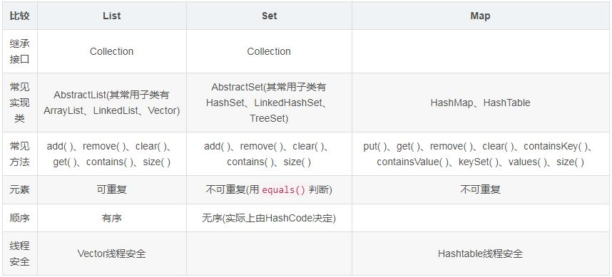

[toc]

---

## 基本数据类型

-  Java 中的几种基本数据类型是什么？对应的包装类型是什么？各自占用多少字节呢？

`Java`中有8种数据类型,分别为:

1. 6中数字类型:`byte`,`short`,`int`,`long`,`float`,`double`
2. 1种字符类型:`char`
3. 1中布尔类型:`boolean`

| 基本类型 | 位数 | 字节 | 默认值  |
| :------: | :--: | :--: | :-----: |
|   int    |  32  |  4   |    0    |
|  short   |  16  |  2   |    0    |
|   long   |  64  |  8   |   0L    |
|   byte   |  8   |  1   |    0    |
|   char   |  16  |  2   | 'u0000' |
|  float   |  32  |  4   |   0f    |
|  double  |  64  |  8   |   0d    |
| boolean  |  1   |      |  false  |

> 对于 boolean，官方文档未明确定义，它依赖于 JVM 厂商的具体实现。逻辑上理解是占用 1 位，但是实际中会考虑计算机高效存储因素。
>
> 注意：
>
> 1. Java 里使用 long 类型的数据一定要在数值后面加上 **L**，否则将作为整型解析：
> 2. `char a = 'h'`char :单引号，`String a = "hello"` :双引号

## `String`,`StringBuffer`和`StringBuilder` 的区别

`Sttring`是`final`修饰的,不可变,每次操作都会产生新的String对象

`StringBuffer` 和`StringBuilder`都是在原对象上操作

`StringBuffer`是线程安全的,`StringBuilder`线程不安全

`StringBuffer`方法都是`synchronized`修饰的,性能不高

性能:`StringBuilder` > `StringBuffer` > `String`

使用场景:

经常需要改变字符串内容时使用`StringBuffer`和`StringBuilder`,优先使用`StringBuilder`,多线程使用共享变量时使用`StringBuffer`

## 重载和重写的区别

- 重载: 发生在同一个类中,方法名必须相同,参数类型不同,个数不同,顺序不同,方法返回值和访问修饰符可以不同,发生在编译时.
- 重写:发生在父子类中,方法名,参数列表必须相同,返回值范围小于等于父类,抛出的异常范围小于等于父类,访问修饰符范围大于等于父类,如果父类方法访问修饰符为`private`则子类就不能重写该方法

## 接口和抽象类的区别

- 抽象类可以存在普通成员函数,而接口中只能存在`public abstract`方法
- 抽象类中的成员变量可以是各种类型的,而接口中的成员变量只能是`public static final`类型的
- 抽象类中只能继承一个,接口可以实现多个

## `list`,`Map`和`set`的区别


- `list`:

==**有序**==,按对象进入的顺序保存对象,保持了每个元素的插入顺序,输出的顺序就是插入的顺序,==可重复==,允许多个`null`元素对象,可以使用`iterator`取出所有元素,再逐一遍历,还可以使用`get(int index)`获取指定下标.

常用的实现类有 `ArrayList、LinkedList` 和 `Vector`。ArrayList 最为流行，它提供了使用索引的随意访问，而 LinkedList 则对于经常需要从 List 中添加或删除元素的场合更为合适。

- `set`:

==无序,不可重复,最多允许一个`null`元素对象==,取元素时只能使用`iterator`接口取得所有元素,再逐一遍历各个元素,TreeSet通过 Comparator 或者 Comparable 维护了一个排序顺序。

Set 接口最流行的几个实现类是 HashSet、LinkedHashSet 以及 TreeSet。最流行的是基于 HashMap 实现的 HashSet；TreeSet 还实现了 SortedSet 接口，因此 TreeSet 是一个根据其 compare() 和 compareTo() 的定义进行排序的有序容器。

- `Map`:


Map不是collection的子接口或者实现类。Map是一个接口。Map 的 每个 Entry 都持有两个对象，也就是一个键一个值，Map 可能会持有相同的值对象但键对象必须是唯一的。

TreeMap 也通过 Comparator 或者 Comparable 维护了一个排序顺序。Map 里你可以拥有随意个 null 值但最多只能有一个 null 键。Map 接口最流行的几个实现类是 HashMap、LinkedHashMap、Hashtable 和 TreeMap。（HashMap、TreeMap最常用）

- 使用场景:
  - list：有序访问、索引访问
  - set(HashSet、LinkedHashSet 或者 TreeSet)：去重
  - map：键值存储

如果你经常会使用索引来对容器中的元素进行访问，那么 List 是你的正确的选择。如果你已经知道索引了的话，那么 List 的实现类比如 ArrayList 可以提供更快速的访问,如果经常添加删除元素的，那么肯定要选择LinkedList。

如果你想容器中的元素能够按照它们插入的次序进行有序存储，那么还是 List，因为 List 是一个有序容器，它按照插入顺序进行存储。

如果你想保证插入元素的唯一性，也就是你不想有重复值的出现，那么可以选择一个 Set 的实现类，比如 HashSet、LinkedHashSet 或者 TreeSet。所有 Set 的实现类都遵循了统一约束比如唯一性，而且还提供了额外的特性比如 TreeSet 还是一个 SortedSet，所有存储于 TreeSet 中的元素可以使用 Java 里的 Comparator 或者 Comparable 进行排序。LinkedHashSet 也按照元素的插入顺序对它们进行存储。

如果你以键和值的形式进行数据存储那么 Map 是你正确的选择。你可以根据你的后续需要从 Hashtable、HashMap、TreeMap 中进行选择。



## `==`与`equals`

- `==`:它的作用是判断两个对象的地址是不是相等。即判断两个对象是不是同一个对象。(**基本数据类型==比较的是值，引用数据类型==比较的是内存地址**)

> 因为 Java 只有值传递，所以，对于 == 来说，不管是比较基本数据类型，还是引用数据类型的变量，其本质比较的都是值，只是引用类型变量存的值是对象的地址。

- **`equals()`** : 它的作用也是判断两个对象是否相等，它不能用于比较基本数据类型的变量。`equals()`方法存在于`Object`类中，而`Object`类是所有类的直接或间接父类。

```java
public class test1 {
    public static void main(String[] args) {
        String a = new String("ab"); // a 为一个引用
        String b = new String("ab"); // b为另一个引用,对象的内容一样
        String aa = "ab"; // 放在常量池中
        String bb = "ab"; // 从常量池中查找
        if (aa == bb) // true
            System.out.println("aa==bb");
        if (a == b) // false，非同一对象
            System.out.println("a==b");
        if (a.equals(b)) // true
            System.out.println("aEQb");
        if (42 == 42.0) { // true
            System.out.println("true");
        }
    }
}
```

> - `String` 中的 `equals` 方法是被重写过的，因为 `Object` 的 `equals` 方法是比较的对象的内存地址，而 `String` 的 `equals` 方法比较的是对象的值。
> - 当创建 `String` 类型的对象时，虚拟机会在常量池中查找有没有已经存在的值和要创建的值相同的对象，如果有就把它赋给当前引用。如果没有就在常量池中重新创建一个 `String` 对象。

## `hashCode`与`equals`

- `hashCode()`:`hashCode()` 的作用是获取哈希码，也称为散列码；它实际上是返回一个 int 整数。这个哈希码的作用是确定该对象在哈希表中的索引位置。`hashCode()`定义在 JDK 的 `Object` 类中，这就意味着 Java 中的任何类都包含有 `hashCode()` 函数。另外需要注意的是： `Object` 的 hashcode 方法是本地方法，也就是用 c 语言或 c++ 实现的，该方法通常用来将对象的 内存地址 转换为整数之后返回。

```java
public native int hashCode();
```

散列表存储的是键值对(key-value)，它的特点是：能根据“键”快速的检索出对应的“值”。这其中就利用到了散列码！（可以快速找到所需要的对象）

- 为什么要有`hashCode`?

我们以“`HashSet` 如何检查重复”为例子来说明为什么要有 hashCode？

当你把对象加入 `HashSet` 时，`HashSet` 会先计算对象的 `hashcode` 值来判断对象加入的位置，同时也会与其他已经加入的对象的 `hashcode` 值作比较，如果没有相符的 `hashcode`，`HashSet` 会假设对象没有重复出现。但是如果发现有相同 `hashcode` 值的对象，这时会调用 `equals()` 方法来检查 `hashcode` 相等的对象是否真的相同。如果两者相同，`HashSet` 就不会让其加入操作成功。如果不同的话，就会重新散列到其他位置。

- **为什么重写 `equals` 时必须重写 `hashCode` 方法？**

如果两个对象相等，则 hashcode 一定也是相同的。两个对象相等,对两个对象分别调用 equals 方法都返回 true。但是，两个对象有相同的 hashcode 值，它们也不一定是相等的 。**因此，equals 方法被覆盖过，则 `hashCode` 方法也必须被覆盖。**`hashCode()`的默认行为是对堆上的对象产生独特值。如果没有重写 `hashCode()`，则该 class 的两个对象无论如何都不会相等（即使这两个对象指向相同的数据）

- **为什么两个对象有相同的 hashcode 值，它们也不一定是相等的？**

因为 `hashCode()` 所使用的杂凑算法也许刚好会让多个对象传回相同的杂凑值。越糟糕的杂凑算法越容易碰撞，但这也与数据值域分布的特性有关（所谓碰撞也就是指的是不同的对象得到相同的 `hashCode`。

我们刚刚也提到了 `HashSet`,如果 `HashSet` 在对比的时候，同样的 hashcode 有多个对象，它会使用 `equals()` 来判断是否真的相同。也就是说 `hashcode` 只是用来缩小查找成本。

## `ArrayList` 和 `LinkedList`区别

- `ArrayList`:基于动态数组,连续内存存储,适合下标访问(随机访问).扩容机制:因为数组长度固定,超出数组长度的数据时,需要新建数组,然后将老数组中的数据拷贝到新数组中,如果不是尾部插入数据还会涉及到元素的移动,使用尾插法并指定初始容量可以极大提高性能,甚至超过`LinkedList`(需要创建大量的`node`对象).
- `LinkedList`:基于链表,可以存储在分散的内存中,适合做数据插入删除操作,不适合查询,需要逐一遍历`LinkedList`必须使用`iterator`不能使用`for`循环,因为每次`for`循环体内通过`get(i)`获得某一元素时都需要对`list`从新进行遍历,性能消耗极大.另外不要试图使用`indexOf`等返回元素索引,并利用其进行遍历,使用`indexOf`对`list`进行遍历时,当结果为空时,会遍历整个列表.

## 如何实现数组和`List`之间的转换?

- `List`转换称为数组:调用`ArrayList`的`toArray`方法
- 数组转换为`List`:调用`Arrays`的`asList`方法

## `ArrayList`和`Vector`区别:

- Vector是同步的，而ArrayList不是。然而，如果你寻求在迭代的时候对列表进行改变，你应该使用CopyOnWriteArrayList。 
- ArrayList比Vector快，它因为有同步，不会过载。 
- ArrayList更加通用，因为我们可以使用Collections工具类轻易地获取同步列表和只读列表。

## `Array` 和 `ArrayList` 有何区别?

- Array可以容纳基本类型和对象，而ArrayList只能容纳对象。 
- Array是指定大小的，而ArrayList大小是固定的。 
- Array没有提供ArrayList那么多功能，比如addAll、removeAll和iterator等。

## `HashMap`和`HashTable`有什么区别?其底层实现是什么?

1. 区别:
   1. `HashMap`方法没有`synchronized`修饰,线程不安全,`HashTable`线程安全
   2. `HashMap`允许`key`和`value`为`null`,而`HashTable`不允许
   3. `HashTable`同步的,而`HashMap`是非同步的,效率上比`HashTable`要高
   4. hashMap去掉了HashTable 的contains方法，但是加上了containsValue（）和containsKey（）方法。
2. 底层实现:**数据+链表**实现

`jdk8`开始链表高度到8,数组长度超过64,链表转变为红黑树,元素以内部类`Node`结点存在

- 计算`key`的`hash`值,二次`hash`然后对数组长度取模,对应到数组下标

- 如果没有产生`hash`冲突(下标位置没有元素),则直接创建`Node`存入数组

- 如果产生`hash`冲突,先进行`equal`比较,相同则取代该元素,不同,则判断链表高度插入链表,链表高度达到8,并且数组长度到64则转变为红黑树,长度低于6则将红黑树转回链表

- key为null,存在下标0的位置

- HashMap概述：HashMap是基于哈希表的Map接口的非同步实现。此实现提供所有可选的映射操作，并允许使用null值和null键。此类不保证映射的顺序，特别是它不保证该顺序恒久不变。 HashMap的数据结构：在java编程语言中，最基本的结构就是两种，一个是数组，另外一个是模拟指针（引用），所有的数据结构都可以用这两个基本结构来构造的，HashMap也不例外。HashMap实际上是一个“链表散列”的数据结构，即数组和链表的结合体。当我们往Hashmap中put元素时,首先根据key的hashcode重新计算hash值,根绝hash值得到这个元素在数组中的位置(下标),如果该数组在该位置上已经存放了其他元素,那么在这个位置上的元素将以链表的形式存放,新加入的放在链头,最先加入的放入链尾.如果数组中该位置没有元素,就直接将该元素放到数组的该位置上。

  需要注意Jdk 1.8中对HashMap的实现做了优化,当链表中的节点数据超过八个之后,该链表会转为红黑树来提高查询效率,从原来的O(n)到O(logn)

对于在Map中插入、删除和定位元素这类操作，HashMap是最好的选择。然而，假如你需要对一个有序的key集合进行遍历，TreeMap是更好的选择。基于你的collection的大小，也许向HashMap中添加元素会更快，将map换为TreeMap进行有序key的遍历。

- `HashSet`的实现原理:

`HashSet`底层由`HashMap`实现

`HashSet`的值存放于`HashMap`的key上

`HashMap`的value统一为PRESENT

## `String`类的常用方法:

- indexOf()：返回指定字符的索引。
- charAt()：返回指定索引处的字符。
- replace()：字符串替换。
- trim()：去除字符串两端空白。
- split()：分割字符串，返回一个分割后的字符串数组。
- getBytes()：返回字符串的 byte 类型数组。
- length()：返回字符串长度。
- toLowerCase()：将字符串转成小写字母。
- toUpperCase()：将字符串转成大写字符。
- substring()：截取字符串。
- equals()：字符串比较。

## 抽象类必须要有抽象方法么?

不需要,抽象类不一定非要有抽象方法.

```java

abstract class Cat {
    public static void sayHi() {
        System.out.println("hi~");
    }
}
```

## 普通类和抽象类:

- 普通类不能包含抽象方法,抽象类可以包含抽象方法
- 抽象类不能直接实例化,普通类可以直接实例化

- 抽象类不能使用`final`修饰,定义抽象类就是让其他类继承的,如果定义为`final`该类就不能被继承,这样彼此就会产生矛盾.

## 接口和抽象类有什么区别?

- 实现:抽象类的子类使用`extends`来继承,接口必须使用`implements`来实现接口
- 构造函数:抽象类可以有`main`方法,并且我们能运行它,接口不能有`main`方法
- 实现数量:类可以实现很多个接口,但是只能继承一个抽象类
- 访问修饰符:接口中的方法默认使用`public`修饰,抽象类中的方法可以是任意访问修饰符

## `java`中`IO`流分为几种?

按功能来分:输入流`input`,输出流`output`

按类型来分:字节流和字符流

字节流还是字符流的区别:字节流按8位传输以字节为单位输入输出数据,字符流按16位传输以字符为单位输入输出数据

> 字节(Byte)是计量单位，表示数据量多少，是计算机信息技术用于计量存储容量的一种计量单位，通常情况下一字节等于八位。
>
> 字符(Character)计算机中使用的字母、数字、字和符号，比如'A'、'B'、'$'、'&'等。
>
> 一般在英文状态下一个字母或字符占用一个字节，一个汉字用两个字节表示。
>
> 字节与字符:
>
> - ASCII 码中，一个英文字母（不分大小写）为一个字节，一个中文汉字为两个字节。
> - UTF-8 编码中，一个英文字为一个字节，一个中文为三个字节。
> - Unicode 编码中，一个英文为一个字节，一个中文为两个字节。
> - 符号：英文标点为一个字节，中文标点为两个字节。例如：英文句号 **.** 占1个字节的大小，中文句号 **。**占2个字节的大小。
> - UTF-16 编码中，一个英文字母字符或一个汉字字符存储都需要 2 个字节（Unicode 扩展区的一些汉字存储需要 4 个字节）。
> - UTF-32 编码中，世界上任何字符的存储都需要 4 个字节。

## `BIO`,`NIO`和`AIO`区别:

- `BIO`:Block IO同步阻塞式IO,就是我们平常使用的传统IO,它的特点就是模式简单使用方便,并发处理能力低
- `NIO`:New IO 同步非阻塞IO,就是传统的IO升级,客户端和服务器端通过Channel(通道)通讯,实现了多路复用.
- `AIO`:Asynchronous IO 是NIO的升级,也叫NIO2,实现了异步非阻塞IO,异步IO的操作基于事件和回调机制.

## `Files`常用方法

- Files.exists()：检测文件路径是否存在。
- Files.createFile()：创建文件。
- Files.createDirectory()：创建文件夹。
- Files.delete()：删除一个文件或目录。
- Files.copy()：复制文件。
- Files.move()：移动文件。
- Files.size()：查看文件个数。
- Files.read()：读取文件。
- Files.write()：写入文件。

## 常用的容器:


## `Collection`和`Collections`区别:

- `java.util.Collection`是一个集合接口(集合类的一个顶级接口).它提供了对集合对象进行基本操作的同用接口方法.Collection接口在Java类库中有很多具体的实现.Collection接口的意义是为了各种具体的集合提供了最大化的统一操作方式,其直接记仇接口有List和Set.
- Collections则是集合类的一个工具类/帮助类,其中提供了一系列静态方法,用于对集合中元素进行排序,搜索以及线程安全等各种操作.

## 在`Queue`中`poll()`和`remove()`有什么区别?

`poll()`和`remove()`都是从队列中取出一个元素,但是`poll()`在获取元素失败的时候会返回空,但是`remove()`失败的时候回抛出异常

## 哪些集合类是线程安全的?

- `vector`:就比arraylist多了个同步化机制（线程安全），因为效率较低，现在已经不太建议使用。在web应用中，特别是前台页面，往往效率（页面响应速度）是优先考虑的。

- `statck`：堆栈类，先进后出。
- `hashtable`：就比hashmap多了个线程安全。
- `enumeration`：枚举，相当于迭代器。

## 迭代器`Iterator`是什么?

迭代器是一种设计模式，它是一个对象，它可以遍历并选择序列中的对象，而开发人员不需要了解该序列的底层结构。迭代器通常被称为“轻量级”对象，因为创建它的代价小

## `Iterator`怎么使用?有什么特点?

Java中的Iterator功能比较简单，并且只能单向移动：

(1) 使用方法iterator()要求容器返回一个Iterator。第一次调用Iterator的next()方法时，它返回序列的第一个元素。注意：iterator()方法是java.lang.Iterable接口,被Collection继承。

(2) 使用next()获得序列中的下一个元素。

(3) 使用hasNext()检查序列中是否还有元素。

(4) 使用remove()将迭代器新返回的元素删除。　

Iterator是Java迭代器最简单的实现，为List设计的ListIterator具有更多的功能，它可以从两个方向遍历List，也可以从List中插入和删除元素

## `Iterator`和`ListIterator`有什么区别?

- Iterator可用来遍历Set和List集合，但是ListIterator只能用来遍历List。 
- Iterator对集合只能是前向遍历，ListIterator既可以前向也可以后向。 
- ListIterator实现了Iterator接口，并包含其他的功能，比如：增加元素，替换元素，获取前一个和后一个元素的索引，等等。
