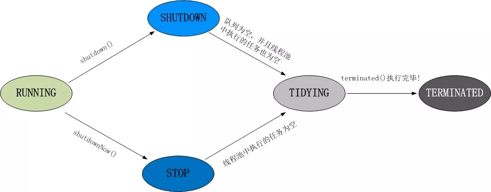

[toc]

---

# 多线程

## 并行和并发有什么区别?

- 并行是指两个或者多个事件在同一时刻发生;而并发是指两个或多个事件在同一时间间隔发生
- 并行是在不同实体上的多个事件,并发是在同一实体上的个多时间
- 在一台处理器上“同时”处理多个任务,在多台处理器上同时处理多个任务

并发编程的目标是充分利用处理器的每一个核,以达到最高的处理性能

## 线程和进程:

##### 何为进程？

进程是程序的一次执行过程，是系统运行程序的基本单位，因此进程是动态的。系统运行一个程序即是一个进程从创建，运行到消亡的过程。 或者我们可以这样说： 进程，是程序的一次执行过程，是系统运行程序的基本单位，因此进程是动态的。系统运行一个程序即是一个进程从创建，运行到消亡的过程。简单来说，一个进程就是一个执行中的程序，它在计算机中一个指令接着一个指令地执行着，同时，每个进程还占有某些系统资源如CPU时间，内存空间，文件，文件，输入输出设备的使用权等等。换句话说，当程序在执行时，将会被操作系统载入内存中。

##### 何为线程？

线程与进程相似，但线程是一个比进程更小的执行单位。一个进程在其执行的过程中可以产生多个线程。与进程不同的是同类的多个线程共享同一块内存空间和一组系统资源，所以系统在产生一个线程，或是在各个线程之间作切换工作时，负担要比进程小得多，也正因为如此，线程也被称为轻量级进程。

##### 何为多线程

多线程就是多个线程同时运行或交替运行。单核CPU的话是顺序执行，也就是交替运行。多核CPU的话，因为每个CPU有自己的运算器，所以在多个CPU中可以同时运行。

##### 为什么多线程是必要的

个人觉得可以用一句话概括：开发高并发系统的基础，利用好多线程机制可以大大提高系统整体的并发能力以及性能。

##### 为什么提倡多线程而不是多进程

线程就是轻量级进程，是程序执行的最小单位。使用多线程而不是用多进程去进行并发程序的设计，是因为线程间的切换和调度的成本远远小于进程。

##### 线程有什么优缺点

1）好处 使用多线程可以把程序中占据时间长的任务放到后台去处理，如图片、视屏的下载。 发挥多核处理器的优势，并发执行让系统运行的更快、更流畅，用户体验更好。 2）坏处 大量的线程降低代码的可读性。 更多的线程需要更多的内存空间。 当多个线程对同一个资源出现争夺时候要注意线程安全的问题。

##### 多线程中重要的概念

**同步和异步** 同步和异步通常用来形容一次方法调用。同步方法调用一旦开始，调用者必须等到方法调用返回后，才能继续后续的行为。异步方法调用更像一个消息传递，一旦开始，方法调用就会立即返回，调用者可以继续后续的操作。

关于异步目前比较经典以及常用的实现方式就是消息队列：在不使用消息队列服务器的时候，用户的请求数据直接写入数据库，在高并发的情况下数据库压力剧增，使得响应速度变慢。但是在使用消息队列之后，用户的请求数据发送给消息队列之后立即 返回，再由消息队列的消费者进程从消息队列中获取数据，异步写入数据库。由于消息队列服务器处理速度快于数据库（消息队列也比数据库有更好的伸缩性），因此响应速度得到大幅改善。

**并发(Concurrency)和并行(Parallelism)** 并发和并行是两个非常容易被混淆的概念。它们都可以表示两个或者多个任务一起执行，但是偏重点有些不同。并发偏重于多个任务交替执行，而多个任务之间有可能还是串行的。而并行是真正意义上的“同时执行”。

多线程在单核CPU的话是顺序执行，也就是交替运行（并发）。多核CPU的话，因为每个CPU有自己的运算器，所以在多个CPU中可以同时运行（并行）。

**高并发** 高并发（High Concurrency）是互联网分布式系统架构设计中必须考虑的因素之一，它通常是指，通过设计保证系统能够同时并行处理很多请求。

高并发相关常用的一些指标有响应时间（Response Time），吞吐量（Throughput），每秒查询率QPS（Query Per Second），并发用户数等。

**临界区** 临界区用来表示一种公共资源或者说是共享数据，可以被多个线程使用。但是每一次，只能有一个线程使用它，一旦临界区资源被占用，其他线程要想使用这个资源，就必须等待。在并行程序中，临界区资源是保护的对象。

**阻塞和非阻塞** 非阻塞指在不能立刻得到结果之前，该函数不会阻塞当前线程，而会立刻返回，而阻塞与之相反。

**守护线程（即daemon thread）**，是个服务线程，准确地来说就是服务其他的线程。

## 创建线程有哪几种方式?

①. 继承Thread类创建线程类

- 定义Thread类的子类，并重写该类的run方法，该run方法的方法体就代表了线程要完成的任务。因此把run()方法称为执行体。
- 创建Thread子类的实例，即创建了线程对象。
- 调用线程对象的start()方法来启动该线程。

②. 通过Runnable接口创建线程类

- 定义runnable接口的实现类，并重写该接口的run()方法，该run()方法的方法体同样是该线程的线程执行体。
- 创建 Runnable实现类的实例，并依此实例作为Thread的target来创建Thread对象，该Thread对象才是真正的线程对象。
- 调用线程对象的start()方法来启动该线程。

③. 通过Callable和Future创建线程

- 创建Callable接口的实现类，并实现call()方法，该call()方法将作为线程执行体，并且有返回值。
- 创建Callable实现类的实例，使用FutureTask类来包装Callable对象，该FutureTask对象封装了该Callable对象的call()方法的返回值。
- 使用FutureTask对象作为Thread对象的target创建并启动新线程。
- 调用FutureTask对象的get()方法来获得子线程执行结束后的返回值。

## runnable 和 callable 有什么区别？

- Runnable接口中的run()方法的返回值是void，它做的事情只是纯粹地去执行run()方法中的代码而已；
- Callable接口中的call()方法是有返回值的，是一个泛型，和Future、FutureTask配合可以用来获取异步执行的结果。

## 线程有哪些状态

线程通常都有五种状态，创建、就绪、运行、阻塞和死亡。

- 创建状态。在生成线程对象，并没有调用该对象的start方法，这是线程处于创建状态。
- 就绪状态。当调用了线程对象的start方法之后，该线程就进入了就绪状态，但是此时线程调度程序还没有把该线程设置为当前线程，此时处于就绪状态。在线程运行之后，从等待或者睡眠中回来之后，也会处于就绪状态。
- 运行状态。线程调度程序将处于就绪状态的线程设置为当前线程，此时线程就进入了运行状态，开始运行run函数当中的代码。
- 阻塞状态。线程正在运行的时候，被暂停，通常是为了等待某个时间的发生(比如说某项资源就绪)之后再继续运行。sleep,suspend，wait等方法都可以导致线程阻塞。
- 死亡状态。如果一个线程的run方法执行结束或者调用stop方法后，该线程就会死亡。对于已经死亡的线程，无法再使用start方法令其进入就绪 　　

## `sleep()`和`wait()`区别:

sleep()：方法是线程类（Thread）的静态方法，让调用线程进入睡眠状态，让出执行机会给其他线程，等到休眠时间结束后，线程进入就绪状态和其他线程一起竞争cpu的执行时间。因为sleep() 是static静态的方法，他不能改变对象的机锁，当一个synchronized块中调用了sleep() 方法，线程虽然进入休眠，但是对象的机锁没有被释放，其他线程依然无法访问这个对象。

wait()：wait()是Object类的方法，当一个线程执行到wait方法时，它就进入到一个和该对象相关的等待池，同时释放对象的机锁，使得其他线程能够访问，可以通过notify，notifyAll方法来唤醒等待的线程

## `notify()`和`notifyAll()`区别:

- 如果线程调用了对象的 wait()方法，那么线程便会处于该对象的等待池中，等待池中的线程不会去竞争该对象的锁。
- 当有线程调用了对象的 notifyAll()方法（唤醒所有 wait 线程）或 notify()方法（只随机唤醒一个 wait 线程），被唤醒的的线程便会进入该对象的锁池中，锁池中的线程会去竞争该对象锁。也就是说，调用了notify后只要一个线程会由等待池进入锁池，而notifyAll会将该对象等待池内的所有线程移动到锁池中，等待锁竞争。
- 优先级高的线程竞争到对象锁的概率大，假若某线程没有竞争到该对象锁，它还会留在锁池中，唯有线程再次调用 wait()方法，它才会重新回到等待池中。而竞争到对象锁的线程则继续往下执行，直到执行完了 synchronized 代码块，它会释放掉该对象锁，这时锁池中的线程会继续竞争该对象锁。

## 线程的`run()`和`start()`有什么区别?

每个线程都是通过某个特定Thread对象所对应的方法run()来完成其操作的，方法run()称为线程体。通过调用Thread类的start()方法来启动一个线程。

start()方法来启动一个线程，真正实现了多线程运行。这时无需等待run方法体代码执行完毕，可以直接继续执行下面的代码； 这时此线程是处于就绪状态， 并没有运行。 然后通过此Thread类调用方法run()来完成其运行状态， 这里方法run()称为线程体，它包含了要执行的这个线程的内容， Run方法运行结束， 此线程终止。然后CPU再调度其它线程。

run()方法是在本线程里的，只是线程里的一个函数,而不是多线程的。 如果直接调用run(),其实就相当于是调用了一个普通函数而已，直接待用**run()方法必须等待run()方法执行完毕才能执行下面的代码**，所以执行路径还是只有一条，根本就没有线程的特征，所以在**多线程执行时要使用start()方法而不是run()方法**。

## 创建线程池有哪几种方式?

①. newFixedThreadPool(int nThreads)

创建一个固定长度的线程池，每当提交一个任务就创建一个线程，直到达到线程池的最大数量，这时线程规模将不再变化，当线程发生未预期的错误而结束时，线程池会补充一个新的线程。

②. newCachedThreadPool()

创建一个可缓存的线程池，如果线程池的规模超过了处理需求，将自动回收空闲线程，而当需求增加时，则可以自动添加新线程，线程池的规模不存在任何限制。

③. newSingleThreadExecutor()

这是一个单线程的Executor，它创建单个工作线程来执行任务，如果这个线程异常结束，会创建一个新的来替代它；它的特点是能确保依照任务在队列中的顺序来串行执行。

④. newScheduledThreadPool(int corePoolSize)

创建了一个固定长度的线程池，而且以延迟或定时的方式来执行任务，类似于Timer。

## 线程池都有哪些状态?

线程池有5种状态:`Running`,`ShutDown`,`Stop`,`Tidying`,`Terminated`

线程池各个状态切换框架图:

## 线程池中`submit()`和`execute()`方法有什么区别?

- 接收参数不一样
- `submit`有返回值,而`execute`没有
- `submit`方便`Exception`处理

## 在java程序中怎样保证多线程的运行安全?

线程安全在三个方面体现:

- 原子性:提供互斥访问，同一时刻只能有一个线程对数据进行操作，（atomic,synchronized）；
- 可见性:一个线程对主内存的修改可以及时地被其他线程看到，（synchronized,volatile）；
- 有序性:一个线程观察其他线程中的指令执行顺序，由于指令重排序，该观察结果一般杂乱无序，（happens-before原则）。

## 多线程锁的升级原理是什么?

在Java中,锁共有4中状态,级别从低到高依次为:无状态锁,偏向锁,轻量级锁和重量级锁状态,这几个状态会随着竞争情况逐渐升级,锁可以升级但不能降级.

锁升级的过程:

## 什么事死锁?

死锁是指两个或两个以上的进程在执行过程中，由于竞争资源或者由于彼此通信而造成的一种阻塞的现象，若无外力作用，它们都将无法推进下去。此时称系统处于死锁状态或系统产生了死锁，这些永远在互相等待的进程称为死锁进程。是操作系统层面的一个错误，是进程死锁的简称，最早在 1965 年由 Dijkstra 在研究银行家算法时提出的，它是计算机操作系统乃至整个并发程序设计领域最难处理的问题之一。

## 怎么防止死锁?

死锁的四个必要条件：

- **互斥条件**：进程对所分配到的资源不允许其他进程进行访问，若其他进程访问该资源，只能等待，直至占有该资源的进程使用完成后释放该资源
- **请求和保持条件***：进程获得一定的资源之后，又对其他资源发出请求，但是该资源可能被其他进程占有，此事请求阻塞，但又对自己获得的资源保持不放
- **不可剥夺条件**：是指进程已获得的资源，在未完成使用之前，不可被剥夺，只能在使用完后自己释放
- **环路等待条件**：是指进程发生死锁后，若干进程之间形成一种头尾相接的循环等待资源关系

这四个条件是死锁的必要条件，只要系统发生死锁，这些条件必然成立，**而只要上述条件之 一不满足，就不会发生死锁**。理解了死锁的原因，尤其是产生死锁的四个必要条件，就可以最大可能地避免、预防和 解除死锁。所以，在系统设计、进程调度等方面注意如何不让这四个必要条件成立，如何确 定资源的合理分配算法，避免进程永久占据系统资源。此外，也要防止进程在处于等待状态的情况下占用资源。因此，对资源的分配要给予合理的规划。

## `TreadLocal`是什么?有哪些使用场景?

线程局部变量是局限于线程内部的变量，属于线程自身所有，不在多个线程间共享。Java提供ThreadLocal类来支持线程局部变量，是一种实现线程安全的方式。但是在管理环境下（如 web 服务器）使用线程局部变量的时候要特别小心，在这种情况下，工作线程的生命周期比任何应用变量的生命周期都要长。任何线程局部变量一旦在工作完成后没有释放，Java 应用就存在内存泄露的风险。

## `synchronized`底层实现原理:

`synchronized`可以保证方法或者代码块在运行时,同一时刻只有一个方法可以进入到临界区,同时它还可以保证共享变量的内存可见性

Java中每一个对象都可以作为锁,这是`synchronized`实现同步的基础:

- 普通同步方法,锁是当前实例对象
- 静态同步方法,锁是当前类的class对象
- 同步方法快,锁是括号里面的对象

## `synchronized`和`volatile`的区别:

- `volatile`本质是在告诉jvm当前变量在寄存器(工作内存)中的值是不确定的,需要从主内存中读取; `synchronized`则是锁定当前变量,只有当前线程可以访问该变量,其他线程呗阻塞住.
- `volatile`仅能使用在变量级别;`synchronized`则可以使用在变量,方法和类级别的
- `volatile`仅能实现变量的修改可见性,不能保证原子性;而`synchronized`则可以保证变量的修改可见性和原子性
- `volatile`不会改变线程的阻塞;`synchronized`可能会造成线程的阻塞
- `volatile`标记的变量不会被编译器优化;`synchronized`标记的变量可以被编译前优化

## `synchronized`和`Lock`区别:

- 首先`synchronized`是java内置关键字,在jvm层面,`Lock`是个java类
- `synchronized`无法判断是否获取锁的状态,`Lock`可以判断是否获取到锁

- `synchronized`会自动释放锁(a线程执行完全同步代码块会释放锁;b线程执行过程中发生异常会释放锁),`Lock`需要在`finally`中手工释放锁(`unlock()`方法释放锁),否则容易造成线程死锁
- 用`synchronized`关键字的两个线程1和线程2,如果当前线程1获得锁,线程2等待,如果线程1阻塞,线程2会一直等待下去,而`Lock`锁就不一定会等待下去,如果尝试获取不到锁,线程可以不用一直等待就结束了
- `synchronized`的锁可重入,不可中断,非公平,而`Lock`锁可重入,可判断,可公平(两者皆可)
- `Lock`锁适合大量同步的代码的同步问题,`synchronized`锁适合代码量少的同步问题

## `synchronized`和`ReentrantLock`区别:

`synchronized`是和`if`,`else`,`for`,`while`一样的关键字,`ReentrantLock`是类,这是二者本质的区别,`ReentrantLock`提供了比`synchronized`更多更灵活的特性,可以被继承,可以有方法,可以有各种各样的类变量,`ReentrantLock`比`synchronized`的扩展性体现在几点上:

- `ReentrantLock`可以对获取锁的等待时间进行设置,这样就避免了死锁
- `ReentrantLock`可以获取各种锁的信息
- `ReentrantLock`可以灵活地实现多路通知

另外,二者锁机制起始也是不一样的:`ReentrantLock`底层调用的是`Unsafe`的`park`方法加锁,`synchronized`操作的应该是对象头中`mark word`

## `atomic`的原理:

`atomic`包中的类基本的特性就是在多线程环境下,当有多个线程同时对单个(包括基本类型及引用类型)变量进行操作时,具有排他性,即当多个线程同时对该变量的值进行更新时,仅有一个线程能成功,而未成功的线程可以像自旋锁一样,继续尝试,一直等到执行成功.

`atomic`系列的类中的核心方法会调用`unsafe`类中的几个本地方法,我们需要先知道一个东西就是`Unsafe`类,全名:`sun.misc.Unsafe`,这个类中包含了大量的对C代码的操作,包括很多直接内存分配以及原子操作的调用,而它之所以标记为非安全的,是告诉你这个里面大量的方法调用都会存在安全隐患,需要小心使用,例如在通过`unsafe`分配内存的时候,如果自己指定某些区域可能会导致一些类似C++一样的指针越界到其它进程的问题.

---

# 反射

## 什么是反射?

反射主要是指程序可以访问,检测和修改它本身状态或者行为的一种能力

Java反射:在Java运行时环境中,对于任意一个类,能否知道这个类有哪些属性和方法?对于任意一个对象,能否调用它的任意一个方法

Java反射机制主要提供了一下功能:

- 在运行时判断任意一个对象所属的类
- 在运行时构造任意一个类的对象
- 在运行时判断任意一个类所具有的成员变量和方法
- 在运行时调用任意一个对象的方法

## 什么是`java`序列化?什么情况下需要序列化?

为了保存在内存中的各种对象的状态(也就是实例变量,不是方法),并且可以把保存的对象状态再读出来.虽然我们可以用自己的各种各样的方法来保存Object states,但是java为我们提供了一种更好的保存对象状态的机制,就是**序列化**

什么情况下需要序列化:

- 当我们想要把内存中的对象状态保存到一个文件中或者数据库中的时候
- 当我们想套接在网络上传送对象的时候
- 当我们想通过RMI(Java Remote Method Invocation)传输对象的时候
- 一般来说如果你的对象需要网络传输或者持久化 (对象直接转换为字节的形式传输)，那么就需要实现Serializable接口。比如远程方法调RPC (Remote Procedure Call) 则接口参数就一定要实现Serializable接口；如果只是转换为json字符串的形式与网络打交道，那么就不需要实现Serializable接口。

## 动态代理是什么?有哪些应用?

动态代理:

当想要给实现了某个接口的类中的方法加一下额外的处理,比如说加日志,加事务等,可以给这个类创建一个代理,顾名思义就是创建一个新的类,这个类不仅包含原来类方法的功能,而且还在原来的基础上添加了额外处理的新类,这个代理类并不是定义好的,是动态生成的,具有解耦意义,灵活,扩展性强.

动态代理的应用:

- `Spring`的AOP
- 加事务
- 加权限
- 加日志

## 怎么实现动态代理?

首先必须定义一个接口,还要有一个`InvocationHandle`(将实现接口的类的对象传递给它)处理类.再有一个工具类`Proxy`(习惯性将其称为代理类,因为调用它的`newInstance()`可以产生代理对象,其实它只是一个产生代理对象的工具类).利用`InvocationHandle`,拼接代理类源码,将其编译成代理类的二进制,利用加载器加载,并将其实例化产生代理对象,最后返回.

# 对象拷贝

## 为什么要使用克隆?

相对一个对象进行处理,又想保留原有的数据进行接下来的操作,就需要克隆了,Java语言中克隆针对的是类的实例

## 如何实现对象克隆?

有两种方式:

1. 实现`Cloneable`接口,并重写`Object`类中的`clone()`方法(不是很建议使用)
2. 实现`Serializable`接口,通过对象的序列化和反序列化实现克隆,可以实现真正的深度克隆

注意：基于序列化和反序列化实现的克隆不仅仅是深度克隆，更重要的是通过泛型限定，可以检查出要克隆的对象是否支持序列化，这项检查是编译器完成的，不是在运行时抛出异常，这种是方案明显优于使用Object类的clone方法克隆对象。让问题在编译的时候暴露出来总是好过把问题留到运行时。

## 深拷贝和浅拷贝的区别:

- 浅拷贝只是复制了对象的引用地址,两个对象指向同一个内存地址,所以修改其中任意的值,另一个值都会随之变化.
- 深拷贝是将对象及其值复制过来,两个对象修改其中任意的值另一个值不会改变,这就是深拷贝.

# 异常

## `throw`和`throws`区别:

`throws’是用来声明一个方法坑跑出的所有异常信息,`throws是将异常声明但是不处理,而是将异常往上传,谁调用就是谁处理.而`throw`则是指跑出的一个具体的异常类型

## `final`,`finally``finalize`有什么区别?

- `final`可以修饰类,变量,方法.修饰类表示该类不能被继承;修饰方法别是该方法不能被重写;修饰变量表示该变量是一个常量不能重新赋值
- `finally`一般作用在`try-catch`代码块中,在处理异常的时候,通常我们的将一定要执行的代码放在`finally`代码块中,代表不管是否出现异常,该代码块都会被执行,一般用来存放一些关闭资源的代码。

- `finalize`是一个方法，属于`Object`类的一个方法，而`Object`类是所有类的父类，该方法一般由垃圾回收器来调用，当我们调用`System`的`gc()`方法的时候，由垃圾回收器调用`finalize()`，回收垃圾。

## `try-catch-finally`中哪个部分可以省略？

以下三种情况都是可以通过编译的：

1. `try-catch`
2. `try-finally`
3. `try-catch-finally`

可以省略catch或者finally。catch和finally不可以同时省略。

**如果 catch 中 return 了，finally 还会执行吗？**

会。

（1）finally的作用就是，无论出现什么状况，finally里的代码一定会被执行。

（2）如果在catch中return了，也会在return之前，先执行finally代码块。

（3）而且如果finally代码块中含有return语句，会覆盖其他地方的return。

（4）对于基本数据类型的数据，在finally块中改变return的值对返回值没有影响，而对引用数据类型的数据会有影响。

**注：**
finally也不是一定会被执行，如果在try代码块中，System.exit()强制退出程序,或者在执行try代码块中报错抛出异常（例如5/0），finally代码块就不会执行了。

## 常见的异常类：

- NullPointerException：当应用程序试图访问空对象时，则抛出该异常。
- SQLException：提供关于数据库访问错误或其他错误信息的异常。
- IndexOutOfBoundsException：指示某排序索引（例如对数组、字符串或向量的排序）超出范围时抛出。 
- NumberFormatException：当应用程序试图将字符串转换成一种数值类型，但该字符串不能转换为适当格式时，抛出该异常。
- FileNotFoundException：当试图打开指定路径名表示的文件失败时，抛出此异常。
- IOException：当发生某种I/O异常时，抛出此异常。此类是失败或中断的I/O操作生成的异常的通用类。
- ClassCastException：当试图将对象强制转换为不是实例的子类时，抛出该异常。
- ArrayStoreException：试图将错误类型的对象存储到一个对象数组时抛出的异常。
- IllegalArgumentException：抛出的异常表明向方法传递了一个不合法或不正确的参数。
- ArithmeticException：当出现异常的运算条件时，抛出此异常。例如，一个整数“除以零”时，抛出此类的一个实例。 
- NegativeArraySizeException：如果应用程序试图创建大小为负的数组，则抛出该异常。
- NoSuchMethodException：无法找到某一特定方法时，抛出该异常。
- SecurityException：由安全管理器抛出的异常，指示存在安全侵犯。
- UnsupportedOperationException：当不支持请求的操作时，抛出该异常。
- RuntimeExceptionRuntimeException：是那些可能在Java虚拟机正常运行期间抛出的异常的超类。