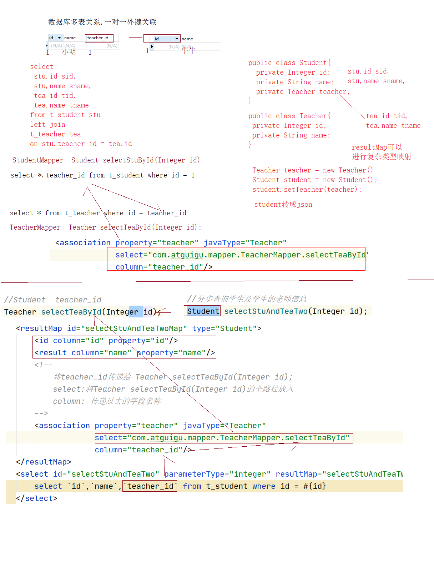

# Mybatis-02

## 课程大纲

# 11、MyBatis的注解使用方式

## 注解的使用示例:

```java
//读操作@Select  写@Update
public interface UserMapper {

    @Select("select id,last_name userName ,sex from t_user where id = #{id}")
    User selectUser(int id);

    @Select("select id,last_name userName ,sex from t_user")
    List<User> selectUserList();

    @Update("update t_user set last_name = #{lastName}, sex = #{sex} where id = #{id}")
    int updateUser(User user);

    @Delete("delete from t_user where id = #{id}")
    int deleteUserById(int id);

    /
     * @SelectKey注解相当于之前的selectKey标签 <br/>
     * statement属性是sql语句 <br/>
     * before属性设置是否先执行selectKey标签的sql语句 <br/>
     * keyProperty属性设置返回的主键值注入到JavaBean的哪个属性中<br/>
     * @param user
     * @return
     */
    @Insert("insert into t_user(`last_name`,`sex`) values(#{lastName},#{sex})")
    @SelectKey(before = false, keyProperty = "id", resultType = Integer.class, statement = { "select last_insert_id()" })
    int insertUser(User user);
}

查询一定使用select,写操作可以使用@Update进行通用
```

## mybatis-config.xml配置文件中导入

```xml
<mappers>
    <package name="com.atguigu.mapper"/>
</mappers>
```

# 12、mybatis的参数传递

## 12.1、一个普通数据类型

当一个方法中只有一个普通数据类型。在mapper配置文件中可以使用#{}占位符来进行占位输出。

\#{} 占位符中，可以写参数的 #{变量名}。	也可以写 #{value}。

方法：

```java
int deleteUserById(int id);
```

\#{变量名}

```xml
<delete id="deleteUserById" parameterType="int">
    delete from t_user where id = #{id}
</delete>
```

\#{value}

```xml
<delete id="deleteUserById" parameterType="int">
    delete from t_user where id = #{value}
</delete>
```

## 12.2、多个普通数据类型

多个普通的参数。当我们需要使用 #{} 占位输出的时候，可以使用

param1，param2 …… paramN

也就是 #{param1} …… #{paramN} 

或者使用@Param命名参数 

### 使用param1、param2 …… paramN 占位输出参数  

方法:

```java
public List<User> findUserByNameOrSex(String username, int sex);
```

使用param1、param2 …… paramN 的方式 占位输出参数

```xml
<select id="findUserByNameOrSex" resultType="user">
    select id,last_name as lastName,sex from t_user WHERE last_Name = #{param1} or sex = #{param2}
</select>
```

### 或使用arg0,arg1.....arg(N-1)占位输出参数

```xml
<select id="findUserByNameOrSex" resultType="user">
    select id,last_name as lastName,sex from t_user WHERE last_Name = #{arg0} or sex = #{arg1}
</select>
```

### 使用@Param注解命名参数

方法：

```java
public List<User> findUserByNameOrSex(@Param("lastName") String username, @Param("sex") int sex);
```

使用命名参数输出：

```xml
<select id="findUserByNameOrSex" resultType="com.atguigu.bean.User" >
    select id,last_name lastName,sex from t_user where last_name = #{lastName} or sex = #{sex}
</select>
```

## 12.3、Mybatis底层等曾参数封装


底层参数最终封装成了map  **@Param使用居多**

1:注解findUserByNameOrSex(@Param("lastName") String lastName,@Param("sex") 

map{"lastName":"老虎","sex":0,"param1":"老虎","parm2":0}

2:使用#{arg0}  or #{parm1}

map{"arg0":"老虎","arg1":0,"param1":"老虎","parm2":0}

## 12.4、传递一个Map对象作为参数

当我们的参数为map对象的时候。我们可以使用 map对象的key来做为占位符，输出数据。

\#{map的key} 来做为占位符的输出

使用示例如下：

方法：

```java
List<User> findUserByMap(Map<String, Object> map);
```

调用的代码：

```java
@Test
public void testfindUserByMap(){
    Map<String, Object> map =new HashMap<>();
    map.put("lastName","琳");
    map.put("sex",1);
    List<User> list = userMapper.findUserByMap(map);
    list.forEach(user -> {
        System.err.println(user);
    });
}
```

配置如下：

注意:map的key必须与#{}的名称一致

```xml
<select id="findUserByMap" resultType="user" >
    select id,last_name lastName,sex from t_user where last_name = #{lastName} and sex = #{sex}
</select>
```

## 12.5、一个Pojo数据类型

当方法的参数是一个复杂类型的对象的时候。我们可以使用 对象的属性名。当成占位符的名称。比如：#{ 属性名 },根据对象的getter方法取值

示例：

```java
int insertUser(User user);
```

mapper中的配置：

```xml
<insert id="insertUser" parameterType="user">
    insert into t_user(`last_name`,`sex`) values(#{lastName},#{sex})
</insert>
```

通过getter取值

## 12.6、多个Pojo数据类型

当有多个复杂pojo对象做为参数传递给方法使用时候。我们要取出数据做为sql的参数。可以使用如下方式：

#{param1.属性名}

……

#{paramN.属性名}

也可以使用@Param命名参数。给每个pojo对象起一个别名。然后再通过 #{别名.属性名} 的方式取出数据值做为参数使用。

使用示例：

默认param1、param2、paramN形式取对象属性。配置如下：

方法：

```java
List<User> findUserByTwoUser(User user1, User user2);
```

配置如下：

```xml
<select id="findUserByTwoUser" resultType="User">
    select id,last_name lastName,sex from t_user where last_name = #{param1.lastName} and sex = #{param2.sex}
</select>

<select id="findUserByTwoUser" resultType="User">
    select id,last_name lastName,sex from t_user where last_name = #{arg0.lastName} and sex = #{arg1.sex}
</select>
```

@Param注解命名参数的形式：

方法：

```java
 List<User> findUserByTwoUser(@Param("user1")User user1, (@Param("user2")User user2);
```

配置如下：

```xml
<select id="findUserByTwoUser" resultType="com.atguigu.bean.User" >
select id,last_name lastName,sex from t_user where last_name = #{user1.lastName} and sex = #{user2.sex}
</select>
```

## 12.7、模糊查询

现在要根据用户名查询用户对象。 也就是希望查询如下：	select * from t_user where last_name like '%b%'

方法：

```java
List<User> findUserLikelastName(String lastName);
```

### 12.7.1、#{} 的实现配置和调用

调用代码：

```java
@Test
public void findUserLikeName() {
    UserMapper userMapper = sqlSession.getMapper(UserMapper.class);
    List<User> list = userMapper.findUserLikelastName("%"+"b"+"%");
    System.err.println(list);
}
```

配置如下：

```xml
<select id="findUserLikelastName" resultType="User">
    select id,last_name lastName,sex from t_user where last_name like #{lastName}
</select>
```

### 12.7.2、${value} 的实现配置和调用  

${} 的实现，只是原样的输出参数的值。然后做字符串的拼接操作。

```java
@Test
public void findUserLikeName() {
    UserMapper userMapper = sqlSession.getMapper(UserMapper.class);
    List<User> list = userMapper.findUserLikelastName("b");
    System.err.println(list);
}
```

配置如下:

```xml
<select id="findUserLikelastName" resultType="User">
    select id,last_name lastName,sex from t_user where last_name like '%${value}%'
</select>
```

### 12.7.3、#{}和${}的区别

#{} 在mapper的配置文件的sql语句中，它是占位符， 相当于 ? 号。

${} 在 mapper 的配置文件的 sql 语句中，它是原样输出变量的值，然后以字符串拼接的功能进行操作。

${} 中只能写value，或者是@Param命名参数后的参数名称

在输出参数的时候，我们并不推荐使用 ${} 来输出。因为可能会导至 sql 注入问题的存在 

比如：

select * form t_user where id = #{id}

相当于：

select * from t_user where id = ?

而

select * from t_user where id = ${value}

相当于

select * from t_user where id = 原样输出变量的值

### 12.7.4、MySQL的字符串拼接，concat函数实现。

在mysql中，有一个字符串拼接操作的函数。叫concat函数。当我们需要做类似于like 这种查询的时候。我们可以使用 #{} 组合 concat来解决参数输入，以及不需要在传递参数的时候，加两个%%的情况。还可以解决sql注入问题。使用如下：

```sql
select concat('a','b','c');  abc
```

配置如下：

```xml
<select id="findUserLikeName" resultType="User">
select id,last_name lastName,sex from t_user where last_name like concat('%',#{name},'%')
</select>
```

# 13、自定义结果集

## 13.1、自定义结果集介绍

当数据库表字段名称与javaBean中属性不一致时,我们可以使用resultMap进行手动映射

```xml
<?xml version="1.0" encoding="UTF-8" ?>
<!DOCTYPE mapper
        PUBLIC "-//mybatis.org//DTD Mapper 3.0//EN"
        "http://mybatis.org/dtd/mybatis-3-mapper.dtd">
<mapper namespace="com.atguigu.mapper.UserMapper">
<!-- 使用resultMap解决数据库字段与实体类属性名称不一致的问题 -->
    <resultMap id="selectUserMap" type="User">
        <id property="id" column="id"/>
        <result property="lastName" column="last_name"/>
        <result property="sex" column="sex"/>
    </resultMap>
    <select id="selectUserById" parameterType="int" resultMap="selectUserMap">
        select `id`,last_name,sex from t_user where id = #{id}
    </select>
</mapper>
```

自定义结果集，可以给复杂的对象使用。也就是对象内又嵌套一个对象。或者一个集合。

在这种情况下。前面学过的知识点，已经无法直接获取出对象内对象的信息。

这个时候就需要使用resultMap自定义结果集来返回需要的数据。

## 13.2、创建一对一数据库表

## 一对一数据表

 创建学生表

```sql
create table t_student(
   `id` int primary key auto_increment,
   `name` varchar(50),
    `teacher_id` int ,
	 foreign key(`teacher_id`) references t_teacher(`id`)
);
```

创建老师表

```sql
create table t_teacher(
	`id` int primary key auto_increment,
	`name` varchar(50)
);
```

 插入初始化数据

```sql
insert into t_student(`name`,teacher_id) values('stu青',1);
insert into t_student(`name`,teacher_id) values('stu红',2);
insert into t_student(`name`,teacher_id) values('stu丽',3);
insert into t_teacher(`name`) values('tea明');
insert into t_teacher(`name`) values('tea强');
insert into t_teacher(`name`) values('tea飞');
```

## 13.3、创建实体对象

学生对象

```java
public class Student {
	private int id;
	private String name;
	private Teacher teacher;
}
```

老师对象

```java
public class Teacher {
	private int id;
	private String name;
}
```

## 13.4、一对一的使用示例

### 13.4.1、创建 StudentMapper接口

```java
public interface StudentMapper {
	Student selectStuAndTea(Integer id);
}
```

### 13.4.2、级联属性的映射配置

```xml
<?xml version="1.0" encoding="UTF-8" ?>
<!DOCTYPE mapper
        PUBLIC "-//mybatis.org//DTD Mapper 3.0//EN"
        "http://mybatis.org/dtd/mybatis-3-mapper.dtd">
<mapper namespace="com.atguigu.mapper.StudentMapper">
    <!--
		resultMap标签专门用来定义自定义的结果集数据。
			type属性设置返回的数据类型
			id属性定义一个唯一标识
	 -->
    <resultMap type="Student" id="selectStuAndTeaMap">
        <!-- id定义主键列 -->
        <id column="id" property="id"/>
        <!-- result 定义一个列和属性的映射 -->
        <result column="name" property="name"/>
        <!-- teacher.id 和  teacher.name 叫级联属性映射 -->
        <result column="tname" property="teacher.name"/>
        <result column="sid" property="teacher.id"/>
    </resultMap>
    <select id="selectStuAndTea" parameterType="integer" resultMap="selectStuAndTeaMap">
        select
         stu.id sid,
         stu.name sname,
         tea.id tid,
         tea.name tname
        from t_student stu
        left join t_teacher tea
        on stu.teacher_id = tea.id
        where stu.id = #{id};
    </select>
</mapper>
```

### 13.4.3、<association/> 嵌套结果集映射配置

<association /> 标签可以给返回结果中对象的属性是子对象的情况，进行映射。

比如：Student对象中有一个子对象Teacher。就可以使用<association /> 来进行映射返 

1:映射到resultMap

```xml
<resultMap id="teaMap" type="com.atguigu.pojo.Teacher">
    <result column="id" property="id"/>
    <result column="NAME" property="name"/>
</resultMap>

<resultMap id="selectStuAndTeaMap" type="com.atguigu.pojo.Student">
    <id column="sid" property="id"/>
    <result column="sname" property="name"/>
    <!--
            association:可以进行多表关联
        -->
    <association property="teacher" resultMap="teaMap"/>
</resultMap>
```

2:在内部进行映射

```xml
<?xml version="1.0" encoding="UTF-8" ?>
<!DOCTYPE mapper
        PUBLIC "-//mybatis.org//DTD Mapper 3.0//EN"
        "http://mybatis.org/dtd/mybatis-3-mapper.dtd">
<mapper namespace="com.atguigu.mapper.StudentMapper">

    <resultMap id="selectStuAndTeaMap" type="Student">
        <id column="id" property="id"/>
        <result column="name" property="name"/>
     <!--   <result column="tname" property="teacher.name"/>
        <result column="sid" property="teacher.id"/>-->
        <!--
           	  association 标签可以给一个子对象定义列的映射。
               property 属性设置 子对象的属性名 teacher
               javaType 属性设置子对象的全类名
        -->
        <association property="teacher" javaType="Teacher">
            <!-- id 属性定义主键 -->
            <id column="sid" property="id"/>
            <!-- result 标签定义列和对象属性的映射 -->
           <result column="tname" property="name"/>
        </association>
    </resultMap>
    <select id="selectStuAndTea" resultMap="selectStuAndTeaMap">
       select
          stu.id,
            stu.name,
            tea.name tname,
            tea.id tid
        from t_student stu
        left join t_teacher tea
        on stu.teacher_id = tea.id
        where stu.id = #{id}
    </select>
</mapper>
```

### 13.4.4、StudentMapper的测试代码

```java
@Test
public void testqueryStudentAndTea(){
    Student student = studentMapper.selectStuAndTea(1);
    System.err.println(student);
}
```

运行的结果：

 

### 13.4.5、<association/> 定义分步查询

添加一个 TeacherMapper 接口

```java
public interface TeacherMapper {
	Teacher selectTeaById(int stuId);
}
```

添加 TeacherMapper接口对应的配置文件

```xml
<?xml version="1.0" encoding="UTF-8" ?>
<!DOCTYPE mapper
        PUBLIC "-//mybatis.org//DTD Mapper 3.0//EN"
        "http://mybatis.org/dtd/mybatis-3-mapper.dtd">
<mapper namespace="com.atguigu.mapper.TeacherMapper">
    <!-- 定义一个根据id查询锁的select -->
    <select id="selectTeaById" parameterType="int" resultType="Teacher">
		select id , name from t_teacher where id = #{stuId}
	</select>
</mapper>
```

在StudentMapper接口中，添加另一个方法分步查询：

```java
public interface StudentMapper {
	Student selectStudentByTwo(int id);
}
```

修改StudentMapper中的配置

```xml
<?xml version="1.0" encoding="UTF-8" ?>
<!DOCTYPE mapper
        PUBLIC "-//mybatis.org//DTD Mapper 3.0//EN"
        "http://mybatis.org/dtd/mybatis-3-mapper.dtd">
<mapper namespace="com.atguigu.mapper.StudentMapper">
    <resultMap id="selectStudentByTwoMap" type="Student">
        <id property="id" column="id"/>
        <result property="name" column="name"/>
        <!--
            association:用于多表
                property:映射
                javaType:映射的类型
                select:引用的第二个查询id
                column:取出查询出数据的列
         -->
        <association property="teacher" javaType="Teacher"
                     select="com.atguigu.mapper.TeacherMapper.selectTeaById"
                     column="teacher_id"/>
    </resultMap>
    <select id="selectStudentByTwo" resultMap="selectStudentByTwoMap">
        select `id`,`name` ,`teacher_id` from t_student where id = #{id}
    </select>
</mapper>
```

分步查询的测试代码：

```java
@Test
public void testqueryStuByTwoStep(){
    Student student = studentMapper.selectStudentByTwo(1);
    System.err.println(student);
}
```

运行结果：

 

## 13.5、延迟加载

延迟加载在一定程序上可以减少很多没有必要的查询。给数据库服务器提升性能上的优化。

要启用延迟加载，需要在mybatis-config.xml配置文件中，添加如下两个全局的settings配置。

```xml
<!-- 打开延迟加载的开关 --> 
<setting name="lazyLoadingEnabled" value="true" /> 
<!-- 将积极加载改为消极加载 按需加载 --> 
<setting name="aggressiveLazyLoading" value="false"/> 
```

修改mybatis-config.xml配置文件，添加全局的设置

```xml
<!-- 配置全局mybatis的配置 -->
<settings>
    <!-- 启用驼峰标识 -->
    <setting name="mapUnderscoreToCamelCase" value="true" />
    <!-- 打开延迟加载的开关 -->
    <setting name="lazyLoadingEnabled" value="true" />
    <!-- 将积极加载改为消息加载即按需加载 -->
    <setting name="aggressiveLazyLoading" value="false" />
</settings>
```

测试:使用第一个表中数据但是未使用第二个表中数据 


测试:全部使用




## 13.6、多对一、一对多的使用示例

### 13.6.1、创建一对多数据库

 一对多数据表

创建公交车表

```sql
create table t_bus(
	`id` int primary key auto_increment,
	`name` varchar(50)
);
#插入公交车信息
insert into t_bus(`name`) values('178');
insert into t_bus(`name`) values('189');
insert into t_bus(`name`) values('998');
insert into t_bus(`name`) values('320');
```

 创建乘客表

```sql
create table t_passenger(
	`id` int primary key auto_increment,
	`name` varchar(50),
	`bus_id` int,
	 foreign key(`bus_id`) references t_bus(`id`)
);
##插入乘客信息
insert into t_passenger(`name`,`bus_id`) values('红',1);
insert into t_passenger(`name`,`bus_id`) values('阳',1);
insert into t_passenger(`name`,`bus_id`) values('辰',1);
insert into t_passenger(`name`,`bus_id`) values('霖',2);
insert into t_passenger(`name`,`bus_id`) values('森',2);
insert into t_passenger(`name`,`bus_id`) values('武',3);
```

### 13.6.2、<collection/> 一对多，立即加载关联查询

创建实体对象

公交车对象

```java
public class Bus {
    private Integer id;
    private String name;
    private List<Passenger>passengers;
}
```

乘客对象

```java
public class Passenger {
	private int id;
	private String name;
 }
```

创建BusMapper接口类：

```java
public interface BusMapper {
    Bus queryBusAndPassById(Integer id);
}
```

编写BusMapper.xml配置文件

```xml
<?xml version="1.0" encoding="UTF-8" ?>
<!DOCTYPE mapper
        PUBLIC "-//mybatis.org//DTD Mapper 3.0//EN"
        "http://mybatis.org/dtd/mybatis-3-mapper.dtd">
<mapper namespace="com.atguigu.mapper.BusMapper">

    <resultMap id="selectBusAndPassByIdMap" type="Bus">
        <id column="id" property="id"/>
        <result column="name" property="name"/>
        <!--
           collection定义一个子集合对象返回
        -->
        <collection property="passengers" ofType="Passenger">
            <id column="pid" property="id"/>
            <result column="pname" property="name"/>
        </collection>
    </resultMap>
    <!-- 定义一个立即加载的查询Bus对象 -->
    <select id="selectBusAndPassById" resultMap="selectBusAndPassByIdMap">
        select
	        t_bus.*,
	        t_passenger.id as pid,
	        t_passenger.name as pname
        from t_bus
        LEFT JOIN t_passenger
        on t_bus.id = t_passenger.bus_id
        where t_bus.id = #{id}
    </select>
</mapper>
```

测试代码：

```java
@Test
public void testqueryBusAndPassById(){
    Bus bus = busMapper.selectBusAndPassById(1);
    System.err.println(bus);
}
```

运行效果：

 

### 13.6.3、一对多，赖加载

1:select id,name from t_bus where id = 1 公交车

2:拿到公交车id去查询乘客

select id,name from t_passenger where bus_id = id

创建一个PassengerMapper接口

```java
public interface PassengerMapper { 
    /**
     * 通过busId查询乘客
     * @param passengerId
     * @return
     */
    List<Passenger> selectPassByBid(int bid);
}
```

创建PassengerMapper.xml配置文件

```xml
<?xml version="1.0" encoding="UTF-8" ?>
<!DOCTYPE mapper
        PUBLIC "-//mybatis.org//DTD Mapper 3.0//EN"
        "http://mybatis.org/dtd/mybatis-3-mapper.dtd">
<mapper namespace="com.atguigu.mapper.PassengerMapper">
    <select id="selectPassByBid" resultType="Passenger">
        select id,name from t_passenger where bus_id = #{bid}
    </select>
</mapper>
```

测试

```java
@Test
public void queryPassengersByBusId(){
    List<Passenger> list = passengerMapper.selectPassByBid(1);
    list.forEach(passenger -> {
        System.err.println(passenger);
    });
}
```

在Bus接口中添加一个分步查询延迟加载的方法

```java
public interface BusMapper {

    Bus selectBusAndPassTwo(Integer id);
}
```

修改PassengerMapper.xml配置文件内容：

```xml
<?xml version="1.0" encoding="UTF-8" ?>
<!DOCTYPE mapper
        PUBLIC "-//mybatis.org//DTD Mapper 3.0//EN"
        "http://mybatis.org/dtd/mybatis-3-mapper.dtd">
<mapper namespace="com.atguigu.mapper.BusMapper">
    <resultMap id="selectBusAndPassTwoMap" type="Bus">
        <id column="id" property="id"/>
        <result column="name" property="name"/>
        <collection property="passengers" ofType="Passenger"
                    select="com.atguigu.mapper.PassengerMapper.selectPassByBid"
                    column="id"/>
    </resultMap>
    <select id="selectBusAndPassTwo" resultMap="selectBusAndPassTwoMap">
         select id,name from t_bus where id = #{id}
    </select>
</mapper>
```

测试立即加载的代码

```java
@Test
public void selectBusAndPassTwo(){
    Bus bus = busMapper.selectBusAndPassTwo(1);
    System.err.println(bus);
}
```

运行效果：

 

测试延迟加载


### 13.6.4、双向关联

修改乘客对象

```java
public class Passenger {
    private Integer id;
    private String name;
    private Bus bus;
}
```

PassengerMapper

```java
public interface PassengerMapper {
    /**
     * 通过id查询乘客并携带公交车信息
     * @param id
     * @return
     */
     Passenger queryPassById(int id);
}
```

修改PassengerMapper配置文件			

```xml
<resultMap id="queryPassByIdMap" type="Passenger">
    <id column="id" property="id"/>
    <result column="name" property="name"/>
    <association property="bus" javaType="Bus"
                 select="com.atguigu.mapper.BusMapper.queryBusByIdTwo"
                 column="bus_id"/>
</resultMap>
<select id="queryPassById" resultMap="queryPassByIdMap">
    select `id`,name,bus_id from t_passenger where id = #{id}
</select>
```

注意：双向关联，要小心进入死循环，

1、防止死循环就是不要调用toString方法

2、最后一次查询返回resultType.

修改测试的代码如下：

```java
@Test
public void queryPassengersById(){
    Passenger passengers = this.passengerMapper.queryPassById(2);
    System.err.println(passengers.getName());
    System.err.println("==================");
    System.err.println(passengers.getBus().getName());
}
```


## 13.7、多值传参

PassengerMapper接口:

根据指定公交车id查询乘客,并且乘客名称还要做模糊查询

```java
/**
     * 根据指定公交车id查询乘客,并且乘客名称还要做模糊查询
     */
List<Passenger> queryPassengerByBidOrLikeName(@Param("bid") Integer bid, @Param("name") String name);
```

PassengerMapper.xml配置文件:

```xml
<select id="queryPassengerByBidOrLikeName" resultType="Passenger">
         select id,name from t_passenger where bus_id = #{bid} or name like concat('%',#{name},'%')
    </select>
```

BusMapper接口:

```java
Bus queryBusByIdTwoArgs(Integer id);
```

BusMapper.xml配置文件

```xml
<resultMap id="queryBusByIdTwoArgsMap" type="Bus">
        <id property="id" column="id"/>
        <result property="name" column="name"/>
        <!--
            1:N延迟加载关联映射
            注意:bid要与传递的参数一致
        -->
        <collection property="passengers"
                    column="{bid=id,name=name}"
                    select="com.atguigu.mapper.PassengerMapper.queryPassengerByBidOrLikeName"/>
    </resultMap>
    <select id="queryBusByIdTwoArgs" resultMap="queryBusByIdTwoArgsMap">
        select `id`,name from t_bus where id = #{id}
    </select>
```

测试:

```java
@Test
public void testqueryBusByIdTwoArgs(){
    Bus bus = busMapper.queryBusByIdTwoArgs(1);
    System.err.println(bus);
}
```

