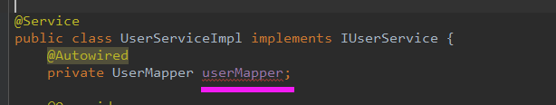

@Repository和@Controller、@Service、@Component的作用差不多，都是把对象交给spring管理。@Repository用在持久层的接口上，这个注解是将接口的一个实现类交给spring管理。
为什么有时候我们不用@Repository来注解接口,我们照样可以注入到这个接口的实现类呢?
1、spring配置文件中配置了MapperScannerConfigurer这个bean，它会扫描持久层接口创建实现类并交给spring管理。

2、接口上使用了@Mapper注解或者springboot中主类上使用了@MapperScan注解，和MapperScannerConfigurer作用一样。

注：不使用@Repository注解，idea会报警告，提示找不到这个bean，直接忽略即可。

@Repository的作用：
这是因为该注解的作用不只是将类识别为Bean，同时它还能将所标注的类中抛出的数据访问异常封装为 Spring 的数据访问异常类型。 Spring本身提供了一个丰富的并且是与具体的数据访问技术无关的数据访问异常结构，用于封装不同的持久层框架抛出的异常，使得异常独立于底层的框架。

