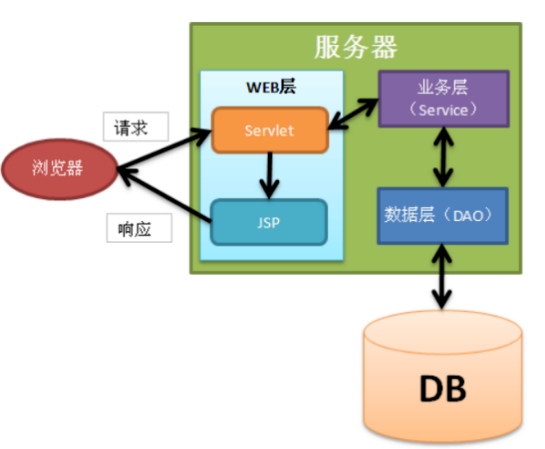

[TOC]

---

---

---

我们的开发架构一般都是基于两种形式，一种是 C/S 架构，也就是客户端/服务器，另一种是 B/S 架构，也就是浏览器服务器。在 JavaEE 开发中，几乎全都是基于 B/S 架构的开发。那么在 B/S 架构中，系统标准的三层架构包括：表现层、业务层、持久层。

- 表现层：

  也就是我们常说的web层。它负责接收客户端请求，向客户端响应结果，通常客户端使用http协议请求web 层， web 需要接收 http 请求，完成 http 响应。表现层包括展示层和控制层：控制层负责接收请求，展示层负责结果的展示。表现层依赖业务层，接收到客户端请求一般会调用业务层进行业务处理，并将处理结果响应给客户端。表现层的设计一般都使用 MVC 模型。（MVC 是表现层的设计模型，和其他层没有关系）

- 业务层：

  也就是我们常说的 service 层。它负责业务逻辑处理，和我们开发项目的需求息息相关。 web 层依赖业务层，但是业务层不依赖 web 层。业务层在业务处理时可能会依赖持久层，如果要对数据持久化需要保证事务一致性。（也就是我们说的，事务应该放到业务层来控制）

- 持久层：

  也就是我们是常说的 dao 层。负责数据持久化，包括数据层即数据库和数据访问层，数据库是对数据进行持久化的载体，数据访问层是业务层和持久层交互的接口，业务层需要通过数据访问层将数据持久化到数据库中。通俗的讲，持久层就是和数据库交互，对数据库表进行曾删改查的.

# MVC模型

- MVC 全名是 Model View Controller，是模型(model)－视图(view)－控制器(controller)的缩写，是一种用于设计创建 Web 应用程序表现层的模式。 MVC 中每个部分各司其职：
  - Model（模型） ：通常指的就是我们的数据模型。作用一般情况下用于封装数据。
  - View（视图） ：  通常指的就是我们的 jsp 或者 html。作用一般就是展示数据的。
    通常视图是依据模型数据创建的。
  - Controller（控制器） ：  是应用程序中处理用户交互的部分。 作用一般就是处理程序逻辑的。

---

----

---

# Java Web常见的三层结构

- **表现层**：也就是Web层，常见的框架有Spring MVC、Struts2 ，并包括用于展示的界面，如JSP界面；
- **业务层**：Service层，专注于业务逻辑的实现；
- **持久层**：也叫Dao层，常见的框架是Hibernate、MyBatis。负责与数据库的交互，封装数据库的访问细节；从数据库表中读取加载数据并实例化领域对象（Domian Object）也就是从数据库中读取数据，或者返过来将领域对象实例化到数据库中，也就是将数据写入到数据库中。

当服务器接受到来时浏览器的请求后，web层首先开始工作，根据不同的请求创建相应的servlet对请求进行处理转发，业务层在收到来自web层的信息之后，调用持久层，持久层访问数据库后得到返回结果，经过业务层将返回结果填充到显示界面中（JSP中），web层将Jsp界面作为浏览器请求的响应结果返回到浏览器。

工作流程如图:

# 三层结构在SSM框架中的体现

在**轻量级**的开发中,常对Web应用分成以下几层:

- **POJO**层:由一组POJO组成，是对系统各种对象的抽象表达。
- **DAO层**： 负责数据库的访问，增、删、改、查等，在MyBatis框架中也常被定义为Mapper层。
- **Service层**：由业务逻辑对象组成，是不同系统的业务逻辑的具体实现。
- **Controller层**：由控制器组成，对来自浏览器的用户请求进行拦截，并调用Service层的响应的业务逻辑组件处理用户请求，并转发返回结果到View层。
- **View层**：由JSP界面，PDF文档等组件组成，用于显示系统对用户请求的处理结果。

> 其中SSM框架经常把dao包命名为mapper包，并将mybatis框架的xxxMapper.java和xxxMapper.xml文件放到此包中

## Java代码源文件中几个包的作用

|     包名     |        名称        |                           作用                            |
| :----------: | :----------------: | :-------------------------------------------------------: |
|     DAO      | 数据访问层（接口） |      封装对数据库的操作，与数据操作有关的都放在这里       |
|     DTO      |     数据传输层     | 用于 service 层与 web 层之间传输，是Entity的一部分或组合  |
|    Entity    |       实体类       | 一般与数据库的表相对应，封装 dao 层取出来的数据为一个对象 |
|   Service    |  业务逻辑（接口）  |                     写我们的业务逻辑                      |
| Service-Impl |  业务逻辑具体实现  |         实现我们业务接口，一般事务控制是写在这里          |
|  Controller  |     MVC控制器      |              Spring MVC 就是在这里发挥作用的              |
|    Mapper    |   数据库具体操作   |    包含 xxxMapper.xml（和xxxMapper.java 二者互相对应）    |

> DAO： 里面可以是数据库操作，也可以是文件读写操作，甚至是redis缓存操作。也有人叫做数据持久层。因为Mybatis可以直接在配置文件中实现接口的每个方法，所以不需要DAOImpl。

> DTO：刚学框架的人可能不明白这个有什么用，其实就是用于service层与web层之间传输，为什么不直接用entity（pojo）？其实在实际开发中发现，很多时间一个entity并不能满足我们的业务需求，可能呈现给用户的信息十分之多；或者一个 Entity 包含的信息过多，我们需要的信息仅仅是Entity的一部分，为了减少网络传输，这时候就有了dto。 一般我们使用DTO类来继承entity实体类，在DTO类里放一些业务字段，并提供get、set方法。当我们在业务逻辑层或者交互层用到一些数据库中不存在的字段时，我们就需要在DTO类里放这些字段，这些字段的意义就相当于一些经处理过的数据库字段，实质意义就是方便数据交互，提高效率。

## 可选的额外包:

> Exception：自定义异常。
>
> Utils，即utility，工具辅助层，一组通用的代码集合，比如处理多语言功能，网站非法信息过滤等等功能的代码集；

## resource:存放后端配置文件

|      配置文件      |        名称        |                          内容                           |
| :----------------: | :----------------: | :-----------------------------------------------------: |
|   spring-dao.xml   | spring数据连接配置 |  配置数据库连接池、sqlSessionFactory对象，扫描DAO接口   |
| spring-service.xml |  spring 服务配置   |   扫描service包下注解、配置事务管理器、基于注解的事务   |
|   spring-mvc.xml   |  spring MVC 配置   | 开启框架注解模式、处理静态资源、配置jsp、扫描Controller |
|  jdbc.properties   |   数据库连接参数   |          配置 JDBC、数据库url、用户名、密码等           |
| mybatis-config.xml |  mybatis 配置文件  |           开启自增主键、使用列别名、驼峰转换            |
|  log4j.properties  |  web 日志输出参数  |                    web 日志输出参数                     |

## webapp:前端页面与配置文件

- 存放jsp、css等静态文件，web.xml 配置文件主要包含：
  - 配置 Spring 需要加载的配置文件、启用 disapatcher 转发处理所有的请求、指定编码格式

# 关于几个包之间的关系

- controller 包是 Spring MVC 的主要文件，其中对来自浏览器的各种请求进行转发和处理。在 controller 中会内置各种 Service 包中的对象，当接收到新的请求的时候，解析 url ，根据注解调用相应的服务来完成请求。
- entity 包常常与数据库中的表一一对应，dao 包中定义了数据库的基本操作，并在 mapper 包中的 xml 配置文件中完成数据操作的具体实现（也就是增、删、改、查）。Mybatis 可以实现 dao 与 .xml 的自动匹配，这时候就需要把 xxxMapper.xml 和 xxxMapper.java 放在同一个包内。
- 在 Service 包中定义了各种服务的接口，然后在 Service-Impl 包中对接口进行实现，在实现接口的时候会内置一个 DAO 包中的对象（因为 web 服务的实现肯定是涉及到数据访问的，而数据访问被抽象成了 DAO 包中的对象，所以服务的实现必须借助 DAO 包），然后我们借助 DAO 中的对象所实现的各种数据访问处理方法来实现具体的服务。

# SSM框架中各框架的作用

## **MyBatis**

- 持久层框架，负责数据库访问。

## **Spring MVC**

- 表现层框架，把模型、视图、控制器分离，组合成一个灵活的系统。

## **Spring**

- 整合项目的所有框架，管理各种Java Bean（mapper、service、controller），事务控制。