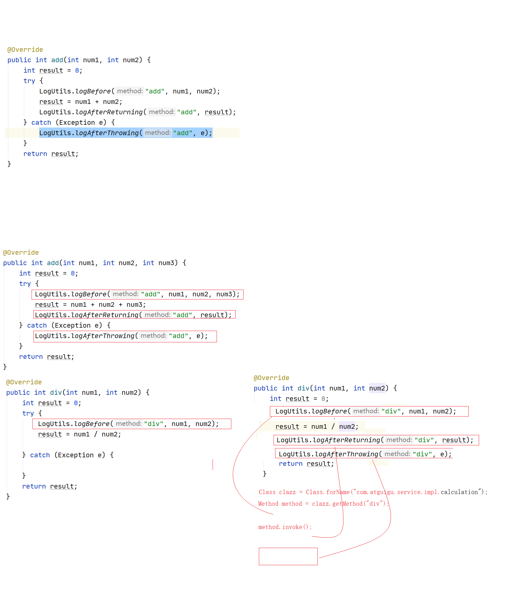

# Spring-02

# 6、Spring管理数据库连接池(重点)

## 6.1、Spring配置管理数据库连接池对象(重点)

jdbc.propertis

JdbcUtils

static

读取jdbc.propeteis

根据key得到value

赋值给连接池对象

 

配置文件信息:

```xml
<?xml version="1.0" encoding="UTF-8"?>
<beans xmlns="http://www.springframework.org/schema/beans"
       xmlns:xsi="http://www.w3.org/2001/XMLSchema-instance"
       xsi:schemaLocation="http://www.springframework.org/schema/beans
       http://www.springframework.org/schema/beans/spring-beans.xsd">
     <bean id="dataSource" class="com.alibaba.druid.pool.DruidDataSource">
        <property name="driverClassName" value="com.mysql.jdbc.Driver"/>
        <property name="url" value="jdbc:mysql://localhost:3306/Person?characterEncoding=UTF-8"/>
        <property name="username" value="root"/>
        <property name="password" value="root"/>
        <property name="initialSize" value="10"/>
        <property name="maxActive" value="10"/>
    </bean>

</beans>
```

测试代码:

```java
@Test
public void test1() throws SQLException {
    ApplicationContext context = new ClassPathXmlApplicationContext("applicationContext.xml");
    DruidDataSource dataSource = context.getBean("dataSource", DruidDataSource.class);
    System.err.println(dataSource.getConnection());
}
```

## 6.2、Spring引入单独的jdbc.properties配置文件(重点)

jdbc.properties属性配置文件:

```properties
user=root
password=root
url=jdbc:mysql://localhost:3306/Person?characterEncoding=UTF-8
driverClassName=com.mysql.jdbc.Driver
initialSize=5
maxActive=10
```

Spring配置文件:

```xml
<?xml version="1.0" encoding="UTF-8"?>
<beans xmlns="http://www.springframework.org/schema/beans"
       xmlns:xsi="http://www.w3.org/2001/XMLSchema-instance"
       xsi:schemaLocation="http://www.springframework.org/schema/beans
       http://www.springframework.org/schema/beans/spring-beans.xsd">

    <!--
        加载指定的配置文件读取到spring的配置文件中
     -->
    <bean class="org.springframework.beans.factory.config.PropertyPlaceholderConfigurer">
        <!--
            location:加载文件
            classpath*:jdbc.properties:类路径下jdbc.properties文件
        -->
        <property name="location" value="classpath:jdbc.properties"/>
    </bean>

    <bean id="dataSource" class="com.alibaba.druid.pool.DruidDataSource">
        <property name="driverClassName" value="${driverClassName}"/>
        <property name="url" value="${url}"/>
        <property name="username" value="${user}"/>
        <property name="password" value="${password}"/>
        <property name="initialSize" value="${initialSize}"/>
        <property name="maxActive" value="${maxActive}"/>
    </bean>
</beans>
```

测试代码:

```java
@Test
public void test1() throws SQLException {
    ApplicationContext context = new ClassPathXmlApplicationContext("applicationContext.xml");
    DruidDataSource dataSource = context.getBean("dataSource", DruidDataSource.class);
    System.err.println(dataSource.getConnection());
}
```

## 6.3、使用context名称空间加载jdbc.properties配置文件(重点)

jdbc.properteis属性配置文件:

```properties
user=root
password=root
url=jdbc:mysql://localhost:3306/Person?characterEncoding=UTF-8
driverClassName=com.mysql.jdbc.Driver
initialSize=5
maxActive=10
```

spring配置文件:

```xml
<?xml version="1.0" encoding="UTF-8"?>
<beans xmlns="http://www.springframework.org/schema/beans"
       xmlns:xsi="http://www.w3.org/2001/XMLSchema-instance"
       xmlns:context="http://www.springframework.org/schema/context"
       xsi:schemaLocation="http://www.springframework.org/schema/beans
       http://www.springframework.org/schema/beans/spring-beans.xsd http://www.springframework.org/schema/context https://www.springframework.org/schema/context/spring-context.xsd">

    <!--
        加载指定的配置文件读取到spring的配置文件中
     -->
    <context:property-placeholder location="classpath:jdbc.properties"/>
    <content:property-placeholder location="classpath:jdbc.properties"/>

    <bean id="dataSource" class="com.alibaba.druid.pool.DruidDataSource">
        <property name="driverClassName" value="${driverClassName}"/>
        <property name="url" value="${url}"/>
        <property name="username" value="${user}"/>
        <property name="password" value="${password}"/>
        <property name="initialSize" value="${initialSize}"/>
        <property name="maxActive" value="${maxActive}"/>
    </bean>
</beans>
```

测试代码:

```java
@Test
public void test1() throws SQLException {
    ApplicationContext context = new ClassPathXmlApplicationContext("applicationContext.xml");
    DruidDataSource dataSource = context.getBean("dataSource", DruidDataSource.class);
    System.err.println(dataSource.getConnection());
}
```

# 7、Spring EL表达式（了解内容）

Spring Expression Language，Spring表达式语言，简称SpEL。支持运行时查询并可以操作对象图。

和JSP页面上的EL表达式,SpEL根据JavaBean风格的getXxx()、setXxx()方法定义的属性访问对象图，完全符合我们熟悉的操作习惯。

## 1.2、基本语法

SpEL使用**#{…}**作为定界符，所有在大框号中的字符都将被认为是SpEL表达式。

## 1.3、使用字面量

●整数：<property name="count" value="#{5}"/>

●小数：<property name="frequency" value="#{89.7}"/>

●科学计数法：<property name="capacity" value="#{1e4}"/>

●String类型的字面量可以使用单引号或者双引号作为字符串的定界符号

<property name="name" value="#{'Chuck'}"/>

<property name='name' value='#{"Chuck"}'/>

●Boolean：<property name="enabled" value="#{false}"/>

## 1.4、引用其他bean

```xml
<bean id="emp04" class="com.atguigu.parent.bean.Employee">
	<property name="empId" value="1003"/>
	<property name="empName" value="Kate"/>
	<property name="age" value="21"/>
	<property name="dept" value="#{dept}"/> 
</bean>
```

## 1.5、引用其他bean的属性值作为自己某个属性的值

```xml
<bean id="emp05" class="com.atguigu.parent.bean.Employee">
	<property name="empId" value="1003"/>
	<property name="empName" value="Kate"/>
	<property name="age" value="21"/>
	<property name="deptName" value="#{dept.deptName}"/>
</bean>
```

## 1.6、调用非静态方法

```xml
<!-- 创建一个对象，在SpEL表达式中调用这个对象的方法 -->
<bean id="salaryGenerator" class="com.atguigu.spel.bean.SalaryGenerator"/>

<bean id="employee" class="com.atguigu.spel.bean.Employee">
	<!-- 通过对象方法的返回值为属性赋值 -->
	<property name="salayOfYear" value="#{salaryGenerator.getSalaryOfYear(5000)}"/>
</bean>
```

## 1.7、调用静态方法

```xml
<bean id="employee" class="com.atguigu.spel.bean.Employee">
	<!-- 在SpEL表达式中调用类的静态方法 -->
	<property name="circle" value="#{T(java.lang.Math).PI*20}"/>
</bean>
```

## 1.8、运算符

①算术运算符：+、-、*、/、%、^

②字符串连接：+

③比较运算符：<、>、==、<=、>=、lt、gt、eq、le、ge

④逻辑运算符：and, or, not, |

⑤三目运算符：判断条件?判断结果为true时的取值:判断结果为false时的取值

⑥正则表达式：matches

## 使用实例:

创建java实体Bean对象

```java
public class Person {
    private int id;
    private String name;
    private String phone;
    private double salary;
    private Car car;
}

public class Car {
    private String name;
    private String carNo;

    public String noStaticFun(){
        return "非静态方法";
    }

    public static String staticFun(){
        return "静态方法";
    }
}
```

实验26：[SpEL测试I]在SpEL中使用字面量

使用格式：#{数值} 		#{“字符串” || ‘字符串’}

```xml
<bean id="person" class="com.atguigu.pojo.Person">
    <property name="id" value="#{100}"/>
    <property name="name" value="#{'小明'}"/>
</bean>
```

实验27：[SpEL测试II]在SpEL中引用其他bean

使用格式：#{bean的id}

```xml
<bean id="person" class="com.atguigu.pojo.Person">
    <property name="car" value="#{car}"/>
</bean>
```

实验28：[SpEL测试III]在SpEL中引用其他bean的某个属性值

使用格式： #{bean.属性名}

```xml
<bean id="person" class="com.atguigu.pojo.Person">
    <property name="phone" value="#{car.carNo}"/>
</bean>
```

实验29：[SpEL测试IV]在SpEL中调用非静态方法

使用格式： #{bean.方法名(参数)}

```xml
<bean id="person" class="com.atguigu.pojo.Person">
   <property name="name" value="#{car.noStaticFun()}"/>
</bean>
```

实验30：[SpEL测试V]在SpEL中调用静态方法

使用格式：#{T(全名类).方法名(参数)}

```xml
<bean id="person" class="com.atguigu.pojo.Person">
    <property name="name" value="#{T(com.atguigu.pojo.Car).StaticFun()}"/>
</bean>
```

实验31：[SpEL测试VI]在SpEL中使用运算符

使用格式：#{表达式}

```xml
<bean id="person" class="com.atguigu.pojo.Person">
    <property name="salary" value="#{30000/12}"/>
</bean>
```

测试代码:

```java
@Test
public void test2(){
    ApplicationContext context = new ClassPathXmlApplicationContext("applicationContext.xml");
    Person person = context.getBean("person", Person.class);
    System.err.println(person);
}
```

# 8、注解功能	(重点)

## 8.1、使用注解配置Dao、Service、Controller组件

实验32：通过注解分别创建Dao、Service、Controller★

Spring配置bean的常用注解有

@Component		  配置Web层,Servcie层,DAO层之外的Bean对象.使用@Component

@Controller	 		配置Web层的组件.

@Service				  配置Service层的组件

@Repository			配置DAO组件

@Scope					 配置Bean的作用域 (单例.多例),用于类上,也可以用于方法上,当前方法上必须有@Bean

@PostConstruct      init-method

@PreDestory	       destory-method

@Value("abc")		  给基本类型注入    

@Value("${user}")   读取配置文件的key得到value给基本类型注入

@Value("${user:root}") 读取配置文件的key,如果没有次key,将root进行注入

@Configuraction      表明当前类是一个配置文件类

@ComponentScan(basePackages={})   扫描其它包下的注解

@Import  					导入其它配置文件类

@Bean						将当前方法返回值放入容器内,bean的Id是方法名

Bean对象:

pojo

```java
/**
 * 相当于以下的配置:<bean class="com.atguigu.pojo.Person" id="Person" />
 * @Scope:
 *  prototype:多例
 *  singleton:单例 默认
 */
@Component
@Scope("prototype")
public class Person {

}
```

dao

```java
/**
 * @Repository 注解的作用相当于: <bean class="com.atguigu.dao.PersonDao" id="PersonDao" />
 */
@Repository
public class PersonDao {

}
```

 service

```java
/**
 * @Service注解的作用相当于: <bean class="com.atguigu.service.PersonService" />
 */
@Service
public class PersonService {

}
```

controller

```java
/**
 * @Controller注解的作用是: <bean class="com.atguigu.controller.PersonController" id="PersonController" />
 */
@Controller
public class PersonController {

}
```

Spring配置文件

```xml
<!--扫描其它注解的包-->
<context:component-scan base-package="com.atguigu"/>
```

测试代码:

```java
@Test
public void test1(){
    ApplicationContext applicationContext = new ClassPathXmlApplicationContext("applicationContext.xml");
    Person Person = (Person) applicationContext.getBean("Person");
    System.err.println(Person);
}
```

## 8.2、指定扫描包时的过滤内容

实验33：使用context:include-filter指定扫描包时要包含的类

实验34：使用context:exclude-filter指定扫描包时不包含的类

<context:include-filter />	设置包含的内容

注意：通常需要与use-default-filters属性配合使用才能够达到“仅包含某些组件”这样的效果。

即：通过将use-default-filters属性设置为false，

<context:exclude-filter />	设置排除的内容

| 类别           | 示例                          | 说明                                                         |
| -------------- | ----------------------------- | ------------------------------------------------------------ |
| **annotation** | **com.atguigu.XxxAnnotation** | **过滤所有标注了XxxAnnotation的类。这个规则根据目标组件是否标注了指定类型的注解进行过滤** |
| **assignable** | **com.atguigu.BaseXxx**       | **过滤所有BaseXxx类的子类。这个规则根据目标组件是否是指定类型的子类的方式进行过滤。** |
| aspectj        | com.atguigu.*Service+         | 所有类名是以Service结束的，或这样的类的子类。这个规则根据AspectJ表达式进行过滤。 |
| regex          | com\.atguigu\.anno\.*         | 所有com.atguigu.anno包下的类。这个规则根据正则表达式匹配到的类名进行过滤。 |
| custom         | com.atguigu.XxxTypeFilter     | 使用XxxTypeFilter类通过编码的方式自定义过滤规则。该类必须实现org.springframework.core.type.filter.TypeFilter接口 |

自定义排除示例:

```xml
<!--扫描其它注解的包-->
<context:component-scan base-package="com.atguigu">
    <!--
            context:exclude-filter:排除
            type:排除类型  annotation:排除注解,并且包含子注解
            expression:排除注解
        -->
    <context:exclude-filter type="annotation" expression="org.springframework.stereotype.Repository"/>
    <!--
            assignable:类型排除
            PersonService:排除的类,包含子类
        -->
    <context:exclude-filter type="assignable" expression="com.atguigu.service.PersonService"/>

</context:component-scan>
```

自定义包含示例:

```xml
<context:component-scan base-package="com.atguigu" use-default-filters="false">
    <!-- context:include-filter标签是自定义包含(必须要和use-default-filters="false"一起组合使用)
            type属性指定使用哪种算法过滤
            expression属性指定需要的表达式
			annotation:只加载注解,包含子注解
			assignable:只加载类,包含子类
        -->
    <context:include-filter type="annotation" expression="org.springframework.stereotype.Controller"/>
    <!--  assignable算法,也会包含子类 -->
    <context:include-filter type="assignable" expression="com.atguigu.service.PersonService"/>
</context:component-scan>
```

如下图

 

注:

1. @Controller	 @Service 和 		@Repository	都继承了		@Component				

2. 自定义排除和包含,一定要先写自定义包含否则会出错


 

```xml
<context:exclude-filter type="annotation" expression="org.springframework.stereotype.Component"/>
```

## 8.3、使用注解@Autowired自动装配

实验35：使用@Autowired注解实现根据类型实现自动装配★

@Autowired 注解 会自动的根据标注的对象类型在Spring容器中查找相对应的类。如果找到，就自动装配。

使用@Autowired注解，不需要get/set方法

```java
@Service
public class PersonService {

    /**
     * @Autowried:将容器中bean给变量赋值
     * 1:先根据类型找注入
     * 2:如果有多个类型则根据名称注入
     */
    @Autowired
    private PersonDao personDao;

    @Override
    public String toString() {
        return "PersonService{" +
            "PersonDao=" + personDao +
            '}';
    }
}
```

## 8.4、多个同类型的bean如何自动装配

实验36：如果资源类型的bean不止一个，默认根据@Autowired注解标记的成员变量名作为id查找bean，进行装配★

```java
@Repository
public class PersonDaoExt extends PersonDao {}
```

 ```java
@Service
public class PersonService {

    /**
     * @Autowried:将容器中bean给变量赋值
     * 1:先根据类型找注入
     * 2:如果有多个类型则根据被注入的名称与beanId一致则注入 byName
     */
    @Autowired
    private PersonDao PersonDaoExt;

    @Override
    public String toString() {
        return "PersonService{" +
            "PersonDao=" + PersonDaoExt +
            '}';
    }
}
 ```

## 8.5、使用@Qualifier装配指定id的bean对象

实验37：如果根据成员变量名作为id还是找不到bean，可以使用@Qualifier注解明确指定目标bean的id★

```java
@Service
public class PersonService {

    /**
     * @Autowried:将容器中bean给变量赋值
     * 1:先根据类型找注入
     * 2:如果有多个类型则根据被注入的名称与beanId一致则注入
     * 3:类型有多个,但是名称都不一致?
     *  @Qualifier(value = "PersonDaoExt") 当前value的值要与bean id一致,组合注解优先使用@Qualifier
     * 4:@Resource(name="bean的id")根据当前bean的id去配置== @Autowired+@Qualifier(value = "PersonDaoExt")
     */
    @Autowired
    @Qualifier(value = "personDaoExt")
    private PersonDao personDaos;

    @Override
    public String toString() {
        return "PersonService{" +
            "PersonDao=" + PersonDaos +
            '}';
    }
}
```

## 8.6、@Autowired注解的required属性作用

实验39：@Autowired注解的required属性指定某个属性允许不被设置

```java
@Service
public class PersonService {

    /**
     * @Autowried:将容器中bean给变量赋值
     * 1:先根据类型找注入
     * 2:如果有多个类型则根据被注入的名称与beanId一致则注入
     * 3:类型有多个,但是名称都不一致?
     *      @Qualifier(value = "PersonDaoExt") 当前value的值要与bean id一致,组合注解优先使用@Qualifier
     * 4:@Autowired(required = false) 当找不到bean时,则注入null
     */

    @Qualifier(value = "PersonDaos")
    @Autowired(required = false)
    private PersonDao PersonDaos;

    @Override
    public String toString() {
        return "PersonService{" +
            "PersonDao=" + PersonDaos +
            '}';
    }
}
```

## 8.7、@Autowired和@Qualifier在方法上的使用。

实验38：在方法的形参位置使用@Qualifier注解

```java
@Service
public class PersonService {

    public PersonService(){
        System.err.println("无参构造");
    }

    @Qualifier(value = "PersonDaoExt")
    @Autowired(required = false)
    private PersonDao PersonDao;

    /**
     * @Autowried:将容器中bean给变量赋值
     * 1:先根据类型找注入
     * 2:如果有多个类型则根据被注入的名称与beanId一致则注入
     * 3:类型有多个,但是名称都不一致?
     *      @Qualifier(value = "PersonDaoExt") 当前value的值要与bean id一致,组合注解优先使用@Qualifier
     * 4:@Autowired(required = false) 当找不到bean时,则注入null
     * 5:@Autowired 标记在方法上,则当前方法会在构造后执行
     * 6:方法内的参数会自动去容器中找bean,自动注入
     * 7:@Qualifier("PersonDaoExt") PersonDao PersonDaos 可以指定容器内bean 的id是PersonDaoExt 进行注入
     *     @Bean修饰在方法上,那么方法的参数会自动去容器中找也会进行自动注入
     */

    @Autowired
    public void show(@Qualifier("personDaoExt") PersonDao personDaos){
        System.err.println("@Autowried");
        System.err.println(PersonDaos+"=======================");
    }
} 
```

## 8.8、Spring的专有测试

Spring整合junit

@ContextConfiguration

@RunWith

Spring为了让Junit测试变得更佳简单,写的测试代码更少.

专门为Junit做了一些扩展操作.

1. 自己实现一个Junit4 的运行器类
2.  在扩展的Junit4 的类中,有一个Spring容器,不再需要我们自己去实现这个容器.
3. 使用Spring提供的扩展的Junit测试 , 还可以使用 Spring的依赖注入功能.

```java
/**
 * Spring扩展的Junit测试里有Spring容器<br/>
 */
// @ContextConfiguration注解的作用是指定Spring容器需要的配置文件路径
@ContextConfiguration(locations = "classpath:applicationContext.xml")
// @RunWith表示使用Spring扩展的Junit测试类来测试代码
@RunWith(SpringJUnit4ClassRunner.class)
public class SpringJunitTest {

    @Autowired
    PersonService PersonService;

    @Autowired
    UserService userService;

    @Test
    public void test() {
        PersonService.saveEntity(new Person());
        System.out.println("========================");
        userService.saveEntity(new User());
    }

}
```

## 8.9 纯注解

```java
/**
 * @Configuration就表明当前类是配置文件 == applicationContext.xml
 * SpringConfig:配置文件类
 * @ComponentScan:扫描其它注解所在的包 == context:component-scan
 * @Import== <import resource="classpath:applicationContext.xml"/>导入其它配置文件
 * @Import():将其他配置文件类的class对象放入
 *
 */
@Configuration
@ComponentScan(basePackages = {"com.atguigu"})
public class SpringConfig {

    /*
        <bean id="user" class="com.atguigu.pojo.User"/>
        @Bean =  <bean id="user" class="com.atguigu.pojo.User"/>
        @Bean("bean的Id"):将当前方法的返回值放入ioc容器中,如果没有beanId,当前方法名称是bean的id
    * */
    @Bean("user1")
    public User getUser(){
        return new User();
    }
    
}
```

测试:

```java
@Test
public void test1(){
    ApplicationContext applicationContext = new AnnotationConfigApplicationContext(SpringConfiguraction.class);
    PersonService PersonService = (PersonService) applicationContext.getBean("PersonService");
}

spring-junit
@ContextConfiguration(classes = {SpringConfig.class})
@RunWith(SpringJUnit4ClassRunner.class)
public class SpringTest {

    @Autowired
    private UserDao userDao;

    @Resource(name = "user1")
    private User user;

    @Test
    public void test(){
        System.err.println(userDao);
        System.err.println(user);
    }

}
```

# 9、AOP切面编程

## 9.1、什么是AOP

AOP是面向切面编程。全称：Aspect Oriented Programming

面向切面编程指的是：程序是运行期间，动态地将某段代码插入到原来方法代码的某些位置中。这就叫面向切面编程。

## 9.2、一个简单计算数功能加日记

 计算器接口

 ```java
public interface Calculation {
    int add(int num1, int num2);

    int add(int num1, int num2, int num3);

    int div(int num1, int num2);
}
 ```

日记工具类:

```java
public class LogUtils {

    public static void logBefore(String method,Object ... args){
        System.out.println(" 当前运算是 " + method + "  , 参数是: " + Arrays.asList(args));
    }

    public static void logAfterReturning(String method,Object result){
        System.out.println(" 当前运算是 " + method + "  , 结果是: " + result);
    }

    public static void logAfterThrowing(String method,Exception e){
        System.out.println(" 当前运算是 " + method + "  , 抛的异常是: " + e);
    }

}
```

计算器实现类: 

```java
public class Calculator implements Calculation {

    @Override
    public int add(int num1, int num2) {
        LogUtils.logBefore("加法", num1, num2);
        int result = 0;
        try {
            result = num1 + num2;
            LogUtils.logAfterReturning("加法", result);
        } catch (Exception e) {
            LogUtils.logAfterThrowing("加法", e);
            throw new RuntimeException(e);
        }
        return result;
    }

    @Override
    public int add(int num1, int num2, int num3) {
        LogUtils.logBefore("加法", num1, num2, num3);
        int result = 0;
        try {
            result = num1 + num2 + num3;
            LogUtils.logAfterReturning("加法", result);
        } catch (Exception e) {
            LogUtils.logAfterThrowing("加法", e);
            throw new RuntimeException(e);
        }
        return result;
    }

    @Override
    public int div(int num1, int num2) {
        LogUtils.logBefore("除法", num1, num2);
        int result = 0;
        try {
            result = num1 / num2;
            LogUtils.logAfterReturning("除法", result);
        } catch (Exception e) {
            LogUtils.logAfterThrowing("除法", e);
            throw new RuntimeException(e);
        }
        return result;
    }
}
```

计算器测试:

```java
public class CalculateTest {

    @Test
    public void test1() {

        Calculate calculate = new Calculator();
        int add = calculate.add(100, 100);
        System.out.println(add);
        System.out.println("============================");
        int div = calculate.div(100, 0);
        System.out.println(div);

    }

}
```



## 9.3、使用代理实现日记

### 9.3.1、使用jdk动态代理统一日记

必须有接口

```java
public class Calculator implements Calculation {

    @Override
    public int add(int num1, int num2) {
        int result = 0;
        result = num1 + num2;
        return result;
    }

    @Override
    public int add(int num1, int num2, int num3) {
        int result = 0;
        result = num1 + num2 + num3;
        return result;
    }

    @Override
    public int div(int num1, int num2) {
        int result = 0;
        result = num1 / num2;
        return result;
    }
}
```


```java
public class CalculateProxy {

    /**
     * 创建jdk动态代理实现类
     	目的:1:不修改源码的情况下对方法增强,动态修改class字节码
     	功能:2:增强:前置增强,后置增强,异常增强,返回增强
     * @return
     */
    public static Object createJdkProxyInstance(Object target){
        return Proxy.newProxyInstance(
                target.getClass().getClassLoader(),
                target.getClass().getInterfaces(),
                new InvocationHandler() {
                    @Override
                    public Object invoke(Object proxy, Method method, Object[] args) throws Throwable {
                        LogUtils.logBefore(method.getName(), args);
                        Object result =  null;
                        try {
                            if(args.length>0){
                                 result = method.invoke( target , args );
                            }else{
                                 result = method.invoke( target);
                            }
                            System.out.println( " method.invoke() 方法的返回值 ===>>> " + result );
                            LogUtils.logAfterReturning(method.getName(), result);
                        } catch (Exception e) {
                            LogUtils.logAfterThrowing(method.getName(), e);// 异常增强
                            throw  new RuntimeException(e);
                        }
                        return result;
                    }
                });
    }

    public static void main(String[] args) {
        // 这是目标对象,jdk的动态代理需要接口,必须要接口
        Calculation target = new Calculator();
        // 使用createJdkProxyInstance()创建jdk动态代理对象实例
        Calculate jdkProxyInstance = (Calculate) createJdkProxyInstance(target);
        // 代理对象是接口的一个实现类
        // 通过代理调用方法
        int result = jdkProxyInstance.div(100,10);
        System.out.println( "结果是: " + result );
    }
}
```

优点：这种方式已经解决我们前面所有日记需要的问题。非常的灵活(将公用的业务逻辑抽去出来进行重用)。而且可以方便的在后期进行维护和升级。

缺点：当然使用jdk动态代理，需要有接口。如果没有接口。就无法使用jdk动态代理,cglib代理。
