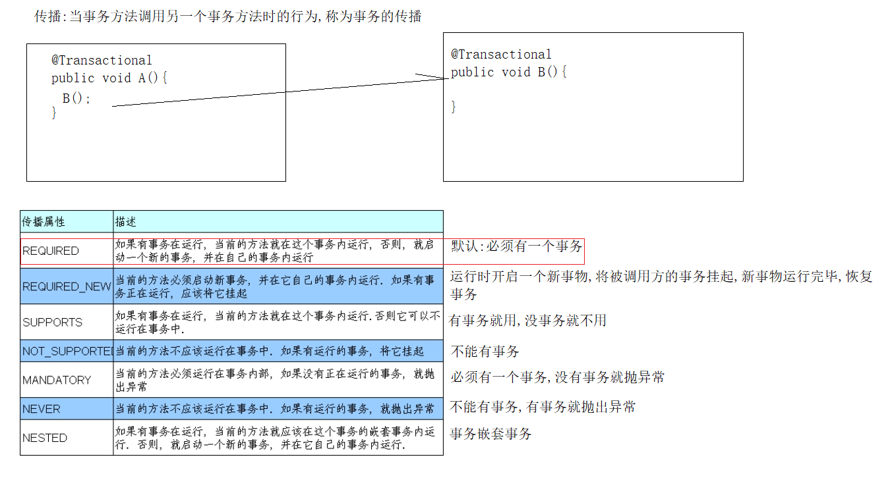
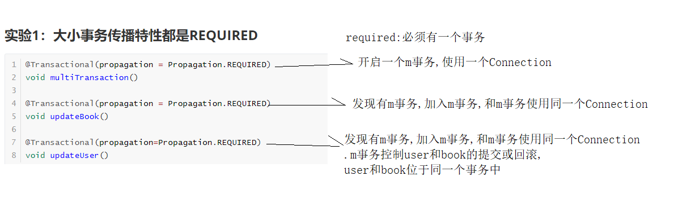
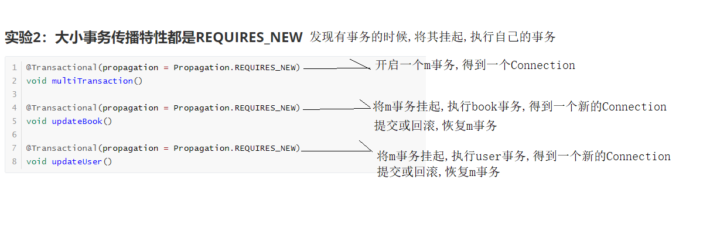
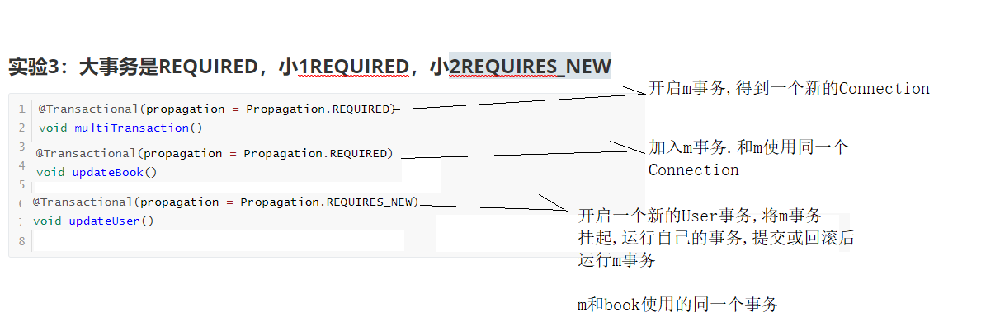
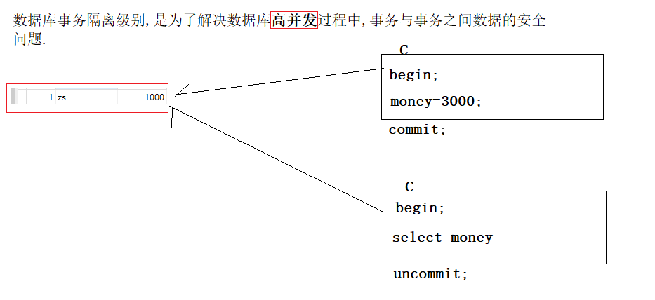

# Spring-04

# 11、声明式事务

事务分为声明式和编程式两种:

1. 声明式事务：声明式事务是指通过注解的形式或xml配置的形式对事务的各种特性进行控制和管理。
2. 编码式（编程式）事务：指的是通过编码的方式实现事务的声明。 

## 11.1、声明式事务环境搭建

### 11.1.1、准备测试数据库

 ```sql
##创建tx数据库
CREATE DATABASE IF NOT EXISTS `tx` DEFAULT CHARSET utf8;
##切换tx数据库
USE `tx`;

##创建用户表
CREATE TABLE `user` (
 `id` int primary key auto_increment,	
 `username` varchar(50) NOT NULL,
 `money` int(11) DEFAULT NULL
);

##插入数据
insert into `user`(`username`,`money`) values ('张三',1000),('李四',1000);

##创建图书表
create table `book`(
  `id` int primary key auto_increment,
  `name` varchar(500) not null,
  `stock` int
);

##插入数据
insert into book(`name`,`stock`) values('java编程思想',100),('C++编程思想',100);

##查看数据
select * from book;
select * from user;
 ```

### 11.2.1、创建一个Java工程，导入Jar包

- com.springsource.org.aspectj.weaver-1.6.8.RELEASE.jar
- druid-1.1.9.jar
- junit_4.12.jar
- mysql-connector-java-5.1.37-bin.jar
- org.hamcrest.core_1.3.0.jar
- spring-aop-5.2.5.RELEASE.jar
- spring-aspects-5.2.5.RELEASE.jar
- spring-beans-5.2.5.RELEASE.jar
- spring-context-5.2.5.RELEASE.jar
- spring-core-5.2.5.RELEASE.jar
- spring-expression-5.2.5.RELEASE.jar
- spring-jcl-5.2.5.RELEASE.jar
- spring-jdbc-5.2.5.RELEASE.jar
- spring-orm-5.2.5.RELEASE.jar
- spring-test-5.2.5.RELEASE.jar
- spring-tx-5.2.5.RELEASE.jar

jdbc.properties属性配置文件:

```properties
db.user=root
db.password=root
db.url=jdbc:mysql://localhost:3306/tx?characterEncoding=UTF-8
db.driverClassName=com.mysql.jdbc.Driver
db.initialSize=5
db.maxActive=10
```

applicationContext.xml配置文件:

```xml
<?xml version="1.0" encoding="UTF-8"?>
<beans xmlns="http://www.springframework.org/schema/beans"
       xmlns:xsi="http://www.w3.org/2001/XMLSchema-instance"
       xmlns:context="http://www.springframework.org/schema/context" xmlns:tx="http://www.springframework.org/schema/tx"
       xsi:schemaLocation="http://www.springframework.org/schema/beans http://www.springframework.org/schema/beans/spring-beans.xsd http://www.springframework.org/schema/context https://www.springframework.org/schema/context/spring-context.xsd http://www.springframework.org/schema/tx http://www.springframework.org/schema/tx/spring-tx.xsd">

    <!--
        加载jdbc.properties属性配置文件
    -->
    <context:property-placeholder location="classpath:jdbc.properties" />

    <!-- 配置包扫描 -->
    <context:component-scan base-package="com.atguigu" />

    <!-- 数据库连接池 -->
    <bean class="com.alibaba.druid.pool.DruidDataSource" id="dataSource">
        <property name="username" value="${db.user}"/>
        <property name="password" value="${db.password}"/>
        <property name="url" value="${db.url}"/>
        <property name="driverClassName" value="${db.driverClassName}"/>
        <property name="initialSize" value="${db.initialSize}"/>
        <property name="maxActive" value="${db.maxActive}"/>
    </bean>

    <!-- 配置sql执行的工具类 -->
    <bean class="org.springframework.jdbc.core.JdbcTemplate" id="jdbcTemplate">
        <property name="dataSource" ref="dataSource" />
    </bean>

</beans>
```

Dao的代码: 

```java
@Repository
public class BookDao {

    @Autowired
    JdbcTemplate jdbcTemplate;

    public void updateBook(){
        jdbcTemplate.update("update book set `name` = '图书表被修改了'");
    }

}
```

```java
@Repository
public class UserDao {

    @Autowired
    JdbcTemplate jdbcTemplate;

    public void updateUser(){
        jdbcTemplate.update("update user set `username` = '用户表被修改了'" );
    }
}
```

Service的代码:

```java
@Service
public class TransactionService {

    @Autowired
    UserDao userDao;

    @Autowired
    BookDao bookDao;

    public void multiUpdate(){
        userDao.updateUser();
        int i =10/0;
        bookDao.updateBook();
    }
}
```

默认的情况下dao中一个方法执行完就生效.

Service方法不带有事务

## 11.2、测试Service的默认事务

实验1：测试service服务层的默认事务

```java
@ContextConfiguration(locations = {"classpath:applicationContext.xml"})
@RunWith(SpringJUnit4ClassRunner.class)
public class TransactionServiceTest {

  @Autowired
  private TransactionService transactionService;

  @Test
  public void testTransaction(){
    transactionService.multiUpdate();
  }

}
```

### 异常的演示

以上操作user表成功

 

book表操作失败:

 

## Spring事务引入的分析------PlatformTransactionManager类简单介绍

PlatformTransactionManager是一个接口.

这个接口是Spring中提供的专门用来处理事务的接口.

```java
public interface PlatformTransactionManager extends TransactionManager {
    // 获取连接,开启事务,设置为手动管理事务
    TransactionStatus getTransaction(@Nullable TransactionDefinition var1) throws TransactionException;
    // 提交事务
    void commit(TransactionStatus var1) throws TransactionException;
    // 回滚事务
    void rollback(TransactionStatus var1) throws TransactionException;
}
```

PlatformTransactionManager接口有很多实现类:

 

DataSourceTransactionManager是我们要重点关心的事务管理器实现类

 

doBegin() 会由获取一个连接Connection, 并设置为手动管理事务 

doCommit() 方法 提交事务  connection.commit() 

doRollback() 方法  回滚事务 connection.rollback()

## 11.3、使用Spring的注解声明事务管制

实验2：测试Spring的声明式事务

applicationContext.xml配置文件:

```xml
<bean id="transactionManager" class="org.springframework.jdbc.datasource.DataSourceTransactionManager">
    <!-- 必须引用当前连接的数据库连接池? 因为事务需要在同一个connection中 -->
    <property name="dataSource" ref="dataSource"/>
</bean>

<!--
            (tx:annotation-driven表示代理 + 注解@transactional)组合使用
            transaction-manager="transactionManager" 配置使用哪个事务管理器
            transaction-manager属性的默认值是: transactionManager
    -->
 <tx:annotation-driven transaction-manager="transactionManager"/>
```

在需要使用事务的方法上,添加注解 @Transactional


Spring 事务管理方式:

 1:@Transactional  注解,声明在方法和类上,就表示引用了事务管理器.利用切面

2:配置事务管理器DataSourceTransactionManager

2:引用事务管理器<tx:annotation-driven ref ="事务管理器bean"/> 默认是 transactionManager

## 11.4、noRollbackFor和noRollbackForClassName测试不回滚的异常

实验3：noRollbackFor和noRollbackForClassName测试不回滚的异常

**Spring默认情况下.是对RuntimeException 运行时异常.和它的子异常,进行事务回滚.**

```java
//@Transactional(noRollbackFor = ArithmeticException.class)  指定不回滚异常类的class
//指定异常类的全路径
@Transactional(noRollbackForClassName = "java.lang.ArithmeticException")
public void multiUpdate() throws FileNotFoundException {
    userDao.updateUser();
    //Spring默认对RuntimeException异常进行回滚
    //if (true) throw new FileNotFoundException();
    int i = 10 / 0;
    bookDao.updateBook();
}
```

## 11.5、自定义设置回滚异常

实验5：rollbackFor和rollbackForClassName回滚的异常

```java
/
 * @Transactional 表示当前方法加事务管理 <br/>
 * noRollbackFor = ArithmeticException.class 表示如果抛ArithmeticException则不回滚事务 <br/>
 * noRollbackForClassName表示指定的哪个全类名的异常不回滚事务<br/>
 * rollbackFor指定哪些异常需要回滚事务 <br/>
 * rollbackForClassName指定哪些全类名的异常.需要回滚事务
 */
@Transactional(rollbackFor = FileNotFoundException.class,
               rollbackForClassName = "java.io.FileNotFoundException"     )
public void multiUpdate() throws FileNotFoundException {
  userDao.updateUser();
  if  (true) {
    throw  new FileNotFoundException("文件未找到异常,默认不回滚");
  }
  bookDao.updateBook();

}
```

## 11.6、事务的只读属性

只读,是指,只能执行 select 查询操作,不允许执行 insert , update , delete 写操作( 如果执行写操作,抛异常 )

实验4：测试readOnly只读属性

```java
/
 * @Transactional 表示当前方法加事务管理 <br/>
 * readOnly设置是否只读,readOnly = true  表示 不允许写操作<br/>
 */
@Transactional(readOnly = true)
public void multiUpdate() throws FileNotFoundException {
  userDao.updateUser();
  bookDao.updateBook();
}
```

## 11.7、事务超时属性timeout(秒为单位,了解内容)

```java
/
 * @Transactional 表示当前方法加事务管理 <br/>
 * <p>
 * timeout 属性设置几秒内不允许再执行sql语句
 */
@Transactional(timeout = 3)
public void multiUpdate() throws InterruptedException {
  userDao.updateUser();
  Thread.sleep(4000);
  bookDao.updateBook();
}
```

事务超时的异常信息:

 

## 11.8、事务的传播特性

什么是事务的传播行为 ( 传播特性又叫传播行为 )：

当事务方法被另一个事务方法调用时，必须指定事务应该如何传播。

例如：方法可能继续在现有事务中运行，也可能开启一个新事务，并在自己的事务中运行。

事务的传播行为可以由传播属性指定。Spring定义了7种类传播行为。

事务的传播特性，有以下几种类型：

 



## 11.9、注解演示事物传播特性

UserService

BookService

TransactionService

### 实验1：大小事务传播特性都是REQUIRED

```java
@Transactional(propagation = Propagation.REQUIRED)
void multiTransaction() 

@Transactional(propagation = Propagation.REQUIRED)
void updateBook() 

@Transactional(propagation=Propagation.REQUIRED)
void updateUser() 
```



### 实验2：大小事务传播特性都是REQUIRES_NEW

```java
@Transactional(propagation = Propagation.REQUIRES_NEW)
void multiTransaction()
    
@Transactional(propagation = Propagation.REQUIRES_NEW)
void updateBook()
    
@Transactional(propagation = Propagation.REQUIRES_NEW)
void updateUser()
```



### 实验3：大事务是REQUIRED，小1REQUIRED，小2REQUIRES_NEW

```java
@Transactional(propagation = Propagation.REQUIRED)
void multiTransaction()
    
@Transactional(propagation = Propagation.REQUIRES_NEW)
void updateUser()

@Transactional(propagation = Propagation.REQUIRED)
void updateBook()
```



## 12、xml配置式事务声明

去掉。所有@Transactional的注解。

```xml
<?xml version="1.0" encoding="UTF-8"?>
<beans xmlns="http://www.springframework.org/schema/beans"
       xmlns:xsi="http://www.w3.org/2001/XMLSchema-instance"
       xmlns:context="http://www.springframework.org/schema/context" xmlns:tx="http://www.springframework.org/schema/tx"
       xmlns:aop="http://www.springframework.org/schema/aop"
       xsi:schemaLocation="http://www.springframework.org/schema/beans http://www.springframework.org/schema/beans/spring-beans.xsd http://www.springframework.org/schema/context https://www.springframework.org/schema/context/spring-context.xsd http://www.springframework.org/schema/tx http://www.springframework.org/schema/tx/spring-tx.xsd http://www.springframework.org/schema/aop https://www.springframework.org/schema/aop/spring-aop.xsd">

    <!--
        加载jdbc.properties属性配置文件
    -->
    <context:property-placeholder location="classpath:jdbc.properties"/>

    <!-- 配置包扫描 -->
    <context:component-scan base-package="com.atguigu"/>

    <!-- 数据库连接池 -->
    <bean class="com.alibaba.druid.pool.DruidDataSource" id="dataSource">
        <property name="username" value="${db.user}"/>
        <property name="password" value="${db.password}"/>
        <property name="url" value="${db.url}"/>
        <property name="driverClassName" value="${db.driverClassName}"/>
        <property name="initialSize" value="${db.initialSize}"/>
        <property name="maxActive" value="${db.maxActive}"/>
    </bean>

    <!-- 配置sql执行的工具类 -->
    <bean class="org.springframework.jdbc.core.JdbcTemplate" id="jdbcTemplate">
        <property name="dataSource" ref="dataSource"/>
    </bean>

    
    <bean id="transactionManager" class="org.springframework.jdbc.datasource.DataSourceTransactionManager">
        <!-- 必须引用当前连接的数据库连接池? 因为事务需要在同一个connection中 -->
        <property name="dataSource" ref="dataSource"/>
    </bean>

    <!-- 事务管理 -->
    <tx:advice transaction-manager="transactionManager" id="tx_advice">
        <tx:attributes>
            <!-- 注意不要忘了multiUpdate和multiTransaction单独配置 -->
            <tx:method name="multiUpdate" propagation="REQUIRED"/>
            <!-- 表示 udpateBook方法的传播特性是REQUIRES  -->
            <tx:method name="update*" propagation="REQUIRED"/>
            <!-- 以save打头的方法   -->
            <tx:method name="save*" propagation="REQUIRED"/>
            <tx:method name="del*" propagation="REQUIRED"/>
            <tx:method name="insert*" propagation="REQUIRED"/>
            <!-- 剩下的方法 设置只读
                name="updateBook" 精确
                name="save*" 半模糊
                method name="*" 全模糊
                匹配的规则是,越精确,越优先
            -->
            <tx:method name="*" read-only="true"/>
        </tx:attributes>
    </tx:advice>

    <aop:config>
        <aop:advisor advice-ref="tx_advice" pointcut="execution(public * com.atguigu..*Service*.*(..))"/>
    </aop:config>

</beans>
```

## 13、事务隔离级别(重要)

数据库事务隔离级别,是为了解决数据库高并发过程中,事务与事务之间数据的安全问题.



数据库有四种事务隔离级别：

一：读未提交	read uncommitted

二：读已提交	read committed			Oracle默认

三：可重复读	repeatable read			mysql默认

四：串行事务	serializable (读写不并行)

由事务隔离级别产生的几个常见问题:

读未提交，可导致----->>>> 脏读

读已提交，可导致----->>>> 不可重复读

重复读，可导致	----->>>> 幻读

### 什么是脏读？

脏读,就是查询到的数据,不是真实有效的数据.( 这个数据可能会随时被回滚 )

### 什么是不可重复读？

完美解决脏读,读到的数据是持久化后的数据,读到的是真实数据

不可重复读,是指多次查询相同的数据.得到的**结果不是完全一样**(commit).(Oracle)

### 什么是幻读？

A:开启事务,执行update,commit

B:开启事务,执行select,查询到的数据必须是**自身commit后看到的真实有效数据**

幻读是指,多次查询相同的数据,得到的结果都跟第一次一样.(但其实,查询的数据已经被修改[有插入,有修改,有删除])(MySQL)

### 演示隔离级别

1.查看当前会话隔离级别

**select @@tx_isolation;**

2.查看系统当前隔离级别

**select @@global.tx_isolation;**

3.设置当前会话隔离级别

**set session transaction isolation level read uncommitted;    设置读未提交**

**set session transaction isolation level read committed;			设置读已提交**

**set session transaction isolation level repeatable read;		  设置可重复读**

**set session transaction isolation level serializable;			     设置串行化**

4.开启事务

**start transaction;**

5.提交事务

**commit;**

6.回滚事务

**rollback;**

### 13.1、读未提交导致脏读的演示：

 

### 13.2、读已提交导致不可重复读演示：

 

### 12.3、可重复读导致幻读的演示

 

### 13.4、串行化事务的演示

 

## 14、Spring整合Web

在web工程上使用Spring框架

### 14.1、在web工程中添加Spring的jar包。

Spring的核心包

- spring-beans-4.0.0.RELEASE.jar
- spring-context-4.0.0.RELEASE.jar
- spring-core-4.0.0.RELEASE.jar
- spring-expression-4.0.0.RELEASE.jar

aop包

- spring-aop-4.0.0.RELEASE.jar
- spring-aspects-4.0.0.RELEASE.jar
- com.springsource.org.aopalliance-1.0.0.jar
- com.springsource.org.aspectj.weaver-1.6.8.RELEASE.jar

JDBC-ORM包

- spring-jdbc-4.0.0.RELEASE.jar
- spring-orm-4.0.0.RELEASE.jar
- spring-tx-4.0.0.RELEASE.jar

Spring的web整合包

- spring-web-4.0.0.RELEASE.jar

Servlet

```java
@WebServlet("/springTestServlet")
public class SpringTestServlet extends HttpServlet {
    protected void doPost(HttpServletRequest request, HttpServletResponse response) throws javax.servlet.ServletException, IOException {
        doGet(request, response);

    }

    protected void doGet(HttpServletRequest request, HttpServletResponse response) throws javax.servlet.ServletException, IOException {
        ApplicationContext applicationContext = new ClassPathXmlApplicationContext("classpath:applicationContext.xml");
        TransactionService transactionService = applicationContext.getBean("transactionService", TransactionService.class);
        transactionService.multiUpdate();
    }
}
```

在web工程中使用Spring,需要做以下几点:

1.  需要自己创建Spring的容器对象
2. 需要我们自己管理Spring容器对象 ( Spring容器只有一个 )
3. 需要很好的对Spring容器的创建和销毁做管理

### 14.2、使用官方推荐的整合包

整合Spring和Web容器分两个步骤：

1. 导入spring-web-4.0.0.RELEASE.jar

2. 在web.xml配置文件中配置org.springframework.web.context.ContextLoaderListener监听器监听ServletContext的初始化

3. 在web.xml配置文件中配置contextConfigLocation上下文参数。配置Spring配置文件的位置，以用于初始化Spring容器

## 在web.xml中配置(重点)

```xml
<!-- 帮我们管理Spring容器创建和销毁 -->
<listener>
    <listener-class>org.springframework.web.context.ContextLoaderListener</listener-class>
</listener>

<!-- 配置spring容器对象需要的路径 -->
<context-param>
    <param-name>contextConfigLocation</param-name>
    <param-value>classpath:applicationContext.xml</param-value>
</context-param>
```

## 获取WebApplicationContext上下文对象的方法如下：

源码解析:

ServletContextListener:监听ServletContext创建及销毁

ServletContext:在web工程启动创建,停止时销毁

```
将WebApplicationContext放入到servletContext域中
servletContext.setAttribute(WebApplicationContext.ROOT_WEB_APPLICATION_CONTEXT_ATTRIBUTE, this.context);
this.context = WebApplicationContext
WebApplicationContext:
读取配置文件contextConfigLocation
```

```java
public class ContextLoaderListener extends ContextLoader implements ServletContextListener {
	/**
	 * Initialize the root web application context.
	 */
	@Override
	public void contextInitialized(ServletContextEvent event) {
		initWebApplicationContext(event.getServletContext());
	}

	/**
	 * Close the root web application context.
	 */
	@Override
	public void contextDestroyed(ServletContextEvent event) {
		closeWebApplicationContext(event.getServletContext());
		ContextCleanupListener.cleanupAttributes(event.getServletContext());
	}
}


public class ContextLoader {
    public WebApplicationContext initWebApplicationContext(ServletContext servletContext) {
		if (servletContext.getAttribute(WebApplicationContext.ROOT_WEB_APPLICATION_CONTEXT_ATTRIBUTE) != null) {
			throw new IllegalStateException(
					"Cannot initialize context because there is already a root application context present - " +
					"check whether you have multiple ContextLoader* definitions in your web.xml!");
		}

		servletContext.log("Initializing Spring root WebApplicationContext");
		Log logger = LogFactory.getLog(ContextLoader.class);
		if (logger.isInfoEnabled()) {
			logger.info("Root WebApplicationContext: initialization started");
		}
		long startTime = System.currentTimeMillis();

		try {
			// Store context in local instance variable, to guarantee that
			// it is available on ServletContext shutdown.
			if (this.context == null) {
				this.context = createWebApplicationContext(servletContext);
			}
			if (this.context instanceof ConfigurableWebApplicationContext) {
				ConfigurableWebApplicationContext cwac = (ConfigurableWebApplicationContext) this.context;
				if (!cwac.isActive()) {
					// The context has not yet been refreshed -> provide services such as
					// setting the parent context, setting the application context id, etc
					if (cwac.getParent() == null) {
						// The context instance was injected without an explicit parent ->
						// determine parent for root web application context, if any.
						ApplicationContext parent = loadParentContext(servletContext);
						cwac.setParent(parent);
					}
					configureAndRefreshWebApplicationContext(cwac, servletContext);
				}
			}
			servletContext.setAttribute(WebApplicationContext.ROOT_WEB_APPLICATION_CONTEXT_ATTRIBUTE, this.context);

			ClassLoader ccl = Thread.currentThread().getContextClassLoader();
			if (ccl == ContextLoader.class.getClassLoader()) {
				currentContext = this.context;
			}
			else if (ccl != null) {
				currentContextPerThread.put(ccl, this.context);
			}

			if (logger.isInfoEnabled()) {
				long elapsedTime = System.currentTimeMillis() - startTime;
				logger.info("Root WebApplicationContext initialized in " + elapsedTime + " ms");
			}

			return this.context;
		}
		catch (RuntimeException | Error ex) {
			logger.error("Context initialization failed", ex);
			servletContext.setAttribute(WebApplicationContext.ROOT_WEB_APPLICATION_CONTEXT_ATTRIBUTE, ex);
			throw ex;
		}
	}
}


protected WebApplicationContext createWebApplicationContext(ServletContext sc) {
		Class<?> contextClass = determineContextClass(sc);
		if (!ConfigurableWebApplicationContext.class.isAssignableFrom(contextClass)) {
			throw new ApplicationContextException("Custom context class [" + contextClass.getName() +
					"] is not of type [" + ConfigurableWebApplicationContext.class.getName() + "]");
		}
		return (ConfigurableWebApplicationContext) BeanUtils.instantiateClass(contextClass);
	}


protected void configureAndRefreshWebApplicationContext(ConfigurableWebApplicationContext wac, ServletContext sc) {
		if (ObjectUtils.identityToString(wac).equals(wac.getId())) {
			// The application context id is still set to its original default value
			// -> assign a more useful id based on available information
			String idParam = sc.getInitParameter(CONTEXT_ID_PARAM);
			if (idParam != null) {
				wac.setId(idParam);
			}
			else {
				// Generate default id...
				wac.setId(ConfigurableWebApplicationContext.APPLICATION_CONTEXT_ID_PREFIX +
						ObjectUtils.getDisplayString(sc.getContextPath()));
			}
		}

		wac.setServletContext(sc);
    	//public static final String CONFIG_LOCATION_PARAM = "contextConfigLocation";
		String configLocationParam = sc.getInitParameter(CONFIG_LOCATION_PARAM);
		if (configLocationParam != null) {
            //交给容器
			wac.setConfigLocation(configLocationParam);
		}

		// The wac environment's #initPropertySources will be called in any case when the context
		// is refreshed; do it eagerly here to ensure servlet property sources are in place for
		// use in any post-processing or initialization that occurs below prior to #refresh
		ConfigurableEnvironment env = wac.getEnvironment();
		if (env instanceof ConfigurableWebEnvironment) {
			((ConfigurableWebEnvironment) env).initPropertySources(sc, null);
		}

		customizeContext(sc, wac);
		wac.refresh();
	}


public abstract class AbstractApplicationContext extends DefaultResourceLoader implements ConfigurableApplicationContext {
    public void refresh() throws BeansException, IllegalStateException {
        synchronized(this.startupShutdownMonitor) {
            this.prepareRefresh();
            ConfigurableListableBeanFactory beanFactory = this.obtainFreshBeanFactory();
            this.prepareBeanFactory(beanFactory);

            try {
                this.postProcessBeanFactory(beanFactory);
                this.invokeBeanFactoryPostProcessors(beanFactory);
                this.registerBeanPostProcessors(beanFactory);
                this.initMessageSource();
                this.initApplicationEventMulticaster();
                this.onRefresh();
                this.registerListeners();
                this.finishBeanFactoryInitialization(beanFactory);
                this.finishRefresh();
            } catch (BeansException var9) {
                if (this.logger.isWarnEnabled()) {
                    this.logger.warn("Exception encountered during context initialization - cancelling refresh attempt: " + var9);
                }

                this.destroyBeans();
                this.cancelRefresh(var9);
                throw var9;
            } finally {
                this.resetCommonCaches();
            }

        }
    }
}
```

方法一（不推荐）：

```java
protected void doGet(HttpServletRequest request, HttpServletResponse response) throws ServletException, IOException {
    ApplicationContext applicationContext = (ApplicationContext) getServletContext().getAttribute(WebApplicationContext.ROOT_WEB_APPLICATION_CONTEXT_ATTRIBUTE);
    TransactionService transactionService = applicationContext.getBean("transactionService", TransactionService.class);
    transactionService.multiUpdate();
}
```

方法二（推荐）：

```java
protected void doGet(HttpServletRequest request, HttpServletResponse response) throws ServletException, IOException {
    ApplicationContext applicationContext = WebApplicationContextUtils.getWebApplicationContext(getServletContext());
    TransactionService transactionService = applicationContext.getBean("transactionService", TransactionService.class);
    transactionService.multiUpdate();
}
```

```java
public abstract class WebApplicationContextUtils {

public static WebApplicationContext getRequiredWebApplicationContext(ServletContext sc) throws IllegalStateException {
    WebApplicationContext wac = getWebApplicationContext(sc);
    if (wac == null) {
        throw new IllegalStateException("No WebApplicationContext found: no ContextLoaderListener registered?");
    }
    return wac;
}

@Nullable
public static WebApplicationContext getWebApplicationContext(ServletContext sc) {
    return getWebApplicationContext(sc, WebApplicationContext.ROOT_WEB_APPLICATION_CONTEXT_ATTRIBUTE);
}
}
```

