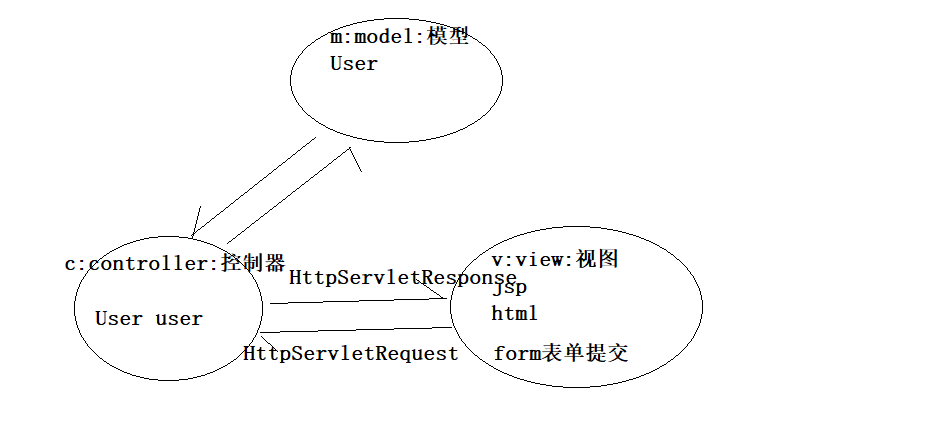
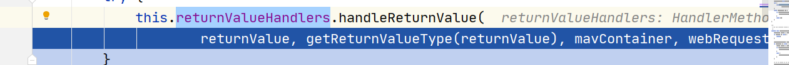

# SpringMVC-01

# 1、SpringMVC的概述

​	Spring MVC框架是一个开源的Java平台，为开发强大的基于JavaWeb应用程序提供全面的基础架构支持，并且使用起来非常简单容易。

​	Spring web MVC框架提供了MVC(模型 - 视图 - 控制器)架构，用于开发灵活和松散耦合的Web应用程序的组件。 MVC模式使应用程序的不同组件(输入逻辑，业务逻辑和UI逻辑)合理有效的分离，同时又有效的将各组件组合一起完成功能。

### 画图解释MVC:



# 2、SpringMVC的核心DispatcherServlet程序

在SpringMVC框架中有一个非常非常重要的程序是DispatcherServlet程序

1. 它是一个servlet程序
2. 它负责把所有请求分发给Controller控制中的业务方法(handler)( 相当于JavaWeb的XxxServlet程序的xxx业务方法 )
3. 我们管它叫前端控制器.

 

# 3、SpringMVC的第一个Hello示例程序

浏览器发送请求------->java---------->转发出去

## 3.1、SpringMVC——Hello world程序的步骤：

创建一个web的模块

 

添加jar包:

- spring-aop-5.2.5.RELEASE.jar
- spring-beans-5.2.5.RELEASE.jar
- spring-context-5.2.5.RELEASE.jar
- spring-core-5.2.5.RELEASE.jar
- spring-expression-5.2.5.RELEASE.jar
- spring-jcl-5.2.5.RELEASE.jar
- spring-web-5.2.5.RELEASE.jar
- spring-webmvc-5.2.5.RELEASE.jar

web.xml中的配置:

```xml
<servlet>
    <servlet-name>dispatcherServlet</servlet-name>
    <servlet-class>org.springframework.web.servlet.DispatcherServlet</servlet-class>
    <!-- SpringMVC也有一个Spring容器对象 -->
    <init-param>
        <param-name>contextConfigLocation</param-name>
        <param-value>classpath:springmvc.xml</param-value>
    </init-param>
    <!-- 加载时机,1为容器启动就创建 dispatcherServlet实例-->
    <load-on-startup>1</load-on-startup>
</servlet>

<servlet-mapping>
    <servlet-name>dispatcherServlet</servlet-name>
    <!--
            /:放行jsp放行外其他全部拦截
            /*:全部拦截,包含jsp
        -->
    <url-pattern>/</url-pattern>
</servlet-mapping>
```

Springmvc.xml配置文件:

```xml
<?xml version="1.0" encoding="UTF-8"?>
<beans xmlns="http://www.springframework.org/schema/beans"
       xmlns:xsi="http://www.w3.org/2001/XMLSchema-instance"
       xmlns:context="http://www.springframework.org/schema/context"
       xsi:schemaLocation="http://www.springframework.org/schema/beans http://www.springframework.org/schema/beans/spring-beans.xsd http://www.springframework.org/schema/context https://www.springframework.org/schema/context/spring-context.xsd">

    <!-- 扫描注解 -->
    <context:component-scan base-package="com.atguigu"/>

</beans>
```

Controlller控制器的代码:

```java
@Controller
public class HelloController {

    /**     
     * @RequestMapping表示Hello方法的访问地址 <br/>
     * 404:将value的值不予方法名重名
     */
    @RequestMapping(value = "/hello")
    public String hello() {
        System.err.println("SpringMVC 第一个 小demo");
        /**
         * / ==>> 在web工程中表示路径为:http://ip:port/工程路径<br/>
         * 映射到代码的web目录 <br/>
         * 默认情况下,springmvc使用请求转发做为默认的页面跳转方式<br/>
         */
        return "/ok.jsp";
    }
}
```

index.jsp页面

```jsp
<%@ page contentType="text/html;charset=UTF-8" language="java" %>
<html>
    <head>
        <title>$Title$</title>
    </head>
    <body>
        <a href="${pageContext.request.contextPath}/hello">springmvc的hello请求</a>
    </body>
</html>
```

## 3.2、SpringMVC的加载文件的另一种存放方式

Springmvc配置文件加载有两种方式:

一种是在web.xml中配置前端控制器的时候使用初始化参数来进行配置加载

```xml
<init-param>
    <param-name>contextConfigLocation</param-name>
    <param-value>classpath:springmvc.xml</param-value>
</init-param>
```

另一种方式是,不使用init-param初始化参数.需要注意以下几个点:

1. 配置文件必须存放在WEB-INF目录下
2. 配置文件名 必须由 <servlet-name>标签值 + (-servlet.xml)

示意如下:

<servlet-name>dispatcher</servlet-name>

那么配置文件名就是: dispatcher-servlet.xml

# 4、视图解析器

视图解析器可以解析SpringMVC框架中Controller控制器里方法的返回值为请求跳转的路径.

SpringMVC配置文件中的视图解析器.

```xml
<!-- 视图解析器 -->
<bean id="viewResolver" class="org.springframework.web.servlet.view.InternalResourceViewResolver">
    <!-- 前缀 -->
    <property name="prefix" value="/pages/"/>
    <!-- 后缀 -->
    <property name="suffix" value=".jsp"/>
</bean>
```

视图解析器的好处: 

1. 方法我们返回值里只需要写上简短的内容即可

2. 视图解析器会把Controller方法的返回值,做前缀和后缀的拼接操作,然后再跳转

3. 方便我们移动资源的目录

```java
/**     
     * @RequestMapping表示Hello方法的访问地址 <br/>
     *  ==>> 在web工程中表示路径为:http://ip:port/工程路径<br/>
     *  /hello  ==>> 表示地址为:http://ip:port/工程路径/hello <br/>     * @return     
     *
     */
@RequestMapping(value = "/hello")
public String hello() {
    System.err.println("spring 第一个 小demo");
    /**
         * / ==>> 在web工程中表示路径为:http://ip:port/工程路径<br/>
         * 映射到代码的web目录 <br/>
         * 默认情况下,springmvc使用请求转发做为默认的页面跳转方式<br/>
         * 如果没有视图解析器,我们需要写上完整的路径也就是 ==>>/pages/ok.jsp
         */
    return "ok";
}
```

视图解析器,工作的时候,会把Controller方法中的返回值做字符串拼接操作:

拼接的规则是:  前缀 + 返回值 + 后缀

注: 视图解析器它只做一个工作,就是把返回值转换为需要的视图View ( 就是最后的跳转 )

# 5、@RequestMapping注解详解

@RequestMapping是给个方法配置一个访问地址。就比如web学习的Servlet程序，在web.xml中配置了访问地址之后，它们之间就有一个访问映射关系。

## 5.1、value属性（重点）

value属性是给方法配置访问地址使用.

它可以配置一个或者多个请求路径.

注意: 一个方法可以有多个请求路径 , 一个路径只能分配给一个方法

```java
/**
 * @RequestMapping它的作用是给方法配置一个访问地址 <br/>
 * 1 一般情况下是以斜杠打头 <br/>
 * 2 斜杠表示地址为:http://ip:port/工程路径/ <br/>
 * 3 /斜杠映射到代码的web目录 <br/>
 */
@RequestMapping(value = {"map1","xxx","sss"})
public String map1(){
    System.err.println("requestMapping");
    return "ok";
}
```

## 5.2、params属性

params是要求此请求的参数匹配

params="username"			表示	请求地址必须带有username参数

params="username=abc"	表示	请求参数中必须要有username，而且值还必须是abc

params="username!=abc"	表示	1、请求参数中不能有username参数。2、有username参数，但值不能等于abc

params="!username"		表示	请求地址不能带有username参数

params= {"username!=abc","!password"}	params可以有多个值,每个值之间是&&关系

以上条件表示要求:

(	请求地址中不能有username参数 || username参数值不能等于 abc 	&& 	不能有password参数	)

```java
/*
    params="username"	表示	请求地址必须带有username参数
    params="username=abc"表示	请求参数中必须要有username，而且值还必须是abc
    params="username!=abc"
        表示
        	1、请求参数中不能有username参数。
            2、有username参数，但值不能等于abc
    params="!username"   表示 请求地址不能带有username参数
    params= {"username!=abc","!password"}	params可以有多个值,每个值之间是&&关系
   */
@RequestMapping(value = "map2", params = {"username!=abc","!password"})
public String map2() {
    System.err.println("requestMapping");
    return "ok";
}
```

## 5.3、headers属性

headers 表示对请求头的匹配要求 , 用法上跟params 完全一样.只是要求匹配的内容不同.

```java
/**
     *  headers = "User-Agent" 表示要求请求头中必须有User-Agent请求头 <br/>
     * @return
     */
@RequestMapping(value = "map3",headers = {"User-Agent"})
public String map3() {
    System.err.println("head");
    return "ok";
}
```

## 5.4、method属性

method属性要求请求的方式必须匹配.也就是GET请求,或POST请求( 其他请求也一样 ).

如果没有标识method属性值,表示任意的请求方式都可以

GET请求演示：

```java
@RequestMapping(value = "map4",method = RequestMethod.GET)
public String map4() {
    System.err.println("method");
    return "ok";
}
```

POST请求演示：

```java
@RequestMapping(value = "map4",method = RequestMethod.POST)
public String map4() {
    System.err.println("method");
    return "ok";
}
```

## 5.5、@RequestMapping标注在Controller类上

 

## 5.6、ant模式地址通配符

### 1、绝对匹配

```java
/**
     * fun  绝对匹配
     * @return
     */
@RequestMapping("fun")
public String fun(){
    System.err.println("fun");
    return "ok";
}
```

### 2、? 问号 匹配资源路径

? 问号表示一个任意字符,比如匹配fu[0-9a-zA-Z]

```java
/**
     * fu? fu开头,?代表一个字符
     * @return
     */
@RequestMapping("fu?")
public String fun1(){
    System.err.println("fu?");
    return "ok";
}
```

### 3、* 星号 匹配资源路径

\* 星号 可以匹配任意个字符

```java
/**
     * fu? fu开头,*代表n个字符串,可以没有
     * @return
     */
@RequestMapping("fu*")
public String fun2(){
    System.err.println("fu*");
    return "ok";
}
```

匹配规则:

精确匹配====>?匹配========>*匹配

### 4、? 问号 匹配一个字符的一层目录

```java
/**
     * /?/fu?  /任意一个字符的路径/fu
     * @return
     */
@RequestMapping("/?/fun")
public String fun3(){
    System.err.println("/?/fu?");
    return "ok";
}
```

### 5、* 星号匹配多个字符的一层目录

```java
/**
     * /\*\/fu?  /n个字符的路径/fu
     * @return
     */
@RequestMapping("/*/fun")
public String fun4(){
    System.err.println("/*/fun");
    return "ok";
}
```

### 6、** 星星号 匹配多层目录

```java
/**
     * /\**\/fu?  /n个字符的路径/fu
     * @return
     */
@RequestMapping("/**/fun")
public String fun5(){
    System.err.println("/**/fun");
    return "ok";
}
```

多个路径匹配时,越精确越优先

# 6、Controller中如何接收请求参数

## 6.1、原生API参数类型

### 6.1.1、HttpServletRequest类、HttpSession类、HttpServletResponse类

注 : 只需要在Controller的方法上.直接写上需要的参数即可.

```java
@RequestMapping("param1")
public String param1(HttpSession session, HttpServletResponse response, HttpServletRequest request){
    System.err.println(request);
    System.err.println(request.getContextPath());
    System.err.println(request.getParameter("username"));
    System.err.println("=====================");
    System.err.println(session.getId());
    System.err.println("=================");
    System.err.println(response.getHeaderNames());
    return "ok";
}
```

## 6.2、普通类型入参

如果想要在Controller方法上直接获取请求的参数有如下的要求:

​	要求 : 方法的参数名一定要和请求的参数名一致!!!

```java
/**
     * 方法中的参数与请求参数name一致则会自动映射
     * @param username
     * @param password
     * @return
     */
@RequestMapping("param2")
public String param2(String username,String password){
    System.err.println(username);
    System.err.println(password);
    return "ok";
}
```

## 6.3、普通类型数组的参数

```java
/**
     * 多个请求参数name一致时可使用数组接收
     * @param hobby
     * @return
     */
@RequestMapping("param3")
public String param3(String [] hobby){
    System.err.println(hobby[0]);
    System.err.println(hobby[1]);
    System.err.println(hobby[2]);
    return "ok";
}
```

## 6.4、普通类型使用@RequestParam入参

如果请求的参数名和方法的参数名不一致 , 也可以使用注解@RequestParam获取相应的值 . 

```java
/**
     *@RequestParam("username") String user 将传递过来的username直接赋值给user
     * required = false:可以不传递
     * defaultValue = "hehe" 默认值是hehe
     * @param user
     * @return
     */
@RequestMapping("param4")
public String param4(@RequestParam(value = "username",required = false,defaultValue = "hehe") String user){
    System.err.println(user);
    return "ok";
}
```

 

## 6.5、@RequestHeader获取请求头入参

```java
/**
     * @param userAgent
     * @return
     * @RequestHeader( name = "User-Agent") 从请求头中获取User-Agent的值
     */
@RequestMapping("param5")
public String param5(@RequestHeader(name = "User-Agent") String userAgent) {
    System.err.println(userAgent);
    return "ok";
}
```

## 6.6、@CookieValue获取Cookie值入参

```java
/**
     * @CookieValue("JSESSIONID") 从cook中获取JSESSIONID的值
     * @param jsessionId
     * @return
     */
@RequestMapping("param6")
public String param6(@CookieValue("JSESSIONID") String jsessionId) {
    System.err.println(jsessionId);
    return "ok";
}
```

## 6.7、一个Pojo对象类型的参数

JavaBean是:

```java
public class Person {
  private Integer id;
  private String name;
  private String phone;
  private Integer age;
}
```

表单:

<form action="${pageContext.request.contextPath}/param7" method="post">    
    编号:<input type="text" name="id" id="id"/> <br/>    
    姓名:<input type="text" name="name" id="name"/><br/>    
    电话:<input type="text" name="phone" id="phone"/><br/>    
    年龄:<input type="text" name="age" id="age"/><br/>      
    <input type="submit" value="提交"/><br/>
</form>

Controller的代码:

```java
/**
     * 表单中的表单项可以直接映射给person属性,但是person属性名称必须与表单项的name属性值一致
     * @param person
     * @return
     */
@RequestMapping("param7")
public String param7(Person person) {
    System.err.println(person);
    return "ok";
}
```

## 6.8、对象中套对象（级联属性）

```java
public class Car {

    private String name;
    private String carNo;
}

public class Person {

    private Integer id;
    private String name;
    private String phone;
    private Integer age;
    private Car car;
}
```

表单:

<form action="${pageContext.request.contextPath}/param7" method="get">    编号:<input type="text" name="id" id="id" /> <br/>    姓名:<input type="text" name="name" id="name" /><br/>    电话:<input type="text" name="phone" id="phone" /><br/>    年龄:<input type="text" name="age" id="age" /><br/>    车名:<input type="text" name="car.name" id="car.name" /><br/>    车版号:<input type="text" name="car.carNo" id="car.carNo" /><br/>      <input type="submit" value="提交" /><br/></form>

Controller中的代码:

```java
/**
     * 表单中的表单项可以直接映射给person属性,但是person属性名称必须与表单项的name属性值一致
     * @param person
     * @return
     */
@RequestMapping("param7")
public String param7(Person person) {
    System.err.println(person);
    return "ok";
}
```

# 7、返回值的设置

## 7.1、返回String

### 7.1.1、返回String默认情况

```java
/**
     * 1:默认情况下
     *     1.1:有视图解析器   走视图解析器 拼接 /page/ok.jsp
     *          只需要写全路径去掉前缀和后缀的内容成为视图名,只写视图名即可
     *     1.2: 无视图解析器   return /page/ok.jsp
     *           /page/ok.jsp 中   /表示 http://ip:post/工程路径,也表示当前项目的web目录
     * 2:默认情况下springMVC为转发跳转页面
     *
     * @return
     */
@RequestMapping("return1")
public String return1(){
    System.err.println("return1");
    return "ok";
}
```

### 7.1.2、显示转发

```java
@RequestMapping("return2")
public String return2(){
    System.err.println("return2");
    /**
         * 要求SpringMVC进行转发
         *      1:使用forward:字符串
         *      2:转发不会使用视图解析器
         *      3:forward:完整的映射路径
         *      4:转发路径分为相对路径和绝对路径:
         *              绝对路径:
         *                  /打头路径
         *                  /page/ok.jsp====>>>http://localhost:8080/01_SpringMVC_war_exploded/page/ok.jsp
         *              相对路径:
         *                  page/ok.jsp
         *                      success:http://localhost:8080/01_SpringMVC_war_exploded/page/ok.jsp
         *                      fail:http://localhost:8080/01_SpringMVC_war_exploded/return/return2
         *                           page/ok.jsp会将"/return"此处替换,所以当没有模块划分时可以使用相对路径,但是禁止使用
         */
    return "forward:/page/ok.jsp";
}
```

### 7.1.3、显示重定向

```java
@RequestMapping("return3")
public String return3() {
    System.err.println("return3");
    /**
         * 显示的要求SpringMVC使用请求重定向跳转页面<br/>
         *  1 显示的*请求重定向*需要在返回值前面添加 redirect: 字符串<br/>
         *  2 显示的*请求重定向*不和视图解析器的前后缀做拼接操作 <br/>
         *  3 显示的*请求重定向*后面一定要写上.完整的跳转路径 <br/>
         *  4 在SpringMVC中,返回的地址的斜杠表示地址为 : http://ip:port/工程路径/ <br/>
         */
    return "redirect:/page/ok.jsp";
}
```

## 7.2、返回ModelAndView

### 7.2.1、返回modelAndView的默认情况

```java
/**
     * ModelAndView可以理解为两部分,一部分是Model(明天的内容),一部分是View <br/>
     * View(视图) 就是跳转路径, 默认情况下.它会跟视图解析器一起工作 <br/>
     * 有两种方式可以指定跳转路径 <br/>
     *  1 在构造器中直接传入<br/>
     *  2 setViewName()设置视图名 <br/>
     *  默认情况下.只需要写视图名即可,它会跟视图解析器一起工作.默认情况下,SpringMVC也是使用请求转发来进行跳转 <br/>
     * modelAndView.setViewName("ok");
     */
@RequestMapping("mv1")
public ModelAndView mv1() {
    System.err.println("mv1");
    ModelAndView modelAndView = new ModelAndView("ok");
    return modelAndView;
}
```

### 7.2.2、显示请求转发

```java
@RequestMapping("mv2")
public ModelAndView mv2() {
    System.err.println("mv2");
    ModelAndView modelAndView = new ModelAndView("forward:/page/ok.jsp");
    return modelAndView;
}
```

### 7.2.3、显示请求重定向

```java
@RequestMapping("mv3")
public ModelAndView mv3() {
    System.err.println("mv3");
    ModelAndView modelAndView = new ModelAndView("redirect:/page/ok.jsp");
    return modelAndView;
}
```

## 源码解析:SpringMVC如何调用Controller目标方法并将返回值封装成ModelAndView


```java
protected void doDispatch(HttpServletRequest request, HttpServletResponse response) throws Exception {
		HttpServletRequest processedRequest = request;
		HandlerExecutionChain mappedHandler = null;
		boolean multipartRequestParsed = false;

		WebAsyncManager asyncManager = WebAsyncUtils.getAsyncManager(request);

		try {
			ModelAndView mv = null;
			Exception dispatchException = null;

			try {
				processedRequest = checkMultipart(request);
				multipartRequestParsed = (processedRequest != request);

				// Determine handler for the current request.
                找到handler及所有的拦截器:HandlerExecutionChain
				mappedHandler = getHandler(processedRequest);
				if (mappedHandler == null) {
					noHandlerFound(processedRequest, response);
					return;
				}

				// Determine handler adapter for the current request.
                找到适配器 HandlerAdapter,
				HandlerAdapter ha = getHandlerAdapter(mappedHandler.getHandler());

				// Process last-modified header, if supported by the handler.
				String method = request.getMethod();
				boolean isGet = "GET".equals(method);
				if (isGet || "HEAD".equals(method)) {
					long lastModified = ha.getLastModified(request, mappedHandler.getHandler());
					if (new ServletWebRequest(request, response).checkNotModified(lastModified) && isGet) {
						return;
					}
				}

				if (!mappedHandler.applyPreHandle(processedRequest, response)) {
					return;
				}

				// Actually invoke the handler.
                适配器执行我们写的handler,返回ModelAndView
				mv = ha.handle(processedRequest, response, mappedHandler.getHandler());

				if (asyncManager.isConcurrentHandlingStarted()) {
					return;
				}

				applyDefaultViewName(processedRequest, mv);
				mappedHandler.applyPostHandle(processedRequest, response, mv);
			}
			catch (Exception ex) {
				dispatchException = ex;
			}
			catch (Throwable err) {
				// As of 4.3, we're processing Errors thrown from handler methods as well,
				// making them available for @ExceptionHandler methods and other scenarios.
				dispatchException = new NestedServletException("Handler dispatch failed", err);
			}
			processDispatchResult(processedRequest, response, mappedHandler, mv, dispatchException);
		}
		catch (Exception ex) {
			triggerAfterCompletion(processedRequest, response, mappedHandler, ex);
		}
		catch (Throwable err) {
			triggerAfterCompletion(processedRequest, response, mappedHandler,
					new NestedServletException("Handler processing failed", err));
		}
		finally {
			if (asyncManager.isConcurrentHandlingStarted()) {
				// Instead of postHandle and afterCompletion
				if (mappedHandler != null) {
					mappedHandler.applyAfterConcurrentHandlingStarted(processedRequest, response);
				}
			}
			else {
				// Clean up any resources used by a multipart request.
				if (multipartRequestParsed) {
					cleanupMultipart(processedRequest);
				}
			}
		}
	}
```

后话


