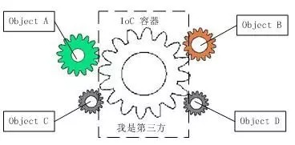
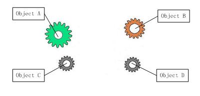
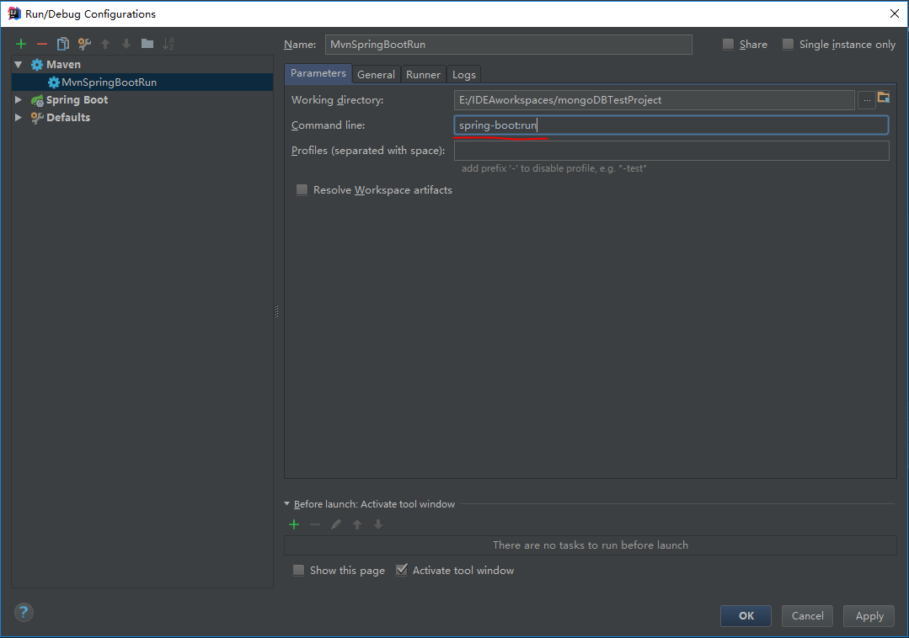

[toc]

---

# `Spring`/`Spring MVC`

## 为什么使用spring？

1. 简介

   - 目的：解决企业应用开发的复杂性
   - 功能：使用基本的`JavaBean`代替EJB，并提供更多的企业应用功能
   - 范围：任何Java应用

   简单来说，Spring是一个轻量级的控制反转（IOC）和切面（AOP）的容器框架。

2. 轻量

从大小与开销两方面而言spring都是轻量级的。完整的spring框架可以在一个大小只有1MB多的JAR文件里发布。并且spring所需的处理开销也是微不足道。此外，spring是非侵入式的：典型的，spring应用中的对象不依赖于spring的特定类。

3. 控制反转

Spring通过一站控制反转（IOC）的技术促进耦合。当应用了IOC，一个对象以来的其它对象就会通过被动的方式传递进来，而不是这个对象自己创建或者查找依赖对象。你可以认为IOC与JNDI相反——不是对象从容器中查找依赖，而是容器在对象初始化时不等对象请求就主动将依赖传递给它。

4. 面向切面

Spring提供了面向切面编程的丰富支持，允许通过分离应用的业务逻辑与系统级服务（例如审计（audition）和事务（transaction）管理）进行内聚性的开发。应用对象只实现它们应该做的——完成业务逻辑。它们并不负责（甚至是意识）其它的系统级关注点，例如日志或事务支持。

5. 容器

Spring包含并管理应用对象的配置和生命周期，在这个意义上它是一种容器，你可以配置的每个bean如何创建——基于一个可配置原型（prototype），你的bean可以创建一个单独的实例或者每次需要时都生成一个新的实例——以及它们是如何关联的。然而，Spring不应该被混同与传统的重量级基的EJB容器，它们经常是庞大与笨重的，难以使用。

6. 框架

Spring可以将简单的组件配置、组合成为复杂的应用。在Spring中，应用对象被声明式地组合，典型地是在一个XML文件里。Spring也提供了很多基础功能（事务管理、持久化框架集成等等），将应用逻辑的开发留给了你。

所有Spring的这些特征使你能够编写更干净、更可管理、并且更易于测试的代码。它们也为Spring中的各种模块提供了基础支持。

## 什么是AOP：

AOP（Aspect-Oriented Programming面向切面编程），可以说是OOP（Object-Oriented Programming，面向对象编程）的补充和完善。OOP引入封装、继承和多态性等概念来建立一种对象层次结构，用以模拟公共行为的一个集合。当我们需要为分散的对象引入公共类行为的时候，OOP则显得无能为力。也就是说，OOP允许你定义从上到下的关系，单并不是适合定义从左到右的关系。例如日志功能。日志代码往往水平低散布在所有对象层次中，而与它所散布到的对象的核心功能毫无关系。对于其他类的代码，如安全性、异常处理和透明的持续性也是如此。这种散布在各处的无关代码被称为横切（cross-cutting）代码，在OOP设计中，它导致了大量代码的重复，而不利于各个模块的重用。

而AOP技术则恰恰相反，它利用一种称为“横切”的技术，剖解开封装的对象内部，并将那些影响了多个类的公共行为封装到一个可重用模块，并将其名为“Aspect”，即方面。所谓“方面”，简单来说，就是将那些与业务无关，却为业务模块所共同调用的逻辑或责任封装起来，便于减少系统的重复代码，降低模块间的耦合度，并有利于未来的可操作性和可维护性。AOP代表的是一个横向关系，如果说”对象“是一个空心的圆柱体，其中封装的是对象的属性和行为；那么面向方面编程的方法，就仿佛一把刀，将这些空心圆柱剖开，以获得其内部的消息。而剖开的切面，也就是所谓的”方面“了。然后它又以巧夺天工的妙手将这些剖开的切面复原，不留痕迹。

使用“横切”技术，AOP把软件系统分为两个部分：核心关注点和横切关注点。业务处理的主要流程是核心关注点，与之关系不大的部分是横向关注点。横向关注点的一个特点是，它们经常发生在核心关注点的多处，而各处都基本相似。比如权限认证、日志、事务处理。Aop 的作用在于分离系统中的各种关注点，将核心关注点和横切关注点分离开来。正如Avanade公司的高级方案构架师Adam Magee所说，AOP的核心思想就是“将应用程序中的商业逻辑同对其提供支持的通用服务进行分离”。

## IOC

IOC是Inversion of Control的缩写，多数书籍翻译成“控制反转”。

　　

1996年，Michael Mattson在一篇有关探讨面向对象框架的文章中，首先提出了IOC 这个概念。对于面向对象设计及编程的基本思想，前面我们已经讲了很多了，不再赘述，简单来说就是把复杂系统分解成相互合作的对象，这些对象类通过封装以后，内部实现对外部是透明的，从而降低了解决问题的复杂度，而且可以灵活地被重用和扩展。

IOC理论提出的观点大体是这样的：借助于“第三方”实现具有依赖关系的对象之间的解耦。如下图：



<center>IOC解耦过程</center>

大家看到了吧，由于引进了中间位置的“第三方”，也就是IOC容器，使得A、B、C、D这4个对象没有了耦合关系，齿轮之间的传动全部依靠“第三方”了，全部对象的控制权全部上缴给“第三方”IOC容器，所以，IOC容器成了整个系统的关键核心，它起到了一种类似“粘合剂”的作用，把系统中的所有对象粘合在一起发挥作用，如果没有这个“粘合剂”，对象与对象之间会彼此失去联系，这就是有人把IOC容器比喻成“粘合剂”的由来。

我们再来做个试验：把上图中间的IOC容器拿掉，然后再来看看这套系统：



<center>拿掉IOC容器后的系统</center>

我们现在看到的画面，就是我们要实现整个系统所需要完成的全部内容。这时候，A、B、C、D这4个对象之间已经没有了耦合关系，彼此毫无联系，这样的话，当你在实现A的时候，根本无须再去考虑B、C和D了，对象之间的依赖关系已经降低到了最低程度。所以，如果真能实现IOC容器，对于系统开发而言，这将是一件多么美好的事情，参与开发的每一成员只要实现自己的类就可以了，跟别人没有任何关系！

  我们再来看看，控制反转(IOC)到底为什么要起这么个名字？我们来对比一下：

  软件系统在没有引入IOC容器之前，对象A依赖于对象B，那么对象A在初始化或者运行到某一点的时候，自己必须主动去创建对象B或者使用已经创建的对象B。无论是创建还是使用对象B，控制权都在自己手上。

  软件系统在引入IOC容器之后，这种情形就完全改变了，由于IOC容器的加入，对象A与对象B之间失去了直接联系，所以，当对象A运行到需要对象B的时候，IOC容器会主动创建一个对象B注入到对象A需要的地方。

  通过前后的对比，我们不难看出来：对象A获得依赖对象B的过程,由主动行为变为了被动行为，控制权颠倒过来了，这就是“控制反转”这个名称的由来。

## Spring常用的注入方式有哪些？

Spring通过DI（依赖注入）实现IOC（控制反转），常用的注入方式主要有三种：

1. 构造方法注入
2. setter注入
3. 基于注解的注入

## Spring中的bean是线程安全的么？

Spring容器中的Bean是否线程安全，容器本身并没有提供Bean的线程安全策略，因此可以说spring容器中的Bean本身不具备线程安全的特性，但是具体还是要结合具体scope的Bean去研究。

## Spring支持几种bean的作用域？

当通过spring容器创建一个Bean实例时，不仅可以完成Bean实例的实例化，还可以为Bean指定特定的作用域。Spring支持如下5种作用域：

- singleton：单例模式，在整个Spring IoC容器中，使用singleton定义的Bean将只有一个实例
- prototype：原型模式，每次通过容器的getBean方法获取prototype定义的Bean时，都将产生一个新的Bean实例
- request：对于每次HTTP请求，使用request定义的Bean都将产生一个新实例，即每次HTTP请求将会产生不同的Bean实例。只有在Web应用中使用Spring时，该作用域才有效
- session：对于每次HTTP Session，使用session定义的Bean都将产生一个新实例。同样只有在Web应用中使用Spring时，该作用域才有效
- globalsession：每个全局的HTTP Session，使用session定义的Bean都将产生一个新实例。典型情况下，仅在使用portlet context的时候有效。同样只有在Web应用中使用Spring时，该作用域才有效

其中比较常用的是singleton和prototype两种作用域。对于singleton作用域的Bean，每次请求该Bean都将获得相同的实例。容器负责跟踪Bean实例的状态，负责维护Bean实例的生命周期行为；如果一个Bean被设置成prototype作用域，程序每次请求该id的Bean，Spring都会新建一个Bean实例，然后返回给程序。在这种情况下，Spring容器仅仅使用new 关键字创建Bean实例，一旦创建成功，容器不在跟踪实例，也不会维护Bean实例的状态。

如果不指定Bean的作用域，Spring默认使用singleton作用域。Java在创建Java实例时，需要进行内存申请；销毁实例时，需要完成垃圾回收，这些工作都会导致系统开销的增加。因此，prototype作用域Bean的创建、销毁代价比较大。而singleton作用域的Bean实例一旦创建成功，可以重复使用。因此，除非必要，否则尽量避免将Bean被设置成prototype作用域。

## Spring自动装配bean有哪些方式：

Spring容器负责创建应用程序中的bean同时通过ID来协调这些对象之间的关系。作为开发人员，我们需要告诉Spring要创建哪些bean并且如何将其装配到一起。

Spring中bean装配有两种方式：

- 隐式的bean发现机制和自动装配
- 在java代码或者XML中进行显示配置

当然这些方式也可以配合使用

## Spring事务实现方式有哪些？

- 编程式事务管理对基于POJO的应用来说是唯一的选择。我们需要将在代码中调用`beginTransaction()`、`commit()`、`rollback()`等事务管理相关的方法，这就是编程式事务管理。
- 基于`TransactionProxyFactoryBean`声明式事务管理
- 基于`@Transactional`声明式事务管理
- 基于`Aspectj AOP`配置事务

## Spring的事务隔离：

事务隔离级别指的是一个事务对数据的修改与另一个并行的事务的隔离程度，当多个事务同时访问相同数据时，如果没有采取必要的隔离机制，就可能发生以下问题：

- 脏读：一个事务读到另一个事务未提交的更新数据。
- 幻读：例如第一个事务对一个表中的数据进行了修改，比如这种修改涉及到表中的“全部数据行”。同时，第二个事务也修改这个表中的数据，这种修改是向表中插入“一行新数据”。那么，以后就会发生操作第一个事务的用户发现表中还存在没有修改的数据行，就好象发生了幻觉一样。
- 不可重复读：比方说在同一个事务中先后执行两条一模一样的select语句，期间在此次事务中没有执行过任何DDL语句，但先后得到的结果不一致，这就是不可重复读。

## Spring MVC运行流程：


### Spring运行流程描述：

1. 用户向服务器发送请求，请求被Spring 前端控制Servelt DispatcherServlet捕获；

2. DispatcherServlet对请求URL进行解析，得到请求资源标识符（URI）。然后根据该URI，调用HandlerMapping获得该Handler配置的所有相关的对象（包括Handler对象以及Handler对象对应的拦截器），最后以HandlerExecutionChain对象的形式返回；

3. DispatcherServlet 根据获得的Handler，选择一个合适的HandlerAdapter；（附注：如果成功获得HandlerAdapter后，此时将开始执行拦截器的preHandler(...)方法）

4. 提取Request中的模型数据，填充Handler入参，开始执行Handler（Controller)。 在填充Handler的入参过程中，根据你的配置，Spring将帮你做一些额外的工作：
   - HttpMessageConveter： 将请求消息（如Json、xml等数据）转换成一个对象，将对象转换为指定的响应信息
   - 数据转换：对请求消息进行数据转换。如String转换成Integer、Double等
   - 数据根式化：对请求消息进行数据格式化。 如将字符串转换成格式化数字或格式化日期等
   - 数据验证： 验证数据的有效性（长度、格式等），验证结果存储到BindingResult或Error中

5. Handler执行完成后，向DispatcherServlet 返回一个ModelAndView对象；

6. 根据返回的ModelAndView，选择一个适合的ViewResolver（必须是已经注册到Spring容器中的ViewResolver)返回给DispatcherServlet ；

7. ViewResolver 结合Model和View，来渲染视图；

8. 将渲染结果返回给客户端。

## Spring MVC有哪些组件：

Spring MVC核心组件：

- `DispatcherServlet`：中央控制器，把请求转发到具体的控制类
- `Controller`：具体处理请求的控制器
- `HandlerMapper`：映射 处理器，负责映射中英处理器转发给`Controller`时的映射策略
- `ModelAndView`：视图解析器，解析具体的视图
- `Interceptors`：拦截器，负责拦截我们定义的请求，然后做处理工作

## `@RequestMapping`作用：

`RequestMapping`是一个用来处理请求地址映射的注解，可以用于类或方法上。用于类上，表示类中的所有响应请求的方法都是以改地址作为父路径。

`RequestMapping`注解有六个属性，下文分为三类进行说明：

`value`，`method`：

- `value`:指定请求的实际地址，指定的地址可以使URL Template模式
- `method`：指定请求的method类型，`GET`、`POST`、`PUT`、`DELETE`等

`consumes`，`produces`：

- `consumes`：指定处理请求的提交内容类型（Content-Type），例如`application/json`，`text/html`
- `produces`:指定返回的内容类型，近当request请求头中的（Accept）类型中包含该指定类型才返回

`params`，`headers`：

- `params`：指定request中必须包含某些参数值，才让该方法处理
- `headers`：指定request中必须包含某些指定的header值，才能让该方法处理请求

# `Spring Boot`/`Spring Cloud`

## 什么是spring boot：

在Spring框架这个大家族中，产生了很多衍生框架，比如 Spring、SpringMvc框架等，Spring的核心内容在于控制反转(IOC)和依赖注入(DI),所谓控制反转并非是一种技术，而是一种思想，在操作方面是指在spring配置文件中创建<bean>，依赖注入即为由spring容器为应用程序的某个对象提供资源，比如 引用对象、常量数据等。

SpringBoot是一个框架，一种全新的编程规范，他的产生简化了框架的使用，所谓简化是指简化了Spring众多框架中所需的大量且繁琐的配置文件，所以 SpringBoot是一个服务于框架的框架，服务范围是简化配置文件。

## 为什么要使用spring boot：

- Spring Boot使编码变简单

- Spring Boot使配置变简单

- Spring Boot使部署变简单

- Spring Boot使监控变简单

- Spring的不足

## spring boot核心配置文件是什么：

Spring Boot提供了两种常用的配置文件：

- properties文件
- yml文件

## spring boot配置文件有哪几种类型？他们有什么区别？

Spring Boot提供了两种常用的配置文件，分别是properties文件和yml文件。相对于properties文件而言，yml文件更年轻，也有很多的坑。可谓成也萧何败萧何，yml通过空格来确定层级关系，使配置文件结构跟清晰，但也会因为微不足道的空格而破坏了层级关系。

## spring boot有哪些方式可以实现热部署：

SpringBoot热部署实现有两种方式：

**①. 使用spring loaded**

在项目中添加如下代码：

```xml
<build>
        <plugins>
            <plugin>
                <!-- springBoot编译插件-->
                <groupId>org.springframework.boot</groupId>
                <artifactId>spring-boot-maven-plugin</artifactId>
                <dependencies>
                    <!-- spring热部署 -->
                    <!-- 该依赖在此处下载不下来，可以放置在build标签外部下载完成后再粘贴进plugin中 -->
                    <dependency>
                        <groupId>org.springframework</groupId>
                        <artifactId>springloaded</artifactId>
                        <version>1.2.6.RELEASE</version>
                    </dependency>
                </dependencies>
            </plugin>
        </plugins>
    </build>
```

添加完毕后需要使用mvn指令运行：　　　

首先找到IDEA中的Edit configurations ,然后进行如下操作：（点击左上角的"+",然后选择maven将出现右侧面板，在红色划线部位输入如图所示指令，你可以为该指令命名(此处命名为MvnSpringBootRun)）



点击保存将会在idea项目运行部位出现，点击绿色箭头运行即可。

**②. 使用spring-boot-devtools**

在项目的pom文件中添加依赖：

```xml
 <!--热部署jar-->
 <dependency>
     <groupId>org.springframework.boot</groupId>
     <artifactId>spring-boot-devtools</artifactId>
 </dependency>
```

然后：使用 shift+ctrl+alt+"/" （IDEA中的快捷键） 选择"Registry" 然后勾选 `compiler.automake.allow.when.app.running`

## jpa和hibernate区别：

- JPA Java Persistence API，是Java EE 5的标准ORM接口，也是ejb3规范的一部分。
- Hibernate，当今很流行的ORM框架，是JPA的一个实现，但是其功能是JPA的超集。
- JPA和Hibernate之间的关系，可以简单的理解为JPA是标准接口，Hibernate是实现。那么Hibernate是如何实现与JPA的这种关系的呢。Hibernate主要是通过三个组件来实现的，及hibernate-annotation、hibernate-entitymanager和hibernate-core。
- hibernate-annotation是Hibernate支持annotation方式配置的基础，它包括了标准的JPA annotation以及Hibernate自身特殊功能的annotation。
- hibernate-core是Hibernate的核心实现，提供了Hibernate所有的核心功能。
- hibernate-entitymanager实现了标准的JPA，可以把它看成hibernate-core和JPA之间的适配器，它并不直接提供ORM的功能，而是对hibernate-core进行封装，使得Hibernate符合JPA的规范。

## 什么是 spring cloud

从字面理解，Spring Cloud 就是致力于分布式系统、云服务的框架。

Spring Cloud 是整个 Spring 家族中新的成员，是最近云服务火爆的必然产物。

Spring Cloud 为开发人员提供了快速构建分布式系统中一些常见模式的工具，例如：

- 配置管理
- 服务注册与发现
- 断路器
- 智能路由
- 服务间调用
- 负载均衡
- 微代理
- 控制总线
- 一次性令牌
- 全局锁
- 领导选举
- 分布式会话
- 集群状态
- 分布式消息
- ……

使用 Spring Cloud 开发人员可以开箱即用的实现这些模式的服务和应用程序。这些服务可以任何环境下运行，包括分布式环境，也包括开发人员自己的笔记本电脑以及各种托管平台。

## spring cloud断路由器的作用是什么：

在Spring Cloud中使用了Hystrix 来实现断路器的功能，断路器可以防止一个应用程序多次试图执行一个操作，即很可能失败，允许它继续而不等待故障恢复或者浪费 CPU 周期，而它确定该故障是持久的。断路器模式也使应用程序能够检测故障是否已经解决，如果问题似乎已经得到纠正，应用程序可以尝试调用操作。

断路器增加了稳定性和灵活性，以一个系统，提供稳定性，而系统从故障中恢复，并尽量减少此故障的对性能的影响。它可以帮助快速地拒绝对一个操作，即很可能失败，而不是等待操作超时（或者不返回）的请求，以保持系统的响应时间。如果断路器提高每次改变状态的时间的事件，该信息可以被用来监测由断路器保护系统的部件的健康状况，或以提醒管理员当断路器跳闸，以在打开状态。

## spring cloud 的核心组件有哪些：

**①. 服务发现——Netflix Eureka**

一个RESTful服务，用来定位运行在AWS地区（Region）中的中间层服务。由两个组件组成：Eureka服务器和Eureka客户端。Eureka服务器用作服务注册服务器。Eureka客户端是一个java客户端，用来简化与服务器的交互、作为轮询负载均衡器，并提供服务的故障切换支持。Netflix在其生产环境中使用的是另外的客户端，它提供基于流量、资源利用率以及出错状态的加权负载均衡。

**②. 客服端负载均衡——Netflix Ribbon**

Ribbon，主要提供客户侧的软件负载均衡算法。Ribbon客户端组件提供一系列完善的配置选项，比如连接超时、重试、重试算法等。Ribbon内置可插拔、可定制的负载均衡组件。

**③. 断路器——Netflix Hystrix**

断路器可以防止一个应用程序多次试图执行一个操作，即很可能失败，允许它继续而不等待故障恢复或者浪费 CPU 周期，而它确定该故障是持久的。断路器模式也使应用程序能够检测故障是否已经解决。如果问题似乎已经得到纠正，应用程序可以尝试调用操作。

**④. 服务网关——Netflix Zuul**

类似nginx，反向代理的功能，不过netflix自己增加了一些配合其他组件的特性。

**⑤. 分布式配置——Spring Cloud Config**

这个还是静态的，得配合Spring Cloud Bus实现动态的配置更新。

# Mybatis

## mybatis 中 #{}和 ${}的区别是什么：

- `#{}`是预编译处理，`${}`是字符串替换
- mybatis在处理`#{}`时，会将SQL中的`#{}`替换为？，调用`PreparedStatement`的set方法来赋值
- mybatis在处理`${}`时，就是把`${}`替换成变量的值
- 使用`#{}`可以有效防止SQL注入，提高系统安全性

## mybatis有几种分页方式：

- 数组分页
- SQL分页
- 拦截器分页
- RowBounds分页

## mybatis逻辑分页和物理分页的区别是什么：

- 物理分页速度并不一定快于逻辑分页，逻辑分页速度上也并不一定快于物理分页
- 物理分页总是优于逻辑分页：没有必要将属于数据库端的压力加注到应用端，就算速度上存在优势，然而其它性能上的有点足以弥补这个缺点。

## mybatis是否支持延迟加载？延迟加载的原理是什么？

Mybatis仅支持association关联对象和collection关联集合对象的延迟加载，association指的就是一对一，collection指的就是一对多查询。在Mybatis配置文件中，可以配置是否启用延迟加载``lazyLoadingEnabled=true|false`

它的原理是，使用CGLIB创建目标对象的代理对象，当调用目标方法时，进入拦截器方法，比如调用a.getB().getName()，拦截器invoke()方法发现a.getB()是null值，那么就会单独发送事先保存好的查询关联B对象的sql，把B查询上来，然后调用a.setB(b)，于是a的对象b属性就有值了，接着完成a.getB().getName()方法的调用。这就是延迟加载的基本原理。

当然了，不光是Mybatis，几乎所有的包括Hibernate，支持延迟加载的原理都是一样的。

## mybatis的一级缓存和二级缓存：

一级缓存: 基于 PerpetualCache 的 HashMap 本地缓存，其存储作用域为 Session，当 Session flush 或 close 之后，该 Session 中的所有 Cache 就将清空，默认打开一级缓存。

二级缓存与一级缓存其机制相同，默认也是采用 PerpetualCache，HashMap 存储，不同在于其存储作用域为 Mapper(Namespace)，并且可自定义存储源，如 Ehcache。默认不打开二级缓存，要开启二级缓存，使用二级缓存属性类需要实现Serializable序列化接口(可用来保存对象的状态),可在它的映射文件中配置`<cache/>` ；

对于缓存数据更新机制，当某一个作用域(一级缓存 Session/二级缓存Namespaces)的进行了C/U/D 操作后，默认该作用域下所有 select 中的缓存将被 clear。

## mybatis和hibernate区别：

1. Mybatis和hibernate不同，它不完全是一个ORM框架，因为MyBatis需要程序员自己编写Sql语句。
2. Mybatis直接编写原生态sql，可以严格控制sql执行性能，灵活度高，非常适合对关系数据模型要求不高的软件开发，因为这类软件需求变化频繁，一但需求变化要求迅速输出成果。但是灵活的前提是mybatis无法做到数据库无关性，如果需要实现支持多种数据库的软件，则需要自定义多套sql映射文件，工作量大。
3. Hibernate对象/关系映射能力强，数据库无关性好，对于关系模型要求高的软件，如果用hibernate开发可以节省很多代码，提高效率。 

## mybatis执行器（Executor）：

#### Mybatis有三种基本的执行器（Executor）：

1. **SimpleExecutor**：每执行一次update或select，就开启一个Statement对象，用完立刻关闭Statement对象。
2. **ReuseExecutor**：执行update或select，以sql作为key查找Statement对象，存在就使用，不存在就创建，用完后，不关闭Statement对象，而是放置于Map内，供下一次使用。简言之，就是重复使用Statement对象。
3. **BatchExecutor**：执行update（没有select，JDBC批处理不支持select），将所有sql都添加到批处理中（addBatch()），等待统一执行（executeBatch()），它缓存了多个Statement对象，每个Statement对象都是addBatch()完毕后，等待逐一执行executeBatch()批处理。与JDBC批处理相同。

## mybatis分页插件的实现原理：

分页插件的基本原理是使用Mybatis提供的插件接口，实现自定义插件，在插件的拦截方法内拦截待执行的sql，然后重写sql，根据dialect方言，添加对应的物理分页语句和物理分页参数。

## mybatis编写一个自定义插件：

Mybatis自定义插件针对Mybatis四大对象（Executor、StatementHandler 、ParameterHandler 、ResultSetHandler ）进行拦截，具体拦截方式为： 

- Executor：拦截执行器的方法(log记录) 
- StatementHandler ：拦截Sql语法构建的处理 
- ParameterHandler ：拦截参数的处理 
- ResultSetHandler ：拦截结果集的处理 

Mybatis自定义插件必须实现Interceptor接口：

```java
public interface Interceptor {
    Object intercept(Invocation invocation) throws Throwable;
    Object plugin(Object target);
    void setProperties(Properties properties);
}
```

> intercept方法：拦截器具体处理逻辑方法 
>
> plugin方法：根据签名signatureMap生成动态代理对象 
>
> setProperties方法：设置Properties属性

自定义插件demo：

```java
// ExamplePlugin.java
@Intercepts({@Signature(
  type= Executor.class,
  method = "update",
  args = {MappedStatement.class,Object.class})})
public class ExamplePlugin implements Interceptor {
  public Object intercept(Invocation invocation) throws Throwable {
  Object target = invocation.getTarget(); //被代理对象
  Method method = invocation.getMethod(); //代理方法
  Object[] args = invocation.getArgs(); //方法参数
  // do something ...... 方法拦截前执行代码块
  Object result = invocation.proceed();
  // do something .......方法拦截后执行代码块
  return result;
  }
  public Object plugin(Object target) {
    return Plugin.wrap(target, this);
  }
  public void setProperties(Properties properties) {
  }
}
```

一个@Intercepts可以配置多个@Signature，@Signature中的参数定义如下： 

- type：表示拦截的类，这里是Executor的实现类；
- method：表示拦截的方法，这里是拦截Executor的update方法；
- args：表示方法参数