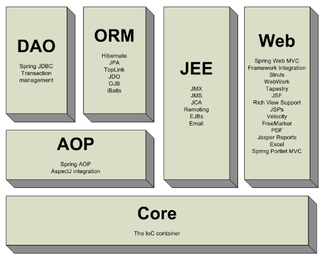
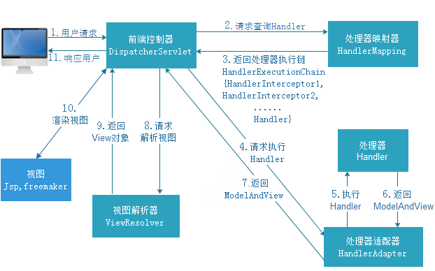
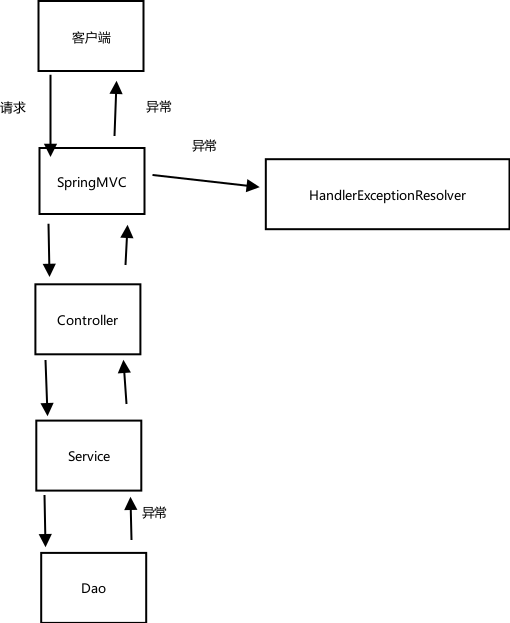

[TOC]

---

----

---



# Springmvc架构



## 架构流程

1.  用户发送请求至前端控制器DispatcherServlet
2. DispatcherServlet收到请求调用HandlerMapping处理器映射器
3. 处理器映射器根据请求url找到具体的处理器，生成处理器对象及处理器拦截器(如果有则生成)一并返回给DispatcherServlet
4.  DispatcherServlet通过HandlerAdapter处理器适配器调用处理器
5.  执行处理器(Controller，也叫后端控制器)。
6.  Controller执行完成返回ModelAndView
7.  HandlerAdapter将controller执行结果ModelAndView返回给DispatcherServlet
8. DispatcherServlet将ModelAndView传给ViewReslover视图解析器
9. ViewReslover解析后返回具体View
10. DispatcherServlet对View进行渲染视图（即将模型数据填充至视图中）。
11. DispatcherServlet响应用户

## 组件说明

- DispatcherServlet：前端控制器

用户请求到达前端控制器，它就相当于mvc模式中的c，dispatcherServlet是整个流程控制的中心，由它调用其它组件处理用户的请求，dispatcherServlet的存在降低了组件之间的耦合性。

- **HandlerMapping：处理器映射器**

HandlerMapping负责根据用户请求url找到Handler即处理器，springmvc提供了不同的映射器实现不同的映射方式，例如：配置文件方式，实现接口方式，注解方式等。

- **Handler：处理器**

Handler 是继DispatcherServlet前端控制器的后端控制器，在DispatcherServlet的控制下Handler对具体的用户请求进行处理。

**由于Handler涉及到具体的用户业务请求，所以一般情况需要程序员根据业务需求开发Handler。**

- **HandlAdapter：处理器适配器**

通过HandlerAdapter对处理器进行执行，这是适配器模式的应用，通过扩展适配器可以对更多类型的处理器进行执行。

- **ViewResolver：视图解析器**

View Resolver负责将处理结果生成View视图，View Resolver首先根据逻辑视图名解析成物理视图名即具体的页面地址，再生成View视图对象，最后对View进行渲染将处理结果通过页面展示给用户。

- **View：视图**

springmvc框架提供了很多的View视图类型的支持，包括：jstlView、freemarkerView、pdfView等。我们最常用的视图就是jsp。

**一般情况下需要通过页面标签或页面模版技术将模型数据通过页面展示给用户，需要由程序员根据业务需求开发具体的页面。**

> 说明：在springmvc的各个组件中，处理器映射器、处理器适配器、视图解析器称为springmvc的三大组件。
>
> 需要用户开发的组件有handler、view

##  组件扫描器

- 使用组件扫描器省去在spring容器配置每个Controller类的繁琐。

  使用`<context:component-scan>`自动扫描标记@Controller的控制器类

  在springmvc.xml配置文件中配置如下：

  ```xml
  <!-- 配置controller扫描包，多个包之间用,分隔 -->
  <context:component-scan base-package="cn.itcast.springmvc.controller" />
  ```

##  注解映射器和适配器

###  配置处理器映射器

- 注解式处理器映射器，对类中标记了@ResquestMapping的方法进行映射。根据@ResquestMapping定义的url匹配@ResquestMapping标记的方法，匹配成功返回HandlerMethod对象给前端控制器。HandlerMethod对象中封装url对应的方法Method。 

- 从spring3.1版本开始，废除了DefaultAnnotationHandlerMapping的使用，推荐使用RequestMappingHandlerMapping完成注解式处理器映射。

-  在springmvc.xml配置文件中配置如下：

  ```xml
  <!-- 配置处理器映射器 -->
  <bean
  	class="org.springframework.web.servlet.mvc.method.annotation.RequestMappingHandlerMapping" />
  ```

  >注解描述：@RequestMapping：定义请求url到处理器功能方法的映射

###  配置处理器适配器

- 注解式处理器适配器，对标记@ResquestMapping的方法进行适配。
- 从spring3.1版本开始，废除了AnnotationMethodHandlerAdapter的使用，推荐使用RequestMappingHandlerAdapter完成注解式处理器适配。
- 在springmvc.xml配置文件中配置如下：

```xml
<!-- 配置处理器适配器 -->
<bean
	class="org.springframework.web.servlet.mvc.method.annotation.RequestMappingHandlerAdapter" />
```

### 注解驱动

- 直接配置处理器映射器和处理器适配器比较麻烦，可以使用注解驱动来加载。SpringMVC使用`<mvc:annotation-driven>`自动加载RequestMappingHandlerMapping和RequestMappingHandlerAdapter可以在springmvc.xml配置文件中使用`<mvc:annotation-driven>`替代注解处理器和适配器的配置。

```xml
<!-- 注解驱动 -->
<mvc:annotation-driven />
```

### 视图解析器

- 视图解析器使用SpringMVC框架默认的InternalResourceViewResolver，这个视图解析器支持JSP视图解析
- 在springmvc.xml配置文件中配置如下：

```xml
<!-- Example: prefix="/WEB-INF/jsp/", suffix=".jsp", viewname="test" -> 
		"/WEB-INF/jsp/test.jsp" -->
	<!-- 配置视图解析器 -->
	<bean
		class="org.springframework.web.servlet.view.InternalResourceViewResolver">
		<!-- 配置逻辑视图的前缀 -->
		<property name="prefix" value="/WEB-INF/jsp/" />
		<!-- 配置逻辑视图的后缀 -->
		<property name="suffix" value=".jsp" />
	</bean>
```

>逻辑视图名需要在controller中返回ModelAndView指定，比如逻辑视图名为ItemList，
>
>则最终返回的jsp视图地址:“WEB-INF/jsp/itemList.jsp”
>
>最终jsp物理地址：前缀+**逻辑视图名**+后缀

###  @RequestMapping

- 通过@RequestMapping注解可以定义不同的处理器映射规则。
- @RequestMapping(value="Google")或@RequestMapping("/Google"）
- value的值是数组，可以将多个url映射到同一个方法

```java
/**
 * 查询商品列表
 * @return
 */
@RequestMapping(value = { "GoogleList", "GoogleListAll" })
public ModelAndView queryItemList() {
	// 查询商品数据
	List<Item> list = this.itemService.queryItemList();

	// 创建ModelAndView,设置逻辑视图名
	ModelAndView mv = new ModelAndView("GoogleList");

	// 把商品数据放到模型中
	mv.addObject("GoogleList", list);
	return mv;
}
```

###  添加在类上面

- 在class上添加@RequestMapping(url)指定通用请求前缀， 限制此类下的所有方法请求url必须以请求前缀开头

```java
@Controller
@RequestMapping("google")
public class TestController{
    
    @Autowired
    private TestService testService;
    
    @RequestMapping(value={"googleList","googleListAll"})
    public ModelAndView queryItemList(){
        List<Item> list = this.testService.queryItemList();
    }
}
```

>此时需要进入queryItemList()方法的请求url为：`http://127.0.0.1:8080/springmvc-web2/Google/googleList.action`
>
>或者:`http://127.0.0.1:8080/springmvc-web2/Google/googleListAll.action`

### 请求方法限定

- 除了可以对url进行设置，还可以限定请求进来的方法

  - 限定GET方法

  ```java
  @RequestMapping(method = RequestMethod.GET)
  ```

  > 如果通过POST访问则报错：
  >
  > HTTP Status 405 - Request method 'POST' not supported 
  >
  > 例如：
  >
  > @RequestMapping(value = "itemList",method = RequestMethod.**POST**)

  - 限定POST方法

  ```java
  @RequestMapping(method = RequestMethod.POST)
  ```

  > 如果通过GET访问则报错：
  >
  > HTTP Status 405 - Request method 'GET' not supported

  - GET和POST都可以

  ```java
  @RequestMapping(method = {RequestMethod.GET,RequestMethod.POST})
  ```


## Controller方法返回值

  ### 返回ModelAndView

  - controller方法中定义ModelAndView对象并返回，对象中可添加model数据、指定view。

  ### 返回void

  - 在Controller方法形参上可以定义request和response，使用request或response指定响应结果：

    1. 使用request转发页面，如下：`request.getRequestDispatcher("页面路径").forward(request, response);`

    ```java
    request.getRequestDispatcher("/WEB-INF/jsp/success.jsp").forward(request, response);
    ```

    2. 可以通过response页面重定向:`response.sendRedirect("url")`

    ```java
    response.sendRedirect("/springmvc-web2/TestEdit.action");
    ```

    3. 可以通过response指定响应结果，例如响应json数据如下：

    ```java
    response.getWriter().print("{\"abc\":123}");
    ```


## 返回字符串

### 逻辑视图名

- controller方法返回字符串可以指定逻辑视图名，通过视图解析器解析为物理视图地址。

```java
//指定逻辑视图名，经过视图解析器解析为jsp物理路径：/WEB-INF/jsp/itemList.jsp
return "TestList";
```

### Redirect重定向

- Contrller方法返回字符串可以重定向到一个url地址

```java
/**
 * 更新商品
 * @return
 */
@RequestMapping("updateItem")
public String updateItemById(Item item) {
	// 更新商品
	this.itemService.updateItemById(item);

	// 修改商品成功后，重定向到商品编辑页面
	// 重定向后浏览器地址栏变更为重定向的地址，
	// 重定向相当于执行了新的request和response，所以之前的请求参数都会丢失
	// 如果要指定请求参数，需要在重定向的url后面添加 ?itemId=1 这样的请求参数
	return "redirect:/itemEdit.action?itemId=" + item.getId();
}
```

### forward转发

- Controller方法执行后继续执行另一个Controller方法
- 如下商品修改提交后转向到商品修改页面，修改商品的id参数可以带到商品修改方法中。

```java
/**
 * 更新商品
 * @return
 */
@RequestMapping("updateItem")
public String updateItemById(Item item) {
	// 更新商品
	this.itemService.updateItemById(item);

	// 修改商品成功后，重定向到商品编辑页面
	// 重定向后浏览器地址栏变更为重定向的地址，
	// 重定向相当于执行了新的request和response，所以之前的请求参数都会丢失
	// 如果要指定请求参数，需要在重定向的url后面添加 ?itemId=1 这样的请求参数
	// return "redirect:/itemEdit.action?itemId=" + item.getId();

	// 修改商品成功后，继续执行另一个方法
	// 使用转发的方式实现。转发后浏览器地址栏还是原来的请求地址，
	// 转发并没有执行新的request和response，所以之前的请求参数都存在
	return "forward:/itemEdit.action";

}
//结果转发到editItem.action，request可以带过去
return "forward: /itemEdit.action";
```

## 异常处理

- springmvc在处理请求过程中出现异常信息交由异常处理器进行处理，自定义异常处理器可以实现一个系统的异常处理逻辑。

### 异常处理思路

- 系统中异常包括两类：预期异常和运行时异常RuntimeException，前者通过捕获异常从而获取异常信息，后者主要通过规范代码开发、测试通过手段减少运行时异常的发生。
- 系统的dao、service、controller出现都通过throws Exception向上抛出，最后由springmvc前端控制器交由异常处理器进行异常处理，如下图：



## JSON数据交互

### @RequestBody

- 作用:

  - @RequestBody注解用于读取http请求的内容(字符串)，通过springmvc提供的HttpMessageConverter接口将读到的内容（json数据）转换为java对象并绑定到Controller方法的参数上。

  - 传统的请求参数：

    `itemEdit.action?id=1&name=zhangsan&age=12`

  - 现在的请求参数：使用POST请求，在请求体里面加入json数据

  ```json
  {
  "id": 1,
  "name": "测试商品",
  "price": 99.9,
  "detail": "测试商品描述",
  "pic": "123456.jpg"
  }
  ```

  > @RequestBody注解实现接收http请求的json数据，将json数据转换为java对象进行绑定

### @ResponseBody

- 作用
  - @ResponseBody注解用于将Controller的方法返回的对象，通过springmvc提供的HttpMessageConverter接口转换为指定格式的数据如：json,xml等，通过Response响应给客户端
  - 本例子应用：@ResponseBody注解实现将Controller方法返回java对象转换为json响应给客户端。

## 拦截器

### 处理流程

1. 有一个登录页面，需要写一个Controller访问登录页面

2. 登录页面有一提交表单的动作。需要在Controller中处理。

   - 判断用户名密码是否正确（在控制台打印）
   - 如果正确,向session中写入用户信息（写入用户名username）
   -  跳转到商品列表

3. 拦截器。

   -  拦截用户请求，判断用户是否登录（登录请求不能拦截）
   - 如果用户已经登录。放行
   - 如果用户未登录，跳转到登录页面。

   配置springmvc.xml

   ```xml
   <mvc:interceptor>
   	<!-- 配置商品被拦截器拦截 -->
   	<mvc:mapping path="/test/**" />
   	<!-- 配置具体的拦截器 -->
   	<bean class="cn.itcast.ssm.interceptor.LoginHandlerInterceptor" />
   </mvc:interceptor>
   ```

   