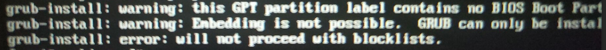

- arch- 第一次装archLinux时，感觉不是很明白各个命令的大致意思，不久前Windows的系统出问题了，不得不重装了，我想我可以不用Linux了，弄得是单系统，Windows也差不多配置好了，但是我发现，Windows用eclipse好卡，或许是我的配置太差了，为了追求快，我又装了arch（**桌面事xfce，下面也有换桌面的方法，我第一次装的事kde**），废话不多说，接下来步骤，其中一些简单的就不写了，想早点睡觉！！！！
- 第一步我感觉应该看看官方的[wiki](https://wiki.archlinux.org/index.php/Installation_guide)，上面有英文有中文的，先看看大概是怎么装的，有个大致的了解
- 这个制作启动项，别的帖子也有好多，不过我建议用这个[USBWrite](https://sourceforge.net/projects/usbwriter/)（轻量级，还好用），不建议用UltralSO（因为我不知这个可以不，我看别的教程上用的是这个，但是我用了制作的安装介质不能用，没反应，可能是个人原因吧）。
- 我的是双系统，并且还只有一个硬盘，步骤应该都是一样的，我压缩了50G，在Windows的磁盘管理里面，压缩卷，1024×你要的大小，单位事G，接着就是进BIOS，把安全启动关了，快速启动最好关了（我没关也没事），接着把u盘作为第一启动项
- 接着就可以看到arch的安装界面了
- 键盘格式一般不用改，如果有特殊需求请看wiki
- 验证启动模式：
  如果以在 UEFI 主板上启用 UEFI 模式，Archiso 将会使用 systemd-boot 来 启动 Arch Linux。可以列出 efivars 目录以验证启动模式：

  

      # ls /sys/firmware/efi/efivars

  如果是的，就会出来一长串信息，如果目录不存在，系统可能以 BIOS 或 CSM 模式启动，详见您的主板手册。
- arch安装是需要网络的，所以先测试一下你的网络可以用不，`# ping archlinux.org`，ping百度也一样，这是在用有线网络的情况下，如果你用的是WiFi可以用wifi-menu这个命令来查找连接网络。
- 更新系统时间：`# timedatectl set-ntp true`
- 成功以后就要弄麻烦一点的东西啦，不过也不要怕，只要你大胆心细，不会错的！！！   
  磁盘若被系统识别到，就会被分配为一个 块设备，如 /dev/sda 或者 /dev/nvme0n1。可以使用 lsblk 或者 fdisk 查看：

```
# fdisk -l
```
如果你找不到你压缩的硬盘的话不要着急，用下面的这个命令：

```
# fdisk /dev/sda
```
然后用q退出，想分区的话用cfdisk这个命令，这个是图形界面的，更容易理解
执行完上面的命令，再用`fdisk -l`的话，就会发现你压缩的硬盘了，然后再用`cfdisk /dev/sdx（这个是你刚刚查到的硬盘）`双系统的话就不用创建efi分区了，记住Windows的efi分区的路径，等下挂载的时候用得到

- 格式化分区：
  当分区建立好了，这些分区都需要使用适当的 文件系统 进行格式化。举个例子，如果想将 /dev/sda1 格式化成 ext4，可以运行：
- 挂载分区
  首先将根分区 挂载 到 /mnt，例如：

```
# mount /dev/sda1 /mnt
```
**这是双系统需要弄得：**

```
# mkdir -p /mnt/boot/efi
# mount /dev/sdx/mnt/boot （请将sdx替换为之前记住的Windows的efi分区，一般是那个256m大小的分区）
```
- 我们可以选择国内的源来加快下载速度
  用vim这个命令修改/etc/pacman.d/mirrorlist这个文件

```
# vim /etc/pacman.d/mirrorlist
```
可以用浙大，清华的源：
vim下的查找命令： / something  （something是你要查找的内容，按回车自动跳转到你查找的位置）
把这两个剪切复制到前面就行了，用2 dd这个命令，意思的是从光标开始剪切2行，数字可以换成别的
```
# Server = http://mirrors.tuna.tsinghua.edu.cn/archlinux/$repo/os/$arch
# Server = http://mirrors.zju.edu.cn/archlinux/$repo/os/$arch
```
完成之后按ese退出编辑模式，接着用`：wq`保存
- 接下来就是安装镜像了：（此步骤需要联网）
  `# pacstrap /mnt base base-devel   前面一步改了源之后，下载一般可以跑满速的`
- 配置系统用的事fstab命令
  `# genfstab -U /mnt >> /mnt/etc/fstab`
  这部完成后我们可以检查一下（这步还是比较重要的）：

```
# cat /mnt/etc/fstab     检查有没有挂在好
```
- chroot ：Change root 到新安装的系统：

```
# arch-chroot /mnt
```
- 设置时区：

```
# ln -sf /usr/share/zoneinfo/Asia/Shanghai /etc/localtime
```

```
# hwclock --systohc     生成 /etc/adjtime
```
我们下面要用到vim，所以先装vim（建议把一会要用的包一并安装了）
`# pacman -S vim dialog wpa_supplicant ntfs-3g networkmanager`
- 本地化：

```
# vim /etc/locale.gen
把下面的的前面的注释（#）去掉，可以用 "/ something"这个命令来查找，上面有介绍：
en_US.UTF-8 UTF-8
zh_CN.UTF-8 UTF-8
zh_TW.UTF-8 UTF-8
zh_CN.UTF-8 UTF-8
```
- 接着执行 locale-gen 以生成 locale 讯息：

```
# locale-gen         注释：/etc/locale.gen 会生成指定的本地化文件。
```
- 创建 locale.conf 并编辑 LANG 这一 变量：先改成英文，到后面下载了中文字体，想改在弄成中文的！

```
# vim /etc/locale.conf
LANG=en_US.UTF-8
```
- 主机名
  要设置 hostname，将其 添加 到 /etc/hostname，myhostname 是需要的主机名：

```
# vim /etc/hostname
myhostname       “myhostname”是你你想设置的电脑名字
```
- 添加对应的信息到hosts中：

```
# vim /etc/hosts
127.0.0.1	localhost
::1		        localhost
127.0.1.1	myhostname.localdomain	myhostname
```
- 设置root密码

```
# passwd     输入密码时不会显示密码，输入两次
```
- 安装interl-ucode

```
# pacman -S intel-ucode
```
-安装os-prober,可以配合Grub检测已存在的系统，自动设置启动项

```
# pacman -S os-prober
```
---

***我这只是对于efi/gtp分区格式下的，再重申一遍***

- 安装grub与efibootmgr两个包： 

```
# pacman -S grub efibootmgr
```
- 部署grub：

```
# grub-install --target=x86_64-efi --efi-directory=/boot/efi --bootloader-id=grub
```
- 生成配置文件：

```
# grub-mkconfig -o /boot/grub/grub.cfg
```
接下来看看提示错误是什么，自己检查是否全部完成
如果是warning failed to connect to lvmetad，falling back to device scanning.错误，简单的方法是编辑/etc/lvm/lvm.conf这个文件，找到use_lvmetad = 1将1修改为0，保存，重新配置grub。


如果报grub-probe: error: cannot find a GRUB drive for /dev/sdb1, check your device.map类似错误，并且sdb1这个地方是你的u盘，这是u盘uefi分区造成的错误，对我们的正常安装没有影响，可以不用理会这条错误。


再重新生成配置文件，就可以找到系统入口。

如果你已经安装os-prober包并生成配置文件后还是没有生成其他系统的入口：
你目前处的U盘安装环境下有可能无法检测到其他系统的入口，请在下一步中重启登陆之后重新运行：

```
# grub-mkconfig -o /boot/grub/grub.cfg
```
- 重启
  输入 `# exit` 或按 Ctrl+D 退出 chroot 环境。


---

- ##### **BIOS/MBR引导方式**

  - 安装`grub`包：

  ```
  pacman -S grub
  ```
  - 部署grub：

  ```
  grub-install --target=i386-pc /dev/你的硬盘
  ```

  - 生成配置文件：

  ```
  grub-mkconfig -o /boot/grub/grub.cfg
  ```

  **如果你没有看到如图所示的提示信息，请仔细检查是否正确完成上面的过程。常见问题如下：**

  1. 如果报`warning failed to connect to lvmetad，falling back to device scanning.`错误。参照[wiki](https://wiki.archlinux.org/index.php/Install_from_existing_Linux/)中搜索关键词`use_lvmetad`所在位置，简单的方法是编辑`/etc/lvm/lvm.conf`这个文件，找到`use_lvmetad = 1`将`1`修改为`0`，保存，重新配置grub。
  2. 有部分同学反馈后面安装`grub`包的时候报如下错误：

  

  是因为实际是`UEFI`引导的系统没有正确挂载`boot`分区。首先检查你是不是按照`BIOS`方式安装的系统，二是检查是否正确挂载`/mnt/boot`。正确配置好`boot`分区之后可以从“挂载分区”这步开始重做。


---

可选用 `# umount -R /mnt` 手动卸载被挂载的分区。
最后，通过执行 `# reboot` 重启系统，systemd 将自动卸载仍然挂载的任何分区。不要忘记移除安装介质，然后使用 root 帐户登录到新系统。

- 这时候可以进到登录页面，用户选择root，密码是你刚刚设置的
- 重启后可能会没用网络：`# ping www.baidu.com`试一下

```
# ip link                看原因
# ip link set ens33 up
# systemctl enable dhcpcd
# reboot
```
- 我们没有创建交换分区，如果有需要，可以自行查看wiki，上面在挂载的时候就创建swap分区了，我内存够用，所以就没弄，如果不够用的话，建议创建swap分区，当然在安装完成后，也是可以创建的！
- 每次都在root的环境下，我感觉不好，所以让我们来创建一个用户吧

```
# useradd -m -G wheel username       把username换成你想要创建用户的名称
# passwd username       	设置你创建的用户密码，还是输入两次
```
- 配置sudo：为了执行root命令

```
# pacman -S sudo     安装sudo软件包
# visudo
找到   # %wheel ALL=(ALL)ALL  这一行，去掉 “ # ”这个注释符就行了
# reboot
```
- 安装显卡驱动（这个是安装Intel的集成显卡的驱动）

```
# pacman -S xf86-video-intel      其他的显卡类型请自行查找
```
- 接下来是安装桌面所需要的支持软件

```
# sudo pacman -S xorg
# sudo pacman -S sddm    
/**
*桌面管理器（可以更换成别的），如果想换桌面的话，
*就把这个禁用了，然后重启，就会进入没有图形界面的命令行，就是你刚装完系统的样子，
*然后卸载的桌面，再下载你想要换的桌面，下载完了后，再咋sddm设置成开机自启，
*重启后就可以进入你新装的桌面
*/
```
-注：

```
sudo systemctl enable  软件或者服务名 （意思是开机启动一项服务）
sudo systemctl disable 软件或者服务名 （取消开机启动一项服务）
sudo systemctl start   软件或者服务名 （启动一项服务）
sudo systemctl stop    软件或者服务名 （停止一项服务）
```
- 安装桌面 xfce4
  `# sudo pacman -S xfce4 xfce4-goodies`
- 设置开机启动桌面管理器sddm

  `# sudo systemctl enable sddm`
- 配置好网络省的开机没网
```
# sudo systemctl disable netctl
# sudo systemctl enable NetworkManager
# sudo pacman -S network-manager-applet     为了保险，再装一遍
# reboot
```
- 开机后，输入密码，发现进入了我们熟悉的图形界面，但这个时候我们的所有界面都是英语的，如果英语不好可能就头疼了，要想换成中文，首先要先装中文字体，不然无法显示中文，或者会挤在一块

```
`# sudo pacman -S noto-fonts-cjk   //这个包包含多个语言的字体（贴吧老哥说的）
//把系统语言改为中文
# sudo vim /etc/locale.conf
把那一行换成下面这个
zh_CN.UTF-8 UTF-8`
```

- 安装fcitx输入法

```
# sudo pacman -S fcitx fcitx-sougoupinyin  fcitx-im fcitx-fbterm kcm-fcitx
//打开/etc/profile文件，加入下面几行

export XMODIFIERS="@im=fcitx"
export GTK_IM_MODULE="fcitx"
export QT_IM_MODULE="fcitx"

然后重启就可以调整输入法了（装的是搜狗输入法）
```
- xfce中警报声去除：
```
    新建/etc/modprobe.d/blacklist.conf
    写入 blacklist pcspkr
    重启搞定
```
- 外面的世界更美丽啦

```
# sudo pacman -S shadowsocks-qt5      这个是图形界面的，命令行用不太好，
剩下的自己加入就行
```
- 让终端也可以走代理

```
1.
it clone https://github.com/rofl0r/proxychains-ng.git
cd proxychains-ng
./configure
make && make install
cp ./src/proxychains.conf /etc/proxychains.conf
cd .. && rm -rf proxychains-ng

2.
# vim /etc/proxychains.conf
将  socks4 127.0.0.1 9095   改为     socks5 127.0.0.1 1080
3.使用方法
proxychains4 wget http://xxx.com/xxx  直接就可以用啦
```
- 安装yay

```
git clone https://aur.archlinux.org/yay.git
cd yay
makepkg -si

建议用proxychains4,速度更快
```
- 美化图标

```
# yay numix    这样就会列出所有的numix相关的软件包，
在其中找到numix-circle-icon-theme，
然后输入前面的序号就可以安装了。然后接下来根据提示进行操作就可以了。
```
- 美化主题
```
# yay gtk-theme-arc-git     我感觉gtk主题还是arc好看！！！！
```
- 美化终端 

```
 # sudo pacman -S zsh
 #  sudo pacman -S git
# wget https://github.com/robbyrussell/oh-my-zsh/raw/master/tools/install.sh
# chmod +x install.sh
# ./install.sh
编辑对应家目录下的.zshrc文件。 
ZSH_THEME=”主题名称” 部分更改为自己喜欢的主题，
（主题存放目录在.oh-my-zsh/themes/）
下面列了几款主题
建议换成agnoster主题，好看一点
```

---

---

---

安装部分的原地址：https://www.viseator.com/2017/05/17/arch_install/

个人认为写的挺好的，我就是看啦他的才安装成功的