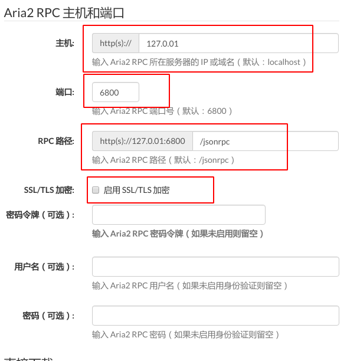

系统:arch

----

安装什么的就不用写了吧….

- 配置文件目录:我的目录如下:

```
/home/stone/.aria2/
```

- aria2.conf配置

```shell
## 文件保存相关 ##

# 文件的保存路径(可使用绝对路径或相对路径), 默认: 当前启动位置
dir=/root/Downloads
# 启用磁盘缓存, 0为禁用缓存, 需1.16以上版本, 默认:16M
disk-cache=32M
# 文件预分配方式, 能有效降低磁盘碎片, 默认:prealloc
# 预分配所需时间: none < falloc ? trunc < prealloc
# falloc和trunc则需要文件系统和内核支持
# NTFS建议使用falloc, EXT3/4建议trunc, MAC 下需要注释此项
file-allocation=trunc
# 断点续传
continue=true

## 下载连接相关 ##

# 最大同时下载任务数, 运行时可修改, 默认:5
max-concurrent-downloads=10
# 同一服务器连接数, 添加时可指定, 默认:1
max-connection-per-server=10
# 最小文件分片大小, 添加时可指定, 取值范围1M -1024M, 默认:20M
# 假定size=10M, 文件为20MiB 则使用两个来源下载; 文件为15MiB 则使用一个来源下载
min-split-size=20M
# 单个任务最大线程数, 添加时可指定, 默认:5
split=10
# 整体下载速度限制, 运行时可修改, 默认:0
max-overall-download-limit=0
# 单个任务下载速度限制, 默认:0
max-download-limit=0
# 整体上传速度限制, 运行时可修改, 默认:0
max-overall-upload-limit=500K
# 单个任务上传速度限制, 默认:0
max-upload-limit=100K
# 禁用IPv6, 默认:false
disable-ipv6=false

## 进度保存相关 ##

# 从会话文件中读取下载任务
input-file=/root/aria2/aria2.session
# 在Aria2退出时保存`错误/未完成`的下载任务到会话文件
save-session=/root/aria2/aria2.session
# 定时保存会话, 0为退出时才保存, 需1.16.1以上版本, 默认:0
save-session-interval=60
# 强制保存会话, 即使任务已经完成, 默认:false
# 较新的版本开启后会在任务完成后依然保留.aria2文件
force-save=true
bt-hash-check-seed=true
bt-seed-unverified=true
bt-save-metadata=true

## RPC相关设置 ##

# 启用RPC, 默认:false
enable-rpc=true
# 允许所有来源, 默认:false
rpc-allow-origin-all=true
# 允许非外部访问, 默认:false
rpc-listen-all=true
# 事件轮询方式, 取值:[epoll, kqueue, port, poll, select], 不同系统默认值不同
event-poll=select
# RPC监听端口, 端口被占用时可以修改, 默认:6800
rpc-listen-port=6800
# 设置的RPC授权令牌, v1.18.4新增功能, 取代 --rpc-user 和 --rpc-passwd 选项
rpc-secret=csdn2017

## BT/PT下载相关 ##

# 当下载的是一个种子(以.torrent结尾)时, 自动开始BT任务, 默认:true
follow-torrent=true
# BT监听端口, 当端口被屏蔽时使用, 默认:6881-6999
listen-port=19999
# 单个种子最大连接数, 默认:55
bt-max-peers=100
# 打开DHT功能, PT需要禁用, 默认:true
enable-dht=true
# 打开IPv6 DHT功能, PT需要禁用
enable-dht6=false
# DHT网络监听端口, 默认:6881-6999
dht-listen-port=6881-6999
# 本地节点查找, PT需要禁用, 默认:false
bt-enable-lpd=true
# 种子交换, PT需要禁用, 默认:true
enable-peer-exchange=true
# 每个种子限速, 对少种的PT很有用, 默认:50K
bt-request-peer-speed-limit=50K
# 客户端伪装, PT需要
peer-id-prefix=-TR2770-
user-agent=Transmission/2.77
# 当种子的分享率达到这个数时, 自动停止做种, 0为一直做种, 默认:1.0
seed-ratio=0.2
# BT校验相关, 默认:true
bt-hash-check-seed=true
# 继续之前的BT任务时, 无需再次校验, 默认:false
bt-seed-unverified=true
# 保存磁力链接元数据为种子文件(.torrent文件), 默认:false
bt-save-metadata=false
#强制加密, 防迅雷必备
bt-require-crypto=true
#添加额外tracker#
#bt-tracker=(GitHub上查找)
```

- UI界面: Aria2 WebUI

  - 配置如下:

  

> 我没有启用SSL/TLS加密

- 本机浏览地址:

```http
https://ziahamza.github.io/webui-aria2/
```

