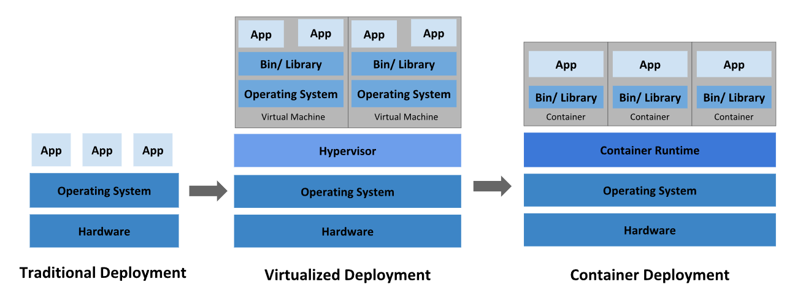

[toc]

## 一. `Kubernetes` 基本概念

> 我们急需一个大规模容器编排系统

kubernetes具有以下特性：

- **服务发现和负载均衡**
  Kubernetes 可以使用 DNS 名称或自己的 IP 地址公开容器，如果进入容器的流量很大， Kubernetes 可以负载均衡并分配网络流量，从而使部署稳定。
- **存储编排**
  Kubernetes 允许你自动挂载你选择的存储系统，例如本地存储、公共云提供商等。
- **自动部署和回滚**
  你可以使用 Kubernetes 描述已部署容器的所需状态，它可以以受控的速率将实际状态 更改为期望状态。例如，你可以自动化 Kubernetes 来为你的部署创建新容器， 删除现有容器并将它们的所有资源用于新容器。
- **自动完成装箱计算**
  Kubernetes 允许你指定每个容器所需 CPU 和内存（RAM）。 当容器指定了资源请求时，Kubernetes 可以做出更好的决策来管理容器的资源。
- **自我修复**
  Kubernetes 重新启动失败的容器、替换容器、杀死不响应用户定义的 运行状况检查的容器，并且在准备好服务之前不将其通告给客户端。
- **密钥与配置管理**
  Kubernetes 允许你存储和管理敏感信息，例如密码、OAuth 令牌和 ssh 密钥。 你可以在不重建容器镜像的情况下部署和更新密钥和应用程序配置，也无需在堆栈配置中暴露密钥。

*Kubernetes 为你提供了一个可弹性运行分布式系统的框架。 Kubernetes 会满足你的扩展要求、故障转移、部署模式等。 例如，Kubernetes 可以轻松管理系统的 Canary 部署。*

### 1. 架构

- 工作方式

Kubernetes **Cluster** **=** N **Master** Node **+** N **Worker** Node：N主节点+N工作节点； N>=1

- 组件架构

#### 1、控制平面组件（Control Plane Components）

控制平面的组件对集群做出全局决策(比如调度)，以及检测和响应集群事件（例如，当不满足部署的 `replicas` 字段时，启动新的 [pod](https://kubernetes.io/docs/concepts/workloads/pods/pod-overview/)）。

控制平面组件可以在集群中的任何节点上运行。 然而，为了简单起见，设置脚本通常会在同一个计算机上启动所有控制平面组件， 并且不会在此计算机上运行用户容器。 请参阅[使用 kubeadm 构建高可用性集群](https://kubernetes.io/zh/docs/setup/production-environment/tools/kubeadm/high-availability/) 中关于多 VM 控制平面设置的示例。

##### kube-apiserver

API 服务器是 Kubernetes [控制面](https://kubernetes.io/zh/docs/reference/glossary/?all=true#term-control-plane)的组件， 该组件公开了 Kubernetes API。 API 服务器是 Kubernetes 控制面的前端。

Kubernetes API 服务器的主要实现是 [kube-apiserver](https://kubernetes.io/zh/docs/reference/command-line-tools-reference/kube-apiserver/)。 kube-apiserver 设计上考虑了水平伸缩，也就是说，它可通过部署多个实例进行伸缩。 你可以运行 kube-apiserver 的多个实例，并在这些实例之间平衡流量。

##### etcd

etcd 是兼具一致性和高可用性的键值数据库，可以作为保存 Kubernetes 所有集群数据的后台数据库。

您的 Kubernetes 集群的 etcd 数据库通常需要有个备份计划。

要了解 etcd 更深层次的信息，请参考 [etcd 文档](https://etcd.io/docs/)。

##### kube-scheduler

控制平面组件，负责监视新创建的、未指定运行[节点（node）](https://kubernetes.io/zh/docs/concepts/architecture/nodes/)的 [Pods](https://kubernetes.io/docs/concepts/workloads/pods/pod-overview/)，选择节点让 Pod 在上面运行。

调度决策考虑的因素包括单个 Pod 和 Pod 集合的资源需求、硬件/软件/策略约束、亲和性和反亲和性规范、数据位置、工作负载间的干扰和最后时限。

##### kube-controller-manager

在主节点上运行 [控制器](https://kubernetes.io/zh/docs/concepts/architecture/controller/) 的组件。

从逻辑上讲，每个[控制器](https://kubernetes.io/zh/docs/concepts/architecture/controller/)都是一个单独的进程， 但是为了降低复杂性，它们都被编译到同一个可执行文件，并在一个进程中运行。

这些控制器包括:

- 节点控制器（Node Controller）: 负责在节点出现故障时进行通知和响应
- 任务控制器（Job controller）: 监测代表一次性任务的 Job 对象，然后创建 Pods 来运行这些任务直至完成
- 端点控制器（Endpoints Controller）: 填充端点(Endpoints)对象(即加入 Service 与 Pod)
- 服务帐户和令牌控制器（Service Account & Token Controllers）: 为新的命名空间创建默认帐户和 API 访问令牌

##### cloud-controller-manager

云控制器管理器是指嵌入特定云的控制逻辑的 [控制平面](https://kubernetes.io/zh/docs/reference/glossary/?all=true#term-control-plane)组件。 云控制器管理器允许您链接集群到云提供商的应用编程接口中， 并把和该云平台交互的组件与只和您的集群交互的组件分离开。

`cloud-controller-manager` 仅运行特定于云平台的控制回路。 如果你在自己的环境中运行 Kubernetes，或者在本地计算机中运行学习环境， 所部署的环境中不需要云控制器管理器。

与 `kube-controller-manager` 类似，`cloud-controller-manager` 将若干逻辑上独立的 控制回路组合到同一个可执行文件中，供你以同一进程的方式运行。 你可以对其执行水平扩容（运行不止一个副本）以提升性能或者增强容错能力。

下面的控制器都包含对云平台驱动的依赖：

- 节点控制器（Node Controller）: 用于在节点终止响应后检查云提供商以确定节点是否已被删除
- 路由控制器（Route Controller）: 用于在底层云基础架构中设置路由
- 服务控制器（Service Controller）: 用于创建、更新和删除云提供商负载均衡器

#### 2. Node 组件

节点组件在每个节点上运行，维护运行的 Pod 并提供 Kubernetes 运行环境。

##### kubelet

一个在集群中每个[节点（node）](https://kubernetes.io/zh/docs/concepts/architecture/nodes/)上运行的代理。 它保证[容器（containers）](https://kubernetes.io/zh/docs/concepts/overview/what-is-kubernetes/#why-containers)都 运行在 [Pod](https://kubernetes.io/docs/concepts/workloads/pods/pod-overview/) 中。

kubelet 接收一组通过各类机制提供给它的 PodSpecs，确保这些 PodSpecs 中描述的容器处于运行状态且健康。 kubelet 不会管理不是由 Kubernetes 创建的容器。

##### kube-proxy

[kube-proxy](https://kubernetes.io/zh/docs/reference/command-line-tools-reference/kube-proxy/) 是集群中每个节点上运行的网络代理， 实现 Kubernetes [服务（Service）](https://kubernetes.io/zh/docs/concepts/services-networking/service/) 概念的一部分。

kube-proxy 维护节点上的网络规则。这些网络规则允许从集群内部或外部的网络会话与 Pod 进行网络通信。

如果操作系统提供了数据包过滤层并可用的话，kube-proxy 会通过它来实现网络规则。否则， kube-proxy 仅转发流量本身。