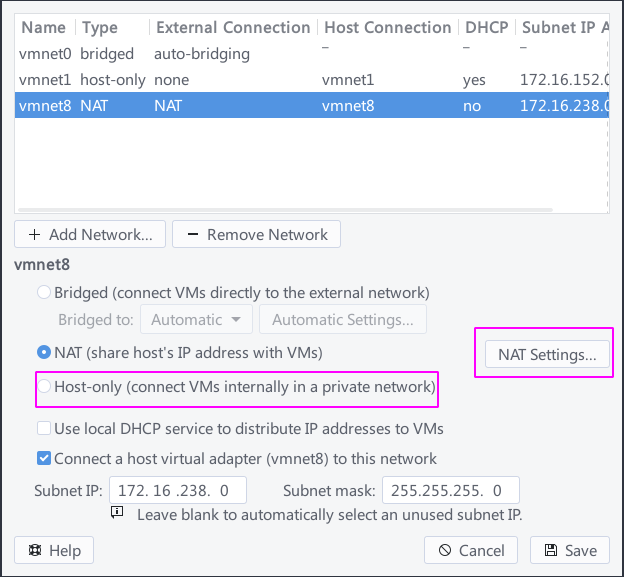
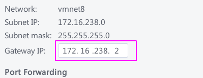
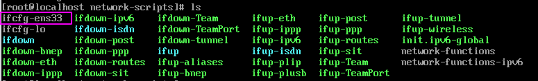
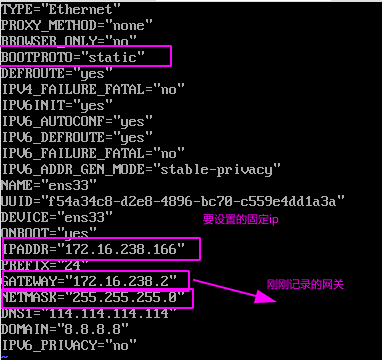

> arch下,VMware安装centos固定ip

---

---

---

1. 打开`Virtual Network Editor`
2. 设置:如果这个DHCP没有启动的话,主机是ping不通虚拟机的!



- 打开NAT Settings,记下这个网关



3. 设置虚拟机

- `cd /etc/sysconfig/network-scripts`,然后看看下面有什么文件夹



- 编辑它



4. 重启网络

```shell
service network restart
```

---

```shell
ifconfig是属于"net-tools"这个包的
```

关闭防火墙:

```shell
systemctl stop firewalld.service
```

禁止防火墙开机启动:

```shell
systemctl disable firewalld.service
```

扩展:

```shell
启动一个服务：systemctl start firewalld.service
关闭一个服务：systemctl stop firewalld.service
重启一个服务：systemctl restart firewalld.service
显示一个服务的状态：systemctl status firewalld.service
在开机时启用一个服务：systemctl enable firewalld.service
在开机时禁用一个服务：systemctl disable firewalld.service
查看服务是否开机启动：systemctl is-enabled firewalld.service;echo $?
查看已启动的服务列表：systemctl list-unit-files|grep enabled

```

```shell
# 岔开已经开放的端口
firewall-cmd --list-ports
```

开启端口

```
firewall-cmd --zone=public --add-port=80/tcp --permanent
```

命令含义：

–zone #作用域

–add-port=80/tcp #添加端口，格式为：端口/通讯协议

–permanent #永久生效，没有此参数重启后失效

重启防火墙

```
firewall-cmd --reload #重启firewall
systemctl stop firewalld.service #停止firewall
systemctl disable firewalld.service #禁止firewall开机启动firewall-cmd --state #查看默认防火墙状态（关闭后显示notrunning，开启后显示running）
```