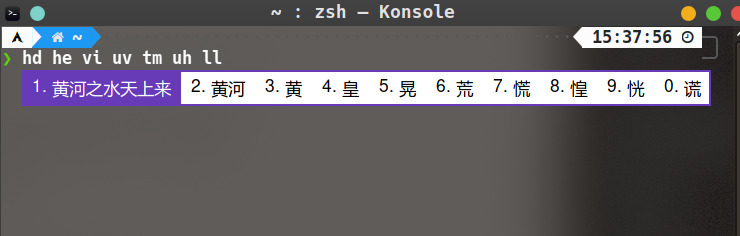

[toc]

---

> 我是一个Arch+KDE的用户，所以下面的方法可能不适合所有的Linux i发行版！！！

# 卸载Fcitx4

- 把系统关于fcitx4的包都卸载了：

```shell
sudo pacman -Rs $(pacman -Qsq fcitx)
```

# 安装Fcitx5

- 安装Fcitx5软件包：

```shell
sudo pacman -S fcitx5-chinese-addons fcitx5-git fcitx5-gtk fcitx5-qt fcitx5-pinyin-zhwiki kcm-fcitx5
```

	- fcitx5: 输入法基础框架主程序 
	- fcitx5-chinese-addons: 简体中文输入的支持，云拼音 
	- fcitx5-gtk: GTK程序的支持 
	- citx5-qt: QT5程序的支持 
	- fcitx5-pinyin-zhwiki: 肥猫制作的维基百万词库，没有版权风险, 放心使用
	- kcm-fcitx5: KDE桌面环境的支持

# 配置

## 修改环境变量

- 修改输入法环境变量，使应用可以调用Fcitx5输入法
- 将下面的内容粘贴到``~/.pam_environment`

```shell
GTK_IM_MODULE DEFAULT=fcitx
QT_IM_MODULE  DEFAULT=fcitx
XMODIFIERS    DEFAULT=@im=fcitx
```

## 系统登陆后默认启动Fcitx5输入法

- 将下面的内容粘贴到 ``~/.xprofile`

```shell
fcitx5 &
```

## 配置主题

- 可以使用``fcitx5-material-color`这个主题，具体配置方法在github上写的很清楚，我就不搬运了，可以去看一下！[fcitx5-material-color](https://github.com/hosxy/Fcitx5-Material-Color)

```shell
yay -S fcitx5-material-color
```

- 贴一下我的配置`vim ~/.config/fcitx5/conf/classicui.conf `

```shell
# 垂直候选列表
Vertical Candidate List=False

# 按屏幕 DPI 使用
PerScreenDPI=True

# Font (设置成你喜欢的字体)
Font="思源黑体 CN Medium 13"

# 主题
Theme=Material-Color-DeepPurple
```

# 最终使用效果

- 皮肤上手效果（我喜欢基佬紫）



- 输入法是微软双拼


# 参考文档

[ArchWili](https://wiki.archlinux.org/index.php/Fcitx5)

[Fcitx5-Material-Color](https://github.com/hosxy/Fcitx5-Material-Color)