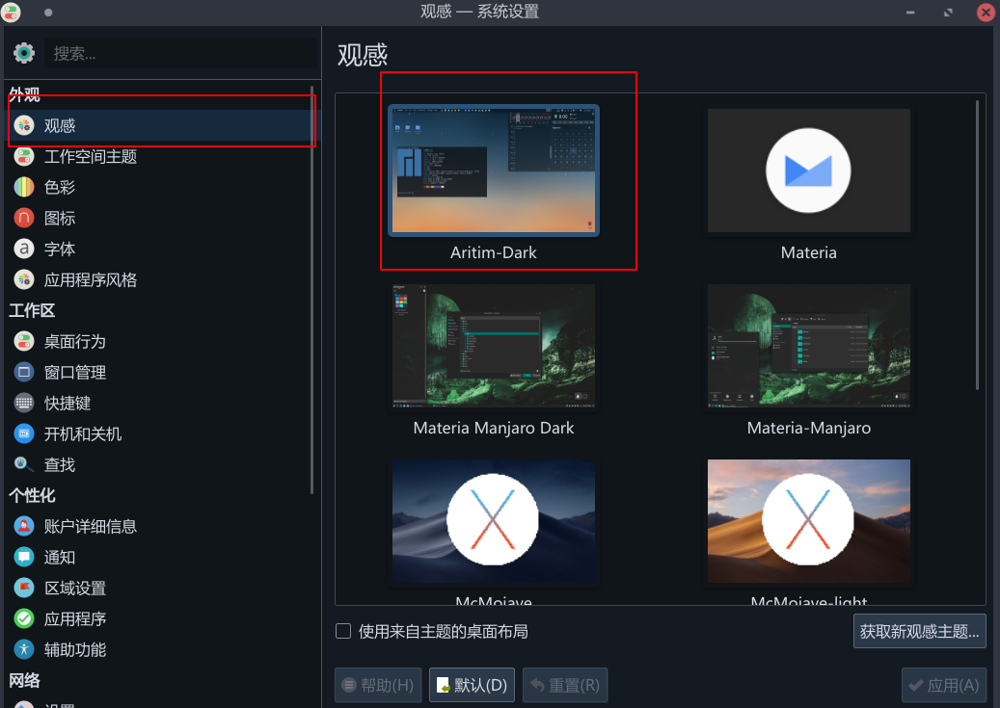
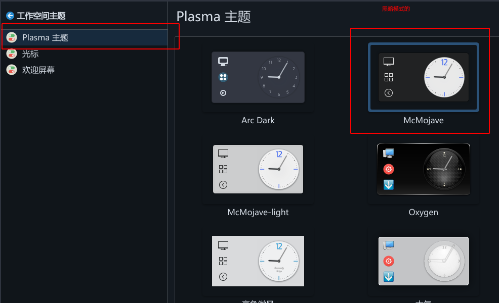
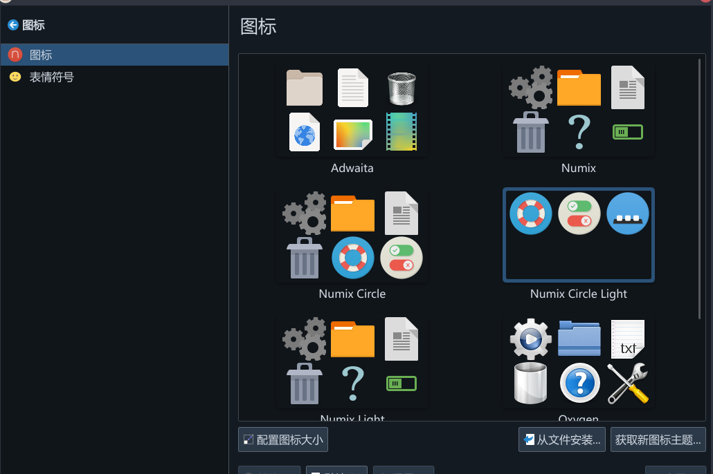
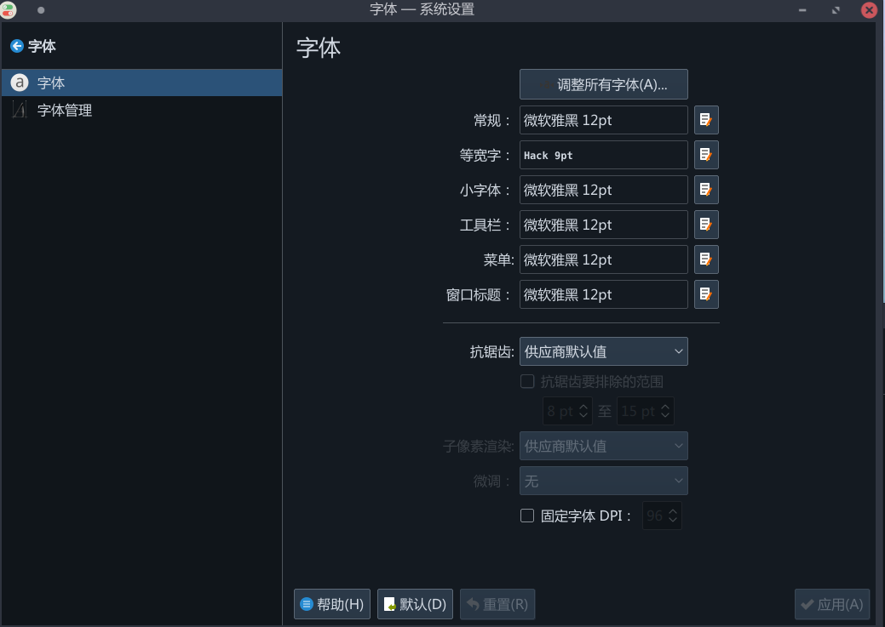
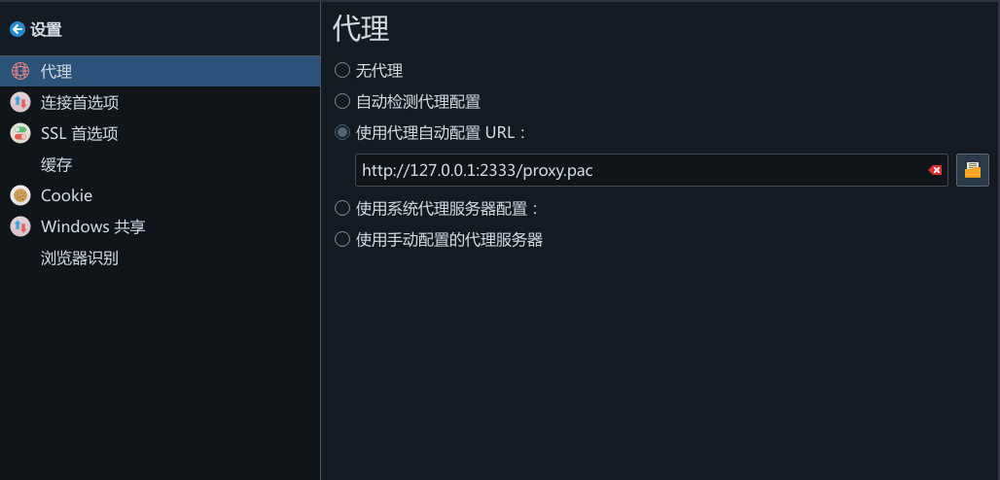
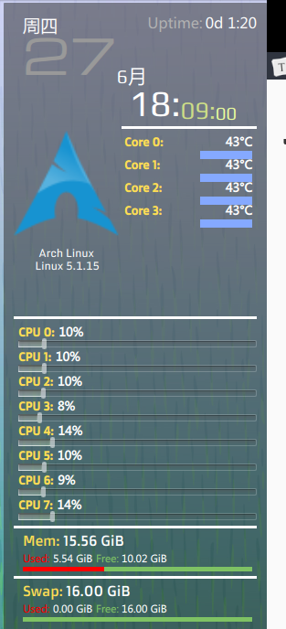

[TOC]

---

---

> 直到今天，我才明白了备份的重要性，以后使用`rm -rf`当出现了错误就会后悔莫及了！！！

---

以下为我的Linux的配置，用了做备份！

---

# 系统配置

- 观感

- Plasma主题

- 图标

- 字体

- 代理

- 插件:simple monitor

- 软件及其最终配置

---

---

以后一定要主要注意啦!!!!