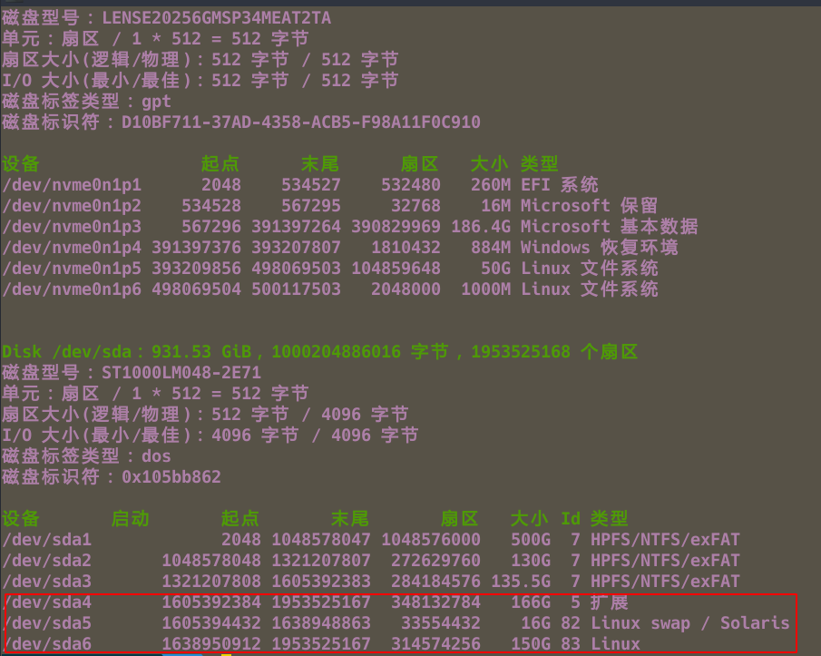
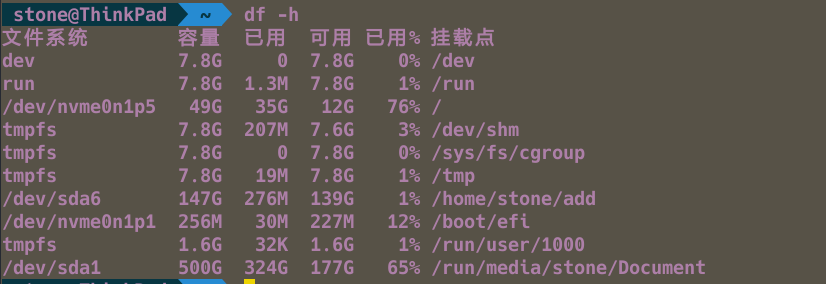

[TOC]

---

---

---

# swap

1. 其中加swap分区有两种方法,这里只介绍一种,可以参考[archwiki](https://wiki.archlinux.org/index.php/Swap_(%E7%AE%80%E4%BD%93%E4%B8%AD%E6%96%87))

   1. 交换空间通常是一个磁盘分区，但是也可以是一个文件。用户可以在安装 Arch Linux 的时候创建交换空间，或者在安装后的任何时间建立交换空间。对于 RAM 小于 1GB 的用户，交换空间通常是推荐的，但是对于拥有大量的物理内存的用户来说是否使用主要看个人口味了(尽管它对于休眠到硬盘支持是必须的)。

   检查交换空间状态,使用:

   ```shell
   $ swapon -s
   ```

   或者:

   ```shell
   $ free -m
   ```

2. 交换分区可以用大多数 GNU/Linux [分区工具](https://wiki.archlinux.org/index.php/Partitioning_(简体中文))(例如 `fdisk`, `cfdisk`)创建。交换分区被分配为类型 `82`。尽管可以使用任何分区类型作为交换分区，但是在大多数情况下，建议使用 `82`，因为 [systemd](https://wiki.archlinux.org/index.php/Systemd) 会自动检测并挂载它（见下文）。

      想安装一个 Linux 交换区域，使用 `mkswap` 命令。例如:

   ```shell
   # mkswap /dev/sdxy
   ```

   > **警告:** 指定分区上的所有数据会丢失。

   想要启用一个设备作为交换分区：

   ```shell
   # swapon /dev/sdxy
   ```

   想要启动时自动启用交换分区，添加一个条目到 fstab:

   ```shell
   # vim /etc/fstab
   UUID=<UUID> none swap defaults 0 0
   ```
   
   UUID可以通过以下命令获得：
   
   ```shell
   lsblk -no UUID /dev/sdxy
   ```
   
3. 关闭交换分区

      - 使用下面的命令关闭交换分区：

      ```shell
      # swapoff /dev/sdxy
      ```

      也可以使用 -a 参数来关闭所有的交换分区。

      因为 swap 通过 systemd 管理，因此会在下一次系统启动时再次激活。要永久禁用该特性，运行 systemctl --type swap 来查找 .swap 单元，然后 mask 它。

      

---

# 加新硬盘

1. 需要用root用户,`su`切换到root用户下,`fdisk -lu`



2. 创建分区

进入磁盘`/dev/sda`,命令: `fdisk /dev/sda`输入m查看帮助:

```shell
欢迎使用 fdisk (util-linux 2.34)。
更改将停留在内存中，直到您决定将更改写入磁盘。
使用写入命令前请三思。


命令(输入 m 获取帮助)：m

帮助：

  DOS (MBR)
   a   开关 可启动 标志
   b   编辑嵌套的 BSD 磁盘标签
   c   开关 dos 兼容性标志

  常规
   d   删除分区
   F   列出未分区的空闲区
   l   列出已知分区类型
   n   添加新分区
   p   打印分区表
   t   更改分区类型
   v   检查分区表
   i   打印某个分区的相关信息

  杂项
   m   打印此菜单
   u   更改 显示/记录 单位
   x   更多功能(仅限专业人员)

  脚本
   I   从 sfdisk 脚本文件加载磁盘布局
   O   将磁盘布局转储为 sfdisk 脚本文件

  保存并退出
   w   将分区表写入磁盘并退出
   q   退出而不保存更改

  新建空磁盘标签
   g   新建一份 GPT 分区表
   G   新建一份空 GPT (IRIX) 分区表
   o   新建一份的空 DOS 分区表
   s   新建一份空 Sun 分区表


命令(输入 m 获取帮助)：
```

3. 按照提示进行新建分区
4. 格式化

```shell
# mkfs.ext4 /dev/sda
```

5. 挂载

   1. 建立一个目录(需要挂在在哪个地方)

   ```shell
   比如说建立/opt/app目录
   # mkdir /opt/app
   ```

   2. 挂载

   ```shell
   # mount /dev/sda1 /opt/app
   ```

6. 查看

```shell
# df -h
```



7. 配置开机自动挂载

```shell
vim /etc/fstab
```

最后面添加一行

```shell
/dev/sdb1(磁盘分区) /opt/app（挂载目录） ext4（文件格式）defaults 0 0
```

