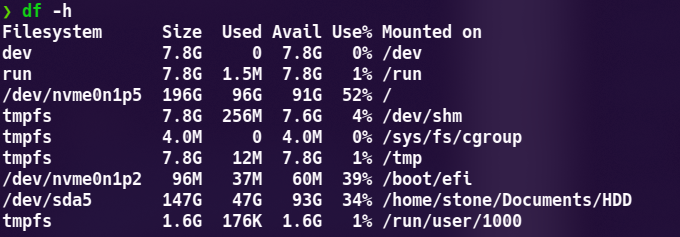

> 我是win10 + arch 双系统,并且efi分区用的是win10自动创建的(大小100m),所以这些空间很快就不够用了(内核和initramfs都放在了ESP分区当中)

- 我原本是直接把`win`的`efi`挂载到`/boot`分区下面,但是这样导致我的efi分区很快就满了,内核和initramfs都在里面存放着.

这个是我系统分区挂载的情况



- 更改方法:

  ```shell
  su
  umount /boot
  mkdir /boot/efi
  mount /dev/nvme0n1p2 /boot/efi
  mv /boot/efi/vmlinuz* /boot/efi/*.img /boot/
  grub-mkconfig >/boot/efi/grub/grub.cfg
  grub-mkconfig -o /boot/efi/grub/grub.cfg  
  #修改 fstab
  vim /et/fstab
  0n1p2      	/boot/efi(这里修改到efi的位置即可)     	vfat    	rw,relatime,fmask=0022,dmask=0022,codepage=437,iocharset=iso8859-1,shortname=mixed,utf8,errors=remount-ro	0 2
  ```

  

---

如果我哪里写的有错,请联系我修改,谢谢!