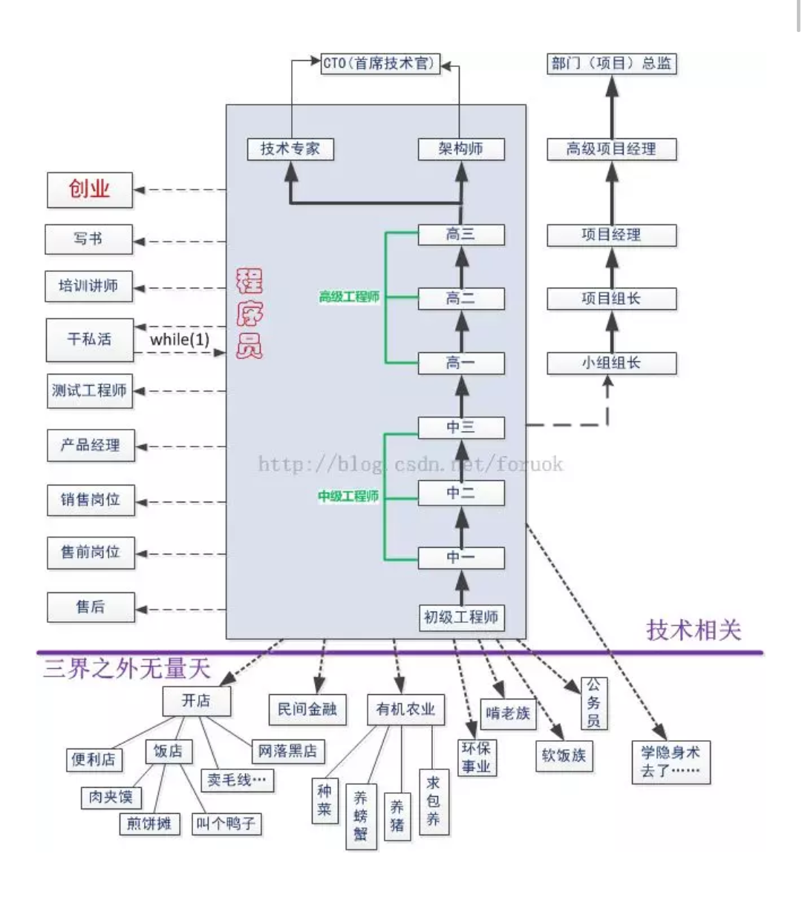

# AMyCode

---
- My code and life.
- Slowly updating！
---

---
## 目录
- [ACM](https://github.com/330079598/MyCode/tree/master/ACM)
- [c++](https://github.com/330079598/MyCode/tree/master/C%2B%2B)
- [Linux](https://github.com/330079598/MyCode/tree/master/Linux)
- [Web](https://github.com/330079598/MyCode/tree/master/Web)
- [工具的基础操作](https://github.com/330079598/MyCode/tree/master/%E5%B7%A5%E5%85%B7%E7%9A%84%E5%9F%BA%E7%A1%80%E6%93%8D%E4%BD%9C)
- [计算机二级笔记（C语言）](https://github.com/330079598/MyCode/tree/master/%E8%AE%A1%E7%AE%97%E6%9C%BA%E4%BA%8C%E7%BA%A7%E7%AC%94%E8%AE%B0(C%E8%AF%AD%E8%A8%80))
---

---

---

---

注：在预览的时候，[toc]在Markdown中是目录的语法，还有$$里面所写的数学公式，在GitHub中都不支持显示，但是我是在本地用Typora写的，我感觉这个软件挺不错的，就是没有云端同步。不想破坏这个格式了，没改！

