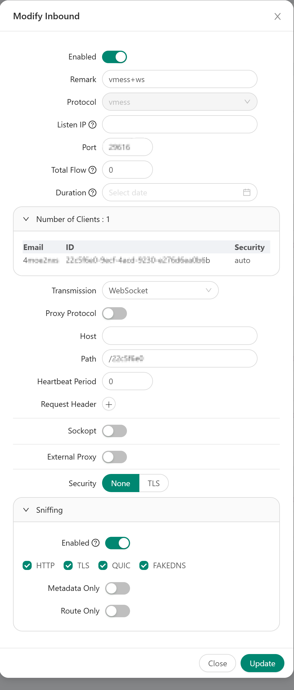
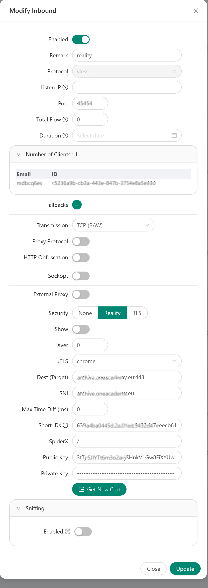

### 对节点进行搭建节点

1. 安装`3x-ui`:
```bash
bash <(curl -Ls https://raw.githubusercontent.com/mhsanaei/3x-ui/master/install.sh)
```
2. 新建`vmess+ws`协议
按照图片进行配置

3. 新建`vless+reality`协议

> 参考: https://v2rayssr.com/reality.html

如何寻找 TLS1.3/H2 的网站：
> 目标网站最低标准：国外网站，支持 TLSv1.3 与 H2，域名非跳转用
加分项：IP 相近（更像，且延迟低），Server Hello 后的握手消息一起加密（如 dl.google.com），有 OCSP Stapling
配置加分项：禁回国流量，TCP/80、UDP/443 也转发（REALITY 对外表现即为端口转发，目标 IP 冷门或许更好）

可以使用这个网站：[点击访问](https://www.ssllabs.com/projects/index.html) ，来寻找 `TLS1.3 / X25519 / H2` 的指向站点，更多注意事项，请看 本期视频

也可以使用这个网站：[点击访问](http://web.chacuo.net/netocspstapling) ，来查询目标网站是否支持 `OCSP Stapling` （**加分项而已，不支持也没有太大关系**）




### `clash verge`配置

使用[clash-verge](../file/clash-verge.yaml)配置机场和自建节点

对全局扩展脚本进行自定义匹配规则：
```
/**

 * 配置中的规则"config.rules"是一个数组，通过新旧数组合并来添加

 * @param prependRule 添加的数组

 */

const prependRule = [

  "DOMAIN-SUFFIX,microsoft.com,自动选择",

  "DOMAIN-SUFFIX,gemini.google.com,手动选择"

];

function main(config) {

  // 把旧规则合并到新规则后面(也可以用其它合并数组的办法)

  let oldrules = config["rules"];

  config["rules"] = prependRule.concat(oldrules);

  return config;

}
```