[TOC]

---

---

# typora快捷键

- 表格

  - 可以用快捷键 **Ctrl+t** 
  - **|空格|空格|**，接着**enter**会弹出来表格

- 文字背景颜色

  - 打开**高亮功能**，`==内容==`，下面是演示
  - ==文本内容==

  


---

# 任务列表

代码：

```tex
- [ ] 吃饭
- [ ] 看电影
- [ ] 看书
- [ ] 记单词
```


效果：

- [ ] 吃饭
- [ ] 看电影
- [ ] 看书
- [x] 记单词


---


# 数学符号表示

**必须在导言区先载入amssymb 宏包而且系统中安装了AMS 数学**


## 数学模式重音符号

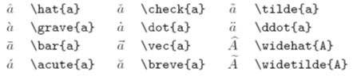


## 希腊字母

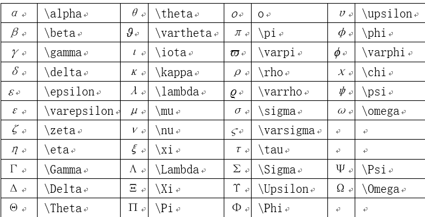


## 二元关系

可以在下面的命令前面加上`\not`命令，而得到起否定形式。

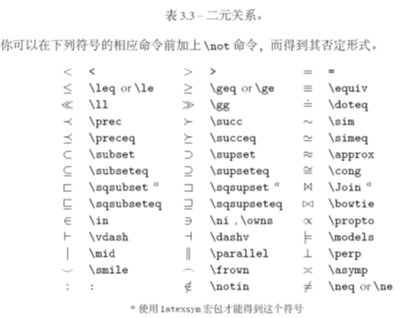


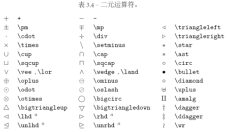


## “大”运算符

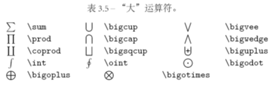


## 箭头

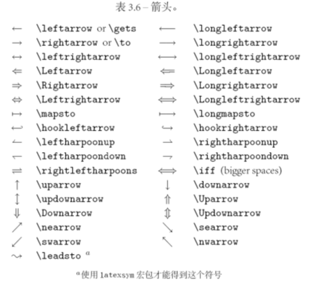


## 定界符

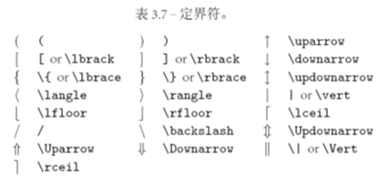


## 大定界符

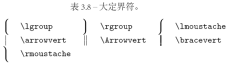


## 其他符号

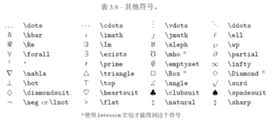


## 非数学符号

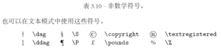


## AMS定界符

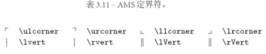


## AMS希腊和希伯来字母

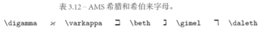


## AMS二元关系

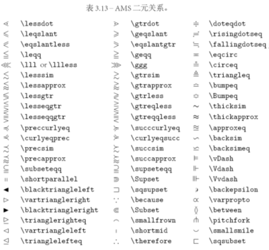


## AMS箭头

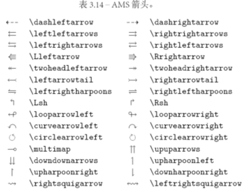


## AMS二元否定关系和箭头

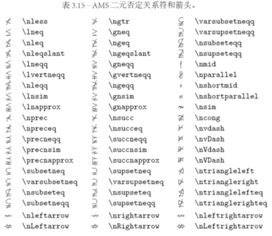


## AMS二元运算符


## AMS其他符号

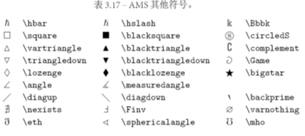


## 数学字母

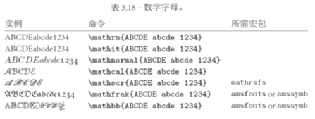


---

# 流程图

## Sequence（序列，顺序发生）

[more](https://knsv.github.io/mermaid/#sequence-diagrams)

```gfm
​```mermaid
%% Example of sequence diagram
  sequenceDiagram
    Alice->>Bob: Hello Bob, how are you?
    alt is sick
    Bob->>Alice: Not so good :(
    else is well
    Bob->>Alice: Feeling fresh like a daisy
    end
    opt Extra response
    Bob->>Alice: Thanks for asking
    end
​```
```

实现：

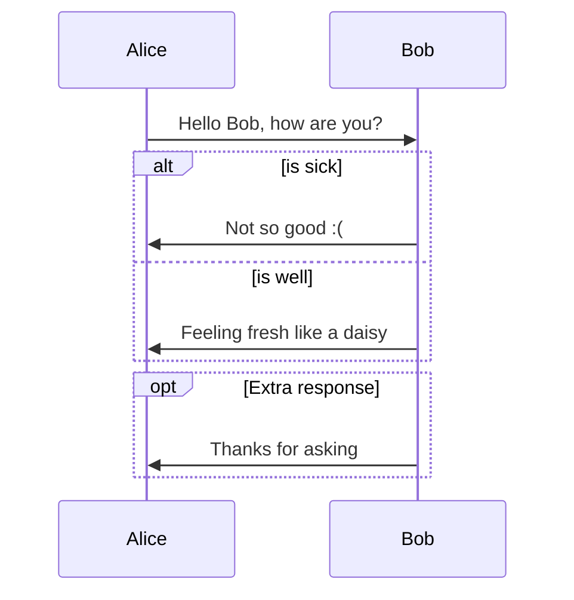

```gfm
​```sequence
Alice->Bob: Hello Bob, how are you?
Note right of Bob: Bob thinks
Bob-->Alice: I am good thanks!
​```
```


实现：

```sequence
Alice->Bob: Hello Bob, how are you?
Note right of Bob: Bob thinks
Bob-->Alice: I am good thanks!
```


## Flowchat（流程图）

[more](https://knsv.github.io/mermaid/#flowcharts-basic-syntax)

```gfm
​```mermaid
graph LR
A[Hard edge] -->B(Round edge)
    B --> C{Decision}
    C -->|One| D[Result one]
    C -->|Two| E[Result two]
​```
```

实现：

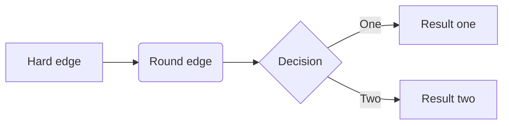


```gfm
​```flow
st=>start: Start
op=>operation: Your Operation
cond=>condition: Yes or No?
e=>end

st->op->cond
cond(yes)->e
cond(no)->op
​```
```


实现：

```flow
st=>start: Start
op=>operation: Your Operation
cond=>condition: Yes or No?
e=>end

st->op->cond
cond(yes)->e
cond(no)->op
```


# Gantt（图表）

[more](https://knsv.github.io/mermaid/#gant-diagrams)

```gfm
​```mermaid
%% Example with slection of syntaxes
        gantt
        dateFormat  YYYY-MM-DD
        title Adding GANTT diagram functionality to mermaid

        section A section
        Completed task            :done,    des1, 2014-01-06,2014-01-08
        Active task               :active,  des2, 2014-01-09, 3d
        Future task               :         des3, after des2, 5d
        Future task2               :         des4, after des3, 5d

        section Critical tasks
        Completed task in the critical line :crit, done, 2014-01-06,24h
        Implement parser and jison          :crit, done, after des1, 2d
        Create tests for parser             :crit, active, 3d
        Future task in critical line        :crit, 5d
        Create tests for renderer           :2d
        Add to mermaid                      :1d

        section Documentation
        Describe gantt syntax               :active, a1, after des1, 3d
        Add gantt diagram to demo page      :after a1  , 20h
        Add another diagram to demo page    :doc1, after a1  , 48h

        section Last section
        Describe gantt syntax               :after doc1, 3d
        Add gantt diagram to demo page      : 20h
        Add another diagram to demo page    : 48h
​```
```


实现：

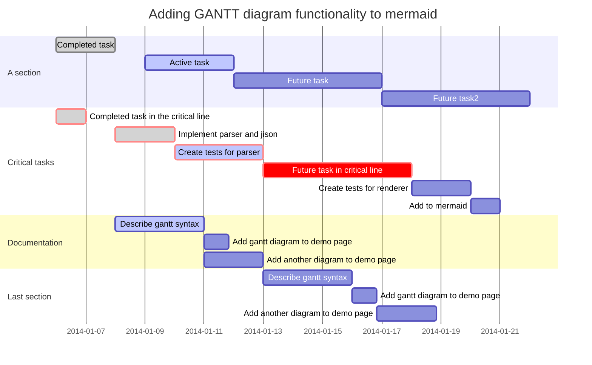