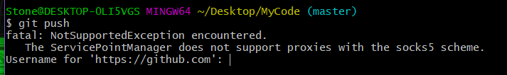

- 因为当前repository使用的是https而不是ssh，需要更新一下origin。

```
git remote rm origin
git remote add origin git@github.com:Username/Your_Repo_Name.git
```


- 也有可能是我们使用的https方式克隆的，这样会使我们在`git push`时要求我们输入用户名和密码，我门有两种解决方法：

  - 第一种：我们使用ssh方式克隆仓库：

  ```
  git clone git@github.com:Name/project.git
  ```

  - 第二种：如果我们已经使用https的方式克隆了仓库，也不必删除重新来过，我们可以将`.git/config`文件中的

  ```
  url = https://github.com/Name/project.git 
  ```

  改为：

  ```
  url = git@github.com:Name/project.git 
  ```

  就行啦！！！

  