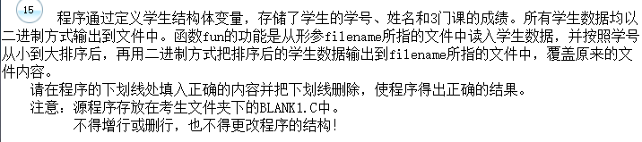

- 再谈文件的读写



- 解析：
  - fopen函数的作用是打开一个文件，在fun函数中位输入打开一个二进制文件，所以第一个空填“rb”；
  - 利用嵌套循环语句按学号从小到大排序，所以第二个空填：>;
  - 再用二进制方式把排序后的数据输出到指定文件中，fwrite函数的作用是往文件夹的当前位置写入指定的数据块，所以第三个填：fwrite。

```c
#include  <stdio.h>
#define    N    5
typedef struct student {
  long  sno;
  char  name[10];
  float  score[3];
} STU;
void fun(char  *filename)
{ FILE  *fp;      int  i, j;
  STU  s[N], t;
/**********found**********/
  fp = fopen(filename, "rb");
  fread(s, sizeof(STU), N, fp);
  fclose(fp);
  for (i=0; i<N-1; i++)
    for (j=i+1; j<N; j++)
/**********found**********/
      if (s[i].sno > s[j].sno)
      {  t = s[i];  s[i] = s[j];  s[j] = t;  }
  fp = fopen(filename, "wb");
/**********found**********/
  fwrite(s, sizeof(STU), N, fp);  /* 二进制输出 */
  fclose(fp);
}
main()
{ STU  t[N]={ {10005,"ZhangSan", 95, 80, 88}, {10003,"LiSi", 85, 70, 78},
             {10002,"CaoKai", 75, 60, 88}, {10004,"FangFang", 90, 82, 87},
             {10001,"MaChao", 91, 92, 77}}, ss[N];
  int  i,j;      FILE  *fp;
  fp = fopen("student.dat", "wb");
  fwrite(t, sizeof(STU), 5, fp);
  fclose(fp);
  printf("\n\nThe original data :\n\n");
  for (j=0; j<N; j++)
  {  printf("\nNo: %ld  Name: %-8s      Scores:  ",t[j].sno, t[j].name);
     for (i=0; i<3; i++)  printf("%6.2f ", t[j].score[i]);
     printf("\n");
  }
  fun("student.dat");
  printf("\n\nThe data after sorting :\n\n");
  fp = fopen("student.dat", "rb");
  fread(ss, sizeof(STU), 5, fp);
  fclose(fp);
  for (j=0; j<N; j++)
  {  printf("\nNo: %ld  Name: %-8s      Scores:  ",ss[j].sno, ss[j].name);
    for (i=0; i<3; i++)  printf("%6.2f ", ss[j].score[i]);
    printf("\n");
  }
  getchar();
}
```

