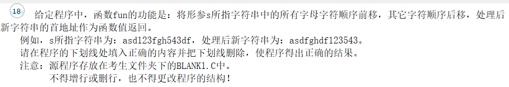
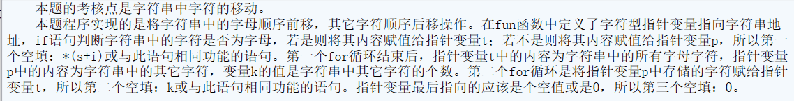
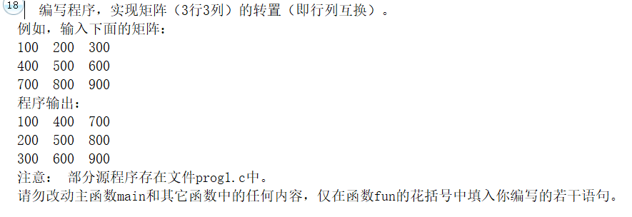

- 第一遍没看懂，看了答案发现自己又狭隘
- 

```c
#include  <stdio.h>
#include  <stdlib.h>
#include  <string.h>
char *fun(char  *s)
{ int  i, j, k, n;    char  *p, *t;
  n=strlen(s)+1;
  t=(char*)malloc(n*sizeof(char));
  p=(char*)malloc(n*sizeof(char));
  j=0; k=0;
  for(i=0; i<n; i++)
  {  if(((s[i]>='a')&&(s[i]<='z'))||((s[i]>='A')&&(s[i]<='Z'))) {
/**********found**********/
       t[j]=s[i]; j++;}
     else
     {  p[k]=s[i]; k++; }
  }
/**********found**********/
  for(i=0; i<k; i++)  t[j+i]=p[i];
/**********found**********/
  t[j+k]=0;
  return  t;
}
main()
{ char  s[80];
  printf("Please input: ");  scanf("%s",s);
  printf("\nThe result is: %s\n",fun(s));
  getchar();
}
```




- 反转数组，注意题目的结构

```c++
#include <stdio.h>
void fun(int array[3][3])
{
	int a,b;
	int c[3][3];
	for(a=0;a<3;a++)
		for(b=0;b<3;b++)
		{
			c[b][a]=array[a][b];
		}
		for(a=0;a<3;a++)
			for(b=0;b<3;b++)
			{
				array[a][b]=c[a][b];
			}
			

}

main()
{
   int i,j;void NONO ();
   int array[3][3]={{100,200,300},
                   {400,500,600},
                   {700,800,900}};

   for (i=0;i<3;i++)
   {   for (j=0;j<3;j++)
       printf("%7d",array[i][j]);
       printf("\n");
   }
   fun(array);
   printf("Converted array:\n");
   for (i=0;i<3;i++)
   {   for (j=0;j<3;j++)
       printf("%7d",array[i][j]);
       printf("\n");
   }
   NONO();
  getchar();
}

void NONO ()
{
/* 请在此函数内打开文件，输入测试数据，调用 fun 函数，输出数据，关闭文件。 */
   int i,j, array[3][3];
   FILE *rf, *wf ;

   rf = fopen("C:\\WEXAM\\000000000000\\in.dat","r") ;
   wf = fopen("C:\\WEXAM\\000000000000\\out.dat","w") ;
   for (i=0;i<3;i++)
   for (j=0;j<3;j++)
     fscanf(rf, "%d", &array[i][j]);
   fun(array);
   for (i=0;i<3;i++)
   {   for (j=0;j<3;j++)
       fprintf(wf, "%7d", array[i][j]);
       fprintf(wf, "\n");
   }
   fclose(rf) ;
   fclose(wf) ;
}
```

