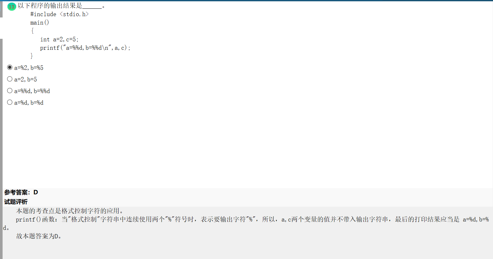

- 下面对对象概念描述错误的是
  - 任何对象都必须有继承性（×）
  - 对象是属性和方法的封装体（√）
  - 对象间的通讯靠消息传递（√）模拟现实世界中不同事物彼此之间的关系。
  - 操作时对象的动态属性（√）
- 关系数据库管理系统能实现的专门关系运算包括**选择、投影、连接运算**。
- 在C语言中，int(*ptr)[M]中的标识符ptr是一个纸箱具有M个整型元素的一维数组的指针。
- sizeof(x)为运算符，它运算的结果是x型的数据结构所占的内存字节数，定义一个结构体AA，他的长度为其中数据成员所占内存的总和。
  - int型的变量需要2个字节；
  - double型的变量需要8个字符；
  - float型的变量需要4个字节；
  - char型的变量需要1个字节；
  - long型字节的变量需要4个字节；
  - 指针变量占2个字节。
- 算法的控制结构给出了算法的基本框架，它不仅决定了算法中各操作的执行顺序，而且也直接反映了算法的设计是否符合结构化原则。**一个算法一般都可以用顺序、选择、循环三种急诊控制结构组合而成。**
- **确认测试**的任务是验证软件的功能和性能以及其他特性是否满足了需求规格说明中的确定这各种需求，以及软件配置是否完全、正确。
- 常见的需求分析的方法：结构化分析方法和面向对象的分析方法。结构化分析的常用工具有：数据流程图（DFD）、数据字典（DD）、判定树和判定表等。
- NULL在C编译器中是一个值为0的常量，他的定义在头文件"stdio.h"中。
- 

- 结构体定义可知：共用体r的成员k和成员i[2]是共用同一段内存，所以，当程序给r.i[0]赋值后，实际上，共用体成员k的值也确定了，就是i[0];
- int i,j=7,*p=&i;与i=j等价的语句是 *p=*&i;
  - p的地址本身和i的地址一样，所以*p代表i中的数值，而&j是j的地址，*&j就是j中的数值。
- “%d"是以带符号的十进制形式输出正数
- “%o"是以八进制的无符号形式输出正数（不输出前导符0）
- "%x"是以十六进制无符号形式输出正数（不输出前导符0）